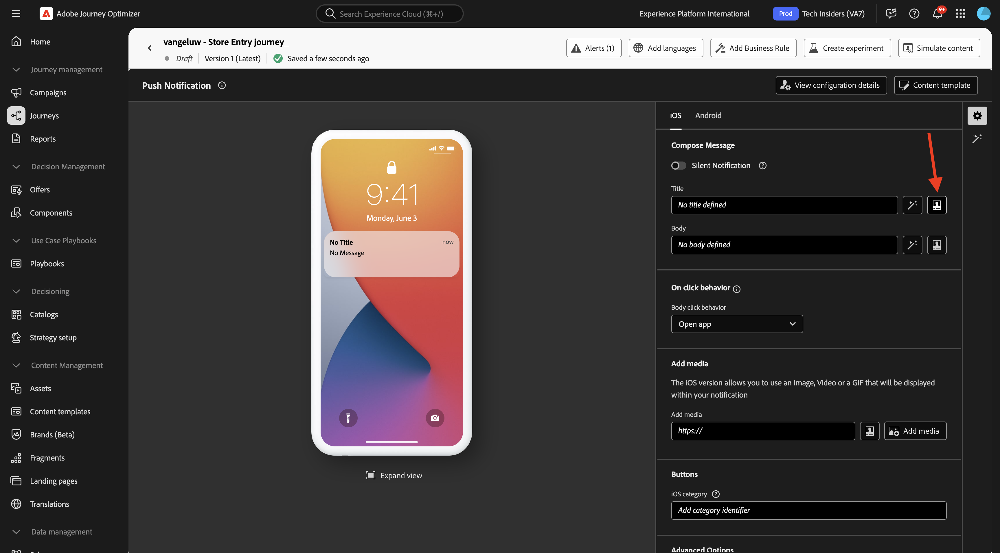
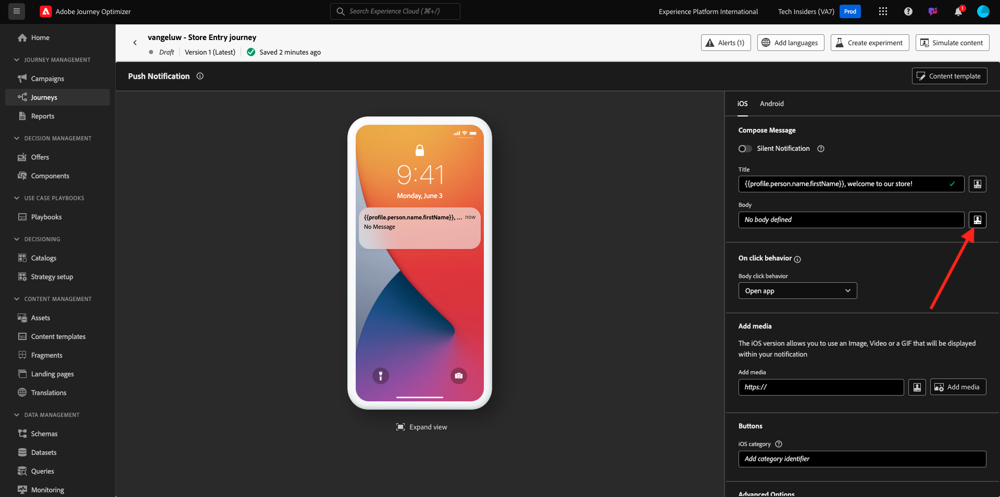

# 3.3.2 Vorm een reis met dupberichten

## 3.4.4.6 Een nieuwe gebeurtenis maken

Ga naar **Journey Optimizer**. In het linkermenu, ga naar **Configuraties** en klik **leiden** onder **Gebeurtenissen**.

Op het **scherm van Gebeurtenissen**, zult u een mening gelijkend op dit zien. Klik **creëren Gebeurtenis**.

U ziet dan een lege gebeurtenisconfiguratie.
Geef uw gebeurtenis eerst een naam zoals deze: `--aepUserLdap--StoreEntryEvent` en stel een beschrijving in op `Store Entry Event` .
Daarna is het **Type van Gebeurtenis** selectie. Selecteer **Eenheids**.
Daarna is het **selecteren van het Type van identiteitskaart van de Gebeurtenis 0&rbrace;.** Selecteer **Gegenereerd Systeem**.

Nu de selectie van het schema. Hiervoor is een schema opgesteld. Gebruik het schema `Demo System - Event Schema for Mobile App (Global v1.1) v.1` .

Na het selecteren van het Schema, zult u een aantal gebieden zien die in de **sectie van de Lading** worden geselecteerd. Uw gebeurtenis is nu volledig geconfigureerd.

Klik **sparen**.

Uw gebeurtenis is nu geconfigureerd en opgeslagen. Klik opnieuw op uw gebeurtenis om **te openen geef het 1&rbrace; scherm van de Gebeurtenis &lbrace;opnieuw uit.**

Beweeg over het **gebied van de Payload** en klik op het **3&rbrace; pictogram van de Payload van de Mening &lbrace;.**

U zult nu een voorbeeld van de verwachte nuttige lading zien.

Uw gebeurtenis heeft een unieke orchestration eventID, die u kunt vinden door neer in die lading te scrollen tot u `_experience.campaign.orchestration.eventID` ziet.

De gebeurtenis-id is wat naar Adobe Experience Platform moet worden verzonden om de Reis te activeren die u in de volgende stap maakt. Schrijf deze eventID neer, aangezien u het in de volgende stap zult nodig hebben.
`"eventID": "89acd341ec2b7d1130c9a73535029debf2ac35f486bc99236b1a5091d6f4bc68"`

Klik **O.K.**, die door **wordt gevolgd annuleert**.

## 3.4.4.7 Een reis maken

In het menu, ga naar **Reizen** en klik **creeer Reizen**.

Dan zie je dit. Geef je reis een naam. Gebruik `--aepUserLdap-- - Store Entry journey` . Klik **sparen**.

Eerst, moet u uw gebeurtenis toevoegen als uitgangspunt van uw reis. Zoek de gebeurtenis `--aepUserLdap--StoreEntryEvent` en sleep deze naar het canvas. Klik **sparen**.

Daarna, onder **Acties**, onderzoek naar de **Duw** actie. De belemmering en laat vallen **duw** actie op het canvas.

Plaats de **Categorie** aan **Marketing** en selecteer een drukkend oppervlak dat u toelaat om pushberichten te verzenden. In dit geval, is de e-mailoppervlakte om te selecteren **duw-iOS-Android**.

>[!NOTE]
>
>Een Kanaal in Journey Optimizer moet bestaan dat de **Oppervlakte van de App** zoals eerder herzien gebruikt.

De volgende stap is uw bericht te creëren. Om dat te doen, klik **geef inhoud** uit.

Dan zie je dit. Klik het **verpersoonlijkings** pictogram voor het **gebied van de Titel**.

Dan zie je dit. U kunt nu elk profiel rechtstreeks selecteren in het realtime profiel van de klant.

Onderzoek naar het gebied **Voornaam**, dan klik het **+** pictogram naast het gebied **Voornaam**. Vervolgens ziet u het personalisatietoken voor Voornaam die wordt toegevoegd: **{{profile.person.name.firstName}}** .

Voeg vervolgens de tekst **toe, welkom in onze winkel!** behind **{{profile.person.name.firstName}}** .

Klik **sparen**.

U hebt dit nu. Klik het **verpersoonlijkings** pictogram voor het **3&rbrace; gebied van het Lichaam &lbrace;.**

Ga deze tekst **in Klik hier om een 10% korting te krijgen wanneer u vandaag koopt!** en klik **sparen**.

Dan heb je dit. Klik op de pijl in de linkerbovenhoek om terug te gaan naar uw reis.

Klik **sparen** om uw duwactie te sluiten.

Klik **publiceren**.

Klik **publiceren** opnieuw.

Uw reis is nu gepubliceerd.

## 3.4.4.8 Test uw reis en pushbericht

In uw DX demo 2.0 mobiele toepassing, ga naar het **scherm van Montages**. Klik de **knoop van de Ingang van de Opslag**.

>[!NOTE]
>
>De **knoop van de Ingang van de Opslag** wordt momenteel uitgevoerd. U vindt deze nog niet in de app.

Zorg ervoor om app onmiddellijk te sluiten na het klikken van het **pictogram van de Ingang van de Opslag**, anders zal het duwbericht niet worden getoond.

Na een paar seconden, zult u het bericht zien verschijnen.

U hebt deze oefening voltooid.

## Volgende stappen

Ga naar [ 3.3.3 vormen een campagne met in-app berichten ](./ex3.md){target="_blank"}

Ga terug naar [ Adobe Journey Optimizer: Duw en In-app Berichten ](ajopushinapp.md){target="_blank"}

Ga terug naar [ Alle modules ](./../../../../overview.md){target="_blank"}
