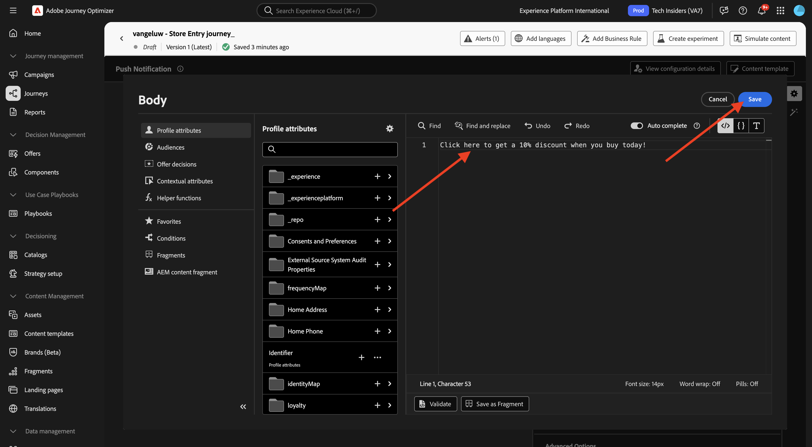
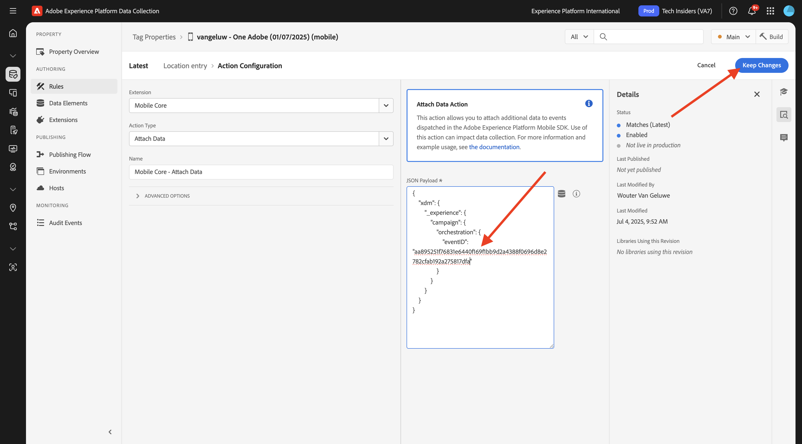

# 3.3.2 Vorm een reis met dupberichten

Login aan Adobe Journey Optimizer door naar [ Adobe Experience Cloud ](https://experience.adobe.com) te gaan. Klik **Journey Optimizer**.

U zult aan de **1} mening van het Huis {in Journey Optimizer worden opnieuw gericht.** Eerst, zorg ervoor u de correcte zandbak gebruikt. De sandbox die moet worden gebruikt, wordt `--aepSandboxName--` genoemd. U zult dan in de **1} mening van het Huis {van uw zandbak** zijn.`--aepSandboxName--`

## 3.3.2.1 Een nieuwe gebeurtenis maken

In het linkermenu, ga naar **Configuraties** en klik **leiden** onder **Gebeurtenissen**.

Op het **scherm van Gebeurtenissen**, zult u een mening gelijkend op dit zien. Klik **creëren Gebeurtenis**.

U ziet dan een lege gebeurtenisconfiguratie.
Geef uw gebeurtenis eerst een naam zoals deze: `--aepUserLdap--StoreEntryEvent` en stel een beschrijving in op `Store Entry Event` .
Daarna is het **Type van Gebeurtenis** selectie. Selecteer **Eenheids**.
Daarna is het **selecteren van het Type van identiteitskaart van de Gebeurtenis 0}.** Selecteer **Gegenereerd Systeem**.

Nu de selectie van het schema. Hiervoor is een schema opgesteld. Gebruik het schema `Demo System - Event Schema for Mobile App (Global v1.1) v.1` .

Na het selecteren van het Schema, zult u een aantal gebieden zien die in de **sectie van de Lading** worden geselecteerd. Verifieer dat het gebied **Namespace** aan **ECID** wordt geplaatst. Uw gebeurtenis is nu volledig geconfigureerd.

Klik **sparen**.

Uw gebeurtenis is nu geconfigureerd en opgeslagen. Klik opnieuw op uw gebeurtenis om **te openen geef het 1} scherm van de Gebeurtenis {opnieuw uit.**

Beweeg over het **gebied van de Payload** en klik op het **3} pictogram van de Payload van de Mening {.**

U zult nu een voorbeeld van de verwachte nuttige lading zien.

Uw gebeurtenis heeft een unieke orchestration eventID, die u kunt vinden door neer in die lading te scrollen tot u `_experience.campaign.orchestration.eventID` ziet.

De gebeurtenis-id is wat naar Adobe Experience Platform moet worden verzonden om de Reis te activeren die u in de volgende stap maakt. Schrijf deze eventID neer, aangezien u het in de volgende stap zult nodig hebben.
`"eventID": "aa895251f76831e6440f169f1bb9d2a4388f0696d8e2782cfab192a275817dfa"`

Klik **OK**.

Klik **annuleren**.

## 3.3.2.2 Een reis maken

In het linkermenu, ga naar **Reizen** en klik **creeer Weg**.

Dan zie je dit. Geef uw reis een naam: `--aepUserLdap-- - Store Entry journey`. Klik **sparen**.

Eerst, moet u uw gebeurtenis toevoegen als uitgangspunt van uw reis. Zoek de gebeurtenis `--aepUserLdap--StoreEntryEvent` en sleep deze naar het canvas. Klik **sparen**.

Daarna, onder **Acties**, onderzoek naar de **Duw** actie. De belemmering en laat vallen **duw** actie op het canvas.

Plaats de **Categorie** aan **Marketing** en selecteer een drukkend oppervlak dat u toelaat om pushberichten te verzenden. In dit geval, is de e-mailoppervlakte om te selecteren **duw-iOS-Android**.

>[!NOTE]
>
>Een Kanaal in Journey Optimizer moet bestaan dat de **Oppervlakte van de App** zoals eerder herzien gebruikt.

De volgende stap is uw bericht te creëren. Om dat te doen, klik **geef inhoud** uit.

Dan zie je dit. Klik het **verpersoonlijkings** pictogram voor het **gebied van de Titel**.

Dan zie je dit. U kunt nu om het even welk profielattribuut van het Profiel van de Klant in real time direct selecteren.

Onderzoek naar het gebied **Voornaam**, dan klik het **+** pictogram naast het gebied **Voornaam**. Vervolgens ziet u het personalisatietoken voor Voornaam die wordt toegevoegd: **{{profile.person.name.firstName}}** .

Voeg vervolgens de tekst **toe, welkom in onze winkel!** behind **{{profile.person.name.firstName}}** .

Klik **sparen**.

U hebt dit nu. Klik het **verpersoonlijkings** pictogram voor het **3} gebied van het Lichaam {.**

Ga deze tekst **in Klik hier om een 10% korting te krijgen wanneer u vandaag koopt!** en klik **sparen**.

Dan heb je dit. Klik op de pijl in de linkerbovenhoek om terug te gaan naar uw reis.

Klik **sparen** om uw duwactie te sluiten.

Klik **publiceren**.

Klik **publiceren** opnieuw.

Uw reis is nu gepubliceerd.

## 3.3.2.3 De eigenschap voor gegevensverzameling bijwerken voor mobiele apparaten

In **Aan de slag**, leidde het Systeem van de Demo daarna tot de eigenschappen van Markeringen voor u: voor de website en voor mobiele app. Vind hen door `--aepUserLdap--` in het **vakje van het Onderzoek** te zoeken. Klik om het **Mobiele** bezit te openen.

Dan moet je dit zien.

In het linkermenu, ga naar **Regels** en klik om de ingang van de regel **Plaats** te openen.

Dan moet je dit zien. Klik de actie **Mobiele Kern - Verbind Gegevens**.

Dan moet je dit zien.

Plak eventID van uw gebeurtenis `--aepUserLdap--StoreEntryEvent` in het **JSON 2} venster van de Payload.** Klik **houden Veranderingen**.

Klik **sparen** of **sparen aan Bibliotheek**.

Ga naar **het Publiceren Stroom** en klik om de bibliotheek **Hoofd** te openen.

Klik **toevoegen Alle Gewijzigde Middelen** en klik dan **sparen &amp; bouwen aan Ontwikkeling**.

## 3.3.2.4 Test uw reis en pushbericht

Open de **mobiele DSN** toepassing.

Ga naar de **pagina van het Merkteken van de Opslag 0}.**

Klik **de Ingang van POI simuleren**.

Na een paar seconden ziet u de pushmelding verschijnen.

## Volgende stappen

Ga naar [ 3.3.3 vormen een campagne met in-app berichten ](./ex3.md){target="_blank"}

Ga terug naar [ Adobe Journey Optimizer: Duw en In-app Berichten ](ajopushinapp.md){target="_blank"}

Ga terug naar [ Alle modules ](./../../../../overview.md){target="_blank"}