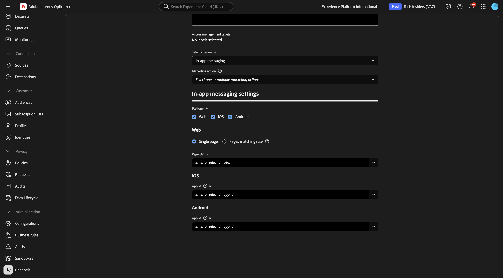

# 3.3.3 Een campagne configureren met berichten in de app

Login aan Adobe Journey Optimizer door naar [ Adobe Experience Cloud ](https://experience.adobe.com) te gaan. Klik **Journey Optimizer**.

U zult aan de **1} mening van het Huis {in Journey Optimizer worden opnieuw gericht.** Eerst, zorg ervoor u de correcte zandbak gebruikt. De sandbox die moet worden gebruikt, wordt `--aepSandboxName--` genoemd. U zult dan in de **1} mening van het Huis {van uw zandbak** zijn.`--aepSandboxName--`

## 3.3.3.1 Kanaalconfiguratie voor in-app berichten

In het linkermenu, ga naar **Kanalen** en selecteer dan **configuraties van het Kanaal**. Klik **creeer kanaalconfiguratie**.

Ga de naam in: `--aepUserLdap--_In-app_Messages`, selecteer het kanaal **In-app overseinen** en laat dan de platforms **Web**, **iOS** en **Android** toe.

Schuif omlaag, dan ziet u dit.

Zorg ervoor dat **Enige pagina** wordt toegelaten.

Voor **Web**, ga URL van de website in die vroeger als deel van **werd gecreeerd Begonnen** module, die als dit kijkt: `https://dsn.adobe.com/web/--aepUserLdap---XXXX`. Vergeet niet **XXXX** in de unieke code van uw website te veranderen.

Voor **iOS** en **Android**, ga `com.adobe.dsn.dxdemo` in.

De rol omhoog en klikt **voorleggen**.

Uw kanaalconfiguratie is nu klaar om te worden gebruikt.

## 3.3.3.2 Een geplande campagne voor In-app-berichten configureren

In het linkermenu, ga naar **Campagnes** en klik dan **creeer campagne**.

Selecteer **Gepland - Op de markt brengend** en klik dan **creeer**.

Ga de naam `--aepUserLdap-- - CitiSignal Fiber Max` in en klik dan **Acties**.

Klik **+ voeg actie** toe en selecteer dan **In-app bericht**.

Selecteer de in-app berichtkanaalconfiguratie die u in de vorige stap hebt gemaakt en die de naam `--aepUserLdap--_In-app_Messages` heeft. Klik **uitgeven inhoud**.

Dan moet je dit zien. Klik **Modal**.

Klik **lay-out van de Verandering**.

Klik het **pictogram van Media URL** om activa van AEM Assets te kiezen.

Ga naar de omslag **burgerschap-beelden** en selecteer het beelddossier **neon-rabbit.jpg**. Klik **Uitgezocht**.

Voor de **tekst van de Kopbal**, gebruik: `CitiSignal Fiber Max`.
Voor de **tekst van het Lichaam**, gebruik: `Conquer lag with Fiber Max`.

Plaats de **tekst van Knoop #1** aan: `Go to Plans`.
Plaats het **doel** aan `com.adobe.dsn.dxdemo://plans`.

Klik **Overzicht om** te activeren.

Klik **activeren**.

Het statuut van uw campagne wordt nu geplaatst aan **het Activeren**. Het kan een paar minuten duren voordat de campagne live gaat.

Zodra de status in **Levend** is veranderd, kunt u uw campagne testen.

## 3.3.3.3 Test uw in-app-berichtcampagne op mobiele apparaten

Open de app op uw mobiele apparaat. Het nieuwe bericht in de app wordt dan weergegeven nadat u de app hebt gestart. Klik de knoop **gaan naar Abonnementen**.

U zult dan aan de **Punten** pagina worden genomen.

## Volgende stappen

Ga naar [ Samenvatting en voordelen ](./summary.md){target="_blank"}

Ga terug naar [ Adobe Journey Optimizer: Duw en In-app Berichten ](ajopushinapp.md){target="_blank"}

Ga terug naar [ Alle modules ](./../../../../overview.md){target="_blank"}
