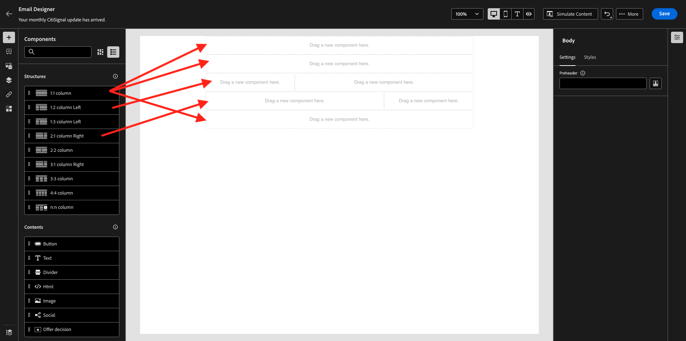
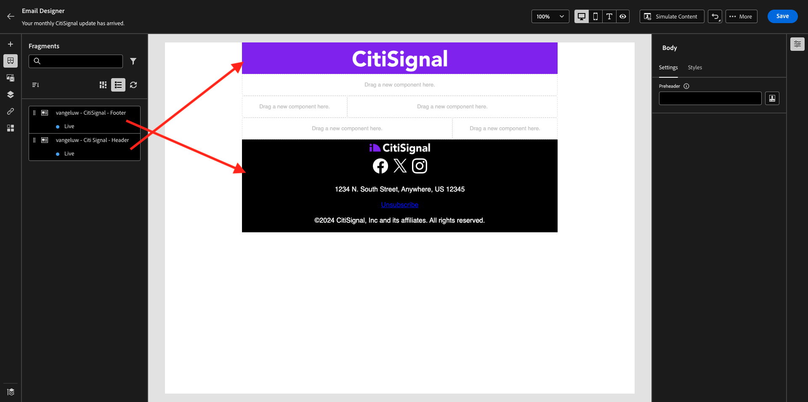
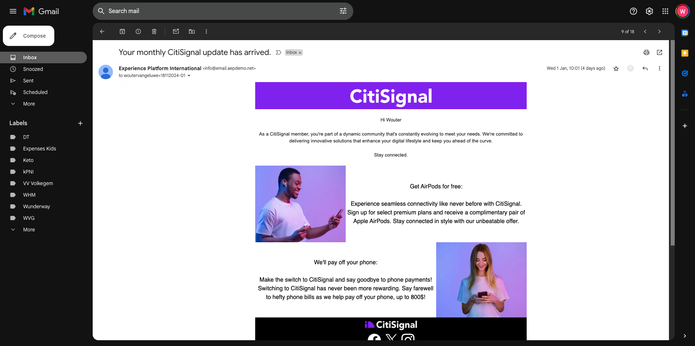

# 3.4.2 Een campagne configureren

Login aan Adobe Journey Optimizer door naar [ Adobe Experience Cloud ](https://experience.adobe.com) te gaan. Klik **Journey Optimizer**.


U zult aan de **1} mening van het Huis {in Journey Optimizer worden opnieuw gericht.** Eerst, zorg ervoor u de correcte zandbak gebruikt. De sandbox die moet worden gebruikt, wordt `--aepSandboxName--` genoemd. U zult dan in de **1} mening van het Huis {van uw zandbak `--aepSandboxName--` zijn.**


## 3.4.2.1 Het publiek maken

Voordat u uw campagne maakt, moet u het publiek definiëren dat de campagne moet ontvangen. Om een publiek tot stand te brengen, ga naar **Soorten publiek** in het linkermenu. Je ziet hier al eerder gecreëerd publiek.

Klik op **+ Publiek maken** .


Selecteer **bouwt regel** en klik **creëren**.


Selecteer het gebied **Individueel Profiel XDM > Persoonlijke E-mail > Adres** en voeg het aan het canvas toe. Plaats de regelvoorwaarde aan **bestaat**.

Om het verzenden van e-mails naar andere gebruikers in uw gedeelde opleidingsmilieu te vermijden, kunt u een filter zoals **ook toevoegen Voornaam evenaart - uw voornaam -**.

Plaats de naam van uw publiek aan `--aepUserLdap-- - All customers with email` en klik **publiceren**.


Uw publiek wordt nu gepubliceerd en kan in een campagne worden gebruikt.

## 3.4.2.2 Een nieuwsbrief maken

U maakt nu een campagne. In tegenstelling tot de op een gebeurtenis gebaseerde reis van de vorige oefening die op inkomende ervaringsgebeurtenissen of publieksingangen of uitgang baseert om een reis voor één specifieke klant teweeg te brengen, richten de campagnes één keer een heel publiek met unieke inhoud zoals nieuwsbrieven, eenmalige bevorderingen, of generische informatie of periodiek met gelijkaardige inhoud die op een regelmatige basis wordt verzonden zoals bijvoorbeeld verjaardagscampagnes en herinneringen.

In het menu, ga naar **Campagnes** en klik **creeer campagne**.


Selecteer **Gepland - Op de markt brengend** en klik **creeer**.


Voor het scherm van de campagneverwezenlijking, vorm het volgende:

- **Naam**: `--aepUserLdap-- - CitiSignal Newsletter`.
- **Beschrijving**: Maandelijkse Nieuwsbrief
- **Type van Identiteit**: verandering in E-mail

Klik **Uitgezochte publiek**.


Voor het **publiek**, selecteer het publiek u in de vorige stap, `--aepUserLdap-- - All customers with email` creeerde. Klik **sparen**.


Voor de **Actie**, selecteer **E-mail** en selecteer een bestaande **E-mailconfiguratie**. U gaat de inhoud over een paar minuten bewerken.


Voor het **Programma**, kies **op een specifieke datum en een tijd** en plaats een tijd van keus.


U kunt nu het e-mailbericht zelf maken. De rol omhoog een beetje, en klikt **geeft inhoud** uit.


Dan zie je dit. Voor de **lijn van het Onderwerp**, gebruik dit: `Your monthly CitiSignal update has arrived.`. Daarna, klik **uitgeeft e-maillichaam**.


Kies **Ontwerp van kras**.


Dan zie je dit. In het linkermenu vindt u de structuurcomponenten die u kunt gebruiken om de structuur van de e-mail (rijen en kolommen) te definiëren.

De belemmering en laat vallen 3 keer a **1:1 kolom** op het canvas, 1 keer een 1:2 kolom verlaten en 1 keer een 2:1 kolom recht die u deze structuur zou moeten geven:



In het linkermenu, ga naar **Fragments**. Sleep de kopbal u vroeger in [ oefening 3.1.2.1 ](./../ajob2c-1/ex2.md) op de eerste component in het canvas creeerde. Sleep de footer u vroeger in [ oefening 3.1.2.2 ](./../ajob2c-1/ex2.md) op de laatste component in het canvas creeerde.



Klik op het pictogram **+** in het linkermenu. Ga naar **Inhoud** beginnen inhoud op het canvas toe te voegen.


De belemmering en laat vallen component van de a **Tekst** op de tweede rij.


Selecteer de standaardtekst in die component **gelieve te typen hier uw tekst.** en vervangt deze door de onderstaande tekst. Verander de groepering aan **groepering van het Centrum**.

```javascript
Hi {{profile.person.name.firstName}}

As a CitiSignal member, you're part of a dynamic community that's constantly evolving to meet your needs. We're committed to delivering innovative solutions that enhance your digital lifestyle and keep you ahead of the curve.

Stay connected.
```


De belemmering en laat vallen een **component van het Beeld** op de 3de en 4de rij. Klik **doorbladeren** op de 3de rij.


Open de omslag **citi-signaal-beelden**, klik om het beeld **Offer_AirPods.jpg** te selecteren, en **Uitgezocht** te klikken.


Klik **doorbladeren** op beeldplaceholder op de 4de rij.


Open de omslag **citi-signaal-beelden**, klik om het beeld **Offer_Phone.jpg** te selecteren, en **Uitgezocht** te klikken.


De belemmering en laat vallen a **component van de Tekst van 0} {op de 3de en 4de rij.**


Selecteer de standaardtekst in de component op de 3de rij **Gelieve te typen hier uw tekst.** en vervangt deze door de onderstaande tekst.

```javascript
Get AirPods for free:

Experience seamless connectivity like never before with CitiSignal. Sign up for select premium plans and receive a complimentary pair of Apple AirPods. Stay connected in style with our unbeatable offer.
```

Selecteer de standaardtekst in de component op de 4de rij **Gelieve te typen hier uw tekst.** en vervangt deze door de onderstaande tekst.

```javascript
We'll pay off your phone:

Make the switch to CitiSignal and say goodbye to phone payments! Switching to CitiSignal has never been more rewarding. Say farewell to hefty phone bills as we help pay off your phone, up to 800$!
```


Je standaardnieuwsbrief is nu klaar. Klik **sparen**.


Ga terug naar het campagnesdashboard door de **pijl** naast de onderwerpregel tekst in de top-left hoek te klikken.


Klik **Overzicht om** te activeren.


Deze fout kan dan optreden. Als dat het geval is, dan kunt u tot 24 uur moeten wachten tot het publiek is geëvalueerd, en dan proberen om uw campagne opnieuw te activeren. Mogelijk moet u ook het programma van uw campagne bijwerken zodat deze later kan worden uitgevoerd.

Klik **activeren**.


Nadat de campagne is geactiveerd, wordt deze gepland.


Uw campagne is nu geactiveerd. Uw e-mailbericht voor de nieuwsbrief wordt verzonden zoals u het in uw programma hebt gedefinieerd. Uw campagne wordt beëindigd zodra het laatste e-mailbericht is verzonden.

U ontvangt de e-mail ook op het e-mailadres dat u hebt gebruikt voor het demoprofiel dat u eerder hebt gemaakt.



U hebt deze oefening voltooid.

## Volgende stappen

Ga naar [ 3.4.3 toepassen op segment-gebaseerde verpersoonlijking in een e-mailbericht ](./ex3.md){target="_blank"}

Ga terug naar [ Adobe Journey Optimizer ](journeyoptimizer.md){target="_blank"}

Ga terug naar [ Alle modules ](./../../../../overview.md){target="_blank"}
