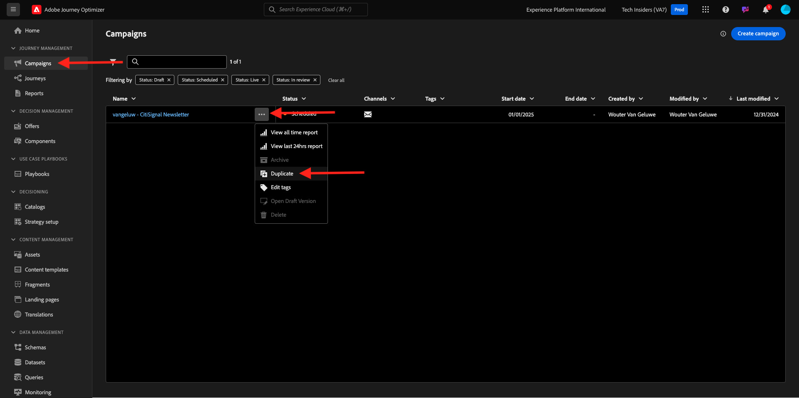

# 3.4.3 Pas segment-gebaseerde verpersoonlijking in een e-mailbericht toe

Login aan Adobe Experience Cloud door naar [ Adobe Experience Cloud ](https://experience.adobe.com) te gaan. Klik **Adobe Journey Optimizer**.

U zult aan de **1} mening van het Huis {in Journey Optimizer worden opnieuw gericht.** Alvorens u verdergaat, moet u a **zandbak** selecteren. De te selecteren sandbox krijgt de naam ``--aepTenantId--`` .

## 3.4.3.1 personalisatie op basis van segmenten

In deze oefening zult u het nieuwsbrief e-mailbericht verbeteren dat u in de vorige oefening met een gepersonaliseerde tekst creeerde die op segmentlidmaatschap wordt gebaseerd.

Ga naar **Campagnes**. Vind de nieuwsbrief die u in de vorige oefening hebt gecreeerd. Zoeken naar `--aepUserLdap-- - CitiSignal Newsletter` . Klik op de 3 punten **met de rechtermuisknop aan...** en klik **Dupliceren**.

Dan zie je dit. Gebruik dit voor de **Titel**: `--aepUserLdap-- - CitiSignal Newsletter (SBP)`. Klik **Dupliceren**.

Klik op de gedupliceerde campagne om deze te openen.

Klik **uitgeven** om de inhoud te veranderen.

Klik **uitgeeft e-maillichaam**.

Dan zie je dit.

Open {de Componenten van 0} Inhoud **en sleep a** 1:1 kolom **boven de aanbieding AirPods.**

De belemmering en laat vallen component van de a **Tekst** in die 1:1 kolom.

Selecteer de volledige standaardtekst en verwijder deze. Dan klik op **verpersoonlijking** knoop in de toolbar toevoegen.

Dan zie je dit. In het linkermenu, klik **Soorten publiek**.

Selecteer het segment `--aepUserLdap-- - Interest in Plans` en klik **+** pictogram om het aan het canvas toe te voegen.

Vervolgens laat u de eerste regel ongewijzigd en vervangt u regel 2 en 3 door de volgende code:

``
    PS: It may be a good idea to check if your plan still meets your needs! Click here to be contacted by one of our experts!

    PS: Thanks for taking the time to read our newsletter. Here is a 10% promo code to use on the website: NEWSLETTER10

``

Dan heb je dit. Klik **sparen**.

Verander de tekstgroepering in **groepering van het Centrum**.

U kunt dit bericht nu bewaren door **te klikken sparen** knoop in de hoger-juiste hoek. Dan, klik **pijl** naast de onderwerpregel tekst in de top-left hoek.

Klik **Overzicht om** te activeren.

Klik **activeren**.

Uw nieuwsbrief met op segment-gebaseerde verpersoonlijking wordt nu gepubliceerd. Uw e-mailbericht voor nieuwsbrieven wordt op basis van uw planning verzonden en uw reis wordt beëindigd zodra het laatste e-mailbericht is verzonden.

Als u in aanmerking komt voor het gebruikte segment, ziet u dit in de e-mail die u ontvangt:

U hebt deze oefening voltooid.

## Volgende stappen

Ga naar [ 3.4.4 de Opstelling en gebruiks dupberichten voor iOS ](./ex4.md){target="_blank"}

Ga terug naar [ Adobe Journey Optimizer ](journeyoptimizer.md){target="_blank"}

Ga terug naar [ Alle modules ](./../../../../overview.md){target="_blank"}
