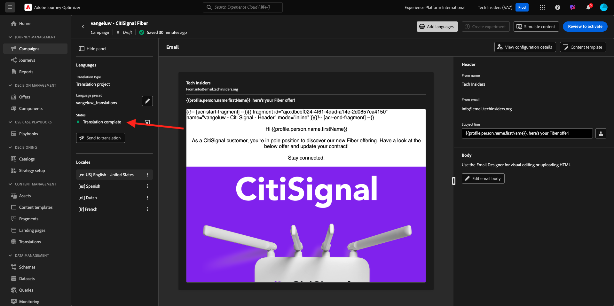
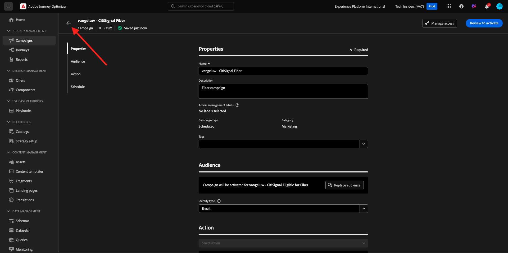

# 3.5.3 Talen toevoegen aan uw e-mail

Ga naar [ https://experience.adobe.com/ ](https://experience.adobe.com/). Klik **Journey Optimizer**.

U zult aan de **1} mening van het Huis {in Journey Optimizer worden opnieuw gericht.** Eerst, zorg ervoor u de correcte zandbak gebruikt. De sandbox die moet worden gebruikt, wordt `--aepSandboxName--` genoemd.

Ga naar **Campagnes** en klik om de campagne te openen u enkel creeerde.

Klik **wijzigen campagne**.

Klik **wijzigen zich**.

De rol neer aan de **E-mail** actie en klikt **geeft inhoud** uit.

Klik **toevoegen talen**.

Selecteer uw **montages van de Taal**, die `--aepUserLdap--_translations` worden genoemd. Klik **Uitgezocht**.

Dan moet je dit zien. Klik **verzenden naar vertaling**.

Dan zie je een bericht als deze. Het **verzenden naar vertaling** werkschema is nu begonnen en zal een paar notulen nemen om te voltooien.
U zult zien dat de statusveranderingen in **Vertaling lopend**.

Na een paar notulen, zal het statuut van het vertaalwerkschema in **Vertaling volledig** veranderen.

Klik op de vertaling **`[es] Spanish`** . U zult dan de bijgewerkte tekst in de e-mailvoorproef en ook in de **Onderwerpregel** zien.
In het geval dat het nodig is, kunt u de vertaling op het **Onderwerplijn** gebied nog herzien en bijwerken.

Klik **uitgeeft e-maillichaam** om de vertaling binnen e-mail te herzien.

U kunt de tekst handmatig wijzigen als de vertaling moet worden gecontroleerd.

Ga terug naar het campagneoverzicht door de **pijl** naast de onderwerpregel tekst in de top-left hoek te klikken.

Dan moet je hier weer zijn. Deze campagne hoeft niet opnieuw te worden geactiveerd.

Ga terug naar de campagne door de **pijl** in de hoogste linkerhoek te klikken.

Gelieve te zorgen ervoor dat uw campagne in de **Gestopt** staat is.

Je hebt deze oefening nu afgerond.

## Volgende stappen

Ga naar [ Samenvatting &amp; Voordelen ](./summary.md)

Ga terug naar [ Adobe Journey Optimizer: Vertaaldiensten ](./ajotranslationsvcs.md){target="_blank"}

Ga terug naar [ Alle modules ](./../../../../overview.md){target="_blank"}
