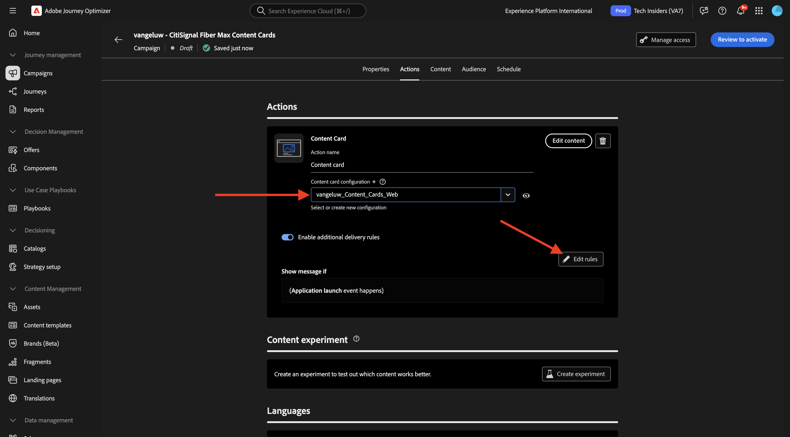
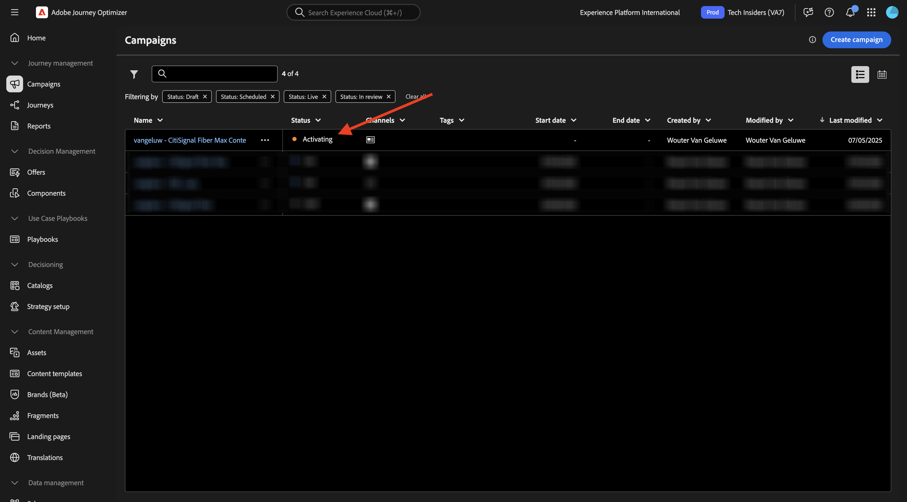
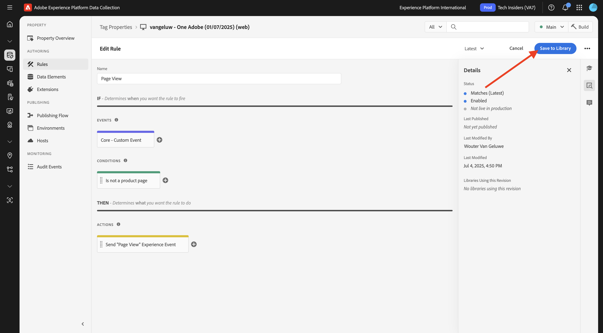
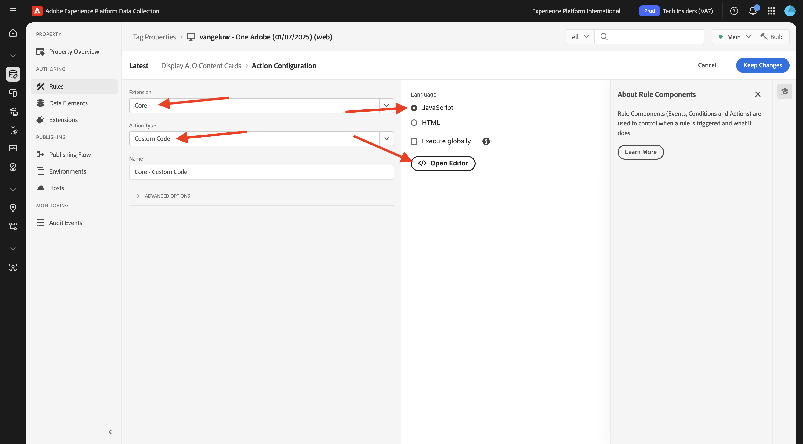

# 3.6.1 Inhoudskaarten

Login aan Adobe Journey Optimizer door naar [ Adobe Experience Cloud ](https://experience.adobe.com) te gaan. Klik **Journey Optimizer**.


U zult aan de **1} mening van het Huis {in Journey Optimizer worden opnieuw gericht.** Eerst, zorg ervoor u de correcte zandbak gebruikt. De sandbox die moet worden gebruikt, wordt `--aepSandboxName--` genoemd. U zult dan in de **1} mening van het Huis {van uw zandbak** zijn.`--aepSandboxName--`


## 3.6.1.1 Configuratie van kanaal voor contentkaarten

In het linkermenu, ga naar **Kanalen** en selecteer dan **configuraties van het Kanaal**. Klik **creeer kanaalconfiguratie**.


Ga de naam in: `--aepUserLdap--_Content_Cards_Web`, selecteer het kanaal **Kaarten van de Inhoud** en laat dan het platform **Web** toe.


De rol neer, en zorgt ervoor dat de optie **Enige pagina** wordt toegelaten.

Ga URL van de website in die vroeger als deel van **werd gecreeerd Begonnen het Begonnen** module, die als dit kijkt: `https://dsn.adobe.com/web/--aepUserLdap---XXXX`. Vergeet niet **XXXX** in de unieke code van uw website te veranderen.

>[!IMPORTANT]
>
>De bovenstaande verwijzing naar de URL van uw CitiSignal-demo-website `https://dsn.adobe.com/web/--aepUserLdap---XXXX` moet worden gewijzigd in uw werkelijke URL. U kunt URL vinden door naar uw websiteproject op [ https://dsn.adobe.com/ ](https://dsn.adobe.com/) te gaan.

Plaats de gebied **Plaats op pagina** aan `CitiSignalContentCardContainer`.


De rol omhoog en klikt **voorleggen**.


Uw kanaalconfiguratie is nu klaar om te worden gebruikt.


## 3.6.1.2 Een geplande campagne voor inhoudskaarten configureren

In het linkermenu, ga naar **Campagnes** en klik dan **creeer campagne**.


Selecteer **Gepland - Op de markt brengend** en klik dan **creeer**.


Ga de naam `--aepUserLdap-- - CitiSignal Fiber Max Content Cards` in en klik dan **Acties**.


Klik **+ voeg actie** toe en selecteer dan **Kaart van de Inhoud**.


Selecteer de inhoudskaartkanaalconfiguratie die u in de vorige stap hebt gemaakt en die de naam `--aepUserLdap--_Content_Cards_Web` heeft.

Daarna, klik **uitgeven Regels**.



Klik **X** om de huidige regel te verwijderen.


Klik op **+ Voorwaarde toevoegen** .


Selecteer de voorwaarde **Verzonden gegevens aan Platform**. Klik **Gereed**


Dan moet je dit zien. Klik **uitgeven inhoud**.


Dan moet je dit zien.


Configureer de volgende instellingen:

- **Titel**: `CitiSignal Fiber Max`
- **Lichaam**: `Lightning speed for gamers`
- **doel URL**: `https://dsn.adobe.com/web/--aepUserLdap---XXXX/plans`

>[!IMPORTANT]
>
>De bovenstaande verwijzing naar de URL van uw CitiSignal-demo-website `https://dsn.adobe.com/web/--aepUserLdap---XXXX/plans` moet worden gewijzigd in uw werkelijke URL. U kunt URL vinden door naar uw websiteproject op [ https://dsn.adobe.com/ ](https://dsn.adobe.com/) te gaan.

Klik op het pictogram om de URL te wijzigen door een element te selecteren in AEM Assets.


Ga naar de omslag **burgerschap-beelden** en selecteer het dossier **`neon_rabbit_banner.jpg`**. Klik **Uitgezocht**.


Dan moet je dit hebben. Klik op de knop **+ Toevoegen** .


Configureer de volgende instellingen voor de knop:

- **Titel van de Knoop**: `Upgrade now!`
- **gebeurtenis van de Interactie**: `click`
- **Doel**: `https://dsn.adobe.com/web/--aepUserLdap---XXXX/plans`

>[!IMPORTANT]
>
>De bovenstaande verwijzing naar de URL van uw CitiSignal-demo-website `https://dsn.adobe.com/web/--aepUserLdap---XXXX/plans` moet worden gewijzigd in uw werkelijke URL. U kunt URL vinden door naar uw websiteproject op [ https://dsn.adobe.com/ ](https://dsn.adobe.com/) te gaan.

Klik **Overzicht om** te activeren.


Klik **activeren**.


Uw campagne wordt dan geactiveerd, wat een paar minuten kan duren.



Na een paar minuten zal je campagne live zijn.


## 3.6.1.3 De DSN-website bijwerken

Als u de inhoudskaart op de website wilt weergeven, moet u het ontwerp van de homepage van uw CitiSignal-demowebsite wijzigen.

Ga naar [ https://dsn.adobe.com/ ](https://dsn.adobe.com/). Klik **3 punten** op uw website en klik **uitgeven**.


Klik om het pagina **Huis** te selecteren. Klik **uitgeven inhoud**.


Houd de cursor boven de hoofdafbeelding en klik op de knop **+** .


Ga naar **Algemeen**, uitgezochte **Banner** en klik dan **toevoegen**.


Klik om de nieuwe banner te selecteren. Ga naar **Stijl** en ga `CitiSignalContentCardContainer` op het gebied **Eigen CSS Klassen** in.


Ga naar **Uitlijning**. Plaats het gebied **Uitlijning** aan `left` en plaats het gebied **Verticale Uitlijning** aan `middle`.

Klik het **X** pictogram om het dialoogvakje te sluiten.


De wijzigingen in uw websiteontwerp zijn nu aangebracht.

Als u uw site nu in een nieuw browservenster opent, ziet deze er zo uit. het grijze gebied is de nieuwe banner, maar heeft nog geen inhoud.


Om ervoor te zorgen dat de inhoud dynamisch in de nieuwe banner wordt geladen, is een wijziging vereist in de eigenschap Tags voor gegevensverzameling.

## 3.6.1.4 De eigenschap Codes gegevensverzameling bijwerken

Ga naar [ https://experience.adobe.com/#/data-collection/ ](https://experience.adobe.com/#/data-collection/), aan **Markeringen**. Als deel van de [ Begonnen ](./../../../../modules/getting-started/gettingstarted/ex1.md) module, werden de eigenschappen van de Markeringen van de Inzameling van Gegevens gecreeerd.

U hebt deze eigenschappen van de Markeringen van de Inzameling van Gegevens reeds als deel van vorige modules gebruikt.

Klik om het bezit van de Inzameling van Gegevens voor Web te openen.


In het linkermenu, ga naar **Regels** en klik om de lijn **Mening van de Pagina** te openen.


Klik de actie **verzenden de Gebeurtenis van de Ervaring van de Mening van de Pagina**.


Als deel van de **regel van de Mening van de Pagina**, wordt het vereist om de verpersoonlijkingsinstructies van Edge voor een specifiek oppervlak te verzoeken. Het oppervlak is de banner die u in de vorige stap hebt geconfigureerd. Om dat te doen, scrol neer aan **Personalization** en ga `web://dsn.adobe.com/web/--aepUserLdap---XXXX#CitiSignalContentCardContainer` onder **Oppervlakken** in.

>[!IMPORTANT]
>
>De bovenstaande verwijzing naar de URL van uw CitiSignal-demo-website `web://dsn.adobe.com/web/--aepUserLdap---XXXX#CitiSignalContentCardContainer` moet worden gewijzigd in uw werkelijke URL. U kunt URL vinden door naar uw websiteproject op [ https://dsn.adobe.com/ ](https://dsn.adobe.com/) te gaan.

Klik **houden Veranderingen**.


Klik **sparen** of **sparen aan Bibliotheek**.




In het linkermenu, ga **Regels** en klik **toevoegen regel**.


Voer de naam in: `Display AJO Content Cards`. Klik op **+ Toevoegen** om een nieuwe gebeurtenis toe te voegen.


Selecteer de **uitbreiding**: **SDK van het Web van Adobe Experience Platform**, en selecteer het **Type van Gebeurtenis**: **Abonneren heersingspunten**.

Onder **Schema&#39;s**, uitgezochte **Kaart van de Inhoud**.

Onder **Oppervlakken**, ga `web://dsn.adobe.com/web/--aepUserLdap---XXXX#CitiSignalContentCardContainer` binnen

>[!IMPORTANT]
>
>De bovenstaande verwijzing naar de URL van uw CitiSignal-demo-website `web://dsn.adobe.com/web/--aepUserLdap---XXXX#CitiSignalContentCardContainer` moet worden gewijzigd in uw werkelijke URL. U kunt URL vinden door naar uw websiteproject op [ https://dsn.adobe.com/ ](https://dsn.adobe.com/) te gaan.

Klik **houden Veranderingen**.


Dan moet je dit zien. Klik op **+ Toevoegen** om een nieuwe handeling toe te voegen.


Selecteer de **Uitbreiding**: **Kern**, en selecteer het **Type van Actie**: **Douane Code**.

Laat checkbox voor de **Taal** toe: **JavaScript** en klik dan **Open Redacteur**.



Vervolgens wordt een leeg editorvenster weergegeven.


Plak de hieronder code in de redacteur, en klik **sparen**.

```javascript
if (!Array.isArray(event.propositions)) {
  console.log("No personalization content");
  return;
}

console.log(">>> Content Card response from Edge: ", event.propositions);

event.propositions.forEach(function (payload) {
  payload.items.forEach(function (item) {
    if (!item.data || !item.data.content || item.data.content === "undefined") {
      return;
    }
    console.log(">>> Content Card response from Edge: ", item);
    const { content } = item.data;
    const { title, body, image, buttons } = content;
    const titleValue = title.content;
    const description = body.content;
    const imageUrl = image.url;
    const buttonLabel = buttons[0]?.text.content;
    const buttonLink = buttons[0]?.actionUrl;
    const html = `<div  class="Banner Banner--alignment-left Banner--verticalAlignment-left hero-banner ContentCardContainer"  oxygen-component-id="cmp-0"  oxygen-component="Banner"  role="presentation"  style="color: rgb(255, 255, 255); height: 60%;">  <div class="Image" role="presentation">      </div>  <div class="Banner__content">    <div class="Title Title--alignment-left Title--textAlignment-left">      <div class="Title__content" role="presentation">        <strong class="Title__pretitle">${titleValue}</strong>        <h2>${description}</h2>      </div>    </div>    <div class="Button Button--alignment-left Button--variant-cta">              <button          class="Dniwja_spectrum-Button Dniwja_spectrum-BaseButton Dniwja_i18nFontFamily Dniwja_spectrum-FocusRing Dniwja_spectrum-FocusRing-ring"          type="button"          data-variant="accent"          data-style="fill"          onclick="window.open('${buttonLink}')"       style="color:#FFFFFF;padding: 12px 28px;font-size: 24px;font-family: adobe-clean;font-weight: bolder;" >          <span            id="react-aria5848951631-49"            class="Dniwja_spectrum-Button-label"            >${buttonLabel}</span          >        </button>            </div>  </div></div>`;
    if (document.querySelector(".CitiSignalContentCardContainer")) {
      const contentCardContainer = document.querySelector(
        ".CitiSignalContentCardContainer"
      );
      contentCardContainer.innerHTML = html;
      contentCardContainer.style.height = "60%";
    }
  });
});
```


Klik **houden Veranderingen**.


Klik **sparen** of **sparen aan Bibliotheek**.


In het linkermenu, ga naar **het Publiceren Stroom** en klik om de **Belangrijkste** bibliotheek te openen.


Klik **toevoegen Alle Gewijzigde Middelen** en klik dan **sparen &amp; bouwen aan Ontwikkeling**.


## 3.6.1.5 Test uw inhoudskaart op uw website

Ga naar [ https://dsn.adobe.com ](https://dsn.adobe.com). Nadat je je hebt aangemeld bij je Adobe ID, kun je dit zien. Klik de 3 punten **..** op uw websiteproject en klik dan **Looppas** om het te openen.


Vervolgens wordt uw demowebsite geopend. Selecteer de URL en kopieer deze naar het klembord.


Open een nieuw Incognito-browservenster.


Plak de URL van uw demowebsite, die u in de vorige stap hebt gekopieerd. Vervolgens wordt u gevraagd u aan te melden met uw Adobe ID.


Selecteer uw accounttype en voltooi het aanmeldingsproces.


U moet nu de CitiSignal-website die wordt geladen en de door u geconfigureerde inhoudskaart moet nu worden weergegeven in plaats van het lege grijze gebied dat u eerder had.


## Volgende stappen

Ga naar [ 3.6.2 Landing Pages ](./ex2.md)

Ga terug naar [ Adobe Journey Optimizer: Het Beheer van de inhoud ](./ajocontent.md){target="_blank"}

Ga terug naar [ Alle modules ](./../../../../overview.md){target="_blank"}
