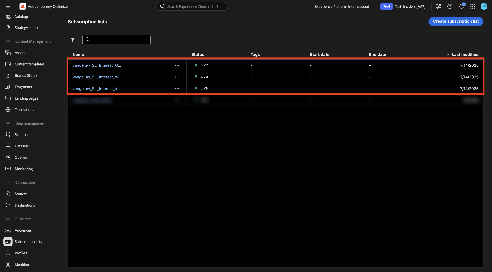
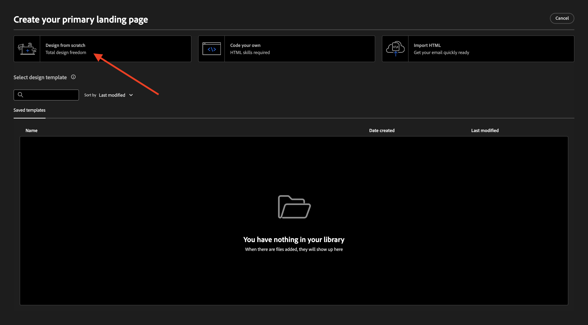
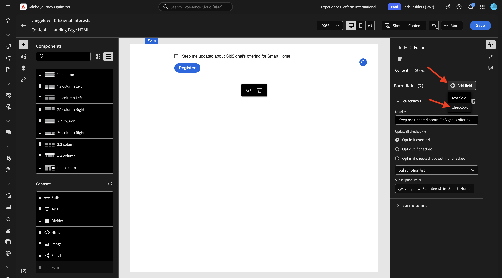
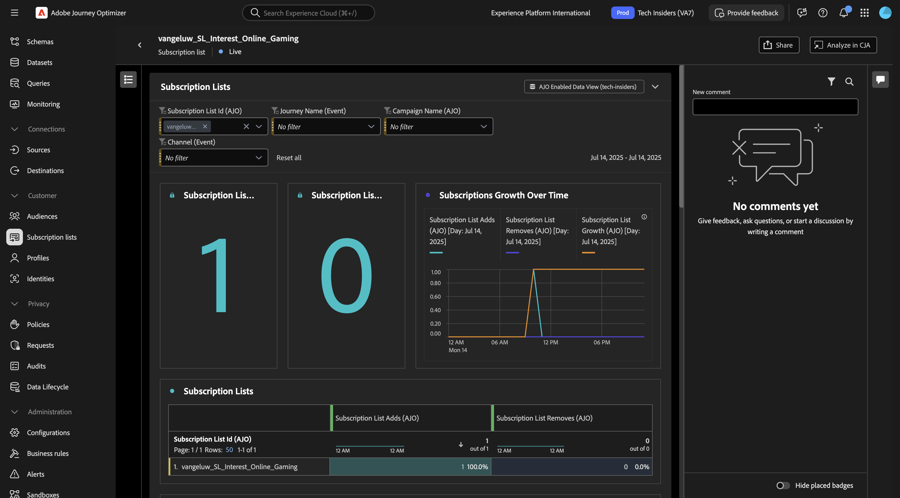

# 3.6.2 Landingspagina&#39;s

Login aan Adobe Journey Optimizer door naar [ Adobe Experience Cloud ](https://experience.adobe.com) te gaan. Klik **Journey Optimizer**.

U zult aan de **1} mening van het Huis {in Journey Optimizer worden opnieuw gericht.** Eerst, zorg ervoor u de correcte zandbak gebruikt. De sandbox die moet worden gebruikt, wordt `--aepSandboxName--` genoemd. U zult dan in de **1} mening van het Huis {van uw zandbak** zijn.`--aepSandboxName--`

## 3.6.2.1 Abonnementenlijsten

Het landen van Pagina&#39;s in Adobe Journey Optimizer werken samen met **Lijsten van het Abonnement**. Om opstellings landende pagina&#39;s te plaatsen, moet u **Lijsten van het Abonnement** eerst vormen.

CitiSignal wil hun klanten vragen naar hun interesse in de volgende domeinen:

- Smart Home
- Werk van thuis
- Online gamen

Zodra een klant zijn belangstelling in één van deze domeinen heeft aangegeven, zou die klant aan een specifieke lijst moeten worden toegevoegd zodat zij met specifieke inhoud achteraf als deel van komende campagnes kunnen worden gericht.

U maakt nu 3 abonnementenlijsten.

In het linkermenu, ga naar **Lijsten van het Abonnement**. Klik **creëren abonnementenlijst**.

Voor **Titel**, gebruik: `--aepUserLdap--_SL_Interest_in_Smart_Home`.
Voor **Beschrijving**, gebruik: `Interest in Smart Home`.

Klik **voorleggen**.

Klik **creëren abonnementenlijst** om een andere lijst tot stand te brengen.

Voor **Titel**, gebruik: `--aepUserLdap--_SL_Interest_WFH`.
Voor **Beschrijving**, gebruik: `Interest in Work From Home`.

Klik **voorleggen**.

Klik **creëren abonnementenlijst** om een andere lijst tot stand te brengen.

Voor **Titel**, gebruik: `--aepUserLdap--_SL_Interest_Online_Gaming`.
Voor **Beschrijving**, gebruik: `Interest in Online Gaming`.

Klik **voorleggen**.

U hebt nu de drie lijsten gemaakt die u nodig hebt.

## 3.6.2.2 Voorinstelling bestemmingspagina

Als u bestemmingspagina&#39;s in Adobe Journey Optimizer wilt gebruiken, moet u een voorinstelling maken.

In het linkermenu, ga naar **Beleid** > **Kanalen** en selecteer dan **het Bestaan pagina vooraf instelt**.

Klik **creeer het landen van pagina vooraf ingesteld**.

Voor het gebied **Naam**, gebruik: `--aepUserLdap-- - CitiSignal LP` en selecteer subdomain dat in uw instantie beschikbaar is.

>[!NOTE]
>
>Als u geen subdomein ziet in uw instantie, raadpleegt u uw AJO-beheerder om er een toe te voegen.

Klik **voorleggen**.

De voorinstelling voor de openingspagina is nu gemaakt.

## 3.6.2.3 Openingspagina

U kunt nu uw openingspagina maken. In het linkermenu, ga naar **het Beheer van de Inhoud** > **Landing Pagina&#39;s**.

Klik **creëren het landen pagina**.

Voor het gebied **Titel**, gebruik: `vangeluw - CitiSignal Interests`. Daarna, selecteer de **Aanvoerende Vooraf ingestelde Pagina** die u in de vorige stap vormde.

Klik **creëren**.

Dan moet je dit zien.

Verander de gebied **Naam van de Pagina** in `--aepUserLdap-- - CitiSignal Interests`.

Ga deze douanenaam onder **montages van de Toegang** in: `--aepUserLdap---citisignal-interests`.

Klik **Open Designer**.

Selecteer **Ontwerp van kras**.

Dan moet je dit zien.

Voeg een structuurcomponent **1:1 kolom** aan het canvas toe.

Voeg een inhoudscomponent **Vorm** aan het canvas toe.

Werk het gebied **Etiket** voor **Checkbox 1** bij aan `Keep me updated about CitiSignal's offering for Smart Home`.

Zorg ervoor dat checkbox **Opt binnen als gecontroleerd** wordt toegelaten, en dat **Lijst van het Abonnement** wordt geselecteerd.

Dan, klik **Uitgezochte abonnementenlijst**.

Daarna, selecteer de lijst `--aepUserLdap--_SL_Interest_in_Smart_Home` en klik **Uitgezocht**.

Klik **+ voeg gebied** toe en selecteer dan **Checkbox**.

Dan moet je dit zien.

Werk het gebied **Etiket** voor **Checkbox 2** bij aan `Keep me updated about CitiSignal's offering for Work From Home`.

Zorg ervoor dat checkbox **Opt binnen als gecontroleerd** wordt toegelaten, en dat **Lijst van het Abonnement** wordt geselecteerd.

Dan, klik **Uitgezochte abonnementenlijst**.

Daarna, selecteer de lijst `--aepUserLdap--_SL_Interest_WFH` en klik **Uitgezocht**.

Klik **+ voeg gebied** toe en selecteer dan **Checkbox**.

Dan moet je dit zien.

Werk het gebied **Etiket** voor **CheckBox 3** aan `Keep me updated about CitiSignal's offering for Online Gaming` bij.

Zorg ervoor dat checkbox **Opt binnen als gecontroleerd** wordt toegelaten, en dat **Lijst van het Abonnement** wordt geselecteerd.

Dan, klik **Uitgezochte abonnementenlijst**.

Daarna, selecteer de lijst `--aepUserLdap--_SL_Interest_Online_Gaming` en klik **Uitgezocht**.

Dan moet je dit zien.

Ga naar het vormgebied **CALL TO ACTION**.

Werk de volgende velden bij:

- **Tekst** - het etiket van de Knoop: `Save`.
- **Bevestiging actie**: uitgezochte **Tekst van de Bevestiging**.
- **Tekst van de Bevestiging**: gebruik: `Thanks for updating your preferences!`
- **actie van de Fout**: uitgezochte **tekst van de Fout**.
- **op foutentekst**: gebruik: `There was an error updating your preferences.`

Klik **sparen** en klik dan de pijl in de hoogste linkerhoek om terug naar het vorige scherm te gaan.

Klik **publiceren**.

Klik **publiceren** opnieuw.

De bestemmingspagina is nu gepubliceerd en kan in een e-mail worden gebruikt.

## 3.6.2.4 Openingspagina opnemen in e-mail

In oefening 3.1 creeerde u een reis die `--aepUserLdap-- - Registration Journey` wordt genoemd.

U moet het e-mailbericht in die reis nu bijwerken om de koppeling naar de bestemmingspagina op te nemen.

In het linkermenu, ga naar **Reizen** en klik om de reis `--aepUserLdap-- - Registration Journey` te openen.

Klik **Meer...** en selecteer dan **creeer een nieuwe versie**.

Klik **creeer een nieuwe versie**.

Klik om de **E-mail** actie te selecteren, en dan **te selecteren geef inhoud** uit.

Klik **uitgeeft e-maillichaam**.

Dan moet je iets dergelijks zien. Voeg een nieuwe structuurcomponent **1:1 kolom** aan het canvas toe.

Voeg een nieuwe inhoudscomponent **Tekst** in de pas gecreëerde structuurcomponent toe.

Plak de volgende tekst in de **** inhoudscomponent van de Tekst.

`Would you like to hear from us about Smart Home news? Do you work from home and would you like to hear our tips? Or are you an avid online gamer and do you want to receive our game reviews? Click here to update your preferences and interests!`

Maak de tekst zodanig op dat deze er uitziet en selecteer het woord `here` . Klik het **verbindings** pictogram.

Plaats het **Type** van de verbinding aan **het Bestaan pagina** en plaats het gebied **Doel** aan **Lege**.

Klik **uitgeven** pictogram om de het landen pagina te selecteren om te verbinden.

Selecteer de openingspagina `--aepUserLdap-- - CitiSignal Interests` . Klik **Uitgezocht**.

Dan moet je dit zien. Klik **sparen**.

Klik op de pijl in de linkerbovenhoek om terug te keren naar het vorige scherm.

Klik op de pijl in de linkerbovenhoek om opnieuw naar het vorige scherm te gaan.

Klik **sparen**.

Klik **publiceren**.

Klik **publiceren** opnieuw.

Uw wijzigingen zijn nu gepubliceerd en u kunt uw reis testen.

## 3.6.2.5 Test uw reis- en landingspagina

Ga naar [ https://dsn.adobe.com ](https://dsn.adobe.com). Nadat je je hebt aangemeld bij je Adobe ID, kun je dit zien. Klik de 3 punten **..** op uw websiteproject en klik dan **Looppas** om het te openen.

Vervolgens wordt uw demowebsite geopend. Selecteer de URL en kopieer deze naar het klembord.

Open een nieuw Incognito-browservenster.

Plak de URL van uw demowebsite, die u in de vorige stap hebt gekopieerd. Vervolgens wordt u gevraagd u aan te melden met uw Adobe ID.

Selecteer uw accounttype en voltooi het aanmeldingsproces.

Uw website wordt vervolgens geladen in een Incognito-browservenster. Voor elke oefening, zult u een vers, incognito browser venster moeten gebruiken om uw demowebsite URL te laden. Ga naar **binnen Teken**

Klik **CREËREN EEN ACCOUNT**. Vul uw details in en klik **Register**.

U wordt nu omgeleid naar de startpagina. Open het deelvenster Profielviewer en ga naar Klantprofiel in realtime. In het deelvenster Profielviewer worden al uw persoonlijke gegevens weergegeven, zoals de zojuist toegevoegde e-mail- en telefoon-id&#39;s.

1 minuut nadat je je account hebt gemaakt, ontvang je een e-mail over het aanmaken van je account van Adobe Journey Optimizer.

Klik op de koppeling in de e-mail om uw voorkeuren bij te werken.

Vervolgens ziet u het formulier dat u hebt gemaakt. Laat sommige controledozen toe en klik **sparen**.

Vervolgens wordt een bevestigingsbericht weergegeven.

## 3.6.2.6 Rapportage abonnementenlijst

Om de beschikbare rapportering over abonnementenlijsten te bekijken, ga naar **lijsten van het Abonnement** in het linkermenu en klik om één pf te openen de abonnementenlijsten u vóór vormde.

Klik **Rapport**.

Vervolgens ziet u het overzicht van de lijst, met het aantal personen dat zich erop heeft geabonneerd of dat zich niet heeft geabonneerd.

## Volgende stappen

Ga naar [ 3.6.3 AJO en GenStudio for Performance Marketing ](./ex3.md)

Ga terug naar [ Adobe Journey Optimizer: Het Beheer van de inhoud ](./ajocontent.md){target="_blank"}

Ga terug naar [ Alle modules ](./../../../../overview.md){target="_blank"}
