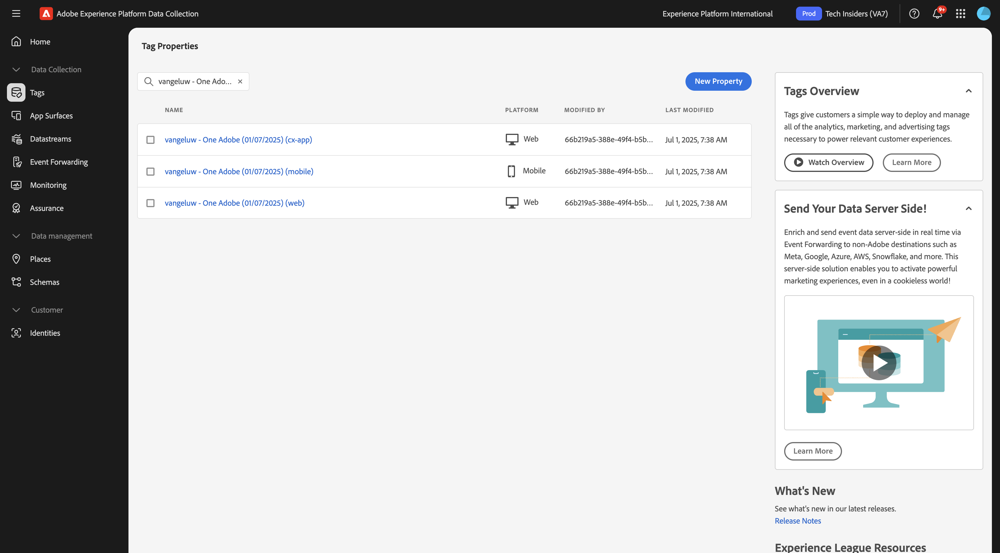

# 3.7.3 Web SDK Setup for Experience Decisition

## 3.7.3.1 De gegevensstroom bijwerken

In [&#x200B; Begonnen het Worden &#x200B;](./../../../../modules/getting-started/gettingstarted/ex2.md), creeerde u uw eigen **Datastream**. Vervolgens hebt u de naam `--aepUserLdap-- - Demo System Datastream` gebruikt.

## 3.7.3.2 Configureer uw Adobe Experience Platform Data Collection Client-eigenschap om persoonlijke aanbiedingen aan te vragen

Ga naar [&#x200B; https://experience.adobe.com/#/data-collection/ &#x200B;](https://experience.adobe.com/#/data-collection/), aan **Markeringen**. Zoek naar uw eigenschappen van de Inzameling van Gegevens, die `--aepUserLdap-- - Demo System (DD/MM/YYYY)` worden genoemd. Open de de cliëntbezit van de Inzameling van Gegevens voor Web.

## 3.7.3.3 Configureer uw Adobe Experience Platform Data Collection Client-eigenschap om persoonlijke aanbiedingen te ontvangen en toe te passen

Ga naar [&#x200B; https://experience.adobe.com/#/data-collection/ &#x200B;](https://experience.adobe.com/#/data-collection/), aan **[!UICONTROL Properties]**. Zoek naar uw eigenschappen van de Inzameling van Gegevens, die `--aepUserLdap-- - Demo System (DD/MM/YYYY)` worden genoemd. Open de eigenschap Gegevensverzameling voor het web.

In de volgende oefening zult u zien hoe u uw aanbiedingen en besluiten kunt combineren die in Adobe Journey Optimizer met een de Ervaring van Adobe Target gerichte activiteit werden gecreeerd.

## Volgende stappen

Ga terug naar [&#x200B; Beslissing van de Ervaring &#x200B;](ajo-decisioning.md){target="_blank"}

Ga terug naar [&#x200B; Alle modules &#x200B;](./../../../../overview.md){target="_blank"}
