# 3.8.1 De stichting van uw relationele gegevens instellen

Login aan Adobe Journey Optimizer door naar [&#x200B; https://experience.adobe.com &#x200B;](https://experience.adobe.com) te gaan. Klik **Journey Optimizer**.

U zult aan de **1&rbrace; mening van het Huis &lbrace;in Journey Optimizer worden opnieuw gericht.** Eerst, zorg ervoor u de correcte zandbak gebruikt. De sandbox die moet worden gebruikt, wordt `--aepSandboxName--` genoemd.

## 3.8.1.1 Instellingen voor relationeel schema

Een relationeel-gebaseerd schema is de formele definitie van het op model-gebaseerde gegevensmodel.

Hier wordt aangegeven:

- De reeks tabellen
- De kolommen in elke tabel
- De beperkingen
- De relaties tussen tabellen

Het organiseren van schema&#39;s of lijsten in een model-gebaseerd gegevensmodel is over het structureren van uw gegevens in veelvoudige lijsten. Zorg ervoor dat elke tabel één type entiteit/schema&#39;s opslaat.

Bij het opnemen van gegevens in voor gebruik met Adobe Journey Optimizer Orchestrated Campaigns zijn de volgende bronnen beschikbaar:

- Amazon S3
- Google Cloud Storage
- SFTP
- Snowflake
- Google BigQuery
- Gegevenslandingszone
- Azure Databricks
- Lokaal bestand uploaden

De eerste stap in deze oefening is de configuratie van uw op relationele-Gebaseerde schema&#39;s XDM. In het linkermenu, scrol neer aan **Beheer van Gegevens** en selecteer **Schema&#39;s**. Klik op **+ Schema maken** .

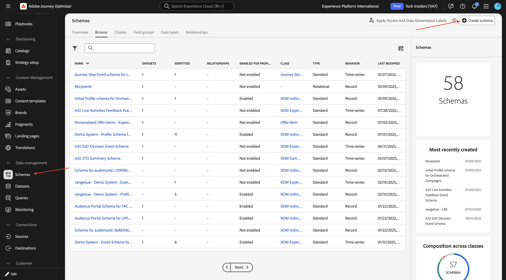

Selecteer **Relationeel**.

Selecteer **uploadt Ddl- dossier** en klik dan **kiezen dossiers**.

Download het dossier [&#x200B; burgersignaal_ddl_tables_only.sql &#x200B;](./assets/citisignal_ddl_tables_only.sql) aan uw Desktop.

Selecteer het dossier **`citisignal_ddl_tables_only.sql`** en klik **open**.

Dan moet je dit zien. Klik **daarna**.

### Identiteit

Sommige van uw schema&#39;s bevatten persoonlijke herkenningstekens en die gebieden zouden als **Identiteit** moeten worden gemerkt, en u moet **Namespace** selecteren die op dat specifieke type van identiteit van toepassing is.

**`citisignal_accounts`**

Voor dit schema, ga naar het gebied **account_id** en plaats het **Type van Identiteit** aan **Systeem van de Manifestatie - CRMID**.

**`citisignal_recipients`**

Voor dit schema, ga naar het gebied **account_id** en plaats het **Type van Identiteit** aan **het Systeem van de Manifestatie - CRMID** en ga naar het gebied **e-mail** en plaats het **type van Identiteit** aan **E-mail**.

### Versioning

Om updates van de gegevens bij te houden die tegen deze schema&#39;s zullen worden opgenomen, is het vereist om een gebied te plaatsen dat zal worden gebruikt om de versie van de geuploade gegevens te volgen. Het gebied dat voor dit in al deze schema&#39;s wordt gebruikt is het gebied **laatst gewijzigd**, dat timestamp van de geuploade gegevens bevat.

U moet nu checkbox voor **Versioning** voor het gebied **laatst gewijzigd** in elk van deze schema&#39;s controleren.

**`citisignal_products`**

Controleer checkbox voor **Versioning** voor het gebied **laatst gewijzigd**.

**`citisignal_product_bundles`**

Controleer checkbox voor **Versioning** voor het gebied **laatst gewijzigd**.

**`citisignal_product_relationships`**

Controleer checkbox voor **Versioning** voor het gebied **laatst gewijzigd**.

**`citisignal_accounts`**

Controleer checkbox voor **Versioning** voor het gebied **laatst gewijzigd**.

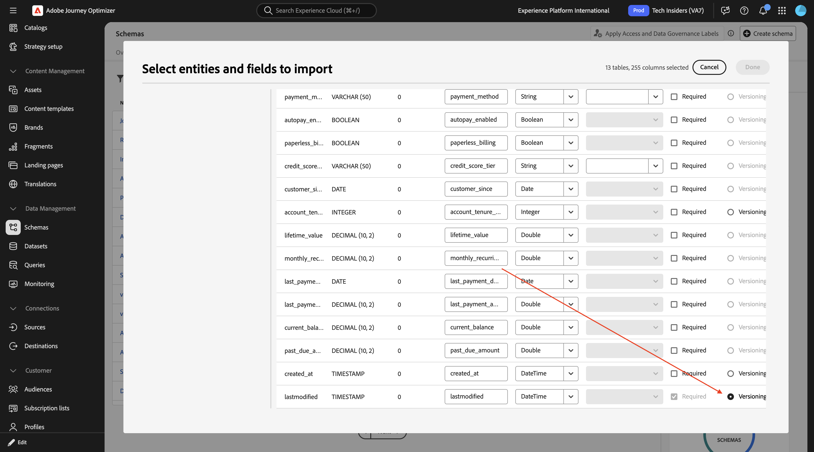

**`citisignal_recipients`**

Controleer checkbox voor **Versioning** voor het gebied **laatst gewijzigd**.

**`citisignal_mobile_subscriptions`**

Controleer checkbox voor **Versioning** voor het gebied **laatst gewijzigd**.

**`citisignal_internet_subscriptions`**

Controleer checkbox voor **Versioning** voor het gebied **laatst gewijzigd**.

**`citisignal_tv_subscriptions`**

Controleer checkbox voor **Versioning** voor het gebied **laatst gewijzigd**.

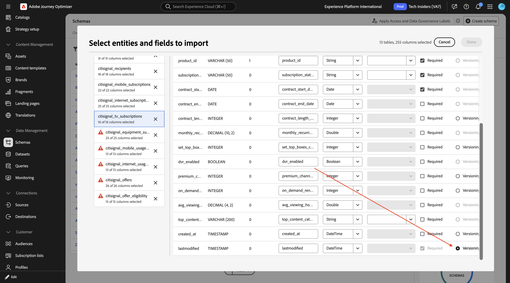

**`citisignal_equipment_subscriptions`**

Controleer checkbox voor **Versioning** voor het gebied **laatst gewijzigd**.

**`citisignal_mobile_usage_summary`**

Controleer checkbox voor **Versioning** voor het gebied **laatst gewijzigd**.

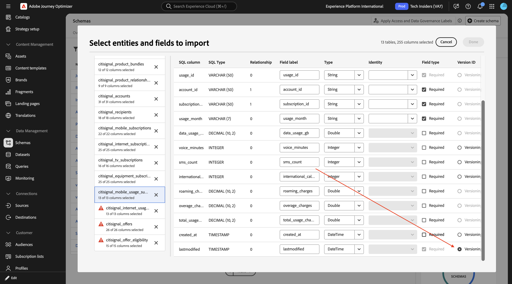

**`citisignal_internet_usage_summary`**

Controleer checkbox voor **Versioning** voor het gebied **laatst gewijzigd**.

**`citisignal_offers`**

Controleer checkbox voor **Versioning** voor het gebied **laatst gewijzigd**.

**`citisignal_offer_eligibility`**

Controleer checkbox voor **Versioning** voor het gebied **laatst gewijzigd**.

### Schemanaam

Wanneer u deze schema&#39;s opneemt voor activering in een gedeelde sandbox, moet u de naam van elk schema wijzigen zodat het uniek is in die specifieke sandbox. De reden voor deze wijziging is om conflicten met schemanamen te voorkomen.

Voor dit laboratorium, zou u uw LDAP vóór elke schemanaam moeten toevoegen, wat betekent dat elke schemanaam dit voorvoegsel zou moeten hebben: `--aepUserLdap--_`

**`citisignal_products`**

Verander de naam van uw schema in `--aepUserLdap--_ citisignal_products`.

**`citisignal_product_bundles`**

Verander de naam van uw schema in `--aepUserLdap--_ citisignal_product_bundles`.

**`citisignal_product_relationships`**

Verander de naam van uw schema in `--aepUserLdap--_ citisignal_product_relationships`.

**`citisignal_accounts`**

Verander de naam van uw schema in `--aepUserLdap--_ citisignal_accounts`.

**`citisignal_recipients`**

Verander de naam van uw schema in `--aepUserLdap--_ citisignal_recipients`.

**`citisignal_mobile_subscriptions`**

Verander de naam van uw schema in `--aepUserLdap--_ citisignal_mobile_subscriptions`.

**`citisignal_internet_subscriptions`**

Verander de naam van uw schema in `--aepUserLdap--_ citisignal_internet_subscriptions`.

**`citisignal_tv_subscriptions`**

Verander de naam van uw schema in `--aepUserLdap--_ citisignal_internet_subscriptions`.

**`citisignal_equipment_subscriptions`**

Verander de naam van uw schema in `--aepUserLdap--_ citisignal_equipment_subscriptions`.

**`citisignal_mobile_usage_summary`**

Verander de naam van uw schema in `--aepUserLdap--_ citisignal_mobile_usage_summary`.

**`citisignal_internet_usage_summary`**

Verander de naam van uw schema in `--aepUserLdap--_ citisignal_internet_usage_summary`.

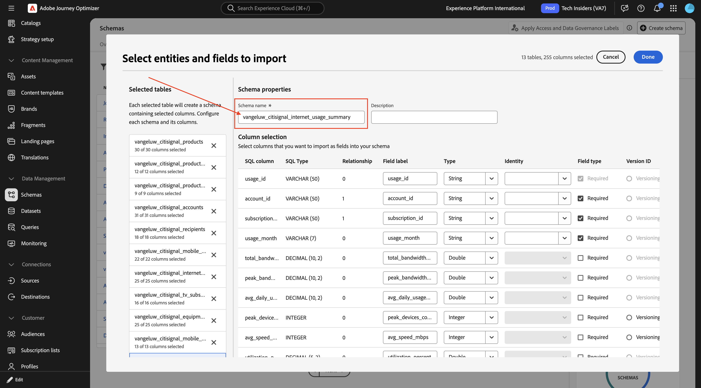

**`citisignal_offers`**

Verander de naam van uw schema in `--aepUserLdap--_ citisignal_offers`.

**`citisignal_offer_eligibility`**

Verander de naam van uw schema in `--aepUserLdap--_ citisignal_offer_eligibility`.

Uw schema&#39;s kunnen nu worden opgeslagen. Klik **Gedaan**.

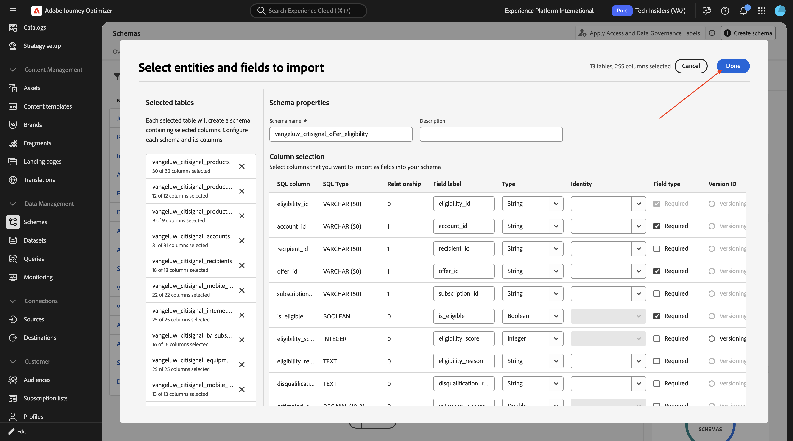

Dan moet je dit zien. Klik **sparen**.

Klik **Open banen**.

Dan moet je dit zien. U moet wachten tot de taak met succes is voltooid voordat u verdergaat met de volgende stap.

Als de taak met succes is voltooid, kunt u verdergaan met de volgende stap. Dit kan 5-10 minuten duren.

Nu uw relationele schema&#39;s XDM en met gegevens worden gevormd die worden opgenomen, kunt u beginnen die gegevens te gebruiken om uw georkestreerde campagne in de volgende oefening tot stand te brengen.

## 3.8.1.2 Gegevensinvoer

Ga naar **Datasets**. U zou dan een dataset moeten zien die voor elk schema werd gecreeerd dat u creeerde.

Download het dossier [&#x200B; data.zip &#x200B;](./assets/data.zip) aan uw Desktop en decomprimeer het.

Open de omslag **gegevens**. U zou een CSV dossier voor elk van de schema&#39;s moeten zien die werden gecreeerd. U moet nu die gegevens in elke overeenkomstige dataset uploaden. Voor dit laboratorium, zult u dat doen door een lokaal dossier te doen uploadt in elke dataset.

**`vangeluw_citisignal_products`**

Ga naar **Bronnen**, onderzoek naar `local` en klik dan **gegevens** toevoegen onder **Lokaal Dossier uploadt**.

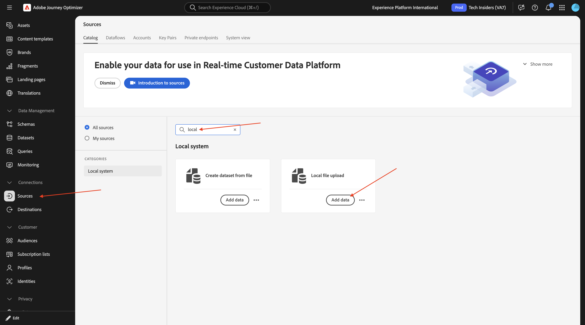

Laat knevel voor **toe toelaten veranderingsgegevens vangen**.

Selecteer de gegevensset `vangeluw_citisignal_products` .

Klik **daarna**.

Klik **kiezen dossiers**. Selecteer het dossier **`citisignal_products.csv`** en klik **open**.

Klik **daarna**

Klik **Afwerking**.

Na een paar notulen, kunt u de gegevens zien die in uw dataset worden opgenomen.

**`vangeluw_citisignal_product_bundles`**

Ga naar **Bronnen**, onderzoek naar `local` en klik dan **gegevens** toevoegen onder **Lokaal Dossier uploadt**.

Laat knevel voor **toe toelaten veranderingsgegevens vangen**.

Selecteer de gegevensset `vangeluw_citisignal_product_bundles` .

Klik **daarna**.

Klik **kiezen dossiers**. Selecteer het dossier **`citisignal_product_bundles.csv`** en klik **open**.

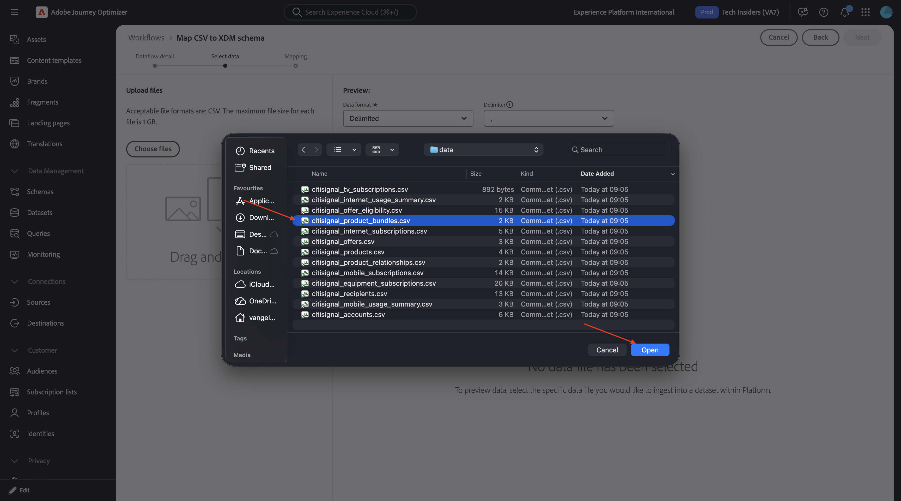

Klik **daarna**

Klik **Afwerking**.

Na een paar notulen, kunt u de gegevens zien die in uw dataset worden opgenomen.

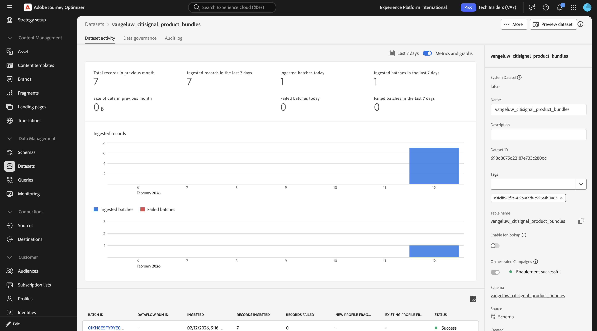

**`vangeluw_citisignal_product_relationships`**

Ga naar **Bronnen**, onderzoek naar `local` en klik dan **gegevens** toevoegen onder **Lokaal Dossier uploadt**.

Laat knevel voor **toe toelaten veranderingsgegevens vangen**.

Selecteer de gegevensset `vangeluw_citisignal_product_relationships` .

Klik **daarna**.

Klik **kiezen dossiers**. Selecteer het dossier **`citisignal_product_relationships.csv`** en klik **open**.

Klik **daarna**

Klik **Afwerking**.

Na een paar notulen, kunt u de gegevens zien die in uw dataset worden opgenomen.

**`vangeluw_citisignal_accounts`**

Ga naar **Bronnen**, onderzoek naar `local` en klik dan **gegevens** toevoegen onder **Lokaal Dossier uploadt**.

Laat knevel voor **toe toelaten veranderingsgegevens vangen**.

Selecteer de gegevensset `vangeluw_citisignal_accounts` .

Klik **daarna**.

Klik **kiezen dossiers**. Selecteer het dossier **`citisignal_accounts.csv`** en klik **open**.

Klik **daarna**

Klik **Afwerking**.

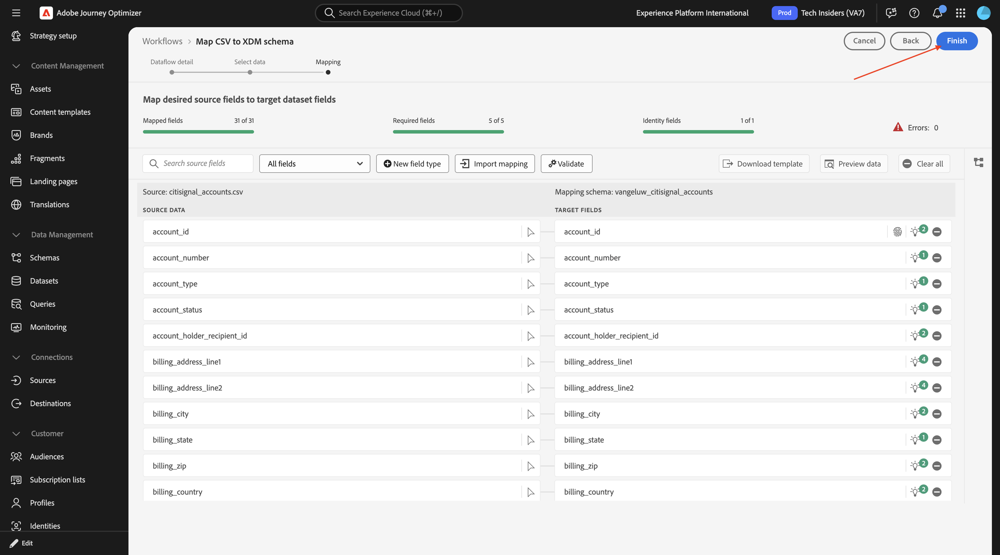

Na een paar notulen, kunt u de gegevens zien die in uw dataset worden opgenomen.

**`vangeluw_citisignal_recipients`**

Ga naar **Bronnen**, onderzoek naar `local` en klik dan **gegevens** toevoegen onder **Lokaal Dossier uploadt**.

Laat knevel voor **toe toelaten veranderingsgegevens vangen**.

Selecteer de gegevensset `vangeluw_citisignal_recipients` .

Klik **daarna**.

Klik **kiezen dossiers**. Selecteer het dossier **`citisignal_recipients.csv`** en klik **open**.

Klik **daarna**

Klik **Afwerking**.

Na een paar notulen, kunt u de gegevens zien die in uw dataset worden opgenomen.

**`vangeluw_citisignal_mobile_subscriptions`**

Ga naar **Bronnen**, onderzoek naar `local` en klik dan **gegevens** toevoegen onder **Lokaal Dossier uploadt**.

Laat knevel voor **toe toelaten veranderingsgegevens vangen**.

Selecteer de gegevensset `vangeluw_citisignal_mobile_subscriptions` .

Klik **daarna**.

Klik **kiezen dossiers**. Selecteer het dossier **`citisignal_mobile_subscriptions.csv`** en klik **open**.

Klik **daarna**

Klik **Afwerking**.

Na een paar notulen, kunt u de gegevens zien die in uw dataset worden opgenomen.

**`vangeluw_citisignal_internet_subscriptions`**

Ga naar **Bronnen**, onderzoek naar `local` en klik dan **gegevens** toevoegen onder **Lokaal Dossier uploadt**.

Laat knevel voor **toe toelaten veranderingsgegevens vangen**.

Selecteer de gegevensset `vangeluw_citisignal_internet_subscriptions` .

Klik **daarna**.

Klik **kiezen dossiers**. Selecteer het dossier **`citisignal_internet_subscriptions.csv`** en klik **open**.

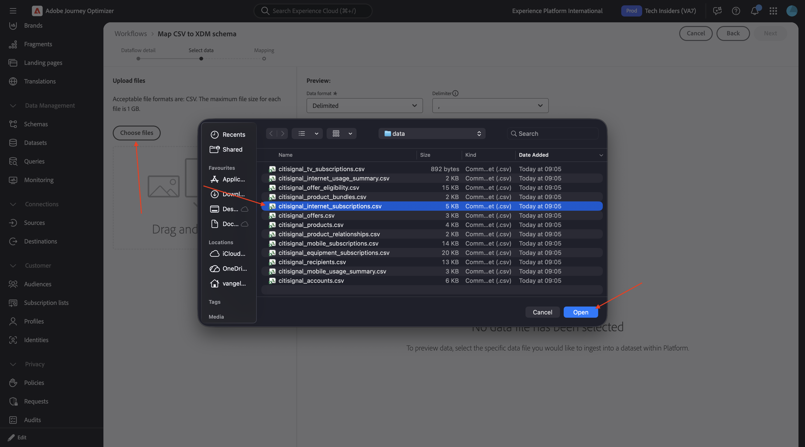

Klik **daarna**

Klik **Afwerking**.

Na een paar notulen, kunt u de gegevens zien die in uw dataset worden opgenomen.

**`vangeluw_citisignal_tv_subscriptions`**

Ga naar **Bronnen**, onderzoek naar `local` en klik dan **gegevens** toevoegen onder **Lokaal Dossier uploadt**.

Laat knevel voor **toe toelaten veranderingsgegevens vangen**.

Selecteer de gegevensset `vangeluw_citisignal_tv_subscriptions` .

Klik **daarna**.

Klik **kiezen dossiers**. Selecteer het dossier **`citisignal_tv_subscriptions.csv`** en klik **open**.

Klik **daarna**

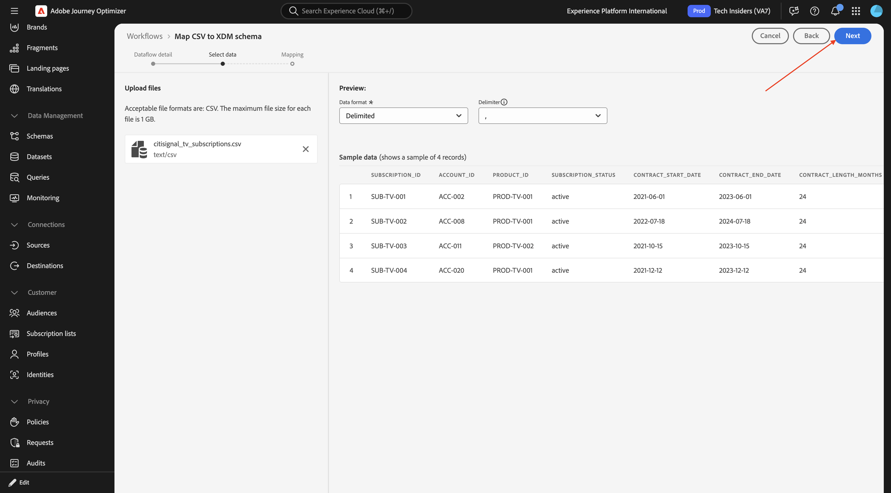

Klik **Afwerking**.

Na een paar notulen, kunt u de gegevens zien die in uw dataset worden opgenomen.

**`vangeluw_citisignal_equipment_subscriptions`**

Ga naar **Bronnen**, onderzoek naar `local` en klik dan **gegevens** toevoegen onder **Lokaal Dossier uploadt**.

Laat knevel voor **toe toelaten veranderingsgegevens vangen**.

Selecteer de gegevensset `vangeluw_citisignal_equipment_subscriptions` .

Klik **daarna**.

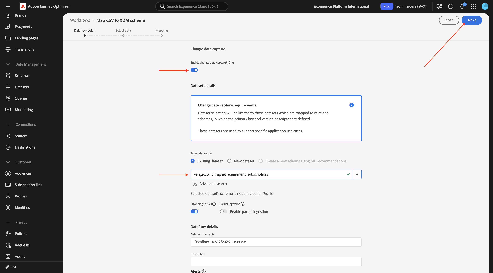

Klik **kiezen dossiers**. Selecteer het dossier **`citisignal_equipment_subscriptions.csv`** en klik **open**.

Klik **daarna**

Klik **Afwerking**.

Na een paar notulen, kunt u de gegevens zien die in uw dataset worden opgenomen.

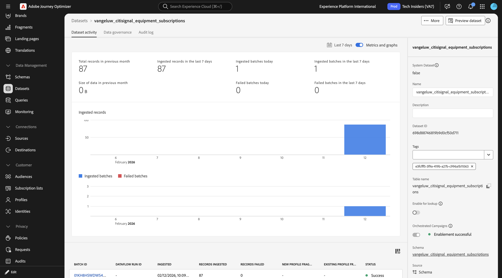

**`vangeluw_citisignal_mobile_usage_summary`**

Ga naar **Bronnen**, onderzoek naar `local` en klik dan **gegevens** toevoegen onder **Lokaal Dossier uploadt**.

Laat knevel voor **toe toelaten veranderingsgegevens vangen**.

Selecteer de gegevensset `vangeluw_citisignal_mobile_usage_summary` .

Klik **daarna**.

Klik **kiezen dossiers**. Selecteer het dossier **`citisignal_mobile_usage_summary.csv`** en klik **open**.

Klik **daarna**

Klik **Afwerking**.

Na een paar notulen, kunt u de gegevens zien die in uw dataset worden opgenomen.

**`vangeluw_citisignal_internet_usage_summary`**

Ga naar **Bronnen**, onderzoek naar `local` en klik dan **gegevens** toevoegen onder **Lokaal Dossier uploadt**.

Laat knevel voor **toe toelaten veranderingsgegevens vangen**.

Selecteer de gegevensset `vangeluw_citisignal_internet_usage_summary` .

Klik **daarna**.

Klik **kiezen dossiers**. Selecteer het dossier **`citisignal_internet_usage_summary.csv`** en klik **open**.

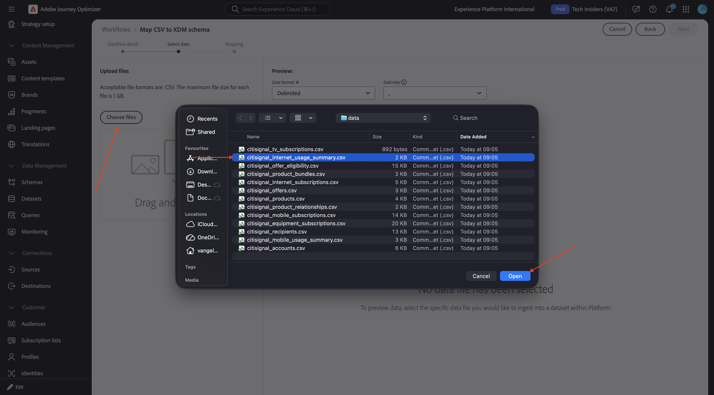

Klik **daarna**

Klik **Afwerking**.

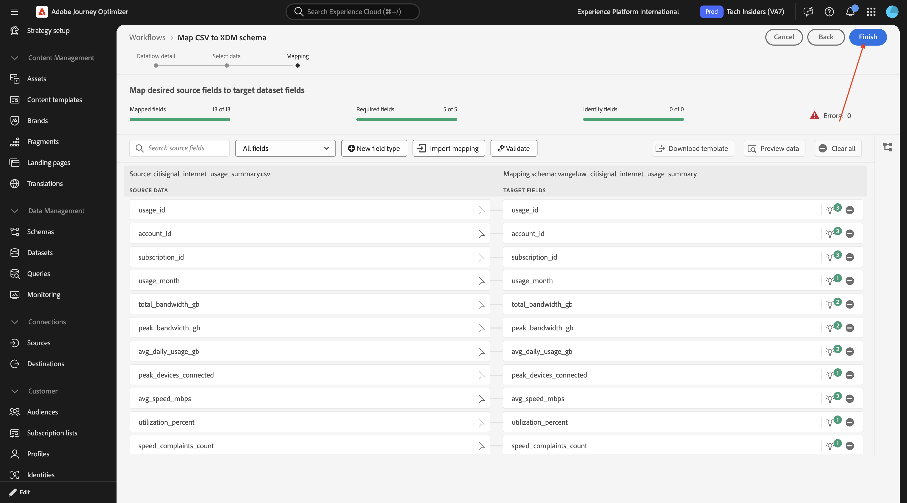

Na een paar notulen, kunt u de gegevens zien die in uw dataset worden opgenomen.

**`vangeluw_citisignal_offers`**

Ga naar **Bronnen**, onderzoek naar `local` en klik dan **gegevens** toevoegen onder **Lokaal Dossier uploadt**.

Laat knevel voor **toe toelaten veranderingsgegevens vangen**.

Selecteer de gegevensset `vangeluw_citisignal_offers` .

Klik **daarna**.

Klik **kiezen dossiers**. Selecteer het dossier **`citisignal_offers.csv`** en klik **open**.

Klik **daarna**

Klik **Afwerking**.

Na een paar notulen, kunt u de gegevens zien die in uw dataset worden opgenomen.

**`vangeluw_citisignal_offer_eligibility`**

Ga naar **Bronnen**, onderzoek naar `local` en klik dan **gegevens** toevoegen onder **Lokaal Dossier uploadt**.

Laat knevel voor **toe toelaten veranderingsgegevens vangen**.

Selecteer de gegevensset `vangeluw_citisignal_offer_eligibility` .

Klik **daarna**.

Klik **kiezen dossiers**. Selecteer het dossier **`citisignal_offer_eligibility.csv`** en klik **open**.

Klik **daarna**

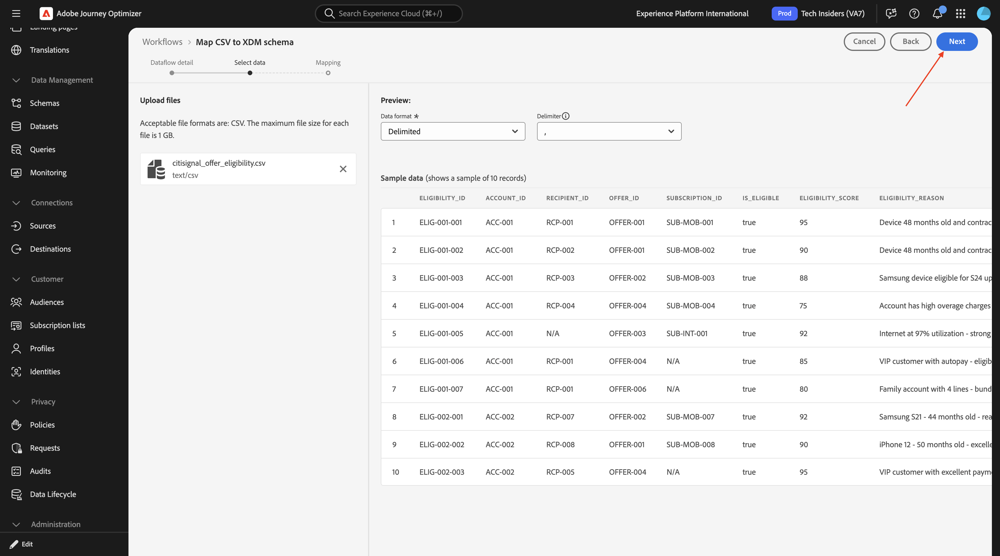

Klik **Afwerking**.

Na een paar notulen, kunt u de gegevens zien die in uw dataset worden opgenomen.

Alle gegevens worden nu opgenomen.

## 3.8.1.3 Profieldoel Dimension

Met Geordende Campagnes, kunt u gerichte mededelingen op entiteitniveau ontwerpen en leveren, leveraging Adobe Experience Platform&#39;s relationele schemamogelijkheden. Experience Platform gebruikt schema&#39;s om de gegevensstructuur op een consistente en herbruikbare manier te beschrijven. Wanneer gegevens in Experience Platform worden opgenomen, worden ze gestructureerd volgens een XDM-schema.

Hoewel de segmentatie voor Geordende Campagnes hoofdzakelijk op relationele regelingen werkt, komt de daadwerkelijke berichtlevering altijd op het niveau van het Profiel voor.

Wanneer het vormen richt, bepaalt u twee zeer belangrijke aspecten:

- Doelschema&#39;s: u geeft op welke relationele schema&#39;s geschikt zijn voor doelframes. Standaard wordt het schema met de naam Ontvanger gebruikt, maar u kunt alternatieven configureren, zoals Bezoekers, Klanten enzovoort.

- Profielkoppeling: het systeem moet begrijpen hoe het doelschema wordt toegewezen aan het profielschema. Dit wordt bereikt door een gedeeld identiteitsgebied — dat zowel in het doelschema als het schema van het Profiel bestaat en als identiteit namespace wordt gevormd.

U moet nu uw afmetingen van het Doel van het Profiel vormen. Ga naar **Beleid** > **Configuratie** en klik dan **leiden** onder **het Doel Dimension van het Profiel**.

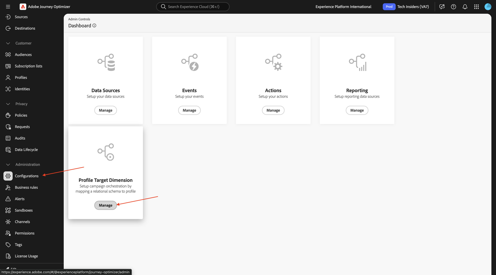

Dan moet je dit zien. Klik **creëren**.

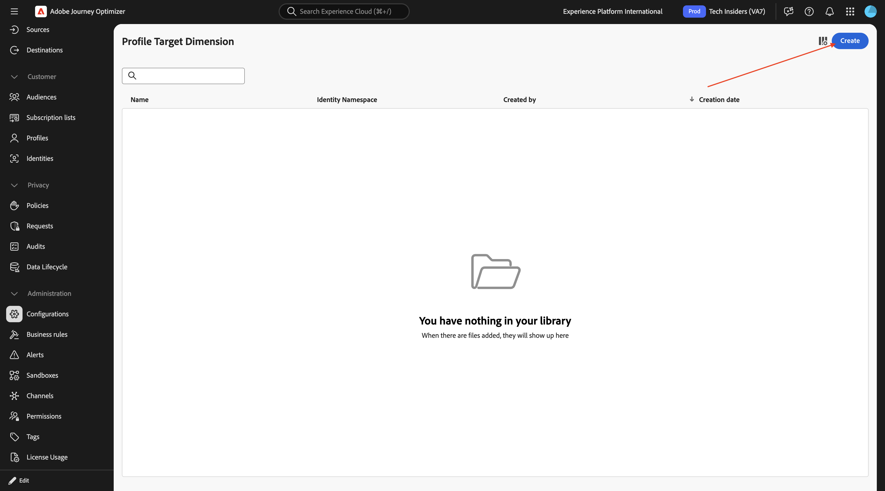

Voor het **Schema**, uitgezochte `--aepUserLdap--_citisignal_accounts`. Voor de **waarde van de Identiteit**, uitgezochte **account_id**.

Klik **sparen**.

Klik **creeer opnieuw**.

Voor het **Schema**, uitgezochte `--aepUserLdap--_citisignal_recipients`. Voor de **waarde van de Identiteit**, uitgezochte **account_id**.

Klik **sparen**.

Klik **creeer opnieuw**.

Voor het **Schema**, uitgezochte `--aepUserLdap--_citisignal_recipients`. Voor de **waarde van de Identiteit**, uitgezochte **e-mail**.

Klik **sparen**.

Dan moet je dit hebben.

## 3.8.1.4 Email channel

In het linkermenu, ga naar **Kanalen**. Klik **creeer kanaalconfiguratie**.

Gebruik de naam: `--aepUserLdap---citisignal-email-oc` . Selecteer het kanaal **E-mail**

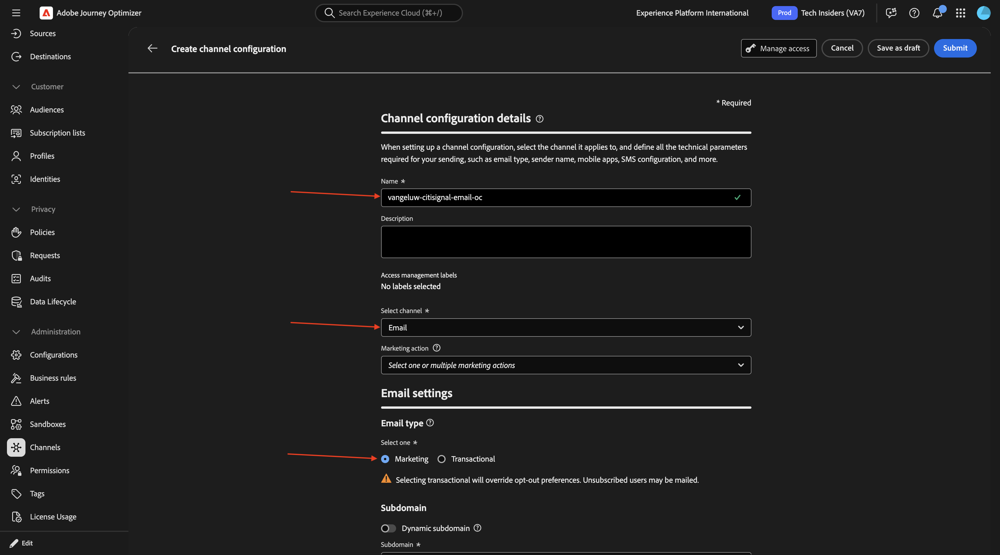

Selecteer een beschikbare **subdomain** en **IP pool**.

De rol neer en vult de **parameters van de Kopbal** uit.

- **van naam**: `info@techinsiders.org`
- **van e-mailprefix**: `info`
- **Antwoord aan naam**: `info@techinsiders.org`
- **Antwoord aan e-mail**: `info@techinsiders.org`
- **E-mailprefix van de Fout**: `error`

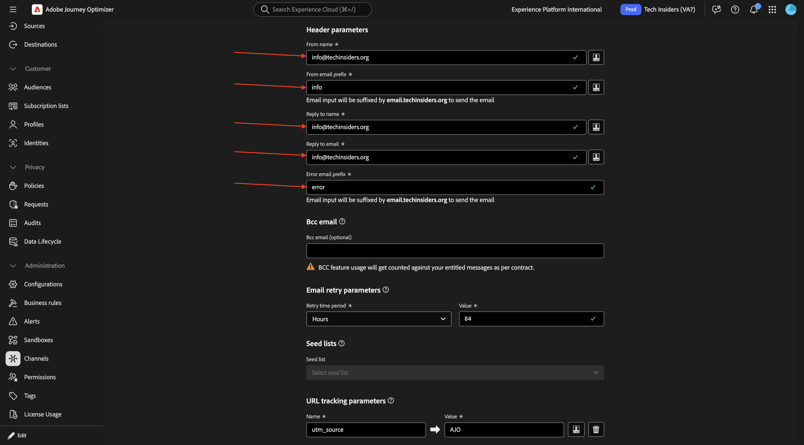

Omlaag schuiven. Ga naar **Geordende campagne**. Controle checkbox voor **Toegelaten**. Selecteer **het richten dimensie**.

Voor **het Doel Dimension van het Profiel**, uitgezochte `--aepUserLdap--_citisignal_recipients - email`.

Selecteer **Dimension van het Doel** en klik het **open omslag** pictogram.

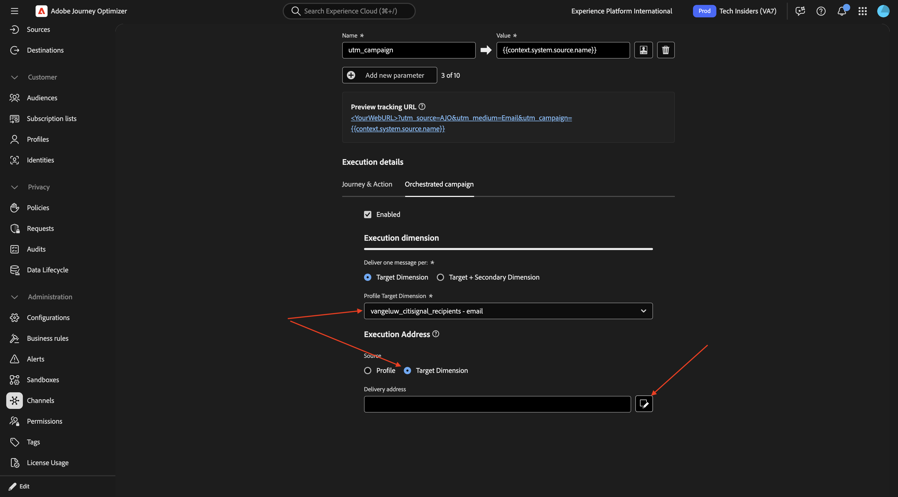

Klik op `--aepUserLdap--_citisignal_recipients`.

Selecteer het gebied **e-mail** en klik **Uitgezocht**.

De rol omhoog en klikt **voorleggen**.

In de volgende oefening zult u beginnen om die gegevens als deel van een georkestreerde campagne te gebruiken.

## Volgende stappen

Ga naar [&#x200B; creeer uw georkestreerde campagne &#x200B;](./ex2.md){target="_blank"}

Ga terug naar [&#x200B; Adobe Journey Optimizer: Geordende Campagnes &#x200B;](./ajocampaigns.md){target="_blank"}

Ga terug naar [&#x200B; Alle modules &#x200B;](./../../../../overview.md){target="_blank"}
