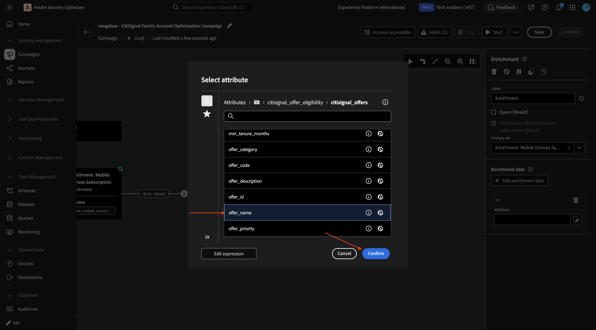
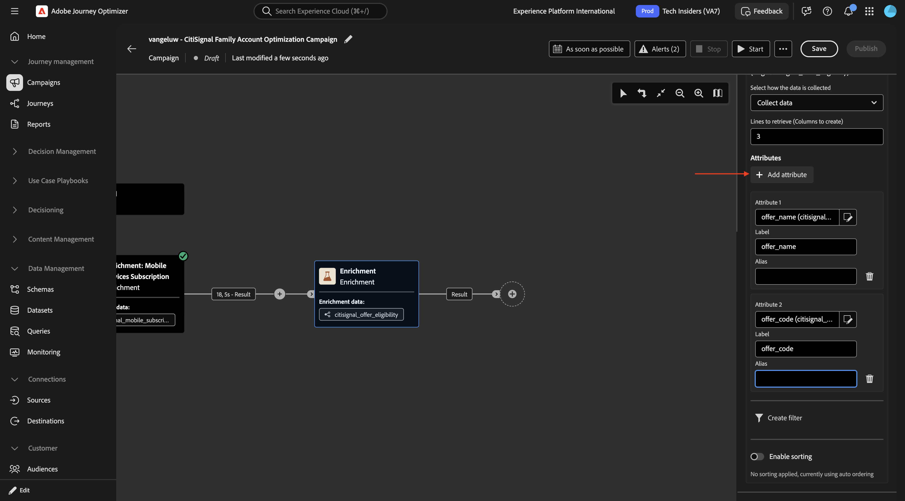
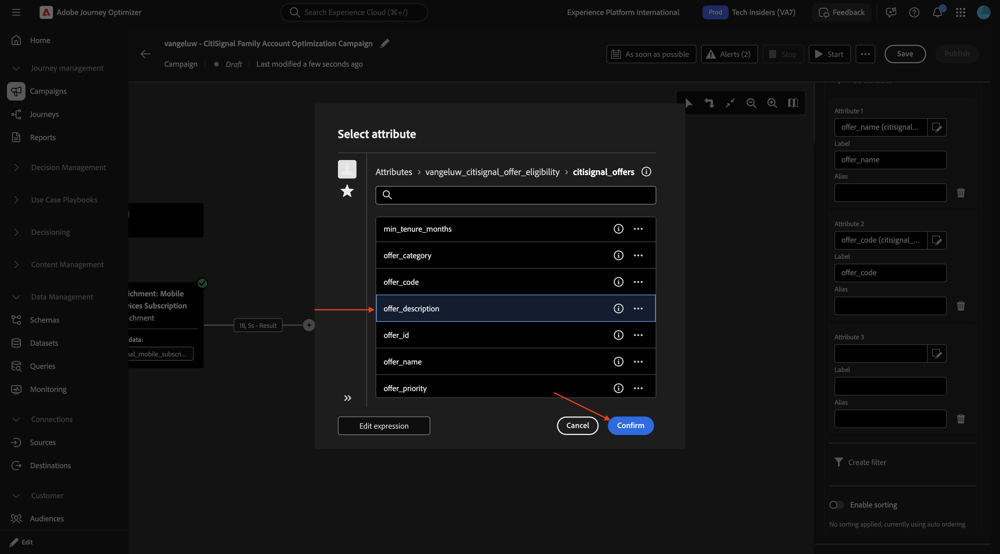
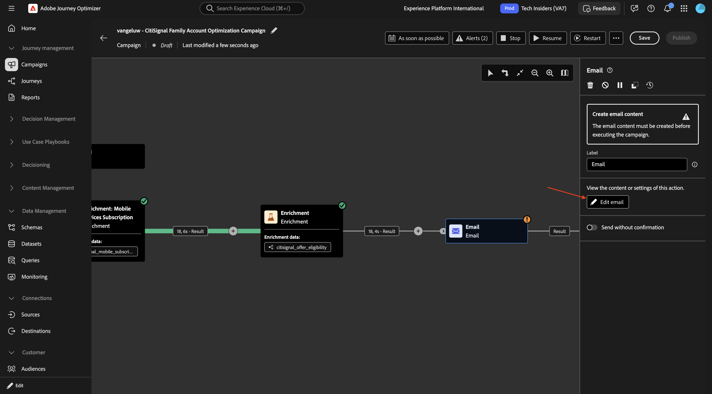
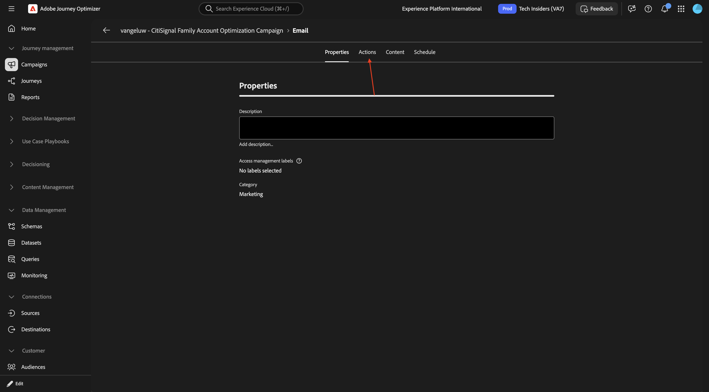

# 3.8.2 Maak uw georkestreerde campagne

## 3.8.2.1 Uw geordende campagne maken

Ga naar **Campagnes**. Klik **creeer campagne**.

Selecteer **Orchestration - marketing** en klik **bevestigen**.

Ga de campagnenaam in: `--aepUserLdap-- - CitiSignal Family Account Optimization Campaign` en klik **sparen**.

Dan moet je dit zien. Klik op het pictogram **+** .

Selecteer **Fork**.

### Gebouwd publiek 1

Klik het **+** pictogram en selecteer dan **Publiek van de Bouwstijl**.

Klik om de omslag voor **het richten afmeting** te openen.

Selecteer **`--aepUserLdap--_citisignal_recipients`** en klik **bevestigen**.

Klik **creëren publiek**.

Klik **toevoegen voorwaarde**.

Selecteer **receiving_type** en klik **bevestigen**.

Ga **`account_holder`** op het gebied **Waarde** in en klik **berekent**.

U zou dan een aantal voor **gerichte profielen** moeten zien. Klik ergens in het grijze gebied zoals aangegeven.

Klik **toevoegen voorwaarde**.

Boor neer aan **`citisignal_accounts`**.

Selecteer **`account_status`** en klik **bevestigen**.

Ga **`active`** op het gebied **Waarde** in. Klik vervolgens ergens in het grijze gebied zoals aangegeven.

Klik **toevoegen voorwaarde**.

Boor neer aan **`citisignal_mobile_subscriptions`**.

Selecteer **`subscription_id`** en klik **bevestigen**.

Laat de schakelaar voor **samengevoegde gegevens** toe. Selecteer vervolgens het volgende:

- **samengevoegde functie**: **Telling**
- **Exploitant**: **groter dan of gelijk aan**
- **Waarde**: **1**

Klik **bevestigen**.

Dan moet je dit zien. Klik **bevestigen**.

### publiek 2 samenstellen

Klik op het pictogram **+** op het volgende knooppunt in het andere pad.

Selecteer **Bouwstijl publiek**.

Klik om de omslag voor **het richten afmeting** te openen.

Selecteer **`--aepUserLdap--_mobile_subscriptions`** en klik **bevestigen**.

Klik **creëren publiek**.

Klik **toevoegen voorwaarde**.

Selecteer **subscription_status** en klik **bevestigen**.

Ga **`active`** op het gebied **Waarde** in. Dan, klik **toevoegen voorwaarde**.

Selecteer **`is_upgrade_eligible`** en klik **bevestigen**.

Plaats de **Waarde** aan **waar**

Klik **berekenen** om een schatting van de profielen te zien die voor dit publiek kwalificeren. Dan, klik **bevestigen**

### Splitsen

Klik **+** pictogram en selecteer dan **Splitsen**.

Verander het gebied **Etiket** in **Behandeling 90/10 vs Controle**. Klik om de objecten **Subset** te openen.

Laat de schakelaar voor **toe toelaten grens** en plaats de **grootte van de Grens** aan **10 percenten**.

Klik **toevoegen segment** en dan zou u het **voorwerp moeten zien van het Resultaat** dat wordt toegevoegd.

Klik **sparen**.

### Doelgroep opslaan

Klik **+** pictogram en selecteer dan **sparen publiek**.

Plaats het etiket van het gebied **publiek** aan **`--aepUserLdap-- - Control Group`**. Klik **Toewijzing van het publiek** toevoegen.

Boor neer aan **richtend afmeting**.

Selecteer **`account_id`** en klik **bevestigen**.

Plaats het **de afbeeldingsgebied van het Profiel** aan **`--aepUserLdap--_citisignal_recipients - account_id`**.

### Verrijking: internetabonnement

Klik op het pictogram **+** .

Selecteer **Verrijking**.

Dan moet je dit zien. Klik **verrijkingsgegevens** toevoegen.

Boor neer aan **`Targeting dimension`**.

Boor neer aan **`citisignal_accounts`**.

Boor neer aan **`citisignal_internet_subscriptions`**.

Selecteer **`account_id`** en klik **bevestigen**.

Dan moet je dit zien. Klik **toevoegen attributen**.

Selecteer **`subscription_status`** en klik **bevestigen**.

Klik **toevoegen attributen**.

Selecteer **`connection_type`** en klik **bevestigen**.

Klik **toevoegen attributen**.

Selecteer **`service_city`** en klik **bevestigen**.

Klik **toevoegen attributen**.

Selecteer **`avg_bandwidth_usage_gb`** en klik **bevestigen**.

Klik **toevoegen attributen**.

Selecteer **`data_cap_gb`** en klik **bevestigen**.

Klik **toevoegen attributen**.

Selecteer **`advertised_speed_mbps`** en klik **bevestigen**.

Klik **toevoegen attributen**.

Selecteer **`monthly_recurring_charge`** en klik **bevestigen**.

Klik **sparen**.

De rol omhoog en verandert het gebied **Etiket** aan `Enrichment: Internet Subscription`.

### Verrijking: abonnement op mobiele apparaten

Klik **+** pictogram op de volgende knoop en selecteer **Verrijking**.

Verander het gebied **Etiket** aan `Enrichment: Mobile Devices Subscription` en klik dan **verrijkingsgegevens** toevoegen.

Boor neer aan **het richten afmeting**.

Boor neer aan **`citisignal_accounts`**.

Boor neer aan **`citisignal_mobile_subscriptions`**.

Selecteer **`phone_number`** en klik **bevestigen**.

Klik **toevoegen attributen**.

Boor neer aan **`citisignal_equipment_subscriptions`**.

Selecteer **`model`** en klik **bevestigen**.

Klik **toevoegen attributen**.

Boor neer aan **`citisignal_equipment_subscriptions`**.

Selecteer **`recommended_device_model`** en klik **bevestigen**.

Klik **toevoegen attributen**.

Boor neer aan **`citisignal_equipment_subscriptions`**.

Selecteer **`is_upgrade_eligible`** en klik **bevestigen**.

U kunt nu de voortgang testen door een test uit te voeren en te zien welke gegevens beschikbaar zijn in uw campagne.

Sparen uw veranderingen en klik dan **Begin**.

Na enige tijd moet je dit zien. Klik **resultaten van de Voorproef**.

Dan zou je iets gelijkaardigs moeten zien. Klik **dicht**.

Ga terug in de knoop **Verrijking: Mobiele Abonnement van Apparaten**.

Klik **toevoegen attributen**.

Selecteer **`account_id`** en klik **bevestigen**.

Klik **toevoegen attributen**.

Selecteer **`subscription_id`** en klik **bevestigen**.

Klik **toevoegen attributen**.

Selecteer **`renewal_eligibility_date`** en klik **bevestigen**.

Klik **toevoegen attributen**.

Selecteer **`line_user_recipient_id`** en klik **bevestigen**.

Klik **toevoegen attributen**.

Selecteer **`current_device_id`** en klik **bevestigen**.

Klik **toevoegen attributen**.

Selecteer **`contract_start_date`** en klik **bevestigen**.

Klik **toevoegen attributen**.

Boor neer aan **`citisignal_equipment_subscriptions`**.

Selecteer **`manufacturer`** en klik **bevestigen**.

Klik **toevoegen attributen**.

Boor neer aan **`citisignal_equipment_subscriptions`**.

Selecteer **`device_age_months`** en klik **bevestigen**.

Klik **toevoegen attributen**.

Boor neer aan **`citisignal_equipment_subscriptions`**.

Selecteer **`trade_in_value`** en klik **bevestigen**.

Klik **toevoegen attributen**.

Boor neer aan **`citisignal_equipment_subscriptions`**.

Selecteer **`monthly_payment`** en klik **bevestigen**.

### Verrijking: abonnement op mobiele apparaten

Dan moet je dit hebben. Klik **sparen**. Dan, klik het **+** pictogram om een nieuwe knoop toe te voegen en **Verrijking** te selecteren.

Dan moet je dit zien. Klik **verrijkingsgegevens** toevoegen.

Boor neer aan **het richten afmeting**.

Boor neer aan **`citisignal_offer_eligibility`**.

Boor neer aan **`citisignal_offers`**.

Selecteer **`offer_name`** en klik **bevestigen**.

Klik **toevoegen attributen**.

Boor neer aan **`citisignal_offers`**.

Selecteer **`offer_code`** en klik **bevestigen**.

Klik **toevoegen attributen**.

Boor neer aan **`citisignal_offers`**.

Selecteer **`offer_description`** en klik **bevestigen**.

Klik **toevoegen attributen**.

Boor neer aan **`citisignal_offers`**.

Selecteer **`offer_description`** en klik **bevestigen**.

Schakel **toe laat het sorteren**.

Boor neer aan **`citisignal_offers`**.

Selecteer **`offer_priority`** en klik **bevestigen**.

Je kunt nu je campagne testen. Klik **Begin**.

Na enige tijd moet u dit zien. Klik het **Resultaat** en selecteer dan **Resultaten van de Voorproef**.

Dan zou je iets gelijkaardigs moeten zien.

### E-mailactiviteit

Klik **+** pictogram en selecteer dan **E-mail**.

Klik **uitgeven e-mail**.

Ga naar **Acties**.

Selecteer de **configuratie van het E-mailkanaal** die u vóór creeerde en dan **klikt geef inhoud** uit.

Voor de **Onderwerpregel**, kleef dit:

`{{target.--aepUserLdap--_citisignal_recipients.first_name}}, Your CitiSignal Family Account Summary`

Klik **uitgeeft e-maillichaam**.

## Volgende stappen

Ga terug naar [ Adobe Journey Optimizer: Geordende Campagnes ](./ajocampaigns.md){target="_blank"}

Ga terug naar [ Alle modules ](./../../../../overview.md){target="_blank"}
