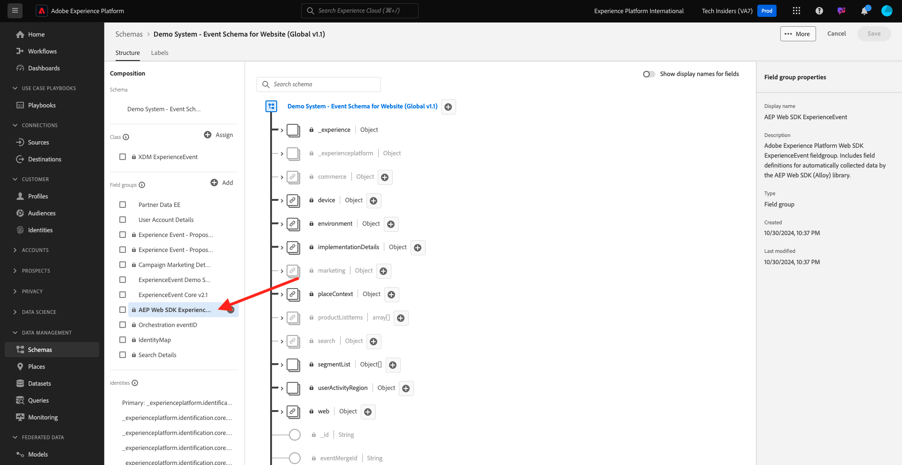

# 1.1.7 XDM-schemavereisten in Adobe Experience Platform

Om ervoor te zorgen dat de SDK van het Web gegevens in Adobe Experience Platform kan opnemen, is er een vereiste voor een specifieke mix XDM om deel uit te maken van het XDM-schema in Adobe Experience Platform.

Ga naar [ https://experience.adobe.com/platform ](https://experience.adobe.com/platform) en login.

Na het programma openen, selecteer de aangewezen zandbak door de tekst **Prod van de Productie** in de blauwe lijn bovenop uw scherm te klikken. Selecteer de sandbox `--aepSandboxName--` .

Na het selecteren van uw zandbak, zult u de het schermverandering zien en nu bent u in uw zandbak.

In het linkermenu, ga naar **Schema&#39;s** en open het **Systeem van de Demo - het Schema van de Gebeurtenis voor Website (Globale v1.1)** Schema.

In dat schema, zult u zien dat de het gebiedsgroep van het Web van AEP Web SDK ExperienceEvent **is toegevoegd.** Deze veldgroep voegt alle minimaal vereiste velden toe aan het schema. Elk schema van de Gebeurtenis van de Ervaring in Adobe Experience Platform dat door Web SDK zal worden gebruikt zal altijd vereisen dat de gebiedsgroep deel van het Schema uitmaakt.

In [ Module 1.2 de Ingestie van Gegevens ](./../dc1.2/data-ingestion.md) zult u leren hoe te om gebiedsgroepen aan schema&#39;s toe te voegen.

Volgende stap:

## Volgende stappen

Ga terug naar [ Opstelling van de Inzameling van Gegevens van Adobe Experience Platform en de de markeringsuitbreiding van SDK van het Web ](./data-ingestion-launch-web-sdk.md){target="_blank"}

Ga terug naar [ Alle modules ](./../../../../overview.md){target="_blank"}
