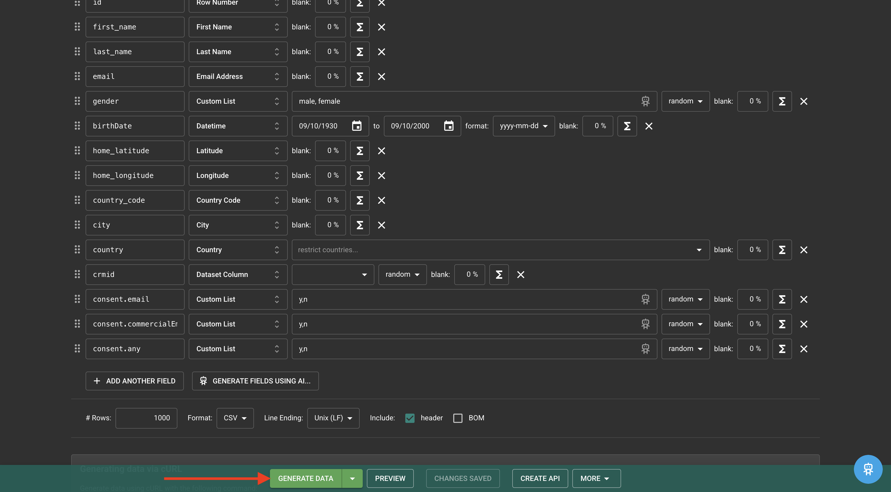
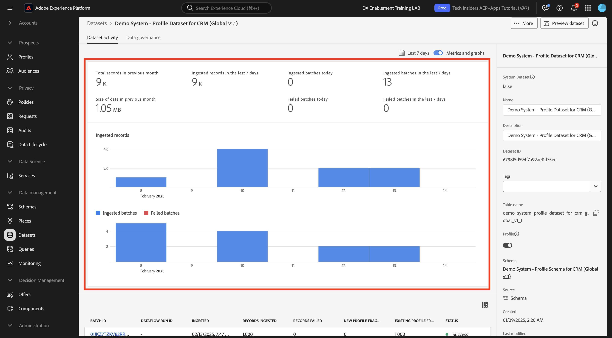

# 1.2.4 Gegevensinname uit offlinebronnen

In deze oefening, is het doel om externe gegevens zoals Gegevens CRM in Platform aan te nemen.

## Leerdoelen

- Leer hoe u testgegevens kunt genereren
- Leer hoe u CSV inneemt
- Leer hoe u de webinterface kunt gebruiken voor gegevensinvoer via Workflows
- Begrijp de functies voor gegevensbeheer van Experience Platform

## Bronnen

- Mockaroo: [&#x200B; https://www.mockaroo.com/](https://www.mockaroo.com/)
- Adobe Experience Platform: [&#x200B; https://experience.adobe.com/platform/](https://experience.adobe.com/platform/)

## Taken

- Maak een CSV-bestand met demo-gegevens. Maak gebruik van de beschikbare workflows om het CSV-bestand in Adobe Experience Platform op te nemen.
- Opties voor gegevensbeheer in Adobe Experience Platform begrijpen

## Creeer een Dataset van CRM gebruikend een hulpmiddel van de gegevensgenerator

Voor deze oefening, hebt u 1000 steekproeflijnen van Gegevens van CRM nodig.

Open het Malplaatje Mockaroo door [&#x200B; https://www.mockaroo.com/12674210 &#x200B;](https://www.mockaroo.com/12674210) te gaan.

In de sjabloon ziet u de volgende velden:

- id
- first_name
- last_name
- email
- sekse
- geboortedatum
- home_latitude
- home_longitude
- country_code
- stad
- land
- crmId
- consent.email
- consent.commercialEmail
- consent.any

Al deze gebieden zijn bepaald om gegevens te veroorzaken die met Platform compatibel zijn.

Als u het CSV-bestand wilt genereren, klikt u op de knop **[!UICONTROL Generate Data]** waarmee u een CSV-bestand met 1000 regels demo-gegevens maakt en downloadt.

Open het CSV-bestand om de inhoud van het bestand te visualiseren.

Als uw CSV-bestand gereed is, kunt u doorgaan met opnemen in AEP.

### De gegevensset verifiëren

Ga naar [&#x200B; https://experience.adobe.com/platform &#x200B;](https://experience.adobe.com/platform).

Selecteer een **[!UICONTROL sandbox]** voordat u verdergaat. De te selecteren sandbox krijgt de naam ``--aepSandboxName--`` .

Klik in Adobe Experience Platform op **[!UICONTROL Datasets]** in het menu aan de linkerkant van het scherm.

U zult een gedeelde dataset gebruiken. De gedeelde gegevensset is al gemaakt en wordt **[!UICONTROL Demo System - Profile Dataset for CRM (Global v1.1)]** genoemd. Klik erop om het te openen.

Op het overzichtsscherm kunt u drie belangrijke stukken van informatie zien.

>[!NOTE]
>
>Het is mogelijk dat de weergave van uw gegevensset leeg is als er in de afgelopen 7 dagen geen activiteit is opgetreden.

Ten eerste toont het dashboard van [!UICONTROL Dataset Activity] het totale aantal CRM-records in de dataset en de opgenomen batches en hun status

Ten tweede kunt u door omlaag te schuiven op de pagina controleren wanneer batches met gegevens zijn ingesloten, hoeveel records zijn ingecheckt en of de batch is ingecheckt. **[!UICONTROL Batch ID]** is de id voor een specifieke batchtaak en **[!UICONTROL Batch ID]** is belangrijk omdat deze kan worden gebruikt voor het oplossen van problemen waarom een specifieke batch niet is geactiveerd.

Ten slotte bevat het tabblad [!UICONTROL Dataset] info belangrijke informatie zoals [!UICONTROL Dataset ID] (ook hier belangrijk vanuit het oogpunt van probleemoplossing), de naam van de gegevensset en of de gegevensset is ingeschakeld voor Profiel.

Het belangrijkste plaatsen hier is het verband tussen de dataset en het Schema. Het schema bepaalt welke gegevens kunnen worden opgenomen en hoe die gegevens eruit moeten zien.

In dit geval gebruiken we **[!UICONTROL Demo System - Profile Schema for CRM (Global v1.1)]** , dat is toegewezen aan de klasse **[!UICONTROL Profile]** en extensies heeft geïmplementeerd, ook wel veldgroepen genoemd.

Door op de naam van het schema te klikken, gaat u naar het [!UICONTROL Schema] -overzicht waar u alle velden ziet die voor dit schema zijn geactiveerd.

Voor elk schema moet een aangepaste, primaire descriptor zijn gedefinieerd. In het geval van onze dataset van CRM, heeft het schema bepaald dat het gebied **[!UICONTROL crmId]** het primaire herkenningsteken zou moeten zijn. Als u een schema wilt maken en dit aan de [!UICONTROL Real-time Customer Profile] wilt koppelen, moet u een aangepaste [!UICONTROL Field Group] definiëren die naar uw primaire descriptor verwijst.

U kunt ook zien dat uw primaire identiteit zich bevindt in `--aepTenantId--.identification.core.crmId` en is gekoppeld aan [!UICONTROL namespace] of **[!UICONTROL Demo System - CRMID]** .

Elk schema en dus elke gegevensset die in [!UICONTROL Real-time Customer Profile] moet worden gebruikt, moet er één hebben [!UICONTROL Primary identifier] . This [!UICONTROL Primary Identifier] is the identifier user by the brand for a customer in that dataset. In het geval van een dataset van CRM zou het e-mail-adres of identiteitskaart van CRM kunnen zijn, in het geval van een dataset van het Centrum van de Vraag het het mobiele aantal van een klant kunnen zijn.

Het is beste praktijken om een afzonderlijk, specifiek schema voor elke dataset tot stand te brengen en de beschrijver voor elke dataset specifiek te plaatsen om aan te passen hoe de huidige oplossingen die door het merk worden gebruikt werken.

### Een workflow gebruiken om een CSV-bestand toe te wijzen aan een XDM-schema

Het doel van deze oefening is om CRM-gegevens aan boord in AEP te hebben. Alle gegevens die in Platform worden opgenomen zouden tegen het specifieke Schema XDM in kaart moeten worden gebracht. Wat u momenteel hebt is een dataset CSV met 1000 lijnen op de ene kant, en een dataset die met een schema aan de andere kant verbonden is. Om dat CSV-bestand in die dataset te laden, moet een toewijzing plaatsvinden. Om deze toewijzingsoefening mogelijk te maken, hebben we **[!UICONTROL Workflows]** beschikbaar in Adobe Experience Platform.

Klik op **[!UICONTROL Map CSV to XDM Schema]** en vervolgens op **[!UICONTROL Launch]** om het proces te starten.

Op het volgende scherm, moet u een dataset selecteren om uw dossier binnen in te nemen. U kunt kiezen tussen het selecteren van een bestaande gegevensset of het maken van een nieuwe gegevensset. Voor deze oefening, zullen wij bestaande hergebruiken: gelieve te selecteren **[!UICONTROL Demo System - Profile Dataset for CRM (Global v1.1)]** zoals hieronder vermeld en de andere montages te verlaten aan gebrek.

Klik **daarna**.

Sleep het CSV-bestand of klik op **[!UICONTROL Choose files]** en navigeer op de computer naar het bureaublad en selecteer het gewenste CSV-bestand.

Nadat u het CSV-bestand hebt geselecteerd, wordt het meteen geüpload en wordt binnen enkele seconden een voorvertoning van het bestand weergegeven.

Klik **daarna**.

U moet nu de kolomkopballen van uw Csv- dossier met een XDM-bezit in uw **[!UICONTROL Demo System - Profile Dataset for CRM]** in kaart brengen.

Adobe Experience Platform heeft al enkele voorstellen voor u gedaan door de [!UICONTROL Source Attributes] te koppelen aan de [!UICONTROL Target Schema Fields] .

>[!NOTE]
>
>Als u om het even welke fouten op het kaartkaartscherm ziet, maak u geen zorgen. Na het volgen van de onderstaande instructies worden deze fouten opgelost.

Voor [!UICONTROL Schema Mappings] heeft Adobe Experience Platform al geprobeerd velden aan elkaar te koppelen. Niet alle voorstellen voor het in kaart brengen zijn echter juist. U moet nu de **Gebieden van het Doel** één voor één bijwerken.

#### geboortedatum

Het gebied van het Schema van Source **bornDate** zou aan het doelgebied **person.geboordeDate** moeten worden verbonden.

#### stad

Het gebied van het Schema van Source **plaats** zou aan het doelgebied **homeAddress.city** moeten worden verbonden.

#### land

Het gebied van het Schema van Source **land** zou aan het doelgebied **homeAddress.country** moeten worden verbonden.

#### country_code

Het gebied van het Schema van Source **country_code** zou aan het doelgebied **homeAddress.countryCode** moeten worden verbonden.

#### email

Het gebied van het Schema van Source **e-mail** zou met het doelgebied **PersonalEmail.address** moeten worden verbonden.

#### crmid

Het gebied van het Schema van Source **midden** zou aan het doelgebied **`--aepTenantId--`.identification.core.crmId** moeten worden verbonden.

#### first_name

Het gebied van het Schema van Source **first_name** zou met het doelgebied **person.name.firstName** moeten worden verbonden.

#### sekse

Het gebied van het Schema van Source **geslacht** zou aan het doelgebied **person.gender** moeten worden verbonden.

#### home_latitude

Het gebied van het Schema van Source **home_latitude** zou aan het doelgebied **homeAddress moeten worden verbonden._schema.latitude**.

#### home_longitude

Het gebied van het Schema van Source **home_longitude** zou met het doelgebied **homeAddress moeten worden verbonden._schema.longitude**.

#### id

Het gebied van het Schema van Source **identiteitskaart** zou aan het doelgebied **_id** moeten worden verbonden.

#### last_name

Het gebied van het Schema van Source **last_name** zou met het doelgebied **person.name.lastName** moeten worden verbonden.

#### consents.marketing.email.val

Het gebied van het Schema van Source **permission.email** zou met het doelgebied **consents.marketing.email.val** moeten worden verbonden.

#### consents.marketing.commercialEmail.val

Het gebied van het Schema van Source **permission.commercialEmail** zou aan het doelgebied **toestemmingen.marketing.commercialEmail.val** moeten worden verbonden.

#### consents.marketing.any.val

Het gebied van het Schema van Source **toestemming.any** zou aan het doelgebied **toestemmingen.marketing.any.val** moeten worden verbonden.

Dat zou u nu moeten doen. Klik **Afwerking**.

Na het klikken **[!UICONTROL Finish]**, zult u dan het **Dataflow** overzicht zien, en na een paar notulen kunt u uw scherm verfrissen om te zien of kan uw werkschema met succes voltooid zijn. Klik uw **naam van de gegevensset van het Doel**.

Vervolgens ziet u de gegevensset waarin uw opname is verwerkt en ziet u een [!UICONTROL Batch ID] die zojuist is opgenomen, met 1000 records ingesloten en een status **[!UICONTROL Success]** . Klik op **[!UICONTROL Preview Dataset]**.

U zult nu een kleine steekproef van de dataset zien om ervoor te zorgen dat de geladen gegevens correct zijn.

Zodra het gegeven wordt geladen, kunt u de correcte benadering van het gegevensbeheer voor onze dataset bepalen.

### Gegevensbeheer toevoegen aan uw gegevensset

Nu uw klantengegevens worden opgenomen, moet u ervoor zorgen dat deze dataset behoorlijk voor gebruik en de uitvoercontrole wordt geregeerd. Klik op het tabblad **[!UICONTROL Data Governance]** en merk op dat u meerdere typen beperkingen kunt instellen: Contract, Identiteit en Gevoelig, Partnerecosysteem en Aangepast.

Laten wij identiteitsgegevens voor de volledige dataset beperken. Houd de muis boven de naam van de gegevensset en klik op het pictogram Potlood om de instellingen te bewerken.

Ga naar **[!UICONTROL Identity Labels]** en u zult zien dat de optie **[!UICONTROL I2]** wordt gecontroleerd - dit veronderstelt dat alle stukken van informatie in deze dataset ten minste onrechtstreeks identificeerbaar voor de persoon zijn.

Klik op **[!UICONTROL Save Changes]**.

In een andere module, zullen wij een diepgaande op het wie kader van gegevensbestuur en etiketten doen.

Met dit, hebt u met succes en geclassificeerde Gegevens van CRM in Adobe Experience Platform opgenomen.

## Volgende stappen

Ga naar [&#x200B; 1.2.5 Gegevens Landing Zone &#x200B;](./ex5.md){target="_blank"}

Ga terug naar [&#x200B; Ingestie van Gegevens &#x200B;](./data-ingestion.md){target="_blank"}

Ga terug naar [&#x200B; Alle modules &#x200B;](./../../../../overview.md){target="_blank"}
