# 1.3.2 Schema&#39;s, gegevensmodel en koppelingen maken

U kunt nu uw gefedereerde database configureren in Adobe Experience Platform.

Login aan Adobe Experience Platform door naar dit URL te gaan: [&#x200B; https://experience.adobe.com/platform &#x200B;](https://experience.adobe.com/platform).

Na het aanmelden landt je op de homepage van Adobe Experience Platform.

Alvorens u verdergaat, moet u a **zandbak** selecteren. De te selecteren sandbox krijgt de naam `--aepSandboxName--` . Na het selecteren van de aangewezen zandbak, zult u de het schermverandering zien en nu bent u in uw specifieke zandbak.

## 1.3.2.1 Een gefedereerde database instellen in AEP

Klik **Verdeelde gegevensbestanden** in het linkermenu. Dan, klik **voegt gefederaliseerde gegevensbestand** toe.

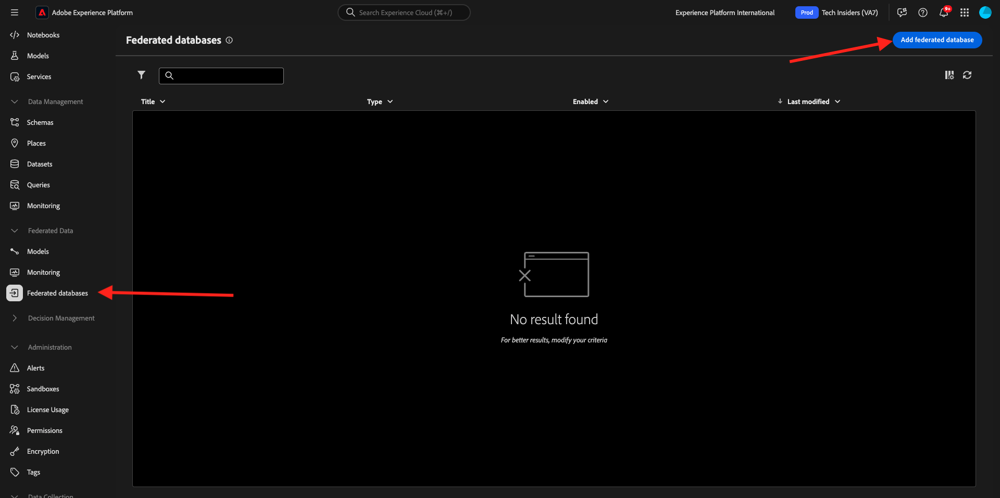

Als a **Etiket**, gebruik `--aepUserLdap-- - CitiSignal Snowflake` en voor het type, kies **Snowflake**.

Onder details, moet u uw geloofsbrieven invullen, die als dit zullen kijken:

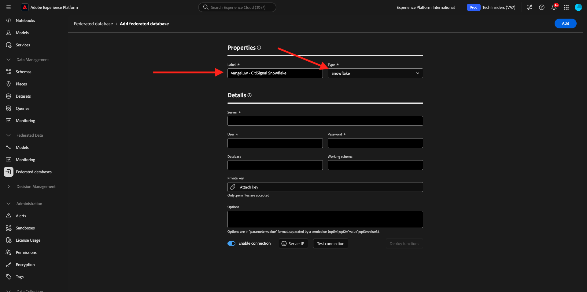

**Server**:

In Snowflake, ga naar **Admin > Rekeningen**. Klik 3 **...** naast uw rekening en klik **leiden URLs**.

Dan zie je dit. Kopieer **Huidige URL** en kleef het op het **gebied van de Server** in AEP.

**Gebruiker**: De gebruikersnaam u vroeger, in oefening 1.3.1.1 creeerde
**Wachtwoord**: het wachtwoord u vroeger, in oefening 1.3.1.1 creeerde
**Gegevensbestand**: gebruik **CITISIGNAL**

Dus ten slotte, zou je dit moeten hebben. Klik **Verbinding van de Test**. Als de test succesvol is, stelt de klik **Functies** op, die tot functies op de kant van Snowflake zullen leiden die noodzakelijk voor de werkschemamotor zijn.

Zodra de verbinding met succes werd getest en de functies worden opgesteld, zal uw configuratie worden opgeslagen.

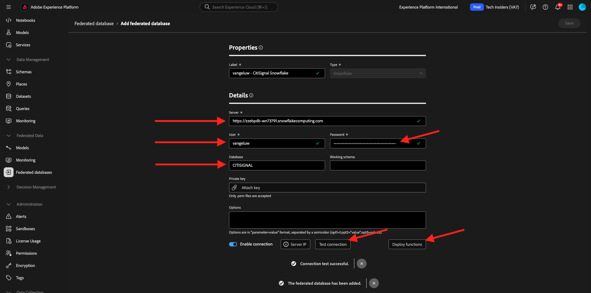

Wanneer u dan terug naar het **Verbond gegevensbestanden** menu gaat, zult u uw verbinding daar zien.

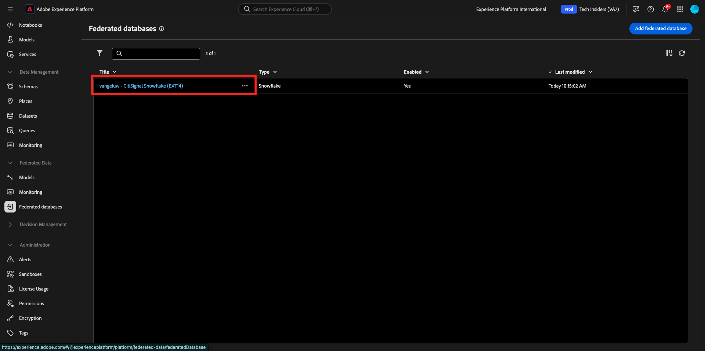

## 1.3.2.2 Schema&#39;s maken in AEP

In het linkermenu, klik **Modellen** en ga dan naar **Schema&#39;s**. Klik **creeer schema**.

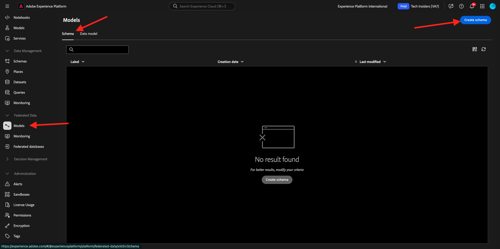

Selecteer uw gefedereerde gegevensbestand en klik **daarna**.

Dan zie je dit. Selecteer de vijf tabellen die u eerder in Snowflake hebt gemaakt:

- `--aepUserLdap--_HOUSEHOLDS`
- `--aepUserLdap--_MOBILE_DATA_USAGE`
- `--aepUserLdap--_MONTHLY_DATA_USAGE`
- `--aepUserLdap--_PERSONS`
- `--aepUserLdap--_USERS`

Klik **daarna**.

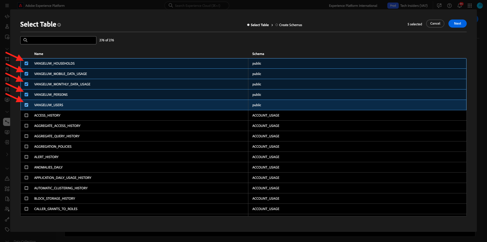

AEP laadt vervolgens de informatie van elke tabel en toont deze in de gebruikersinterface.

Voor elke tabel kunt u:

- wijzigt het label van het schema
- een beschrijving toevoegen
- naam van alle velden wijzigen en zichtbaarheid instellen
- Selecteer de primaire sleutel voor het schema

Voor deze oefening zijn geen veranderingen nodig.

Klik **Gedaan**.

Dan zie je dit. U kunt op elk schema klikken en de gegevens bekijken. Klik bijvoorbeeld op **`--aepUserLdap--_PERSONS`** .

U zult dan dit zien, met de capaciteit om de configuratie uit te geven. Klik **Gegevens** om een steekproef van het gegeven te zien dat in het gegevensbestand van Snowflake is.

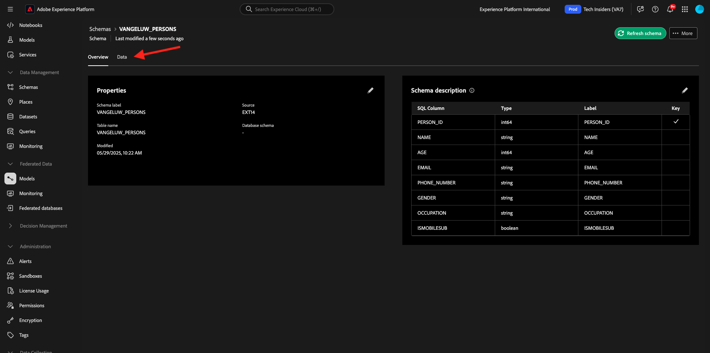

U ziet dan een voorbeeld van de gegevens. Deze gegevens worden rechtstreeks vanuit Snowflake geladen en blijven niet in AEP bestaan.

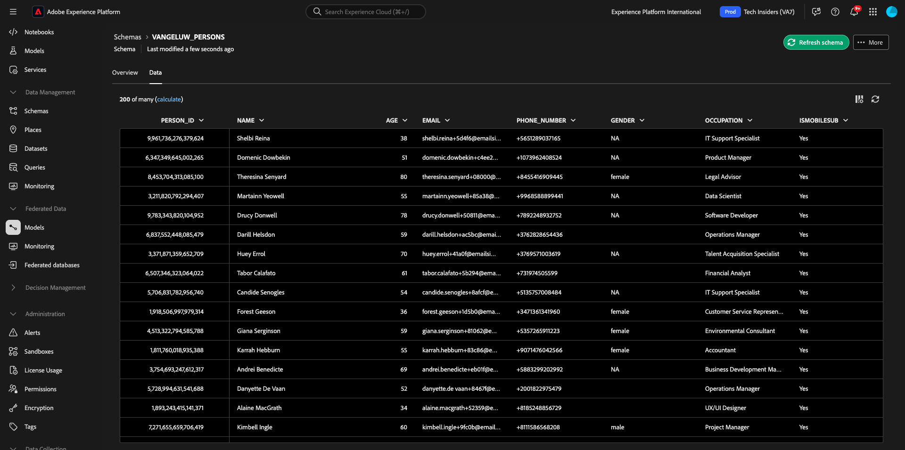

## 1.3.2.3 Een model maken in AEP

In het linkermenu, ga naar **Modellen** en ga dan naar **het model van Gegevens**. Klik **creëren gegevensmodel**.

Gebruik `--aepUserLdap-- - CitiSignal Snowflake Data Model` voor het label. Klik **creëren**.

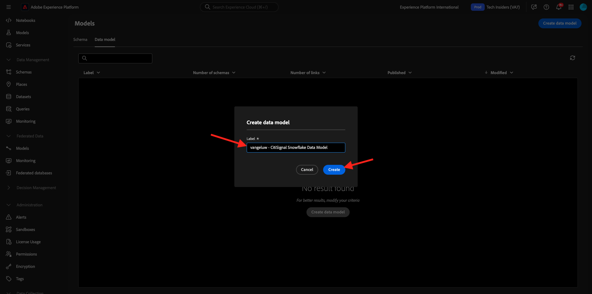

Klik **schema&#39;s** toevoegen.

Selecteer uw schema&#39;s en klik **toevoegen**.

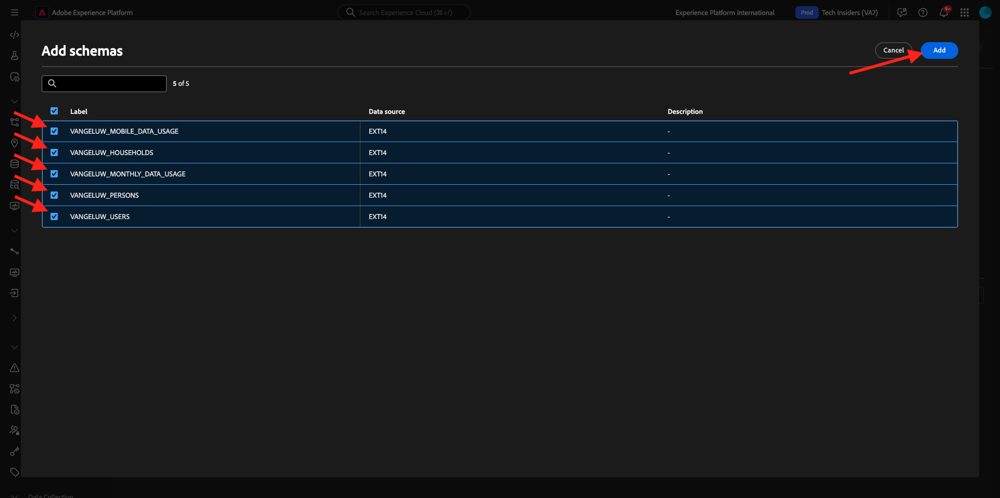

Dan zie je dit. Klik **sparen**.

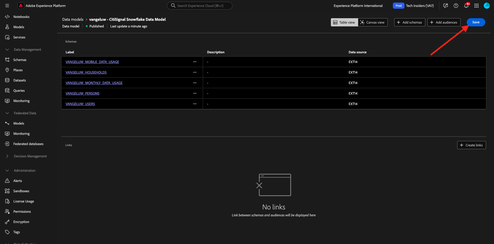

### PERSONEN - GEBRUIKERS

U kunt nu koppelingen tussen schema&#39;s definiëren. Begin bepalend een verbinding, moet u **klikken creeert verbindingen**.

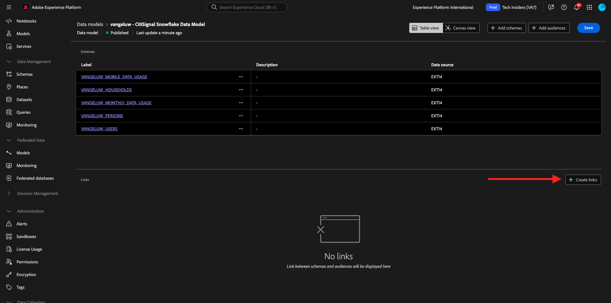

Eerst moet u de koppeling definiëren tussen de tabel `--aepUserLdap--_USERS` en `--aepUserLdap--_PERSONS` .

Klik **toevoegen**.

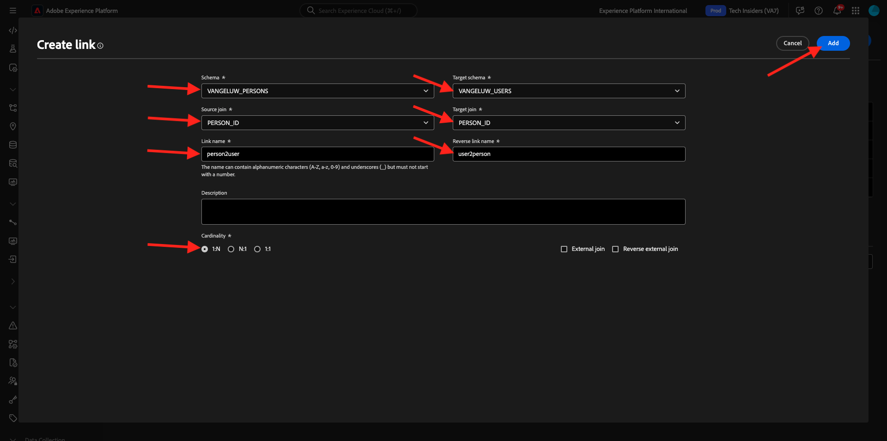

### HUISHOUDENS - PERSONEN

Dan ben je hier weer. Klik **creeer verbindingen** om een andere verbinding tot stand te brengen.

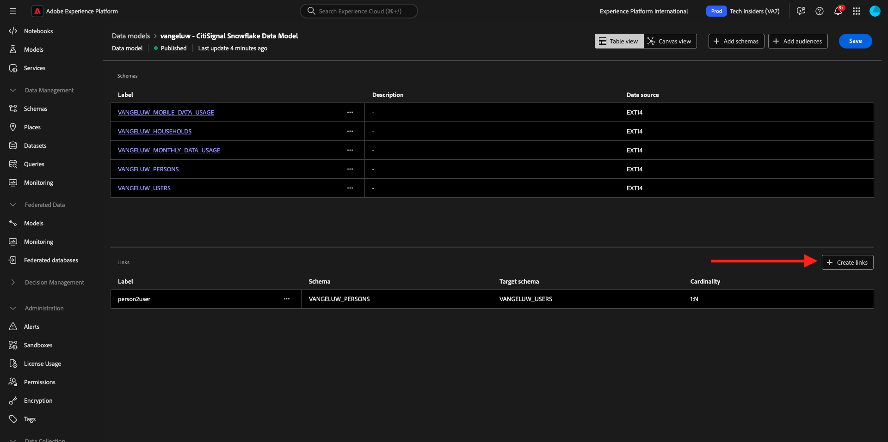

Vervolgens moet u de koppeling definiëren tussen de tabel `--aepUserLdap--_HOUSEHOLDS` en `--aepUserLdap--_PERSONS` .

Klik **toevoegen**.

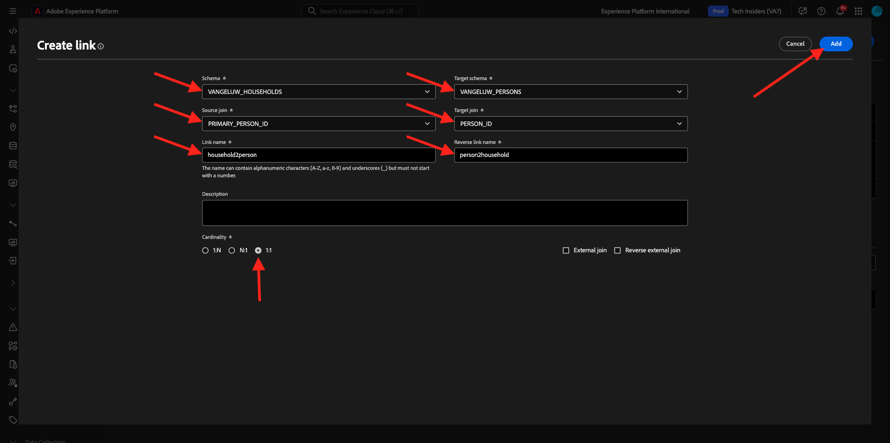

### GEBRUIKERS - MONTHLY_DATA_USAGE

Dan ben je hier weer. Klik **creeer verbindingen** om een andere verbinding tot stand te brengen.

Vervolgens moet u de koppeling definiëren tussen de tabel `--aepUserLdap--_USERS` en `--aepUserLdap--_MONTHLY_DATA_USAGE` .

Klik **toevoegen**.

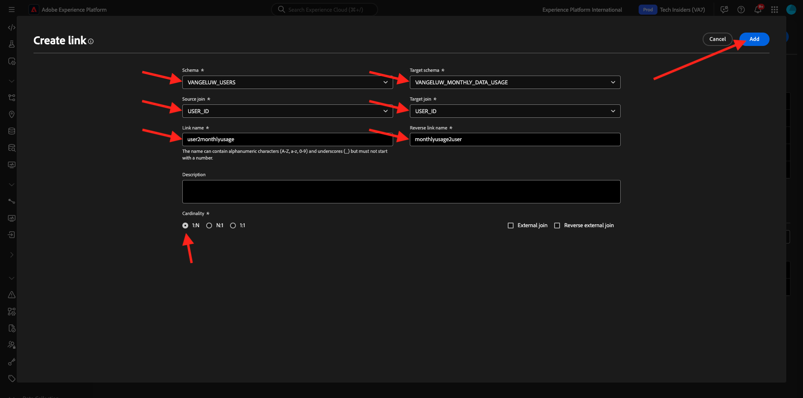

### GEBRUIKERS - HUISHOUDENS

Dan ben je hier weer. Klik **creeer verbindingen** om een andere verbinding tot stand te brengen.

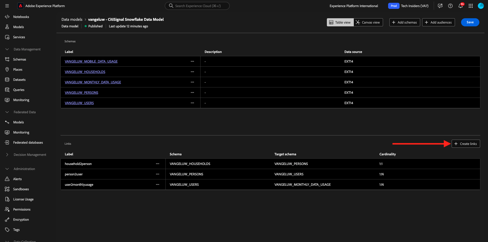

Vervolgens moet u de koppeling definiëren tussen de tabel `--aepUserLdap--_USERS` en `--aepUserLdap--_HOUSEHOLDS` .

Klik **toevoegen**.

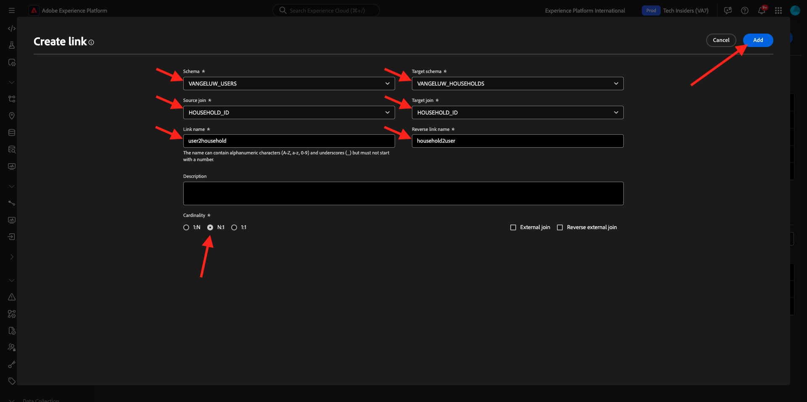

### GEBRUIKERS - MOBILE_DATA_USAGE

Dan ben je hier weer. Klik **creeer verbindingen** om een andere verbinding tot stand te brengen.

Vervolgens moet u de koppeling definiëren tussen de tabel `--aepUserLdap--_USERS` en `--aepUserLdap--_MOBILE_DATA_USAGE` .

Klik **toevoegen**.

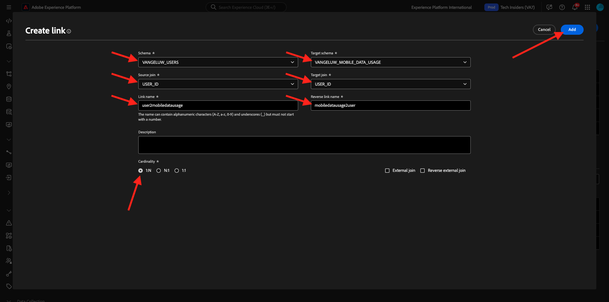

Dan moet je dit zien. Klik **sparen**.

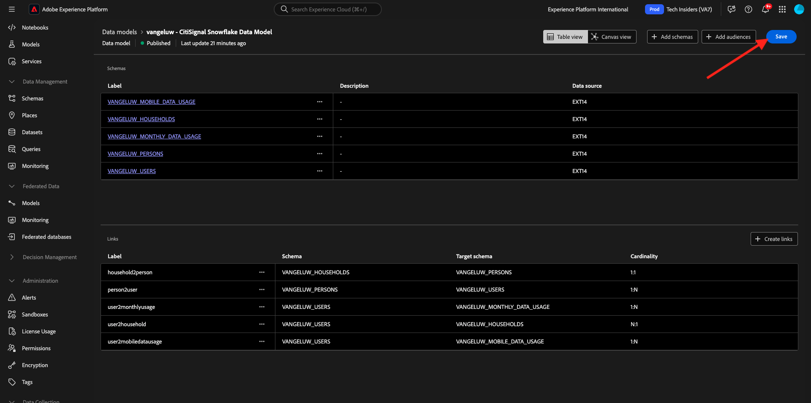

De installatie van uw gefedereerde database in Adobe Experience Platform is nu voltooid. U kunt nu uw gefedereerde gegevens in een gefederaliseerde publiekscompositie gebruiken.

## Volgende stappen

Ga naar [&#x200B; 1.3.3 creeer een gefederaliseerde samenstelling &#x200B;](./ex3.md){target="_blank"}

Ga terug naar [&#x200B; Federated de Samenstelling van het Publiek &#x200B;](./fac.md){target="_blank"}

Ga terug naar [&#x200B; Alle modules &#x200B;](./../../../../overview.md){target="_blank"}
