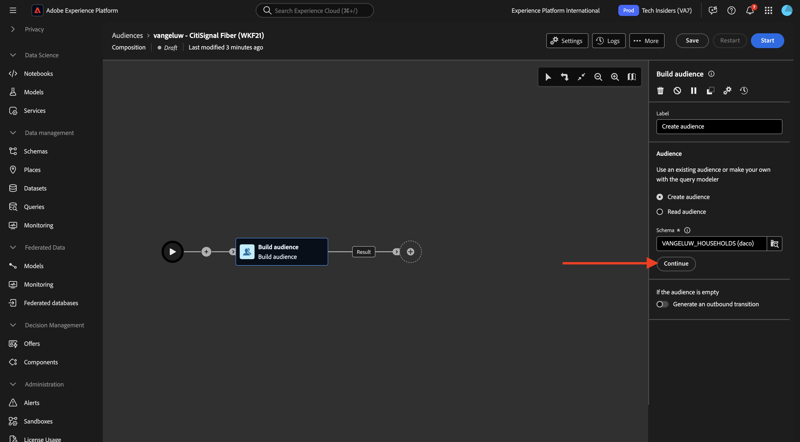
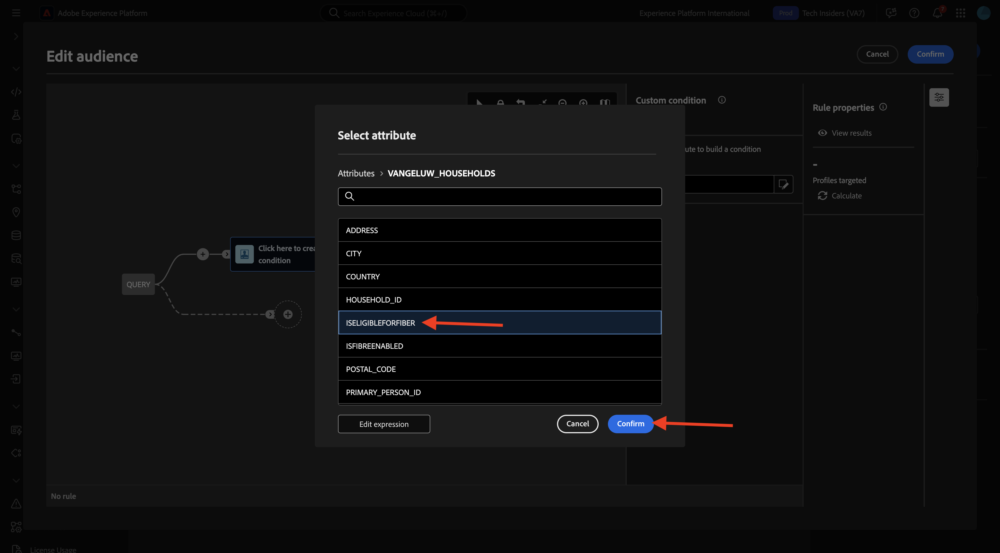

# 1.3.3 Een gefederaliseerde compositie maken

U kunt nu uw gefederaliseerde publiekscompositie configureren in AEP.

Login aan Adobe Experience Platform door naar dit URL te gaan: [&#x200B; https://experience.adobe.com/platform &#x200B;](https://experience.adobe.com/platform).

Na het aanmelden landt je op de homepage van Adobe Experience Platform.

Alvorens u verdergaat, moet u a **zandbak** selecteren. De te selecteren sandbox krijgt de naam `--aepSandboxName--` . Na het selecteren van de aangewezen zandbak, zult u de het schermverandering zien en nu bent u in uw specifieke zandbak.

## 1.3.3.1 Uw publiek maken

In het linkermenu, ga naar **Soorten publiek** en ga dan naar **Verbond samenstellingen**. Klik **creeer samenstelling**.

Gebruik voor het label het volgende: `--aepUserLdap-- - CitiSignal Fiber` . Selecteer het gegevensmodel dat u in de vorige oefening creeerde, die `--aepUserLdap-- - CitiSignal Snowflake Data Model` wordt genoemd. Klik **creëren**.

Dan zie je dit.

Klik het **+** pictogram en klik **het publiek van de Bouwstijl**.

Dan zie je dit. Selecteer **tot publiek** leiden. Klik het **onderzoek** pictogram om een schema te selecteren.

Selecteer het schema **`--aepUserLdap--_HOUSEHOLDS`** . Klik **bevestigen**.

Daarna, klik **verdergaan**.

U kunt nu beginnen met het maken van de query die naar Snowflake wordt verzonden. Klik **+** pictogram en klik dan **de voorwaarde van de Douane**.

Selecteer de attributen **ISELIGIBLEFORFIBER** klik **bevestigen**.

Dan zie je dit. Plaats de gebied **Waarde** aan **Waar**. Klik **berekenen** om de vraag neer aan Snowflake te duwen en een schatting van de profielen te krijgen die nu kwalificeren.

Dan, klik opnieuw het **+** pictogram en klik **de voorwaarde van de Douane** opnieuw om een andere voorwaarde toe te voegen.

De tweede voorwaarde die moet worden toegevoegd, is: `Is the user an existing CitiSignal Mobile subscriber?` . De manier om die vraag te beantwoorden is de verhouding tussen het huishouden en de primaire klant in het huishouden te gebruiken, die in een andere lijst, **`--aepUserLdap--_PERSONS`** wordt bepaald. U kunt neer in het attributenmenu boren gebruikend de **huishouden2person** verbinding.

Selecteer de attributen **ISMOBILESUB** en klik **bevestigen**.

Plaats de gebied **Waarde** aan **Ware** klik **berekent** opnieuw om het aantal profielen bij te werken die zullen worden gericht. Klik **bevestigen**.

Klik **+** pictogram en klik dan **sparen Publiek**.

Plaats het **etiket van het Publiek** aan `--aepUserLdap-- - CitiSignal Eligible for Fiber`.

Klik op **+ Toewijzing publiek toevoegen** .

Selecteer **HOUSEHOLD_ID** en klik **bevestigen**.

Klik op **+ Toewijzing publiek toevoegen** .

Boor neer door **het richten dimensie** te klikken.

Boor neer door de verbinding **te klikken huishouden2person**.

Selecteer de gebied **NAAM**. Klik **bevestigen**.

Klik op **+ Toewijzing publiek toevoegen** .

Boor neer door **het richten dimensie** te klikken.

Boor neer door de verbinding **te klikken huishouden2person**.

Selecteer het gebied **EMAIL**. Klik **bevestigen**.

Dan zie je dit. U moet nu het **Primaire identiteitsgebied** plaatsen, het plaatsen aan **Household2person_EMAIL**. Plaats **Namespace van de Identiteit** aan **E-mail**.

Klik **sparen**.

Uw compositie is nu voltooid. Klik **Begin** om het in werking te stellen.

De query wordt nu omlaag geduwd naar Snowflake, die de brongegevens daar zal opvragen. De resultaten worden teruggezet naar AEP, maar de brongegevens blijven in Snowflake.

Het publiek is nu bevolkt en het publiek is gericht vanuit het ecosysteem van AEP.

## Volgende stappen

Ga naar [&#x200B; Samenvatting &amp; voordelen &#x200B;](./summary.md){target="_blank"}

Ga terug naar [&#x200B; Federated de Samenstelling van het Publiek &#x200B;](./fac.md){target="_blank"}

Ga terug naar [&#x200B; Alle modules &#x200B;](./../../../../overview.md){target="_blank"}
