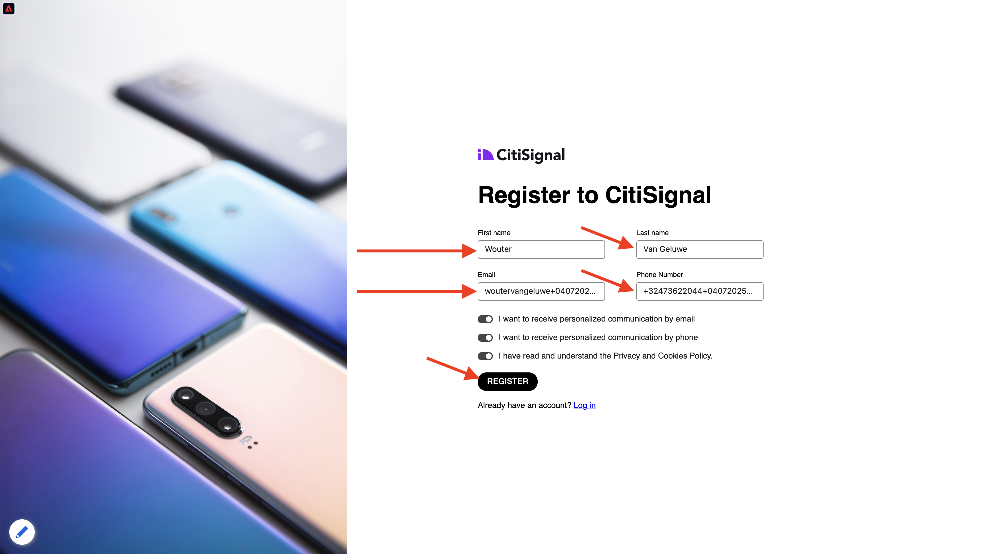

# 2.1.1 Van onbekend naar bekend op de website

## Context

De reis van onbekend naar bekend is tegenwoordig een van de belangrijkste onderwerpen onder merken, evenals de reis van de klant van aankoop naar bewaring.

Adobe Experience Platform speelt een enorme rol in deze reis. Platform is de breinen voor communicatie, het &quot;ervaringssysteem van verslag.&quot;

Platform is een omgeving waarin het woord klant breder is dan alleen de bekende klanten. Een onbekende bezoeker op de website is ook een klant vanuit het perspectief van Platform en als zodanig wordt al het gedrag als onbekende bezoeker ook verzonden naar Platform. Dankzij deze aanpak, wanneer deze bezoeker uiteindelijk een bekende klant wordt, kan een merk ook visualiseren wat er voor dat moment gebeurde. Dit helpt vanuit een attributie- en ervaringsperspectief.

## Vervoersstroom voor klanten

Ga naar [ https://dsn.adobe.com ](https://dsn.adobe.com). Nadat je je hebt aangemeld bij je Adobe ID, kun je dit zien. Klik de 3 punten **..** op uw websiteproject en klik dan **Looppas** om het te openen.

Vervolgens wordt uw demowebsite geopend. Selecteer de URL en kopieer deze naar het klembord.

Open een nieuw Incognito-browservenster.

Plak de URL van uw demowebsite, die u in de vorige stap hebt gekopieerd. Vervolgens wordt u gevraagd u aan te melden met uw Adobe ID.

Selecteer uw accounttype en voltooi het aanmeldingsproces.

Uw website wordt vervolgens geladen in een Incognito-browservenster. Voor elke oefening, zult u een vers, incognito browser venster moeten gebruiken om uw demowebsite URL te laden.

Klik op het Adobe-logopictogram in de linkerbovenhoek van het scherm om de Profile Viewer te openen.

Heb een blik bij het paneel van de Kijker van het Profiel en het Profiel van de Klant in real time met **identiteitskaart van Experience Cloud** als primaire herkenningsteken voor deze momenteel onbekende klant.

U kunt ook alle Experience Events zien die zijn verzameld op basis van het gedrag van de klant. De lijst is momenteel leeg, maar dat zal binnenkort veranderen.

Ga naar de **Telefoons &amp; apparaten** productcategorie. Daarna, klik op het product **iPhone 16 Pro**.

Vervolgens ziet u de pagina met productdetails. Een gebeurtenis van type **Mening van het Product** is nu verzonden naar Adobe Experience Platform gebruikend de implementatie van SDK van het Web die u in Module 1 herzien.

Open het paneel van de Kijker van het Profiel en heb een blik bij uw **Gebeurtenissen**.

Ga terug naar de **Telefoons &amp; apparaten** categoriepagina, en klik een ander product. Er is een andere Experience Event verzonden naar Adobe Experience Platform. Open het deelvenster Profielviewer. U zult nu 2 gebeurtenissen van type **Mening van het Product** zien. Terwijl het gedrag anoniem is, met de juiste toestemming op zijn plaats, kunt u elke klik volgen en het opslaan in Adobe Experience Platform. Zodra de anonieme klant wordt gekend, zullen wij al anoniem gedrag automatisch aan het knowhowprofiel kunnen samenvoegen.

Klik **Teken binnen**.

Klik **creeer een rekening**.

Vul uw details in en klik **Register** waarna u aan de vorige pagina opnieuw zult worden gericht.

Open het deelvenster Profielviewer en ga naar Klantprofiel in realtime. In het deelvenster Profielviewer worden al uw persoonlijke gegevens weergegeven, zoals de zojuist toegevoegde e-mail- en telefoon-id&#39;s.

Ga in het deelvenster Profile Viewer naar Experience Events. De twee producten die u eerder hebt bekeken, worden weergegeven in het deelvenster Profielviewer. Beide gebeurtenissen zijn nu ook verbonden met uw &#39;gekende&#39; profiel.

U hebt nu gegevens in Adobe Experience Platform ingevoerd en u hebt die gegevens gekoppeld aan id&#39;s zoals ECID&#39;s en e-mailadressen. Het doel hiervan is om de zakelijke context te begrijpen van wat je gaat doen. In de volgende oefening, zult u beginnen alles te vormen u nodig hebt om al die gegevensopname mogelijk te maken.

### Navigeren door de mobiele app

Nadat u een bekende klant bent geworden, is het tijd om de mobiele app te gaan gebruiken. Open de mobiele app op uw iPhone en meld u vervolgens aan bij de app.

Als u niet app hebt die meer wordt geïnstalleerd, of als u niet kunt herinneren hoe te om het te installeren, gelieve een blik hier te hebben: [ Gebruik mobiele app ](../../../getting-started/gettingstarted/ex5.md)

Nadat u de app volgens de instructies hebt geïnstalleerd, ziet u de openingspagina van de app met het Citi Signal-merk geladen. Klik op het accountpictogram in het linkerbovengedeelte van het scherm.

Meld u aan met het e-mailadres dat u op de bureaubladwebsite hebt gebruikt in het aanmeldingsscherm. Klik **Login**.

U ontvangt dan een bevestiging dat u bent aangemeld.

Ga naar het huisscherm van app en ga naar de pagina **Telefoons &amp; Apparaten**.

Klik op een product op de pagina.

Vervolgens ziet u de pagina met productdetails.

Ga naar het beginscherm in de app en klik op het Adobe-pictogram om het deelvenster Profielviewer weer te geven. U zult dan de **mening van de Attributen van het Profiel** zien, die nu een gecombineerde mening van uw Web en mobiele toepassingsactiviteit toont. Ga naar **Gebeurtenissen**

U zult dan het product zien u enkel in de **sectie van de Gebeurtenissen van de Ervaring**, samen met alle productmeningen van de websitezitting voordien bekeken.

>[!NOTE]
>
>Het kan een paar minuten duren voordat de geconsolideerde weergave in de app en op de website wordt weergegeven.

Ga nu terug naar uw desktopcomputer en vernieuw de homepage, waarna u het product ook daar zult zien.

>[!NOTE]
>
>Het kan een paar minuten duren voordat de geconsolideerde weergave in de app en op de website wordt weergegeven.

U hebt nu gegevens in Adobe Experience Platform ingevoerd en u hebt die gegevens gekoppeld aan id&#39;s zoals ECID&#39;s en e-mailadressen. Het doel van deze oefening was om de bedrijfscontext te begrijpen van wat u op het punt staat te doen. U hebt nu effectief een real-time, cross-device klantenprofiel gebouwd. In de volgende oefening, ga u verder en visualiseer uw profiel in Adobe Experience Platform.

## Volgende stappen

Ga naar [ 2.1.2 visualiseer uw eigen real-time klantenprofiel - UI ](./ex2.md){target="_blank"}

Ga terug naar [ Real-time het Profiel van de Klant ](./real-time-customer-profile.md){target="_blank"}

Ga terug naar [ Alle modules ](./../../../../overview.md){target="_blank"}
