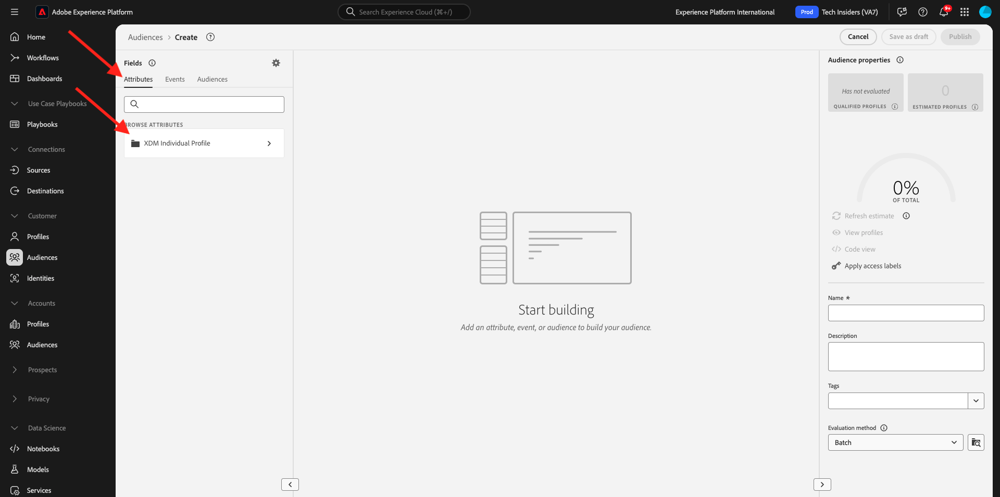

# 2.1.4 Een publiek maken - gebruikersinterface

In deze oefening, zult u een publiek creëren door gebruik van de Bouwer van het Publiek van Adobe Experience Platform te maken.

Ga naar [ Adobe Experience Platform ](https://experience.adobe.com/platform). Na het aanmelden landt je op de homepage van Adobe Experience Platform.


Alvorens u verdergaat, moet u a **zandbak** selecteren. De te selecteren sandbox krijgt de naam ``--aepSandboxName--`` . Nadat u de juiste [!UICONTROL sandbox] hebt geselecteerd, ziet u de schermwijziging en nu bevindt u zich in uw toegewezen [!UICONTROL sandbox] .


In het menu op de linkerkant, ga naar **Soorten publiek**. Op deze pagina ziet u een overzicht van alle bestaande doelgroepen. Klik op **+ creeer publiek** knoop om een nieuw publiek te beginnen creëren.


Selecteer **bouwt regel** en klik **creëren**.


Zodra u in de nieuwe publieksbouwer bent, merkt u onmiddellijk de **het menuoptie van Attributen** en de **Individuele verwijzing van het Profiel XDM**.



Aangezien XDM de taal is die de ervaringszaken macht, is XDM ook de stichting voor de publieksbouwer. Alle gegevens die in Platform worden opgenomen, moeten tegen XDM worden toegewezen en als zodanig, worden alle gegevens deel van het zelfde gegevensmodel ongeacht waar die gegevens uit komen. Dit geeft u een groot voordeel wanneer het bouwen van publiek, zoals van deze één kijkbouwer UI, kunt u gegevens van om het even welke oorsprong in het zelfde werkschema combineren. Soorten publiek dat in de builder van het publiek is gemaakt, kunnen voor activering naar oplossingen als Adobe Target, Adobe Campaign en Adobe Audience Manager worden gestuurd.

Laten wij een publiek bouwen dat alle **mannelijke** klanten omvat.

Om aan het genderattribuut te krijgen, moet u XDM begrijpen en kennen.

Gender is een kenmerk van Person, dat te vinden is onder Kenmerken. Zo om daar te krijgen, zult u beginnen door op **te klikken individueel Profiel XDM**. Dan zie je dit. Van het **individuele venster van het Profiel XDM**, uitgezochte **Persoon**.


Dan zie je dit. In **Persoon**, kunt u het **3} attribuut van het Geslacht {vinden.** Sleep het attribuut Gender naar de publieksbouwer.


Nu kunt u het specifieke geslacht kiezen uit de vooraf ingevulde opties. In dit geval, laten wij **Mannelijke** kiezen.


Na het selecteren van **Mannelijke**, kunt u een schatting van de bevolking van het publiek krijgen door **te duwen verfrissen Schatting** knoop. Dit is zeer nuttig voor een bedrijfsgebruiker, zodat zij de invloed van bepaalde attributen op de resulterende publieksgrootte kunnen zien.


Hieronder ziet u een schatting:


Vervolgens moet u het publiek wat verfijnen. U moet een publiek van alle mannelijke klanten opbouwen die het product **iPhone 15 Pro** hebben bekeken.

U moet een Experience Event toevoegen om dit publiek op te bouwen. U kunt alle Gebeurtenissen van de Ervaring vinden door op het **pictogram van Gebeurtenissen** in de **Gebieden** menubar te klikken. Daarna, zult u de top-level, **XDM ExperienceEvents** knoop zien. Klik **XDM ExperienceEvent**.


Ga naar **Punten van de Lijst van het Product**.


Selecteer **Naam** en sleep en laat vallen het **voorwerp van de Naam** van het linkermenu op het canvas van de publieksbouwer in de **** sectie van Gebeurtenissen.


U zult dan dit zien:


De vergelijkingsparameter zou **gelijken** moeten zijn en op het inputgebied, ga **iPhone 15 Pro** in.


Telkens als u een element aan de publieksbouwer toevoegt, kunt u **klikken verfrist Schatting** knoop om een nieuwe schatting van de bevolking in uw publiek te krijgen.

Tot dusver, hebt u slechts UI gebruikt om uw publiek te bouwen, maar er is ook een code-optie om een publiek te bouwen.

Wanneer u een publiek maakt, stelt u eigenlijk een Profile Query Language (PQL) query samen. Om de code van PQL te visualiseren, kunt u op de **schakelaar van de Mening van de Code** in de hogere juiste hoek van de publieksbouwer klikken.


Nu kunt u de volledige PQL-verklaring zien:

```sql
person.gender in ["male"] and CHAIN(xEvent, timestamp, [C0: WHAT(productListItems.exists(name.equals("iPhone 15 Pro", false)))])
```

U kunt een steekproef van de klantenprofielen ook voorproef die deel van dit publiek uitmaken, door op **Profielen van de Mening** te klikken.


Tot slot, geven wij uw publiek een naam,
plaats de **methode van de Evaluatie** aan **het stromen** en klik **publiceren**.

Gebruik als naamgevingsconventie:

- `--aepUserLdap-- - Male customers with interest in iPhone 15 Pro`


U gaat terug naar de overzichtspagina van het publiek.


## Volgende stappen

Ga naar [ 2.1.5 zie uw Real-time Profiel van de Klant in actie in het Centrum van de Vraag ](./ex5.md){target="_blank"}

Ga terug naar [ Real-time het Profiel van de Klant ](./real-time-customer-profile.md){target="_blank"}

Ga terug naar [ Alle modules ](./../../../../overview.md){target="_blank"}
