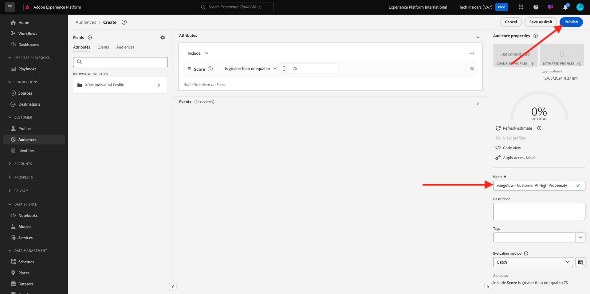

# 2.2.3 AI van de Klant - Scoring dashboard en segmentatie (Voorspelling en actie ondernemen)

Zodra uw exemplaar van de Klant AI een modellooppas voltooit, zal het u toelaten om de volheidsscore visualiseren die wordt geëvalueerd om een klant te voorspellen die een aankoop in de volgende 30 dagen uitvoert.

>[!NOTE]
>
>Slechts zal een instantie van AI van de Klant met een status van **Succes** u toestaan om de inzichten van de dienst voor te vertonen.

## Propensiteitsvoorspelling

Laten we nu de voorspelde eigenschappen bekijken die worden gegenereerd door het AI-instantiemodel van de klant. Klik op de instantienaam om het dashboard weer te geven.

Het AI-dashboard van de Klant geeft een overzicht van de score, de verdeling van de populatie en de invloedrijke factoren voor het model dat moet worden geëvalueerd.

Houd de invloedrijke factoren aan om de verdere uitsplitsing van de gegevensdistributie te bekijken.

## Handelingen

### Klanten segmenteren

Met het AI-dashboard van de Klant kunt u segmenten definiëren met één klik. Klik op **creeer de knoop van het Segment** op de bezitskaarten.

U zult zien dat een segmentdefinitie automatisch wordt gecreeerd.

Geef het segment een naam die volgt op de naamgevingsconventie: `--aepUserLdap-- - Customer AI High Propensity` . Klik **publiceren**.

U kunt dit segment nu gebruiken voor de doelversie, bijvoorbeeld Real-time CDP, Journey Optimizer en Adobe Target.

## Opschonen

Om ervoor te zorgen dat er geen onnodige demo-gegevens in uw omgeving worden bewaard, moet u de gegevensset `--aepUserLdap-- - Demo System - Customer Experience Event Dataset` verwijderen nadat u deze bewerking hebt voltooid. Als u de demo-gegevens niet verwijdert, heeft dit een invloed op de kosten van uw AEP-instantie.

## Volgende stappen

Ga naar [&#x200B; Samenvatting en voordelen &#x200B;](./summary.md){target="_blank"}

Ga terug naar [&#x200B; Intelligente Diensten &#x200B;](./intelligent-services.md){target="_blank"}

Ga terug naar [&#x200B; Alle modules &#x200B;](./../../../../overview.md){target="_blank"}
