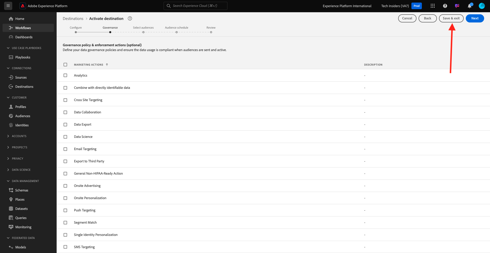

# 2.3.2 Een Advertising-bestemming configureren, zoals Google DV360

>[!IMPORTANT]
>
>De hieronder inhoud is gedeeltelijk bedoeld als FYI - als zulk een bestemming reeds in uw instantie bestaat, dan moet u **NIET** een nieuwe bestemming voor DV360 vormen. De bestemming is reeds gecreeerd in dat geval en u kunt het in de volgende oefening gebruiken.

Ga naar [&#x200B; Adobe Experience Platform &#x200B;](https://experience.adobe.com/platform). Na het aanmelden landt je op de homepage van Adobe Experience Platform.

Alvorens u verdergaat, moet u a **zandbak** selecteren. De te selecteren sandbox krijgt de naam ``--aepSandboxName--`` . Nadat u de juiste [!UICONTROL sandbox] hebt geselecteerd, ziet u de schermwijziging en nu bevindt u zich in uw toegewezen [!UICONTROL sandbox] .

In het linkermenu, ga naar **Doelen**, dan gaan naar **Catalogus**. U zult dan de **Catalogus van Doelen** zien.

In **Doelen**, klik op **de Vertoning van Google &amp; Video 360** en klik dan **+ Opstelling**.

Dan zie je dit. Klik **verbinden met bestemming**.

In het volgende scherm kunt u uw bestemming configureren naar Google DV360.

Ga een waarde op de gebieden **Naam** en **Beschrijving** in.

Het gebied **identiteitskaart van de Rekening** is **Advertiser identiteitskaart** van de Rekening DV360. Dat kun je hier vinden:

Het **Type van Rekening** zou aan **moeten worden geplaatst Advertiser** uitnodigen.

Nu heb je dit. Klik **daarna**.

>[!NOTE]
>
>Google moet Adobe toestaan om gegevens naar Google DV360 te verzenden. Neem contact op met uw Google-accountmanager om deze gegevensstroom in te schakelen.

Na het creëren van de bestemming, zult u dit zien. U kunt desgewenst een beleid voor gegevensbeheer selecteren. Daarna, klik **sparen en uitgang**.

U zult dan een lijst van beschikbare bestemmingen zien.
In de volgende oefening, zult u het publiek verbinden u in de vorige oefening bouwde aan de bestemming van Google DV360.

## Volgende stappen

Ga naar [&#x200B; 2.3.3 Actie nemen: verzend uw publiek naar DV360 &#x200B;](./ex3.md){target="_blank"}

Ga terug naar [&#x200B; in real time CDP - Bouw een publiek en neem actie &#x200B;](./real-time-cdp-build-a-segment-take-action.md){target="_blank"}

Ga terug naar [&#x200B; Alle modules &#x200B;](./../../../../overview.md){target="_blank"}
