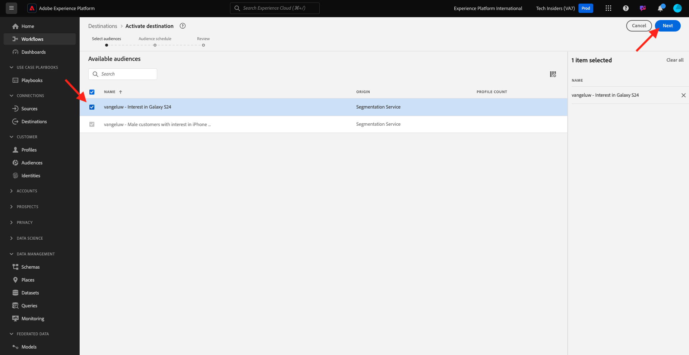

# 2.3.3 Actie nemen: stuur uw publiek naar DV360

Ga naar [&#x200B; Adobe Experience Platform &#x200B;](https://experience.adobe.com/platform). Na het aanmelden landt je op de homepage van Adobe Experience Platform.

Alvorens u verdergaat, moet u a **zandbak** selecteren. De te selecteren sandbox krijgt de naam ``--aepSandboxName--`` . Nadat u de juiste [!UICONTROL sandbox] hebt geselecteerd, ziet u de schermwijziging en nu bevindt u zich in uw toegewezen [!UICONTROL sandbox] .

In het linkermenu, ga naar **Doelen**, dan gaan **doorbladeren**. U zult dan de **bestemming DV360** zien. Klik de 3 punten **..** en klik **activeer Soorten publiek**.

Selecteer in de lijst met beschikbare doelgroepen het publiek dat u in de vorige oefening hebt gemaakt. Klik **daarna**.

Voor de **pagina van het Programma van de Auditie**, klik **daarna**.

Tot slot op de **pagina van het Overzicht**, klik **Afwerking**.

Uw publiek is nu gekoppeld aan Google DV360. Telkens wanneer een klant voor dit publiek in aanmerking komt, wordt een signaal verzonden naar Google DV360 om die klant in het publiek op Google DV360 te omvatten.

## Volgende stappen

Ga naar [&#x200B; 2.3.4 Actie nemen: verzend uw publiek naar een S3-bestemming &#x200B;](./ex4.md){target="_blank"}

Ga terug naar [&#x200B; in real time CDP - Bouw een publiek en neem actie &#x200B;](./real-time-cdp-build-a-segment-take-action.md){target="_blank"}

Ga terug naar [&#x200B; Alle modules &#x200B;](./../../../../overview.md){target="_blank"}
