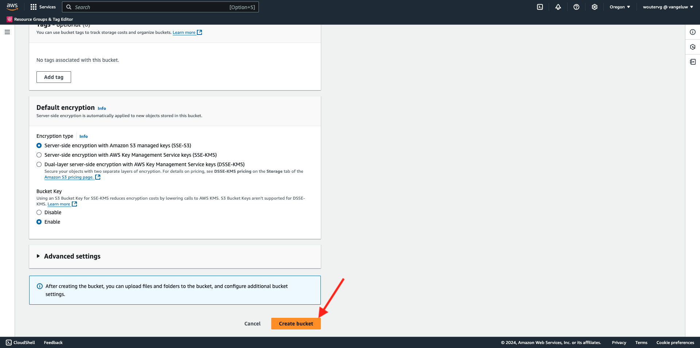
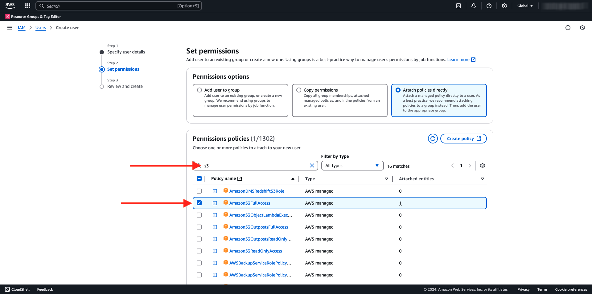
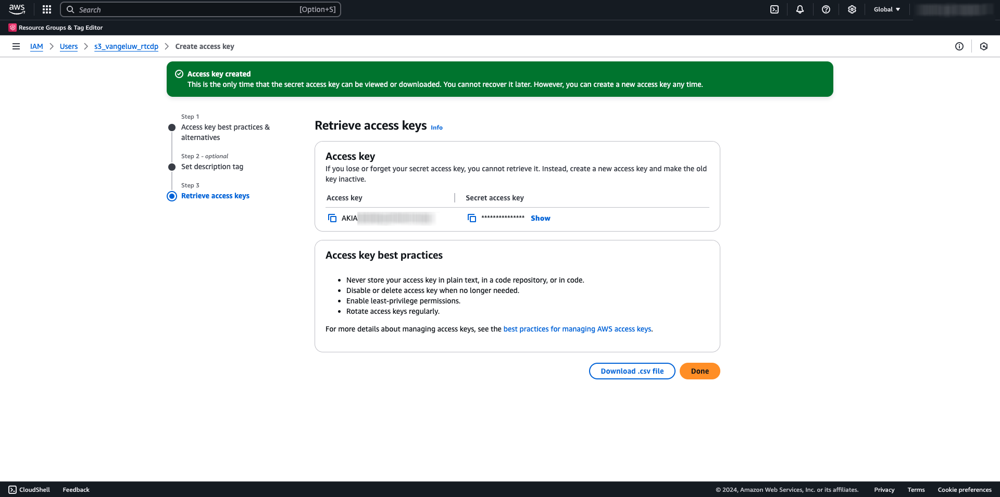

# 2.3.4 Actie ondernemen: stuur je publiek naar een S3-bestemming

Adobe Experience Platform heeft ook de capaciteit om publiek aan E-mailMarketing Doelen zoals Salesforce Marketing Cloud, Oracle Eloqua, Oracle Responsys en Adobe Campaign te delen.

U kunt FTP of SFTP als deel van de specifieke bestemmingen voor elk van deze E-mailMarketing Doelen gebruiken, of u kunt AWS S3 gebruiken om lijsten van klanten tussen Adobe Experience Platform en deze E-mailmarketing Doelen uit te wisselen.

In deze module, zult u zulk een bestemming vormen door gebruik van een emmertje van AWS S3 te maken.

## Maak uw S3-emmertje

Ga naar [&#x200B; https://console.aws.amazon.com &#x200B;](https://console.aws.amazon.com) en teken binnen.

>[!NOTE]
>
>Als je nog geen AWS-account hebt, maak dan een nieuwe AWS-account aan met je persoonlijke e-mailadres.

Na het programma openen, zult u aan de **Console van het Beheer van AWS** opnieuw worden gericht.

In de onderzoeksbar, onderzoek naar **s3**. Klik het eerste onderzoeksresultaat: **S3 - Schaalbare Opslag in de Wolk**.

U zult dan de **homepage van Amazon S3** zien. Klik **creëren Emmertje**.

In **creeer het 1&rbrace; scherm van het Emmertje &lbrace;, gebruik de naam `aepmodulertcdp--aepUserLdap--`**

Laat alle andere standaardinstellingen ongewijzigd. De rol neer en klikt **creeert emmer**.

Vervolgens ziet u dat uw emmer is gemaakt en wordt deze omgeleid naar de startpagina van Amazon S3.

## Toestemmingen plaatsen om tot uw S3 emmertje toegang te hebben

De volgende stap is toegang tot uw S3 emmertje te plaatsen.

Om dat te doen, ga naar [&#x200B; https://console.aws.amazon.com/iam/home &#x200B;](https://console.aws.amazon.com/iam/home).

De toegang tot AWS-bronnen wordt beheerd door Amazon Identity and Access Management (IAM).

U ziet deze pagina nu.

In het linkermenu, klik **Gebruikers**. U zult dan het **scherm van Gebruikers** zien. Klik **creëren gebruiker**.

Configureer vervolgens de gebruiker:

- Gebruikersnaam: gebruik `s3_--aepUserLdap--_rtcdp`

Klik **daarna**.

U zult dan dit toestemmingenscherm zien. Klik **beleid van de Band direct**.

Ga de onderzoekstermijn **s3** in om al verwant S3 beleid te zien. Selecteer het beleid **AmazonS3FullAccess**. De rol neer en klikt **daarna**.

Controleer uw configuratie. Klik **creëren Gebruiker**.

Dan zie je dit. Klik **Gebruiker van de Mening**.

Klik **geloofsbrieven van de Veiligheid** en klik dan **creeer toegangssleutel**.

Selecteer **Toepassing die buiten AWS** loopt. De rol neer en klikt **daarna**.

Klik **creëren toegangssleutel**

Dan zie je dit. Klik **tonen** om uw Geheime toegangstoets te zien:

Uw **Geheime toegangssleutel** wordt nu getoond.

>[!IMPORTANT]
>
>Sla uw gegevens op in een tekstbestand op uw computer.
>
> - Toegang sleutel-id: ...
> - Geheime toegangssleutel: ...
>
> Zodra u **Gedaan** klikt zult u uw geloofsbrieven nooit meer zien!

Klik **Gedaan**.

U hebt nu een AWS S3 emmertje met succes gecreeerd en u hebt een gebruiker met toestemmingen gecreeerd om tot dit emmertje toegang te hebben.

## Doel configureren in Adobe Experience Platform

Ga naar [&#x200B; Adobe Experience Platform &#x200B;](https://experience.adobe.com/platform). Na het aanmelden landt je op de homepage van Adobe Experience Platform.

Alvorens u verdergaat, moet u a **zandbak** selecteren. De te selecteren sandbox krijgt de naam ``--aepSandboxName--`` . Nadat u de juiste [!UICONTROL sandbox] hebt geselecteerd, ziet u de schermwijziging en nu bevindt u zich in uw toegewezen [!UICONTROL sandbox] .

In het linkermenu, ga naar **Doelen**, dan gaan naar **Catalogus**. U zult dan de **Catalogus van Doelen** zien.

Klik {de Opslag van de Wolk 1}, dan klik de **Opstelling** knoop (of op **activeer Soorten publiek**, afhankelijk van uw milieu) op **Amazon S3** kaart.**&#x200B;**

Selecteer **Sleutel van de Toegang** als Type van Rekening. Gelieve te gebruiken de S3 geloofsbrieven die aan u in de vorige stap werden gegeven:

| Toegangstoets-id | Geheime toegangstoets |
|:-----------------------:| :-----------------------:|
| AKIA... | 7 cm... |

Klik **verbinden met bestemming**.

Vervolgens ziet u een visuele bevestiging dat deze bestemming nu is verbonden.

U moet S3 emmerdetails verstrekken zodat Adobe Experience Platform met het S3 emmertje kan verbinden.

Als naamgevingsconventie kunt u het volgende gebruiken:

| Toegangstoets-id | Geheime toegangstoets |
|:-----------------------:| :-----------------------:|
| Naam | `AWS - S3 - --aepUserLdap--` |
| Beschrijving | `AWS - S3 - --aepUserLdap--` |
| Naam emmertje | `aepmodulertcdp--aepUserLdap--` |
| Mappad | /now |

Selecteer **Soorten publiek**.

Voor **Type van Dossier**, uitgezochte **CSV** en verlaat onveranderd de standaardmontages.

Omlaag schuiven. Voor **formaat van de Compressie**, uitgezochte **niets**. Klik **daarna**.

U kunt nu optioneel een beleid voor gegevensbeheer aan uw nieuwe bestemming koppelen. Klik **daarna**.

Zoek in de lijst met soorten publiek naar het publiek dat u in de vorige oefening hebt gemaakt `--aepUserLdap-- - Interest in Galaxy S24` en selecteer dit. Klik **daarna**.

Dan zie je dit. Als u wenst, kunt u het programma en filename uitgeven door het **potlood** pictogram te klikken. Klik **daarna**.

U kunt nu profielkenmerken selecteren voor het exporteren naar AWS S3. Klik **toevoegen nieuw gebied** en zorg ervoor het gebied `--aepTenantId--.identification.core.ecid` wordt toegevoegd en als **Sleutel van de Deduplicatie** duidelijk.

U kunt desgewenst zoveel andere profielkenmerken toevoegen als u wilt.

Zodra u alle gebieden hebt toegevoegd, klik **daarna**.

Controleer uw configuratie. Klik **Afwerking** om uw configuratie te beëindigen.

U zult dan terug bij het scherm van de Activering van de Bestemming zijn en u zult uw publiek zien aan deze bestemming worden toegevoegd.

Als u meer publieksuitvoer zou willen toevoegen, kunt u **klikken activeert Soorten publiek** om het proces opnieuw te beginnen en meer publiek toe te voegen.

## Volgende stappen

Ga naar [&#x200B; 2.3.5 Actie nemen: verzend uw publiek naar Adobe Target &#x200B;](./ex5.md){target="_blank"}

Ga terug naar [&#x200B; in real time CDP - Bouw een publiek en neem actie &#x200B;](./real-time-cdp-build-a-segment-take-action.md){target="_blank"}

Ga terug naar [&#x200B; Alle modules &#x200B;](./../../../../overview.md){target="_blank"}
