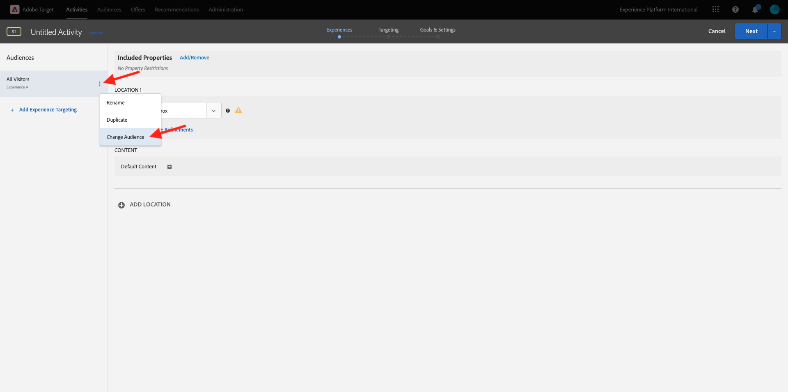

# 2.3.5 Actie nemen: stuur je publiek naar Adobe Target

Ga naar [ Adobe Experience Platform ](https://experience.adobe.com/platform). Na het aanmelden landt je op de homepage van Adobe Experience Platform.


Alvorens u verdergaat, moet u a **zandbak** selecteren. De te selecteren sandbox krijgt de naam ``--aepSandboxName--`` . Nadat u de juiste [!UICONTROL sandbox] hebt geselecteerd, ziet u de schermwijziging en nu bevindt u zich in uw toegewezen [!UICONTROL sandbox] .


## Uw DataStream verifiëren

De Adobe Target-bestemming in Real-Time CDP is verbonden met de gegevensstroom die wordt gebruikt om gegevens in te voeren in het Adobe Edge-netwerk. Als u de Adobe Target-bestemming wilt instellen, moet u eerst controleren of uw gegevensstroom al is ingeschakeld voor Adobe Target. Uw datastram werd gevormd in [ Uitoefening 0.2 creeer uw Datasstream ](./../../../modules/../getting-started/gettingstarted/ex2.md) en werd genoemd `--aepUserLdap-- - Demo System Datastream`.

In het linkermenu, scrol neer en klik **Datastreams**. Zoek in Datastreams naar de gegevensstroom met de naam `--aepUserLdap-- - Demo System Datastream` . Klik op de gegevensstroom om deze te openen.


U zult dan dit zien, klik **..** naast **Adobe Experience Platform** en klik dan **uitgeven**.


Controleer checkboxes voor zowel **de Segmentatie van Edge** als **de Doelen van Personalization**. Klik **sparen**.


Vervolgens klikt u op **+ Service toevoegen** .


Selecteer de dienst **Adobe Target**. Klik **sparen**.


Uw gegevensstroom is nu geconfigureerd voor Adobe Target.


## Uw Adobe Target-bestemming instellen

Adobe Target is beschikbaar als een bestemming vanuit Real-Time CDP. Om uw integratie van Adobe Target te plaatsen, ga **Doelen**, aan **Catalogus**.

Klik **Personalization** in het **menu van Categorieën**. U zult dan **(v2) Adobe Target** bestemmingskaart zien.


Klik **Verbinding met bestemming**.


Dan zie je dit. U moet uw eigen Adobe Target-bestemming maken en de volgende richtlijnen volgen:

- Naam: gebruik de naam `--aepUserLdap-- - Adobe Target v2  (Web)` .
- Identiteitskaart van de gegevensstroom: u moet de gegevensstroom selecteren die u in [ Uitoefening 0.2 vormde creeer uw DataStream ](./../../../modules/../getting-started/gettingstarted/ex2.md). De naam van de gegevensstroom moet zijn: `--aepUserLdap-- - Demo System Datastream` .
- Workspace: dit is gerelateerd aan Adobe Target-werkruimten. Als er geen specifieke werkruimte is moet u gebruiken, dan selecteren **StandaardWorkspace**.

Klik **daarna**.


U kunt nu optioneel een beleid voor gegevensbeheer selecteren. Klik **daarna**.


In de lijst van beschikbaar publiek, selecteer het publiek u in de vorige oefening [ creeerde een publiek ](./ex1.md), dat `--aepUserLdap-- - Interest in Galaxy S24` wordt genoemd. Dan, klik **daarna**.


Op het **scherm van de Afbeelding**, kunt u profielattributen in kaart brengen om beschikbaar in Adobe Target te worden. Zo kunt u een extra laag met een hogere mate van personalisatie toevoegen aan uw website. Klik **toevoegen Nieuw Gebied**.


Voor het nieuwe gebied, selecteer het gebied **person.name.firstName**. Klik **sparen**.


Dan heb je dit. Klik **daarna**.


Klik **Afwerking**.


Uw publiek wordt nu geactiveerd voor Adobe Target.


>[!IMPORTANT]
>
>Als je net je Adobe Target-bestemming hebt gemaakt in Real-Time CDP, kan het tot een uur duren voordat de bestemming live is. Dit is eenmalig wachttijd, wegens de opstelling van de backendconfiguratie. Zodra de aanvankelijke 1 uur wachttijd en achtergrondconfiguratie wordt gedaan, zal het onlangs toegevoegde publiek dat naar de bestemming van Adobe Target wordt verzonden voor het richten in real time beschikbaar zijn.

## Uw Adobe Target-formuliergebaseerde activiteit configureren

Nu uw Real-Time CDP-publiek is geconfigureerd om naar Adobe Target te worden verzonden, kunt u uw Experience Targeting-activiteit in Adobe Target configureren. In deze oefening zult u een op vorm-gebaseerde activiteit vormen.

Ga naar de homepage van Adobe Experience Cloud door [ https://experiencecloud.adobe.com/ ](https://experiencecloud.adobe.com/) te gaan. Klik **Doel** om het te openen.


Op **Adobe Target** homepage, zult u alle bestaande Activiteiten zien. Klik **creeer Activiteit**, dan klik **Ervaring richtend**.


Selecteer **Web**, **Vorm** en **Geen Beperkingen van het Bezit**. Klik **creëren**.


U bent nu in de op formulier gebaseerde composer voor activiteiten.


Voor het gebied **LOCATIE 1**, uitgezochte **doel-globaal-mbox**.


Het standaardpubliek is momenteel **Alle Bezoekers**. Klik op **3 dots** naast **Alle Bezoekers** en klik **Publiek van de Verandering**.



U ziet nu de lijst met beschikbare soorten publiek. Het Adobe Experience Platform-publiek dat u eerder hebt gemaakt en naar Adobe Target hebt verzonden, maakt nu deel uit van deze lijst. Selecteer het publiek dat u eerder in Adobe Experience Platform hebt gemaakt. Klik **toewijzen Publiek**.


Uw Adobe Experience Platform-publiek maakt nu deel uit van deze Experience Targeting Activity.


Laten we nu de hoofdafbeelding wijzigen op de homepage van de website. Klik om de dropdown lijst naast **StandaardInhoud** te openen en **te klikken creeer de Aanbieding van HTML**.


Plak de volgende code.

```javascript
<script>document.querySelector("#SpectrumProvider > div.App > div > div.Page.home > main > div.Banner.Banner--alignment-right.Banner--verticalAlignment-middle.main-banner > div.Image > img").src="https://one-adobe-tech-insiders.s3.us-west-2.amazonaws.com/citisignal-new-hero.png"; document.querySelector("#SpectrumProvider > div.App > div > div.Page.home > main > div.Banner.Banner--alignment-right.Banner--verticalAlignment-middle.main-banner > div.Banner__content > div > div > h1").innerHTML="Hi there ";
document.querySelector("#SpectrumProvider > div.App > div > div.Page.home > main > div.Banner.Banner--alignment-right.Banner--verticalAlignment-middle.main-banner > div.Banner__content > div > div > div > div > p").innerHTML="What about 10% off of your next Galaxy S24 smartphone?";
</script>
```


Vervolgens moet u een personalisatietoken toevoegen van Adobe Experience Platform-profielkenmerken. Herinner me, wanneer u het publiek aan Adobe Target activeerde, selecteert u ook het gebied **person.name.firstName** dat met Adobe Target moet worden gedeeld. Om het gebied terug te winnen, selecteer de bron **Adobe Experience Platform**, selecteer uw zandbak (die `--aepSandboxName--` zou moeten zijn) en selecteer dan de attributen **person.name.firstName**.


Alvorens u **klikt voeg** knoop toe, zorg ervoor om naar de lijn te gaan waar u `... > h1").innerHTML="Hi there ";` ziet en uw curseur binnen de steunen na het woord `there`, als dit plaatst:

```
... > h1").innerHTML="Hi there ";
```

Dan klik **toevoegen** knoop, die dan het teken zou moeten toevoegen, dat de code als dit zal bijwerken:

```
... > h1").innerHTML="Hi there ${aep.person.name.firstName}";
```


Klik **daarna**.


U zult dan het overzicht van uw ervaring met het nieuwe beeld, voor uw geselecteerd Publiek zien. Klik **daarna**.


Klik op de titel van uw activiteit in de linkerbovenhoek om de naam ervan als volgt te wijzigen: `--aepUserLdap-- - RTCDP - XT (Form)`


Op de **Doelstellingen &amp; Montages** - pagina, ga naar **Goal Metrics**. Plaats het Primaire Doel aan **Betrokkenheid** - **Tijd op Plaats**. Klik **sparen &amp; Sluiten**.


U bent nu op de **pagina van het Overzicht van de Activiteit**. U moet uw activiteit nog activeren. Klik op het gebied **Inactief** en selecteer **activeren**.


Je krijgt dan een visuele bevestiging dat je activiteit nu actief is.


Uw activiteiten zijn nu live en kunnen worden getest op de demo-website.

>[!IMPORTANT]
>
>Als je net je Adobe Target-bestemming hebt gemaakt in Real-Time CDP, kan het tot een uur duren voordat de bestemming live is. Dit is eenmalig wachttijd, wegens de opstelling van de backendconfiguratie. Zodra de aanvankelijke 1 uur wachttijd en de backendconfiguratie wordt gedaan, zal het onlangs toegevoegde randpubliek dat naar de bestemming van Adobe Target wordt verzonden voor richten in real time beschikbaar zijn.

Als u nu teruggaat naar uw demo-website en de productpagina voor Galaxy S24 bezoekt, komt u in aanmerking voor het publiek dat u hebt gemaakt en ziet u dat de Adobe Target-activiteit in real-time wordt weergegeven op de homepage.


## Volgende stappen

Ga naar [ 2.3.6 SDK van Doelen ](./ex6.md){target="_blank"}

Ga terug naar [ in real time CDP - Bouw een publiek en neem actie ](./real-time-cdp-build-a-segment-take-action.md){target="_blank"}

Ga terug naar [ Alle modules ](./../../../../overview.md){target="_blank"}
