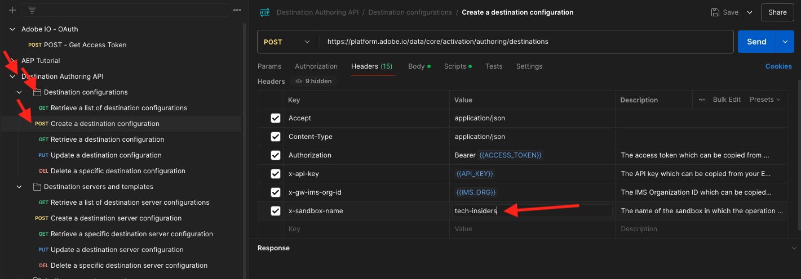

# 2.3.6 Doelen SDK

## Adobe I/O-project instellen

In deze oefening zult u Adobe I/O opnieuw gebruiken om Adobe Experience Platform API&#39;s te vragen. Als u uw project van Adobe I/O nog niet hebt gevormd, ga terug naar [&#x200B; oefening 3 in Module 2.1 &#x200B;](../rtcdpb2c-1/ex3.md) en volg de instructies daar.

>[!IMPORTANT]
>
>Als u een werknemer van Adobe bent, te volgen gelieve de instructies hier om [&#x200B; PostBuster &#x200B;](./../../../../modules/getting-started/gettingstarted/ex8.md) te gebruiken.

## Verificatie naar Adobe I/O

In deze oefening zult u Postman opnieuw gebruiken om Adobe Experience Platform API&#39;s te vragen. Als u uw toepassing van Postman nog niet hebt gevormd, ga terug naar [&#x200B; Uitoefening 3 in Module 2.1 &#x200B;](../rtcdpb2c-1/ex3.md) en volg de instructies daar.

>[!IMPORTANT]
>
>Als u een werknemer van Adobe bent, te volgen gelieve de instructies hier om [&#x200B; PostBuster &#x200B;](./../../../../modules/getting-started/gettingstarted/ex8.md) te gebruiken.

## Definiëren van eindpunt en formaat

Voor deze oefening, zult u een eindpunt nodig hebben om te vormen zodat wanneer een publiek kwalificeert, de kwalificatiegebeurtenis aan dat eindpunt kan worden gestroomd. In deze oefening, zult u een steekproefeindpunt gebruiken gebruikend [&#x200B; https://pipedream.com/requestbin &#x200B;](https://pipedream.com/requestbin). Ga naar [&#x200B; https://pipedream.com/requestbin &#x200B;](https://pipedream.com/requestbin), creeer een rekening en creeer dan een werkruimte. Als de werkruimte eenmaal is gemaakt, ziet u iets gelijkaardigs.

Klik **exemplaar** om url te kopiëren. U zult deze url in de volgende oefening moeten specificeren. De URL in dit voorbeeld is `https://eodts05snjmjz67.m.pipedream.net` .


Wat de indeling betreft, gebruiken we een standaardsjabloon voor het streamen van publiekskwalificaties of -kwalificaties, samen met metagegevens zoals klantid&#39;s. De malplaatjes kunnen worden aangepast om aan de verwachtingen van specifieke eindpunten te voldoen, maar in deze oefening zullen wij een standaardmalplaatje opnieuw gebruiken, dat in een nuttige last als dit zal resulteren die aan het eindpunt zal worden gestroomd.

```json
{
  "profiles": [
    {
      "identities": [
        {
          "type": "ecid",
          "id": "64626768309422151580190219823409897678"
        }
      ],
      "AdobeExperiencePlatformSegments": {
        "add": [
          "f58c723c-f1e5-40dd-8c79-7bb4ab47f041"
        ],
        "remove": []
      }
    }
  ]
}
```

## Een server- en sjabloonconfiguratie maken

De eerste stap voor het maken van uw eigen bestemming in Adobe Experience Platform is het maken van een server- en sjabloonconfiguratie met Postman.

Om dat te doen, open uw toepassing van Postman en ga naar **Authoring API van de Bestemming**, aan **de servers en de malplaatjes van de Bestemming** en klik om het verzoek **POST te openen - creeer een configuratie van de bestemmingsserver**.

>[!NOTE]
>
>Als u niet die inzameling van Postman hebt, ga terug naar [&#x200B; oefening 3 in Module 2.1 &#x200B;](../rtcdpb2c-1/ex3.md) en volg de instructies daar aan opstelling Postman met de verstrekte inzamelingen van Postman.

Dan zie je dit. Onder **Kopballen**, moet u de waarde voor sleutel **x-zandbak-naam** manueel bijwerken en het plaatsen aan `--aepSandboxName--`. Selecteer de waarde **{{SANDBOX_NAME}}** .


Vervang deze door `--aepSandboxName--` .


Daarna, ga naar **Lichaam**. Selecteer de tijdelijke aanduiding **{{body}}** .


U moet nu de tijdelijke aanduiding **{{body}}** vervangen door de onderstaande code:

```json
{
    "name": "Custom HTTP Destination",
    "destinationServerType": "URL_BASED",
    "urlBasedDestination": {
        "url": {
            "templatingStrategy": "PEBBLE_V1",
            "value": "yourURL"
        }
    },
    "httpTemplate": {
        "httpMethod": "POST",
        "requestBody": {
            "templatingStrategy": "PEBBLE_V1",
            "value": "{\n    \"profiles\": [\n    \n        {\n            \"identities\": [\n            \n            \n                \n                {\n                    \"type\": \"{{ namespace }}\",\n                    \"id\": \"{{ identity.id }}\"\n                },\n                ,\n            \n            ],\n            \"AdobeExperiencePlatformSegments\": {\n                \"add\": [\n                \n                    \"{{ segment.key }}\",\n                \n                ],\n                \"remove\": [\n                {#- Alternative syntax for filtering segments by status: -#}\n                \n                    \"{{ segment.key }}\",\n                \n                ]\n            }\n        },\n    \n    ]\n}"
        },
        "contentType": "application/json"
    }
}
```

Na het kleven van de bovengenoemde code, moet u het gebied **urlBasedDestination.url.value** manueel bijwerken, en u moet het aan url van Webhaak plaatsen u in de vorige stap creeerde, die `https://eodts05snjmjz67.m.pipedream.net` in dit voorbeeld was.


Na het bijwerken van het gebied **urlBasedDestination.url.value**, zou het als dit moeten kijken. Klik **verzenden**.


>[!NOTE]
>
>Vergeet niet dat u een geldige `access_token` moet hebben voordat u een aanvraag naar Adobe I/O verzendt. Om een geldige `access_token` te krijgen, stel het verzoek **POST in werking - krijg het Token van de Toegang** in de inzameling **Adobe IO - OAuth**.

Na het klikken **verzend**, zal uw servermalplaatje worden gecreeerd, en als deel van de reactie zult u een gebied genoemd **instanceId** zien. Schrijf het neer, aangezien u het in de volgende stap zult nodig hebben. In dit voorbeeld, is **instanceId**
`52482c90-8a1e-42fc-b729-7f0252e5cebd` .


## Uw doelconfiguratie maken

In Postman, onder **Authoring API van de Bestemming**, ga naar **configuraties van de Bestemming** en klik om het verzoek **POST te openen - creeer een bestemmingsconfiguratie**. Dan zie je dit. Onder **Kopballen**, moet u de waarde voor sleutel **x-zandbak-naam** manueel bijwerken en het plaatsen aan `--aepSandboxName--`. Selecteer de waarde **{{SANDBOX_NAME}}** en vervang deze door `--aepSandboxName--` .



Daarna, ga naar **Lichaam**. Selecteer de tijdelijke aanduiding **{{body}}** .


U moet nu de tijdelijke aanduiding **{{body}}** vervangen door de onderstaande code:

```json
{
    "name": "--aepUserLdap-- - Webhook",
    "description": "Exports segment qualifications and identities to a custom webhook via Destination SDK.",
    "status": "TEST",
    "customerAuthenticationConfigurations": [
        {
            "authType": "BEARER"
        }
    ],
    "customerDataFields": [
        {
            "name": "endpointsInstance",
            "type": "string",
            "title": "Select Endpoint",
            "description": "We could manage several instances across the globe for REST endpoints that our customers are provisioned for. Select your endpoint in the dropdown list.",
            "isRequired": true,
            "enum": [
                "US",
                "EU",
                "APAC",
                "NZ"
            ]
        }
    ],
    "uiAttributes": {
        "documentationLink": "https://experienceleague.adobe.com/docs/experience-platform/destinations/home.html?lang=nl-NL",
        "category": "streaming",
        "connectionType": "Server-to-server",
        "frequency": "Streaming"
    },
    "identityNamespaces": {
        "ecid": {
            "acceptsAttributes": true,
            "acceptsCustomNamespaces": false
        }
    },
    "segmentMappingConfig": {
        "mapExperiencePlatformSegmentName": true,
        "mapExperiencePlatformSegmentId": true,
        "mapUserInput": false
    },
    "aggregation": {
        "aggregationType": "BEST_EFFORT",
        "bestEffortAggregation": {
            "maxUsersPerRequest": "1000",
            "splitUserById": false
        }
    },
    "schemaConfig": {
        "profileRequired": false,
        "segmentRequired": true,
        "identityRequired": true
    },
    "destinationDelivery": [
        {
            "authenticationRule": "NONE",
            "destinationServerId": "yourTemplateInstanceID"
        }
    ]
}
```


Na het kleven van de bovengenoemde code, moet u het gebied **destinationDelivery manueel bijwerken. destinationServerId**, en u moet het plaatsen aan **instanceId** van het malplaatje van de bestemmingsserver u in de vorige stap creeerde, die `52482c90-8a1e-42fc-b729-7f0252e5cebd` in dit voorbeeld was. Daarna, klik **verzenden**.


Dan zie je dit antwoord.


Je bestemming is nu gemaakt in Adobe Experience Platform. Laten we daar naartoe gaan en het controleren.

Ga naar [&#x200B; Adobe Experience Platform &#x200B;](https://experience.adobe.com/platform). Na het aanmelden landt je op de homepage van Adobe Experience Platform.


Alvorens u verdergaat, moet u a **zandbak** selecteren. De te selecteren sandbox krijgt de naam ``--aepSandboxName--`` . Nadat u de juiste [!UICONTROL sandbox] hebt geselecteerd, ziet u de schermwijziging en nu bevindt u zich in uw toegewezen [!UICONTROL sandbox] .


In het linkermenu, ga naar **Doelen**, klik **Catalogus** en scrol neer aan de categorie **Streaming**. Je ziet je bestemming nu beschikbaar.


## Uw publiek aan uw bestemming koppelen

In **Doelen** > **Catalogus**, klik **Opstelling** op uw bestemming beginnen publiek aan uw nieuwe bestemming toe te voegen.


Ga een willekeurige waarde voor het **dragerteken** in, als **1234**. Klik **verbinden met bestemming**.


Dan zie je dit. Gebruik `--aepUserLdap-- - Webhook` als naam voor uw doel. Selecteer een eindpunt van keus, in dit voorbeeld **EU**. Klik **daarna**.


U kunt desgewenst een beleid voor gegevensbeheer selecteren. Klik **daarna**.


Selecteer het publiek dat u eerder hebt gemaakt en dat de naam `--aepUserLdap-- - Interest in Galaxy S24` heeft. Klik **daarna**.


Dan zie je dit. Zorg ervoor om het **VELD van SOURCE** `--aepTenantId--.identification.core.ecid` aan het gebied `Identity: ecid` in kaart te brengen. Klik **daarna**.


Klik **Afwerking**.


Uw bestemming is nu live. Nieuwe publiekskwalificaties worden nu gestreamd naar uw aangepaste webhaak.


## Activering van het publiek testen

Ga naar [&#x200B; https://dsn.adobe.com &#x200B;](https://dsn.adobe.com). Nadat je je hebt aangemeld bij je Adobe ID, kun je dit zien. Klik de 3 punten **..** op uw websiteproject en klik dan **Looppas** om het te openen.


Vervolgens wordt uw demowebsite geopend. Selecteer de URL en kopieer deze naar het klembord.


Open een nieuw Incognito-browservenster.


Plak de URL van uw demowebsite, die u in de vorige stap hebt gekopieerd. Vervolgens wordt u gevraagd u aan te melden met uw Adobe ID.


Selecteer uw accounttype en voltooi het aanmeldingsproces.


Uw website wordt vervolgens geladen in een Incognito-browservenster. Voor elke oefening, zult u een vers, incognito browser venster moeten gebruiken om uw demowebsite URL te laden.


In dit voorbeeld wilt u reageren op een specifieke klant die een specifiek product weergeeft.
Van de **homepage van het Signaal 0&rbrace; Citi, ga** Telefoons &amp; apparaten **, en klik het product** Galaxy S24 **.**


De productpagina voor Galaxy S24 is nu weergegeven. Uw doelgroep komt dus in aanmerking voor uw profiel in de volgende minuten.


Wanneer u de Kijker van het Profiel opent, en naar **Soorten publiek** gaat gaan, zult u het publiek zien kwalificeren.


Ga nu terug naar uw open webhaak op [&#x200B; https://eodts05snjmjz67.m.pipedream.net &#x200B;](https://eodts05snjmjz67.m.pipedream.net), waar u een nieuw inkomend verzoek zou moeten zien, dat uit Adobe Experience Platform voortkomt en die de gebeurtenis van de publiekskwalificatie bevat.


## Volgende stappen

Ga naar [&#x200B; Samenvatting en voordelen &#x200B;](./summary.md){target="_blank"}

Ga terug naar [&#x200B; in real time CDP - Bouw een publiek en neem actie &#x200B;](./real-time-cdp-build-a-segment-take-action.md){target="_blank"}

Ga terug naar [&#x200B; Alle modules &#x200B;](./../../../../overview.md){target="_blank"}
