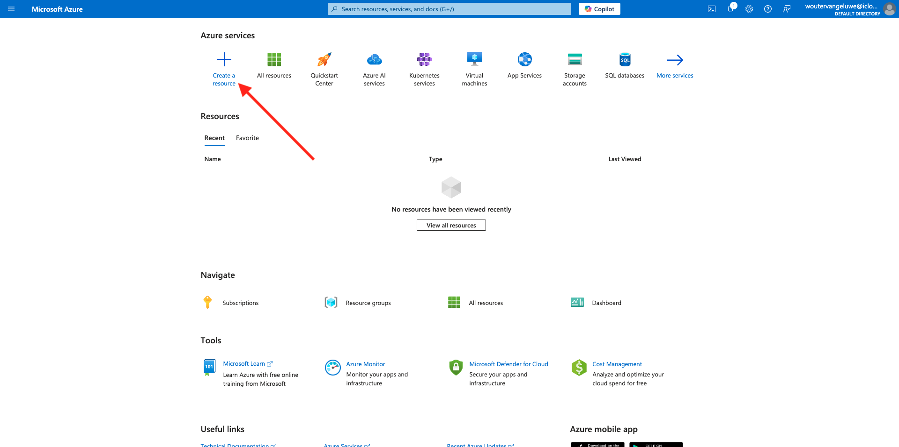
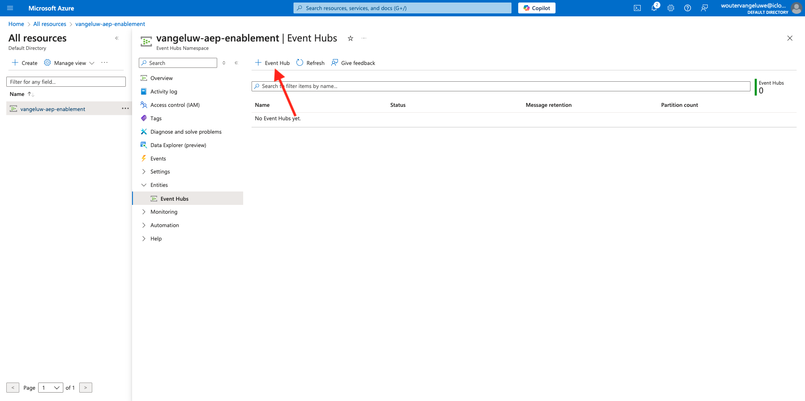

# 2.4.2 Uw Microsoft Azure EventHub-omgeving configureren

Azure Event Hubs is een hoogst scalable publish-subscribe dienst die miljoenen gebeurtenissen per seconde kan opnemen en hen in veelvoudige toepassingen stroomt. Zo kunt u de enorme hoeveelheden gegevens verwerken en analyseren die door de aangesloten apparaten en toepassingen worden geproduceerd.

## Wat is Azure Event Hubs?

Azure Event Hubs is een groot platform voor gegevensstreaming en service voor het opnemen van gebeurtenissen. Het kan miljoenen gebeurtenissen per seconde ontvangen en verwerken. Gegevens die naar een gebeurtenishub worden verzonden, kunnen worden getransformeerd en opgeslagen met behulp van een realtime analyseprovider of batchadapters.

De Hubs van de gebeurtenis vertegenwoordigt de **voordeur** voor een gebeurtenispijpleiding, vaak genoemd een gebeurtenis ingestor in oplossingsarchitectuur. Een gebeurtenislistener is een component of service die zich tussen gebeurtenisuitgevers (zoals Adobe Experience Platform RTCDP) en gebeurtenisgebruikers bevindt om de productie van een gebeurtenisstream los te koppelen van het gebruik van die gebeurtenissen. De Hubs van de gebeurtenis verstrekt een verenigd stromend platform met tijdretentiebuffer, ontkoppelt gebeurtenisproducenten van gebeurtenisconsumenten.

## Een naamruimte voor gebeurtenishubs maken

Ga naar [ https://portal.azure.com/#home ](https://portal.azure.com/#home) en selecteer **creeer een middel**.

In het middelscherm, ga **Gebeurtenis** in de onderzoeksbar in. Vind de **kaart van de Hubs van de Gebeurtenis 0&rbrace; &lbrace;, klik** creeer **en klik dan** de Hubs van de Gebeurtenis **.**

Als dit de eerste keer is dat u een middel in Azure creeert, zult u een nieuwe **groep van het Middel** moeten creëren. Als u al een middelgroep hebt kunt u het selecteren (of nieuwe creëren).

Klik **creeer nieuw** en noem uw groep `--aepUserLdap---aep-enablement`, klik **O.K.**.

Vul de overige opgegeven velden in:

- Naamruimte: definieer de naamruimte, deze moet uniek zijn en gebruik het volgende patroon `--aepUserLdap---aep-enablement`
- Locatie: kies een locatie
- Prijsende rij: **Basis**
- De Eenheden van de productie: **1**

Klik **Overzicht + creeer**.

Klik **creëren**.

De plaatsing van uw middelgroep kan 1-2 minuten vergen, wanneer succesvol u het volgende scherm zult zien:

## Uw gebeurtenishub in Azure instellen

Ga naar [ https://portal.azure.com/#home ](https://portal.azure.com/#home) en selecteer **Alle middelen**.

Klik in de lijst met bronnen op de naamruimte `--aepUserLdap---aep-enablement` Gebeurtenishubs:

In `--aepUserLdap---aep-enablement` detailscherm, ga **Entiteiten** en klik **de Hubs van de Gebeurtenis**:

Klik **+ de Hub van de Gebeurtenis**.

Gebruik `--aepUserLdap---aep-enablement-event-hub` als naam en klik **Overzicht + creeer**.

Klik **creëren**.

In **de Hubs van de Gebeurtenis** onder uw gebeurtenishub namespace, zult u uw **vermelde Hub van de Gebeurtenis** nu zien.

## Uw Azure Storage Account instellen

Om uw functie van de Hub van de Gebeurtenis van de Azure in recentere oefeningen te zuiveren, zult u een Azure Rekening van de Opslag als deel van uw het projectopstelling van de Code van Visual Studio moeten verstrekken. U gaat nu die Azure Storage Account maken.

Ga naar [ https://portal.azure.com/#home ](https://portal.azure.com/#home) en selecteer **creeer een Middel**.

Ga **opslagrekening** in het onderzoek in, vind de kaart voor **Rekening van de Opslag** en klik **rekening van de Opslag**.

Specificeer uw **Groep van het Middel** (gecreeerd in het begin van deze oefening), gebruik `--aepUserLdap--aepstorage` als uw naam van de de rekeningsrekening van de Opslag en selecteer **lokaal-overtollige opslag (LRS)**, dan klik **Overzicht + creeer**.

Klik **creëren**.

Het maken van onze opslagaccount duurt een paar seconden:

Wanneer gebeëindigd zal uw scherm **aan middel** knoop tonen.

Klik **Huis**.

Uw Rekening van de Opslag is nu zichtbaar onder **Recente Middelen**.

## Volgende stappen

Ga naar [ 2.4.3 vorm uw Azure Doel van de Hub van de Gebeurtenis in Adobe Experience Platform ](./ex3.md){target="_blank"}

Ga terug naar [ Real-Time CDP: Audience Activation aan Microsoft Azure de Hub van de Gebeurtenis ](./segment-activation-microsoft-azure-eventhub.md){target="_blank"}

Ga terug naar [ Alle modules ](./../../../../overview.md){target="_blank"}
