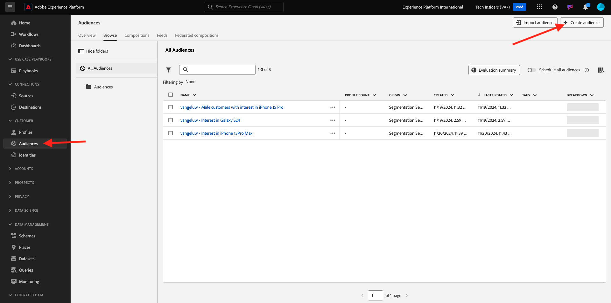

# 2.4.4 Een publiek maken

## Inleiding

U maakt een eenvoudig publiek:

- **Belang in Abonnees** waarvoor de klanten zullen kwalificeren wanneer zij de **Punten** pagina van de CitiSignal demo website bezoeken.

### Goed om te weten

CDP in real time zal een activering aan een bestemming teweegbrengen wanneer u voor een publiek kwalificeert dat deel van de activeringslijst van die bestemming uitmaakt. Wanneer dat het geval is, zal de nuttige lading van de publiekskwalificatie die naar die bestemming zal worden verzonden **alle publiek bevatten waarvoor uw klantenprofiel** kwalificeert.

Het doel van deze module is te tonen dat de het publiekskwalificatie van het Profiel van uw Klant naar uw bestemming van de Hub van de Gebeurtenis in dichtbij real time wordt verzonden.

### Status van publiek

Een publiekskwalificatie in Adobe Experience Platform heeft altijd a **status** - bezit en kan één van het volgende zijn:

- **realiseerde**: dit wijst op een nieuwe publiekskwalificatie
- **verlaten**: dit wijst erop dat het profiel niet meer voor het publiek kwalificeert

## Het publiek samenstellen

Login aan Adobe Experience Platform door naar dit URL te gaan: [ https://experience.adobe.com/platform ](https://experience.adobe.com/platform).

Na het aanmelden landt je op de homepage van Adobe Experience Platform.

Alvorens u verdergaat, moet u a **zandbak** selecteren. De te selecteren sandbox krijgt de naam ``--aepSandboxName--`` . Na het selecteren van de aangewezen zandbak, zult u de het schermverandering zien en nu bent u in uw specifieke zandbak.

Ga naar **Soorten publiek**. Klik op de knop **+ voor een publiek maken** .

Selecteer **bouwt regel** en klik **creëren**.

Noem uw publiek `--aepUserLdap-- - Interest in Plans`, plaats de evaluatiemethode aan **Edge** en voeg de paginanaam van de ervaringsgebeurtenis toe.

Klik op **Gebeurtenissen**, en belemmering en laat vallen **XDM ExperienceEvent > Web > Web-pagina details > Naam**. Ga **plannen** als waarde in:

De belemmering en laat vallen **XDM ExperienceEvent > `--aepTenantId--` > demoEnvironment > brandName**. Ga `--aepUserLdap--` als waarde in, plaats de vergelijkingsparameter aan **bevat** en klik **publiceren**:

Uw publiek is nu gepubliceerd.

## Volgende stappen

Ga naar [ 2.4.5 uw publiek ](./ex5.md){target="_blank"} activeren

Ga terug naar [ Real-Time CDP: Audience Activation aan Microsoft Azure de Hub van de Gebeurtenis ](./segment-activation-microsoft-azure-eventhub.md){target="_blank"}

Ga terug naar [ Alle modules ](./../../../../overview.md){target="_blank"}
