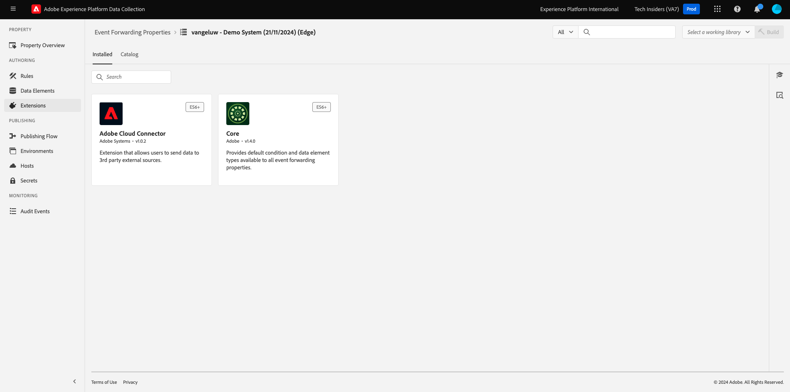

# 2.5.1 Een Adobe Experience Platform-eigenschap voor het doorsturen van gegevensverzamelingsgebeurtenissen maken

## Wat is een Adobe Experience Platform Data Collection Event Forwarding-eigenschap?

Typisch, wanneer het gegeven gebruikend de Inzameling van Gegevens van Adobe Experience Platform wordt verzameld, wordt het verzameld op de **cliëntkant**. De **cliëntkant** is een milieu zoals een website of een mobiele toepassing. Bij Aan de slag en Gegevensverzameling is de configuratie van een Adobe Experience Platform Data Collection Client-eigenschap uitgebreid besproken en hebt u die Adobe Experience Platform Data Collection Client-eigenschap geïmplementeerd op uw website en mobiele toepassing, zodat gegevens daar kunnen worden verzameld wanneer een klant communiceert met de website en mobiele toepassing.

Wanneer die interactiegegevens worden verzameld door de Adobe Experience Platform Data Collection Client-eigenschap, wordt een aanvraag verzonden door de website of mobiele app naar Adobe Edge. De Edge is Adobe-omgeving voor gegevensverzameling en is het ingangspunt voor klikstreamgegevens in het Adobe-ecosysteem. Vanuit de Edge worden die verzamelde gegevens vervolgens verzonden naar toepassingen zoals Adobe Experience Platform, Adobe Analytics, Adobe Audience Manager of Adobe Target.

Met de toevoeging van een Adobe Experience Platform Data Collection Event Forwarding-eigenschap, is het nu mogelijk om een Adobe Experience Platform Data Collection-eigenschap te configureren die luistert naar binnenkomende gegevens op de Edge. Als de Adobe Experience Platform Data Collection Event Forwarding-eigenschap die wordt uitgevoerd op de Edge binnenkomende gegevens ziet, kan deze de gegevens gebruiken en naar een andere locatie doorsturen. Dat elders nu ook een externe webhaak kan zijn die niet van Adobe is, waardoor het mogelijk is die gegevens naar bijvoorbeeld het datapeer van keuze, een beslissingstoepassing of een andere toepassing te verzenden die de mogelijkheid heeft om een webhaak te openen.

De configuratie van een Gebeurtenis die van de Inzameling van Adobe Experience Platform door:sturen van gegevens kijkt vertrouwd aan een cliënt zijbezit, met de capaciteit om gegevenselementen en regels te vormen enkel als in het verleden met de eigenschappen van de Cliënt van de Inzameling van Gegevens van Adobe Experience Platform. De manier waarop gegevens worden benaderd en gebruikt, is echter iets anders, afhankelijk van uw gebruiksscenario.

Laten we beginnen met het maken van de Adobe Experience Platform Data Collection Event Forwarding-eigenschap.

## Een Adobe Experience Platform-eigenschap voor het doorsturen van gegevensverzamelingsgebeurtenissen maken

Ga naar [ https://experience.adobe.com/#/data-collection/ ](https://experience.adobe.com/#/data-collection/). In het linkermenu, klik **Gebeurtenis door:sturen**. Vervolgens ziet u een overzicht van alle beschikbare eigenschappen voor het doorsturen van Adobe Experience Platform-gegevensverzamelingsgebeurtenissen. Klik **creeer Bezit** knoop.

Als er al andere eigenschappen voor het doorsturen van gebeurtenissen zijn gemaakt, ziet de interface er anders uit. In dat geval, klik **Nieuw Bezit**.

U moet nu een naam voor uw Adobe Experience Platform-eigenschap voor het doorsturen van gegevensverzamelingsgebeurtenissen invoeren. Gebruik `--aepUserLdap-- - Demo System (DD/MM/YYYY) (Edge)` als naamgevingsconventie. Bijvoorbeeld, in dit voorbeeld, is de naam **vangeluw - het Systeem van de Demo (22/02/2022) (Edge)**. Klik **sparen**.

U zult dan terug in de lijst van de Gebeurtenis door:sturen van de Gebeurtenis van de Gegevensverzameling van Adobe Experience Platform zijn. Klik om de eigenschap te openen die u net hebt gemaakt.

## De extensie Adobe Cloud Connector configureren

In het linkermenu, ga naar **Uitbreidingen**. U zult zien dat de **uitbreiding van de Kern** reeds wordt gevormd.

Ga naar **Catalogus**. U zult de **uitbreiding van de Verbinding van de Wolk van 0} Adobe {, samen vele anderen zien.** Klik **installeren** om het te installeren.

De extensie wordt vervolgens toegevoegd. Er is geen configuratie voor deze stap. U wordt teruggestuurd naar het overzicht van geïnstalleerde extensies.

## Implementeer de eigenschap Adobe Experience Platform Data Collection Event Forwarding

In het linkermenu, ga naar **het Publiceren Stroom**. Klik **toevoegen Bibliotheek**.

Ga de naam **Belangrijkste** in, selecteer de milieu **Ontwikkeling (ontwikkeling)** en klik **+ voeg Alle Gewijzigde Middelen** toe.

Dan zie je dit. Klik **sparen &amp; bouwt voor Ontwikkeling**.

Uw bibliotheek wordt dan gemaakt, wat 1 tot 2 minuten kan duren.

## Volgende stappen

Ga naar [ 2.5.2 Werk uw DataStream bij om gegevens beschikbaar te maken aan uw Gebeurtenis van de Inzameling van Gegevens die bezit door:sturen ](./ex2.md){target="_blank"}

Ga terug naar [ Verbindingen van Real-Time CDP: Gebeurtenis door:sturen ](./aep-data-collection-ssf.md){target="_blank"}

Ga terug naar [ Alle modules ](./../../../../overview.md){target="_blank"}
