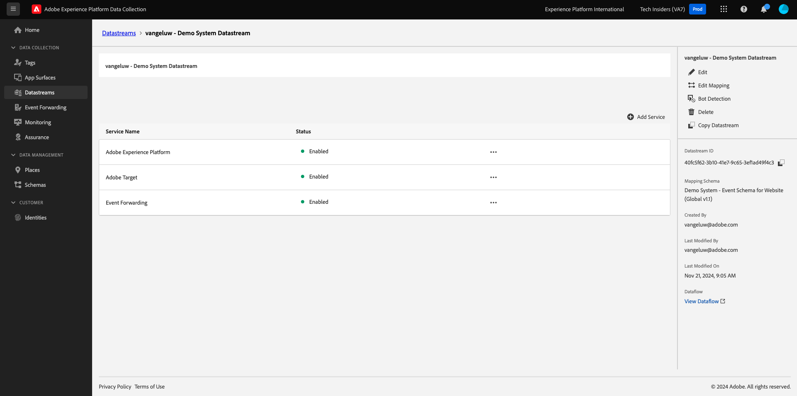

# 2.5.2 Werk uw DataStream bij om gegevens ter beschikking te stellen van uw Adobe Experience Platform-eigenschap van de Server van de Gegevensverzameling

## Uw DataStream bijwerken

In [&#x200B; Aan de slag &#x200B;](./../../../getting-started/gettingstarted/ex2.md), creeerde u uw eigen **[!UICONTROL Datastream]**. Vervolgens hebt u de naam `--aepUserLdap-- - Demo System Datastream` gebruikt.

In deze oefening, moet u dat **[!UICONTROL Datastream]** vormen om met uw **bezit van de Server van de Inzameling van Gegevens te werken**.

Om dat te doen, ga naar [&#x200B; https://experience.adobe.com/#/data-collection/ &#x200B;](https://experience.adobe.com/#/data-collection/). Dan zie je dit. Klik in het linkermenu op **[!UICONTROL Datastreams]** .

Selecteer in de rechterbovenhoek van het scherm de naam van de sandbox, die `--aepSandboxName--` moet zijn.

Zoek naar uw **[!UICONTROL Datastream]**, die `--aepUserLdap-- - Demo System Datastream` wordt genoemd. Klik op de **[!UICONTROL Datastream]** om deze te openen.

Dan zie je dit. Klik op **[!UICONTROL + Add Service]**.

Selecteer de dienst **Gebeurtenis door:sturen**. Hier ziet u nog 2 andere instellingen. Selecteer de eigenschap Event Forwarding, die u in de vorige exercitie hebt gemaakt en die de naam `--aepUserLdap-- - Demo System (DD/MM/YYYY) (Edge)` heeft. Dan selecteer **Ontwikkeling** onder **Milieu**. Klik **sparen**.

Uw gegevensstroom is nu bijgewerkt en klaar voor gebruik.

Uw gegevensstroom is nu klaar om met uw **[!DNL Event Forwarding property]** te werken.

## Volgende stappen

Ga naar [&#x200B; 2.5.3 creeer en vorm een douane webhaak &#x200B;](./ex3.md){target="_blank"}

Ga terug naar [&#x200B; Verbindingen van Real-Time CDP: Gebeurtenis door:sturen &#x200B;](./aep-data-collection-ssf.md){target="_blank"}

Ga terug naar [&#x200B; Alle modules &#x200B;](./../../../../overview.md){target="_blank"}
