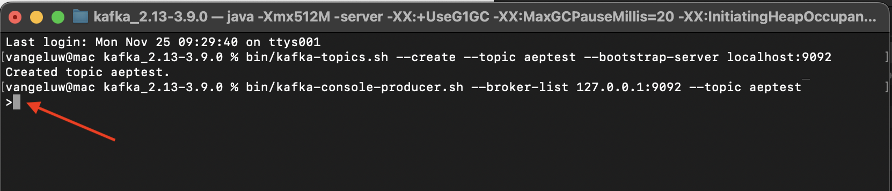

# 2.6.2 Uw Kafka-cluster installeren en configureren

## Apache Kafka downloaden

Ga naar [&#x200B; https://kafka.apache.org/downloads &#x200B;](https://kafka.apache.org/downloads) en download de recentste vrijgegeven versie. Selecteer de recentste binaire versie, in dit geval **3.9.0**. Het downloaden wordt gestart.

Creeer een omslag op uw Desktop genoemd **Kafka_AEP** en plaats het gedownloade dossier in die folder.

Open a **Eind** venster door uw omslag met de rechtermuisknop aan te klikken en **Nieuwe Eind in Omslag** te klikken.

Voer dit bevel in uw Eind venster in werking om het gedownloade dossier te decomprimeren:

`tar -xvf kafka_2.13-3.9.0.tgz`

>[!NOTE]
>
>Controleer of de bovenstaande opdracht overeenkomt met de versie van het bestand dat u hebt gedownload. Als uw versie recenter is, zult u het bovengenoemde bevel moeten bijwerken om die versie aan te passen.

U zult dan dit zien:

Na het decomprimeren van dat bestand hebt u nu een map als deze:

En in die folder, zult u deze subdirecteuren zien:

Ga terug naar uw Eind venster. Voer de volgende opdracht in:

`cd kafka_2.13-3.9.0`

>[!NOTE]
>
>Controleer of de bovenstaande opdracht overeenkomt met de versie van het bestand dat u hebt gedownload. Als uw versie recenter is, zult u het bovengenoemde bevel moeten bijwerken om die versie aan te passen.

Voer vervolgens de opdracht `bin/kafka-topics.sh` in.

U zou dan deze reactie moeten zien. Dit betekent dat Kafka correct is geïnstalleerd en dat Java prima werkt. (Herinnering: dit werkt alleen als Java 23 JDK is geïnstalleerd!. U kunt zien welke Java-versie u hebt geïnstalleerd met de opdracht `java -version` .)

## Start Kafka

Om Kafka te starten, moet je Kafka Zookeeper en Kafka starten, in deze volgorde.

Open a **Eind** venster door uw omslag **kafka_2.13-3.9.0** met de rechtermuisknop aan te klikken en **Nieuwe Eind bij Omslag** te klikken.

Voer deze opdracht in:

`bin/zookeeper-server-start.sh config/zookeeper.properties`

U zult dan dit zien:

Houd dit venster open terwijl u deze oefeningen doorloopt!

Open een ander, nieuw **Eind** venster door uw omslag **kafka_2.13-3.9.0** met de rechtermuisknop aan te klikken en **Nieuwe Eind bij Omslag** te klikken.

Voer deze opdracht in:

`bin/kafka-server-start.sh config/server.properties`

U zult dan dit zien:

Houd dit venster open terwijl u deze oefeningen doorloopt!

## Een Kafka-onderwerp maken

Open a **Eind** venster door uw omslag **kafka_2.13-3.9.0** met de rechtermuisknop aan te klikken en **Nieuwe Eind bij Omslag** te klikken.

Ga dit bevel in om een nieuw onderwerp Kafka met de naam **te creëren ontvankelijk**. Dit onderwerp zal voor het testen in deze oefening worden gebruikt.

`bin/kafka-topics.sh --create --topic aeptest --bootstrap-server localhost:9092`

Je ziet dan een bevestiging:

Ga dit bevel in om een nieuw onderwerp Kafka met de naam **te creëren aep**. Dit onderwerp zal door de Schakelaar worden gebruikt van het Sink van Adobe Experience Platform die u in de volgende oefeningen zult vormen.

`bin/kafka-topics.sh --create --topic aep --bootstrap-server localhost:9092`

Je ziet dan een vergelijkbare bevestiging:

## Gebeurtenissen maken

Ga terug naar het Eind venster waarin u uw eerste Kafka onderwerp creeerde en het volgende bevel ingaat:

`bin/kafka-console-producer.sh --broker-list 127.0.0.1:9092 --topic aeptest`

Dan zie je dit. Elke nieuwe lijn die door de Enter knoop wordt gevolgd zal in een nieuw bericht resulteren dat in het onderwerp **wordt verzonden ontvankelijk**.

Voer `Hello AEP` in en druk op Enter. Uw eerste gebeurtenis is nu verzonden naar uw lokale instantie Kafka, in het onderwerp **ontvankelijk**.

Voer `Hello AEP again.` in en druk op Enter.

Voer `AEP Data Collection is the best.` in en druk op Enter.

U hebt nu 3 gebeurtenissen in het onderwerp **ontvankelijk** geproduceerd. Deze gebeurtenissen kunnen nu worden verbruikt door een toepassing die deze gegevens nodig heeft.

Klik op het toetsenbord op `Control` en `C` tegelijk om de producent te sluiten.

## Gebeurtenissen van Consume

In het zelfde Eindvenster dat u gebruikte om gebeurtenissen te veroorzaken, ga het volgende bevel in:

`bin/kafka-console-consumer.sh --bootstrap-server 127.0.0.1:9092 --topic aeptest --from-beginning`

U zult dan alle berichten zien die in de vorige oefening voor het onderwerp **aeptest** werden veroorzaakt, in de consument verschijnen. Zo werkt Apache Kafka: een producent creëert evenementen in een pijpleiding en een consument verbruikt die evenementen.

Klik op het toetsenbord op `Control` en `C` tegelijk om de producent te sluiten.

In deze oefening, hebt u alle grondbeginselen doorlopen om een lokale cluster Kafka op te zetten, een onderwerp van Kafka tot stand te brengen, gebeurtenissen te produceren en gebeurtenissen te verbruiken.

Het doel van deze module is om te simuleren wat er zou gebeuren als een echte organisatie al een Apache Kafka-cluster heeft geïmplementeerd en gegevens van hun Kafka-cluster naar Adobe Experience Platform wil streamen.

Om een dergelijke implementatie te vergemakkelijken, is een Adobe Experience Platform Sink Connector gemaakt die kan worden geïmplementeerd met Kafka Connect. U kunt de documentatie van die Schakelaar van Adobe Experience Platform hier vinden: [&#x200B; https://github.com/adobe/experience-platform-streaming-connect &#x200B;](https://github.com/adobe/experience-platform-streaming-connect).

Bij de volgende oefeningen implementeert u alles wat u nodig hebt om die Adobe Experience Platform Sink Connector vanuit uw eigen lokale Kafka-cluster te gebruiken.

Sluit uw eindvenster.

U hebt deze oefening voltooid.

## Volgende stappen

Ga naar [&#x200B; 2.6.3 vorm HTTP API eindpunt in Adobe Experience Platform &#x200B;](./ex3.md){target="_blank"}

Ga terug naar [&#x200B; gegevens van de Stroom van Apache Kafka in Adobe Experience Platform &#x200B;](./aep-apache-kafka.md){target="_blank"}

Ga terug naar [&#x200B; Alle modules &#x200B;](./../../../../overview.md){target="_blank"}
