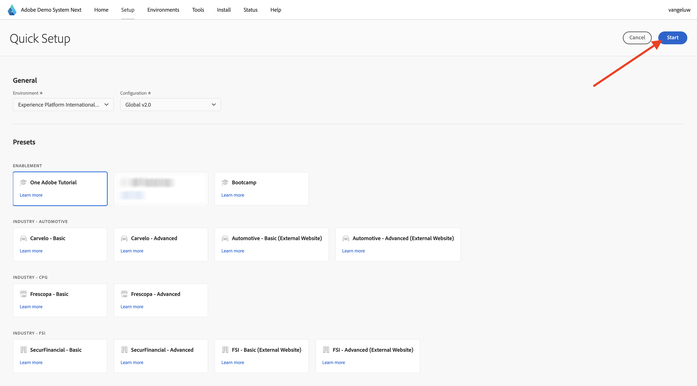

# Demosysteem gebruiken naast het instellen van de client-eigenschap voor Adobe Experience Platform-gegevensverzameling

Om de lessen in deze zelfstudie te visualiseren en het voor u mogelijk te maken uw configuratie in een veilige omgeving te testen, gebruikt deze zelfstudie de volgende tools van het Adobe Demo System. Om het grootste deel van dit leerprogramma te krijgen, moet uw instantie van AEP worden gevormd om met het Systeem van de Demo daarna te worden geïntegreerd.

Zodra u toegang tot het Systeem van de Demo daarna hebt, ga met de onderstaande stappen te werk.

Ga naar [ https://dsn.adobe.com/ ](https://dsn.adobe.com/){target="_blank"} en navigeer aan **Opstelling**.

In **Milieu** dropdown, selecteer uw instantie van AEP en zandbak.

Daarna, selecteer de vooraf ingestelde **Gebruiker van het Leerprogramma van AEP**.

Daarna, klik **Begin**.

In popup, ga een naam voor uw eigenschappen van de Inzameling van Gegevens en de projecten van de Bouwer van de Ervaring in. Gelieve te gebruiken deze noemende overeenkomst: **Één Adobe (DD/MM/JJJJ)**. FYI: de LDAP wordt automatisch toegevoegd, u hoeft deze niet zelf toe te voegen.

Klik **Begin**.

Deze pop-up toont u de voortgang tijdens het maken van uw website en mobiele app-projecten en de eigenschappen van uw gegevensverzameling.

Zodra het snelle opstellingsproces heeft voltooid, zult u hebben:

- 1 webproject dat het mogelijk maakt een demo-website te gebruiken met een merk telco demo
- 1 mobiel app-project, dat het mogelijk maakt een mobiele demo-app met een merk telco demo te gebruiken
- 1 CX App-project, waardoor het mogelijk wordt een callcenter-app te gebruiken met een telco-demo-merk
- 1 eigenschap Gegevensverzameling voor web, dat u gaat gebruiken om gegevens van de website te verzamelen
- 1 eigenschap voor gegevensverzameling voor mobiele apparaten, die u gebruikt om gegevens te verzamelen van de mobiele app

Zorg dat dit scherm open blijft, zoals u het in de volgende stappen nodig hebt.

## Volgende stappen

Ga naar [ creeer uw DataStream ](./ex3.md){target="_blank"}

Ga terug naar [ Begonnen het worden ](./getting-started.md){target="_blank"}

Ga terug naar [ Alle modules ](./../../../overview.md){target="_blank"}