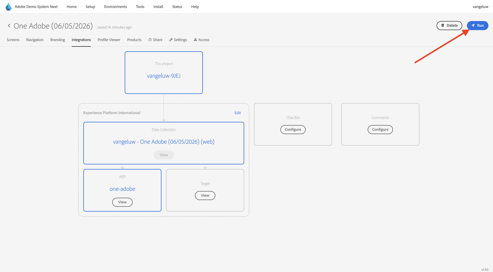

# De website gebruiken

## Optie 1: Doorgaan met vorige oefening

>[!NOTE]
>
>Als u het onderliggende scherm niet meer hebt geopend, gaat u naar optie 2.

Na de vorige oefening, had u dit resultaat. Klik om het **project van Telco van het Web** te openen dat voor u werd gecreeerd.

Dan zie je dit. Klik **Integraties**.

Op de **pagina van de Integraties**, moet u het bezit van de Inzameling van Gegevens selecteren dat in de vorige oefening werd gecreeerd. Om dat te doen, klik **Uitgezochte milieu**.

Klik **Uitgezocht** op het bezit van de Inzameling van Gegevens dat in de vorige stap werd gecreeerd, die `--aepUserLdap-- - Demo System (DD/MM/YYYY) (web)` wordt genoemd. Klik **sparen**.

Dan zie je dit. Klik **Looppas** om de demowebsite te openen.

Vervolgens wordt uw demowebsite geopend. Selecteer de URL en kopieer deze naar het klembord.

Open een nieuw Incognito-browservenster.

Plak de URL van uw demowebsite, die u in de vorige stap hebt gekopieerd. Vervolgens wordt u gevraagd u aan te melden met uw Adobe ID.

Selecteer uw accounttype en voltooi het aanmeldingsproces.

Uw website wordt vervolgens geladen in een Incognito-browservenster. Voor elke demonstratie, zult u een vers, incognito browser venster moeten gebruiken om uw demowebsite URL te laden.

## Optie 2: Beginnen met een nieuw Incognito-browservenster

Voor het geval u per ongeluk uw browser venster, of voor toekomstige zittingen had gesloten, kunt u tot uw websiteproject ook toegang hebben door [ https://dsn.adobe.com/ ](https://dsn.adobe.com/) te gaan. Nadat je je hebt aangemeld bij je Adobe ID, kun je dit zien. Klik de 3 punten **..** op uw websiteproject en klik dan **uitgeven**.

U kunt nu de onderstaande workflow volgen om toegang te krijgen tot de website. Klik **Integraties**.

Op de **pagina van de Integraties**, moet u het bezit van de Inzameling van Gegevens selecteren dat in de vorige oefening werd gecreeerd. Om dat te doen, klik **Uitgezochte milieu**.

Klik **Uitgezocht** op het bezit van de Inzameling van Gegevens dat in de vorige stap werd gecreeerd, die `--aepUserLdap - Demo System (DD/MM/YYYY) (web)` wordt genoemd.

Dan zie je dit. Klik **Looppas** om de demowebsite te openen.

Vervolgens wordt uw demowebsite geopend. Selecteer de URL en kopieer deze naar het klembord.

Open een nieuw Incognito-browservenster.

Plak de URL van uw demowebsite, die u in de vorige stap hebt gekopieerd. Vervolgens wordt u gevraagd u aan te melden met uw Adobe ID.

Selecteer uw accounttype en voltooi het aanmeldingsproces.

Uw website wordt vervolgens geladen in een Incognito-browservenster. Voor elke demonstratie, zult u een vers, incognito browser venster moeten gebruiken om uw demowebsite URL te laden.

Volgende Stap: [ gebruik mobiele app ](./ex5.md)

[Terug naar Aan de slag](./getting-started.md)

[Terug naar alle modules](./../../../overview.md)
