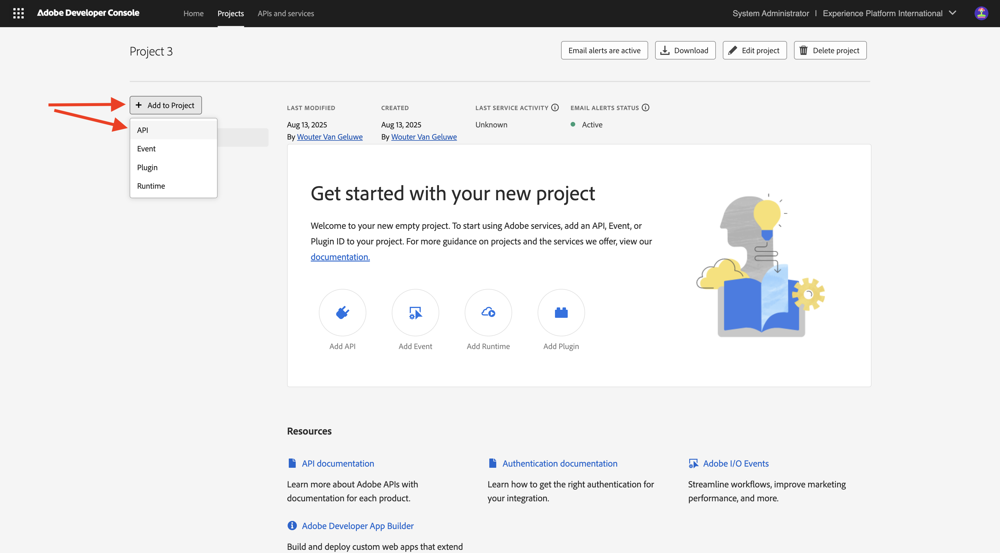
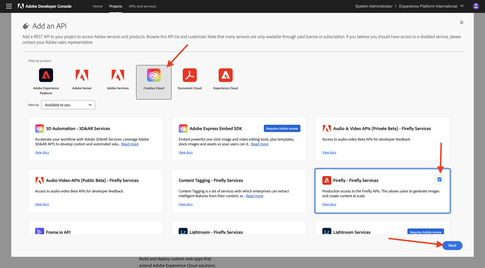
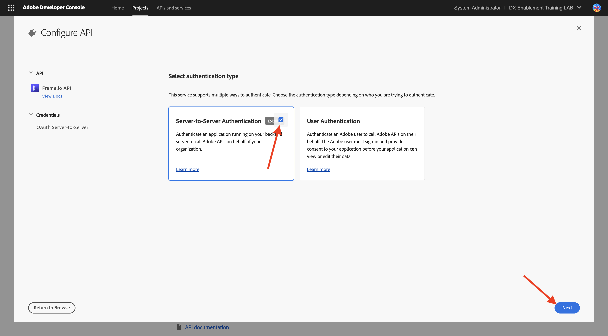

# Uw Adobe I/O-project configureren

## Video

In deze video krijgt u een uitleg en demonstratie van alle stappen die bij deze oefening betrokken zijn.

>[!VIDEO](https://video.tv.adobe.com/v/3476494?quality=12&learn=on)

## Adobe I/O-project maken

In deze oefening, wordt Adobe I/O gebruikt om diverse eindpunten van Adobe te vragen. Voer de volgende stappen uit om Adobe I/O in te stellen.

Ga naar [ https://developer.adobe.com/console/home ](https://developer.adobe.com/console/home){target="_blank"}.

Selecteer de juiste instantie in de rechterbovenhoek van het scherm. Uw instantie is `--aepImsOrgName--` .

>[!NOTE]
>
> In de onderstaande schermafbeelding ziet u een specifieke org die wordt geselecteerd. Wanneer u door dit leerprogramma gaat, is het zeer waarschijnlijk dat uw org een verschillende naam heeft. Wanneer u zich hebt aangemeld voor deze zelfstudie, hebt u de te gebruiken omgevingsdetails ontvangen. Volg deze instructies.

Daarna, uitgezochte **creeer nieuw project**.

### FIREFLY SERVICES API

>[!IMPORTANT]
>
>Afhankelijk van het leerpad dat u hebt geselecteerd, hebt u mogelijk geen toegang tot de Firefly Services API. U zult slechts toegang tot Firefly Services API hebben als u op de het leren weg **Firefly** bent, **de Fusie van Workfront**, **ALLES**, of wanneer u a **levende in-persoonworkshop** bijwoont. U kunt deze stap overslaan als u zich niet op een van deze leerpaden bevindt.

Dan moet je dit zien. Selecteer **+ toevoegen aan Project** en kies **API**.

Selecteer **Adobe Firefly Services** en kies **Firefly - Firefly Services**, dan selecteer **daarna**.

Verstrek een naam voor uw referentie: `--aepUserLdap-- - One Adobe OAuth credential` en selecteer **daarna**.

Selecteer de standaardprofiel **StandaardConfiguratie van Firefly Services** en selecteer **sparen Gevormde API**.

Dan moet je dit zien.

### PHOTOSHOP SERVICES API

>[!IMPORTANT]
>
>Afhankelijk van het leerpad dat u hebt geselecteerd, hebt u mogelijk geen toegang tot de Photoshop Services API. U zult slechts toegang tot Photoshop Services API hebben als u op de het leren weg **Firefly** bent, **de Fusie van Workfront**, **ALLES**, of wanneer u a **levende in-persoonworkshop** bijwoont. U kunt deze stap overslaan als u zich niet op een van deze leerpaden bevindt.
>
Selecteer **+ toevoegen aan Project** en selecteer dan **API**.

Selecteer **Adobe Firefly Services** en kies **Photoshop - Firefly Services**. Selecteer **daarna**.

Selecteer **daarna**.

Vervolgens moet u een productprofiel selecteren dat definieert welke machtigingen beschikbaar zijn voor deze integratie.

Selecteer **de Configuratie van de StandaardFirefly Services** en **configuratie van de Diensten van de Automatisering van Creative Cloud**.

Selecteer **sparen gevormde API**.

Dan moet je dit zien.

### ADOBE EXPERIENCE PLATFORM API

>[!IMPORTANT]
>
>Afhankelijk van het leerpad dat u hebt geselecteerd, hebt u mogelijk geen toegang tot de Adobe Experience Platform API. U zult slechts toegang tot Adobe Experience Platform API hebben als u op de het leren weg **AEP + Apps** bent, **ALLES**, of wanneer u a **levende in-persoonworkshop** bijwoont. U kunt deze stap overslaan als u zich niet op een van deze leerpaden bevindt.

Selecteer **+ toevoegen aan Project** en selecteer dan **API**.

Selecteer **Platform van de Ervaring van Adobe** en kies **Experience Platform API**. Selecteer **daarna**.

Selecteer **daarna**.

Vervolgens moet u een productprofiel selecteren dat definieert welke machtigingen beschikbaar zijn voor deze integratie.

Selecteer **Adobe Experience Platform - Alle Gebruikers - PROD**.

>[!NOTE]
>
>De naam van het productprofiel voor AEP is afhankelijk van de configuratie van de omgeving. Als u het bovengenoemde productprofiel niet ziet, kunt u een productprofiel hebben dat **Standaardproductie Al Toegang** wordt genoemd. Als u niet zeker bent welke u moet kiezen, vraagt u de beheerder van het AEP-systeem.

Selecteer **sparen gevormde API**.

Dan moet je dit zien.

### Frame.io-API

>[!IMPORTANT]
>
>Afhankelijk van het leerpad dat u hebt geselecteerd, hebt u mogelijk geen toegang tot Frame.io-API. U zult slechts toegang tot Frame.io API hebben als u op de het leren weg **Fusion van Workfront**, **ALLES** bent, of wanneer u a **levende in-persoonworkshop** bijwoont. U kunt deze stap overslaan als u zich niet op een van deze leerpaden bevindt.

Selecteer **+ toevoegen aan Project** en selecteer dan **API**.

Selecteer **Creative Cloud** en kies **Frame.io API**. Selecteer **daarna**.

Selecteer **Server-aan-Server Authentificatie** en klik dan **daarna**.

Selecteer **Server-aan-Server** en klik dan **daarna**.

Vervolgens moet u een productprofiel selecteren dat definieert welke machtigingen beschikbaar zijn voor deze integratie.

Selecteer **StandaardOnderneming Frame.io - de Configuratie van Prime** en klik **sparen gevormde API**.

Dan moet je dit zien.

### Projectnaam

Klik op de projectnaam.

{zoomable="yes"}

Selecteer **uitgeven Project**.

{zoomable="yes"}

Ga een vriendschappelijke naam voor uw integratie in: `--aepUserLdap-- One Adobe tutorial` en selecteer **sparen**.

{zoomable="yes"}

De installatie van uw Adobe I/O-project is nu voltooid.

{zoomable="yes"}

## Volgende stappen

Ga naar [ Optie 1: Opstelling van Postman ](./ex7.md){target="_blank"}

Ga naar [ Optie 2: Opstelling PostBuster ](./ex8.md){target="_blank"}

Ga terug naar [ Begonnen het worden ](./getting-started.md){target="_blank"}

Ga terug naar [ Alle modules ](./../../../overview.md){target="_blank"}
