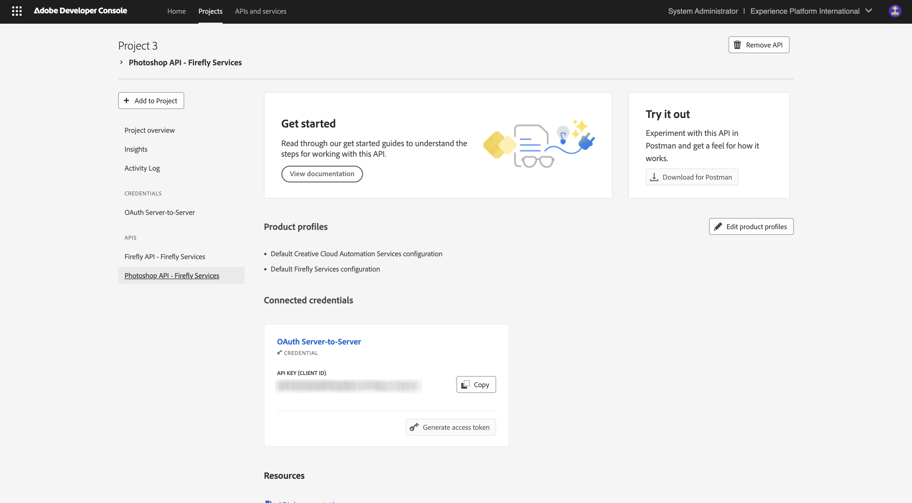

# Uw Adobe I/O-project configureren

## Adobe I/O-project maken

In deze oefening, wordt Adobe I/O gebruikt om diverse eindpunten van Adobe te vragen. Voer de volgende stappen uit om Adobe I/O in te stellen.

Ga naar [ https://developer.adobe.com/console/home ](https://developer.adobe.com/console/home) {target="_blank"}.

{zoomable="yes"}

Selecteer de juiste instantie in de rechterbovenhoek van het scherm. Uw instantie is `--aepImsOrgName--` .
Daarna, uitgezochte **creeer nieuw project**.

{zoomable="yes"}

### Firefly Services-API

Dan moet je dit zien. Selecteer **+ toevoegen aan Project** en kies **API**.

{zoomable="yes"}

Het scherm moet er zo uitzien.

{zoomable="yes"}

Selecteer **Creative Cloud** en kies **Firefly - de Diensten van Firefly**, dan selecteren **daarna**.

{zoomable="yes"}

Verstrek een naam voor uw referentie: `--aepUserLdap-- - One Adobe OAuth credential` en selecteer **daarna**.

{zoomable="yes"}

Selecteer de standaardprofiel **StandaardConfiguratie van de Diensten van Firefly** en selecteer **sparen Gevormde API**.

{zoomable="yes"}

Dan moet je dit zien.

{zoomable="yes"}

### PHOTOSHOP SERVICES API

Selecteer **+ toevoegen aan Project** en selecteer dan **API**.

{zoomable="yes"}

Selecteer **Creative Cloud** en kies **Photoshop - de Diensten van Firefly**. Selecteer **daarna**.

{zoomable="yes"}

Selecteer **daarna**.

{zoomable="yes"}

Vervolgens moet u een productprofiel selecteren dat definieert welke machtigingen beschikbaar zijn voor deze integratie.

Selecteer {de Configuratie van de Diensten van standaardFirefly 1} en **configuratie van de Diensten van de Automatisering van standaardCreative Cloud**.****

Selecteer **sparen gevormde API**.

{zoomable="yes"}

Dan moet je dit zien.

{zoomable="yes"}

### ADOBE EXPERIENCE PLATFORM API

Selecteer **+ toevoegen aan Project** en selecteer dan **API**.

{zoomable="yes"}

Selecteer **Platform van de Ervaring van Adobe** en kies **Experience Platform API**. Selecteer **daarna**.

{zoomable="yes"}

Selecteer **daarna**.

{zoomable="yes"}

Vervolgens moet u een productprofiel selecteren dat definieert welke machtigingen beschikbaar zijn voor deze integratie.

Selecteer **Adobe Experience Platform - Alle Gebruikers - PROD**.

Selecteer **sparen gevormde API**.

{zoomable="yes"}

Dan moet je dit zien.

{zoomable="yes"}

### Projectnaam

Klik op de projectnaam.

{zoomable="yes"}

Selecteer **uitgeven Project**.

{zoomable="yes"}

Ga een vriendschappelijke naam voor uw integratie in: `--aepUserLdap-- One Adobe tutorial` en selecteer **sparen**.

{zoomable="yes"}

De installatie van uw Adobe I/O-project is nu voltooid.

{zoomable="yes"}

## Volgende stappen

Ga naar [ Optie 1: Opstelling van Postman ](./ex7.md){target="_blank"}

Ga naar [ Optie 2: Opstelling PostBuster ](./ex8.md){target="_blank"}

Ga terug naar [ Begonnen het worden ](./getting-started.md){target="_blank"}

Ga terug naar [ Alle modules ](./../../../overview.md){target="_blank"}