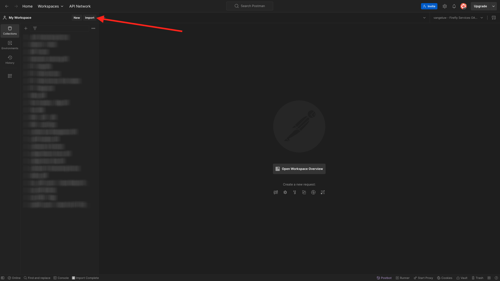

# Optie 1: Postman gebruiken

>[!IMPORTANT]
>
>Als u een werknemer van Adobe bent, volg de instructies aan [ installeer PostBuster ](./ex8.md){target="_blank"}!

## Postman-omgeving downloaden

Ga naar [ https://developer.adobe.com/console/home ](https://developer.adobe.com/console/home){target="_blank"} en open uw project.

{zoomable="yes"}

Klik **Firefly - Firefly Services** API. Dan, klik **Download voor Postman** en kies **Server-aan-Server** om een milieu van Postman te downloaden.

{zoomable="yes"}

## Postman-verificatie naar Adobe I/O

De download en installeert de relevante versie van Postman voor uw OS bij [ Downloads van Postman ](https://www.postman.com/downloads/){target="_blank"}.

{zoomable="yes"}

Start de toepassing.

In Postman zijn er twee concepten: omgevingen en verzamelingen.

Het omgevingsbestand bevat al uw omgevingsvariabelen die min of meer consistent zijn. In het milieu, zult u dingen zoals IMSOrg van uw milieu van Adobe, naast veiligheidsgeloofsbrieven zoals uw identiteitskaart van de Cliënt en anderen vinden. U hebt het omgevingsbestand tijdens de Adobe I/O-installatie eerder gedownload en de naam is **`oauth_server_to_server.postman_environment.json`** .

De verzameling bevat een aantal API-aanvragen die u kunt gebruiken. We gebruiken twee verzamelingen

- 1 Verzameling voor verificatie naar Adobe I/O
- 1 Verzameling voor de oefeningen in deze module

Download [ postman-ff.zip ](./../../../assets/postman/postman-ff.zip){target="_blank"} aan uw lokale Desktop.

{zoomable="yes"}

In **postman-ff.zip** dossier zijn de volgende dossiers:

- `Adobe IO - OAuth.postman_collection.json`
- `FF - Firefly Services Tech Insiders.postman_collection.json`

Unzip **postman-ff.zip** en sla de volgende 2 dossiers in een omslag op uw Desktop op:

- `Adobe IO - OAuth.postman_collection.json`
- `FF - Firefly Services Tech Insiders.postman_collection.json`
- `oauth_server_to_server.postman_environment.json`

{zoomable="yes"}

In Postman, uitgezochte **Invoer**.

{zoomable="yes"}

Selecteer **Dossiers**.

{zoomable="yes"}

Kies de drie dossiers van de omslag, dan selecteren **Open** en **Invoer**.

{zoomable="yes"}

{zoomable="yes"}

Nu hebt u alles wat u nodig hebt in Postman om te beginnen met Firefly Services via de API&#39;s.

## Een toegangstoken aanvragen

Daarna, om ervoor te zorgen u behoorlijk voor authentiek wordt verklaard, moet u om een toegangstoken verzoeken.

Zorg ervoor dat u het juiste milieu hebt geselecteerd alvorens om het even welk verzoek uit te voeren door milieu-dropdown lijst in de hoogste juiste hoek te verifiëren. De geselecteerde omgeving moet een naam hebben die vergelijkbaar is met deze, `--aepUserLdap-- One Adobe OAuth Credential` .

{zoomable="yes"}

De geselecteerde omgeving moet een naam hebben die vergelijkbaar is met deze, `--aepUserLdap-- One Adobe OAuth Credential` .

{zoomable="yes"}

Nu uw Postman-omgeving en -verzamelingen zijn geconfigureerd en werken, kunt u verificatie uitvoeren van Postman naar Adobe I/O.

In **Adobe IO - OAuth** inzameling, selecteer het verzoek genoemd **POST - krijg het Token van de Toegang** en selecteer **verzend**.

Bericht onder **de Params van de Vraag**, worden twee variabelen van verwijzingen voorzien, `API_KEY` en `CLIENT_SECRET`. Deze variabelen zijn afkomstig uit de geselecteerde omgeving, `--aepUserLdap-- One Adobe OAuth Credential` .

{zoomable="yes"}

Als succesvol, een reactie die een dragerteken, een toegangstoken, en een vervalsingsvenster bevat verschijnt in de **sectie van het Lichaam** &lbrace;van Postman.

{zoomable="yes"}

U zou een gelijkaardige reactie moeten zien die de volgende informatie bevat:

| Sleutel | Waarde |
|:-------------:| :---------------:| 
| token_type | **drager** |
| access_token | **eyJhbGciOiJSUz...** |
| verloopt_in | **86399** |

Adobe I/O **drager-teken** heeft een specifieke waarde (zeer lange access_token) en een vervalvenster en is nu geldig voor 24 uren. Dit betekent dat als u Postman na 24 uur wilt gebruiken voor interactie met Adobe API&#39;s, u een nieuw token moet genereren door dit verzoek opnieuw uit te voeren.

Uw Postman-omgeving is nu ingesteld en werkt.

## Volgende stappen

Ga naar [ Toepassingen om ](./ex9.md){target="_blank"} te installeren

Ga terug naar [ Begonnen het worden ](./getting-started.md){target="_blank"}

Ga terug naar [ Alle modules ](./../../../overview.md){target="_blank"}
