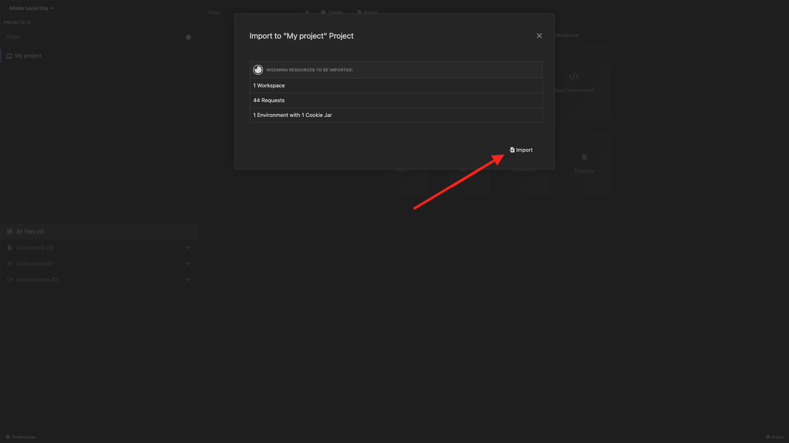

# Optie 2: PostBuster instellen

>[!IMPORTANT]
>
>Als u geen werknemer van Adobe bent, volg de instructies om Postman ](./ex7.md){target="_blank"} te installeren 0}. [ De onderstaande instructies zijn alleen bedoeld voor werknemers van Adobe.

## PostBuster installeren

Ga naar [ https://adobe.service-now.com/esc?id=adb_esc_kb_article&amp;sysparm_article=KB0020542 ](https://adobe.service-now.com/esc?id=adb_esc_kb_article&amp;sysparm_article=KB0020542){target="_blank"}.

Klik om de recentste versie van **PostBuster** te downloaden.


Download de juiste versie voor uw besturingssysteem.


Open PostBuster nadat het downloaden is voltooid en geïnstalleerd. Dan moet je dit zien. Klik **Invoer**.


De download [ postbuster.json.zip ](./../../../assets/postman/postbuster.json.zip){target="_blank"} en haalt het op uw Desktop uit.


Klik **kiezen een Dossier**.


Selecteer het dossier **postbuster.json**. Klik **Open**.


Dan moet je dit zien. Klik **Scannen**.


Klik **Invoer**.



Dan moet je dit zien. Klik om de geïmporteerde verzameling te openen.


Nu zie je je collectie. U moet nog een milieu vormen om sommige omgevingsvariabelen te houden.


Klik **Milieu van de Basis** en klik dan **uitgeven** pictogram.


Dan moet je dit zien.


Kopieer hieronder milieu placeholder en kleef het in het **Milieu van de Basis**.

```json
{
	"CLIENT_SECRET": "",
	"API_KEY": "",
	"ACCESS_TOKEN": "",
	"SCOPES": [
		"openid",
		"AdobeID",
		"read_organizations", 
		"additional_info.projectedProductContext", 
		"session",
		"ff_apis",
		"firefly_api"
	],
	"TECHNICAL_ACCOUNT_ID": "",
	"IMS": "ims-na1.adobelogin.com",
	"IMS_ORG": "",
	"access_token": "",
	"IMS_TOKEN": "",
	"AZURE_STORAGE_URL": "",
	"AZURE_STORAGE_CONTAINER": "",
	"AZURE_STORAGE_SAS_READ": "",
	"AZURE_STORAGE_SAS_WRITE": ""
}
```

Dan moet je dit hebben.


## Adobe I/O-variabelen invoeren

Ga naar [ https://developer.adobe.com/console/home ](https://developer.adobe.com/console/home){target="_blank"} en open uw project.

{zoomable="yes"}

Ga naar **Server-aan-Server**.

{zoomable="yes"}

U moet nu de volgende waarden van uw Adobe I/O-project kopiëren en deze in uw PostBuster Base-omgeving plakken.

- Client-id
- Het Geheime cliënt (klik **verkrijgt Geheime Cliënt**)
- Technisch account-id
- Organisatie-id (schuif omlaag om uw organisatie-id te zoeken)

{zoomable="yes"}

Kopieer de bovengenoemde variabelen één voor één, en kleef hen in uw **Milieu van de Basis** in PostBuster.

| Naam variabele in Adobe I/O | Naam variabele in PostBuster Base-omgeving |
|:-------------:| :---------------:| 
| Client-id | `API_KEY` |
| Clientgeheim | `CLIENT_SECRET` |
| Technisch account-id | `TECHNICAL_ACCOUNT_ID` |
| Organisatie-ID | `IMS_ORG` |

Nadat u deze variabelen één voor één hebt gekopieerd, zou uw Milieu van de Basis van PostBuster als dit moeten kijken:

{zoomable="yes"}

In **Adobe IO - OAuth** inzameling, selecteer het verzoek genoemd **POST - krijg het Token van de Toegang** en selecteer **verzend**.

U zou een gelijkaardige reactie moeten zien die de volgende informatie bevat:

| Sleutel | Waarde |
|:-------------:| :---------------:| 
| token_type | **drager** |
| access_token | **eyJhbGciOiJS...** |
| verloopt_in | **86399** |

Adobe I/O **drager-teken** heeft een specifieke waarde (zeer lange access_token) en een vervalvenster en is nu geldig voor 24 uren. Dit betekent dat als u Postman na 24 uur wilt gebruiken voor interactie met Adobe API&#39;s, u een nieuw token moet genereren door dit verzoek opnieuw uit te voeren.

{zoomable="yes"}

Uw PostBuster-omgeving is nu ingesteld en werkt. U hebt nu de module Aan de slag voltooid.

## Volgende stappen

Ga naar [ Toepassingen om ](./ex9.md){target="_blank"} te installeren

Ga terug naar [ Begonnen het worden ](./getting-started.md){target="_blank"}

Ga terug naar [ Alle modules ](./../../../overview.md){target="_blank"}
