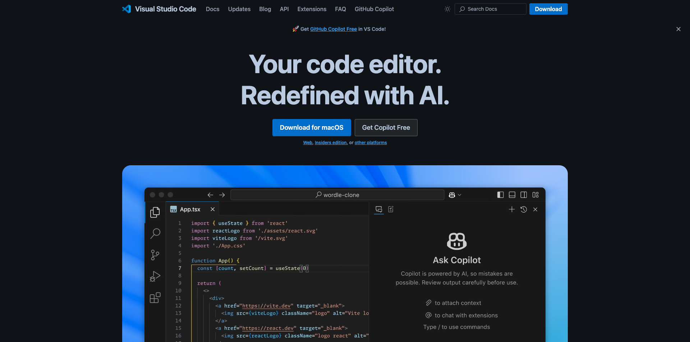

# Toepassingen om te installeren

Hieronder vindt u een overzicht van de toepassingen die u op uw computer moet hebben geïnstalleerd voordat u de zelfstudie start.

## Adobe Creative Cloud

Ga naar [ https://creativecloud.adobe.com/apps/download/creative-cloud ](https://creativecloud.adobe.com/apps/download/creative-cloud){target="_blank"}.

## Photoshop

Open **Adobe Creative Cloud** app, ga naar **Apps**. Installeer Photoshop op uw computer.

## Visual Studio-code

Ga naar [ https://code.visualstudio.com/ ](https://code.visualstudio.com/){target="_blank"}, download en installeer **Code van Visual Studio**.

## Teksteditor

Als u geen toepassing van de Redacteur van de Tekst hebt, kunt u naar [ https://www.sublimetext.com/ ](https://www.sublimetext.com/){target="_blank"} gaan en deze Redacteur van Tekst downloaden en installeren.

## GitHub-account

Als u nog geen rekening GitHub hebt, ga [ https://github.com/ ](https://github.com/){target="_blank"}, en klik **Teken omhoog**. Gebruik uw persoonlijke e-mailadres en maak uw account.

## GitHub Desktop

Ga naar [ https://desktop.github.com/download/ ](https://desktop.github.com/download/){target="_blank"}, download en installeer **Desktop van Github**.

## Azure Storage Explorer

[ Download Microsoft Azure Storage Explorer om uw dossiers ](https://azure.microsoft.com/en-us/products/storage/storage-explorer#Download-4){target="_blank"} te beheren. Selecteer de juiste versie voor uw specifieke besturingssysteem, download en installeer deze.

{zoomable="yes"}

U hebt nu de Aan de slag module gebeëindigd.

## Volgende stappen

Ga terug naar [ Begonnen het worden ](./getting-started.md){target="_blank"}

Ga terug naar [ Alle modules ](./../../../overview.md){target="_blank"}./images
