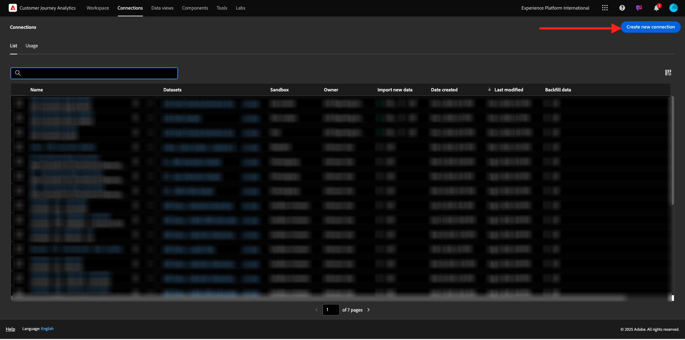
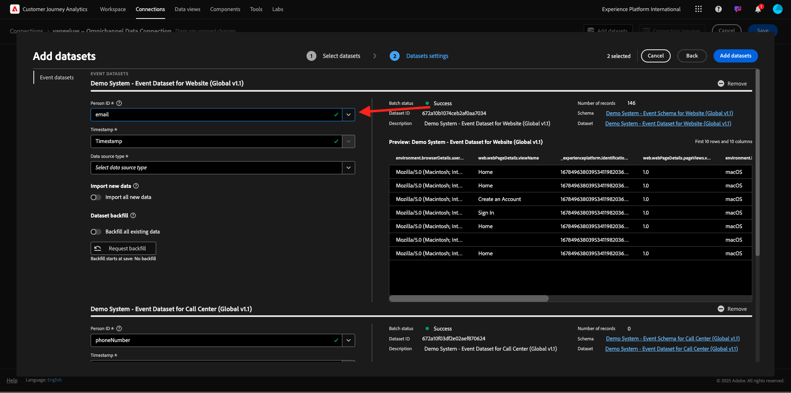

# 1.1.2 Connect Adobe Experience Platform-gegevenssets in Customer Journey Analytics

## Doelstellingen

- De interface voor gegevensverbinding begrijpen
- Adobe Experience Platform-gegevens in CJA plaatsen
- Persoon-id en gegevensstitching begrijpen
- Meer informatie over gegevensstreaming in Customer Journey Analytics

## 1.1.2.1 Verbinding

Ga naar [ analytics.adobe.com ](https://analytics.adobe.com) om tot Customer Journey Analytics toegang te hebben.

Op Customer Journey Analytics-homepage, ga naar **Verbindingen**.

Hier kunt u alle verschillende verbindingen zien die tussen CJA en Platform worden gemaakt. Deze verbindingen hebben hetzelfde doel als rapportsuites in Adobe Analytics. De gegevensverzameling is echter totaal anders. Alle gegevens komen uit de datasets van Adobe Experience Platform.

Laten we uw eerste verbinding maken. Klik **creëren nieuwe verbinding**.

U zult dan **&#x200B;**&#x200B;UI zien creëren Verbinding.

U kunt nu een naam aan uw verbinding geven.

Gebruik deze naamgevingsconventie: `--aepUserLdap-- – Omnichannel Data Connection` .

U moet ook de juiste sandbox selecteren om te gebruiken. Selecteer de sandbox in het menu van de sandbox, die `--aepSandboxName--` moet zijn. In dit voorbeeld, is de zandbak **de Instanties van de Tech**. U moet ook het **Gemiddelde aantal dagelijkse gebeurtenissen** aan **minder dan 1 miljoen** plaatsen.

Nadat u de sandbox hebt geselecteerd, kunt u beginnen met het toevoegen van gegevenssets. Klik **toevoegen datasets**.

## 1.1.2.2 Selecteer Adobe Experience Platform-gegevenssets

Zoek naar de dataset `Demo System - Event Dataset for Website (Global v1.1)`. Laat de doos voor deze dataset toe om het aan deze verbinding toe te voegen.

Blijf op hetzelfde scherm en zoek en schakel het selectievakje `Demo System - Event Dataset for Call Center (Global v1.1)` in.

Dan heb je dit. Klik **daarna**.

## 1.1.2.3 Persoon-id en gegevensopname

### Persoon-id

Het doel is nu om zich bij deze datasets aan te sluiten. Voor elke dataset u selecteerde, zult u een gebied genoemd **identiteitskaart van de Persoon** zien. Elke gegevensset heeft een eigen veld Person-id.

Zoals u kunt zien, hebben de meeste van hen automatisch geselecteerde identiteitskaart van de Persoon. Dit komt omdat er in elk schema in Adobe Experience Platform een primaire identiteit is geselecteerd. Hier ziet u bijvoorbeeld het schema voor `Demo System - Event Schema for Website (Global v1.1)` , waarin u kunt zien dat de primaire identiteit is ingesteld op `ecid` .

Nochtans, kunt u nog beïnvloeden welk herkenningsteken zal worden gebruikt om datasets voor uw verbinding samen te binden. U kunt om het even welke herkenningsteken gebruiken die in het schema verbonden aan uw dataset wordt gevormd. Klik op dropdown om IDs te onderzoeken beschikbaar op elke dataset.

Zoals vermeld, kunt u verschillende Persoon IDs voor elke dataset plaatsen. Dit staat u toe om verschillende datasets van veelvoudige oorsprong in CJA samen te brengen. Stel je voor dat we NPS-gegevens of enquêtegegevens invoeren die erg interessant en nuttig zouden zijn om de context te begrijpen en waarom er iets is gebeurd.

De naam van het veld Person-id is niet belangrijk, zolang de waarde in de velden Person-id overeenkomt. Stel dat er `email` in een gegevensset staat en `emailAddress` in een andere gegevensset die is gedefinieerd als Person ID. Als `delaigle@adobe.com` de zelfde waarde voor de persoon identiteitskaart-gebied op beide datasets is, zal CJA de gegevens kunnen verbinden.

Herzie Veelgestelde vragen CJA hier om de nuances met identiteit het stitching te begrijpen: [ Veelgestelde vragen ](https://experienceleague.adobe.com/docs/analytics-platform/using/cja-overview/cja-faq.html).

### De gegevens tikken met de persoon-id

Nu u het concept het stitching datasets gebruikend identiteitskaart van de Persoon begrijpt, kiezen `email` als uw Persoon identiteitskaart voor elke dataset.

Ga naar elke dataset om de Persoon identiteitskaart bij te werken. Vul nu het veld Persoon-id met de `email` in de vervolgkeuzelijst.

Zodra u de twee datasets hebt vastgezet, bent u bereid om verder te gaan.

| gegevensset | Persoon-id |
| ----------------- |-------------| 
| Demosysteem - Dataset voor gebeurtenissen voor website (Global v1.1) | email |
| Het Systeem van de manifestatie - de Dataset van de Gebeurtenis voor het Centrum van de Vraag (Globale v1.1) | email |

U moet er ook voor zorgen dat voor beide datasets, deze opties worden toegelaten:

- Alle nieuwe gegevens importeren
- Back-up maken van alle bestaande gegevens

(Vergeet niet om beide opties voor de tweede dataset toe te laten)

U moet ook het type van gegevensbron van a **&#x200B;**&#x200B;voor elke dataset selecteren.

Dit zijn de montages voor het dataset **Systeem van de Demo - de Dataset van de Gebeurtenis voor Website (Globale v1.1)**.

Dit zijn de montages voor het dataset **Systeem van de Demo - de Dataset van de Gebeurtenis voor Website (Globale v1.1)**.

Klik **toevoegen datasets**.

Klik **sparen** en ga naar de volgende oefening.

Na het creëren van uw **Verbinding** kan het een paar uren nemen alvorens uw gegevens in CJA beschikbaar zijn.

## Volgende stappen

Ga naar [ 1.1.3 leiden tot een Mening van Gegevens ](./ex3.md) (./ex2.md){target="_blank"}

Ga terug naar [ Customer Journey Analytics ](./customer-journey-analytics-build-a-dashboard.md){target="_blank"}

Ga terug naar [ Alle modules ](./../../../../overview.md){target="_blank"}
