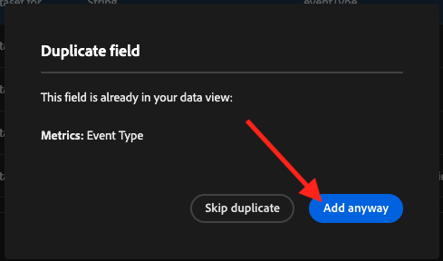
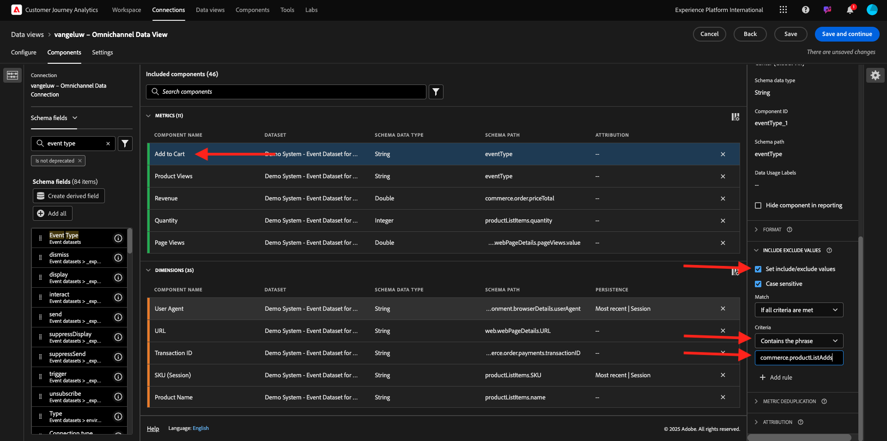
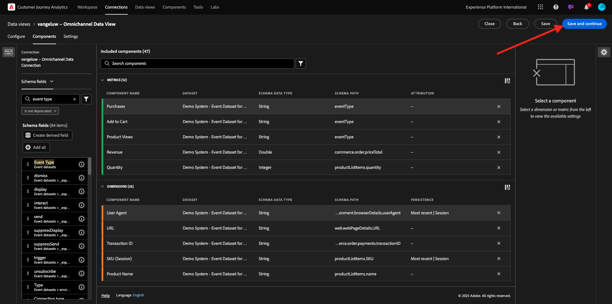

# 1.1.3 Een gegevensweergave maken

## Doelstellingen

- De interface voor gegevensweergave begrijpen
- De basisinstellingen van de definitie van een bezoek begrijpen
- Kenmerk en doorzettingsvermogen in een gegevensweergave begrijpen

## 1.1.3.1 Gegevensweergave

Als de verbinding tot stand is gebracht, kunt u nu de visualisatie beïnvloeden. Een verschil tussen Adobe Analytics en CJA is dat CJA een gegevensweergave nodig heeft om de gegevens vóór visualisatie te kunnen opschonen en voorbereiden.

Een mening van Gegevens is gelijkaardig aan het concept Virtuele Reeksen van het Rapport in Adobe Analytics, waar u context-bewuste bezoekendefinities bepaalt, filtrerend en ook, hoe de componenten worden geroepen.

U hebt minimaal één gegevensweergave per verbinding nodig. Nochtans, voor sommige gebruik-gevallen, is het groot om veelvoudige Mening van Gegevens voor de zelfde verbinding te hebben, met het doel om verschillende inzichten aan verschillende teams te geven.
Als u uw bedrijf gegevensgedreven wilt worden, zou u moeten aanpassen hoe de gegevens in elk team worden bekeken. Enkele voorbeelden:

- UX-meetgegevens alleen voor het UX-ontwerpteam
- Gebruik dezelfde namen voor KPI&#39;s en Metrics voor Google Analytics als voor Customer Journey Analytics, zodat het digitale analyseteam slechts één taal kan spreken.
- Gegevensweergave gefilterd om bijvoorbeeld gegevens weer te geven voor één markt, of voor één merk, of alleen voor mobiele apparaten.

Voor het **scherm van Verbindingen**, controleer checkbox voor de verbinding u enkel creeerde. Klik **creëren de Mening van Gegevens**.

U zult aan **worden opnieuw gericht creeer het werkschema van de Mening van Gegevens**.

## 1.1.3.2 Gegevensweergavedefinitie

U kunt de basisdefinities voor uw Mening van Gegevens nu vormen.

De **Verbinding** u in de vorige oefening creeerde is reeds geselecteerd. Uw verbinding heeft de naam `--aepUserLdap-- – Omnichannel Data Connection` .

Geef vervolgens in de gegevensweergave een naam die volgt op de naamgevingsconventie: `--aepUserLdap-- – Omnichannel Data View` .

Voer dezelfde waarde in voor de beschrijving: `--aepUserLdap-- – Omnichannel Data View` .

| Naam | Beschrijving | Externe id |
| ----------------- |-------------|-------------| 
| `--aepUserLdap-- – Omnichannel Data View` | `--aepUserLdap-- – Omnichannel Data View` | `--aepUserLdap--123` |

Voor de **Streek van de Tijd**, selecteer de timezone **Greenwich Mean Tijd; Monrovia, Casablanca [ GMT]**. Dit is een heel interessante situatie, aangezien sommige bedrijven in verschillende landen en geografische gebieden actief zijn. Door de juiste tijdzone voor elk land toe te wijzen, worden typische fouten in de gegevens vermeden, zoals bijvoorbeeld het vermoeden dat in Peru de meerderheid van de mensen om 16.00 uur T-shirts koopt.

U kunt ook de namen van de belangrijkste metriek wijzigen (Person, Sessie en Gebeurtenis). Dit is niet verplicht, maar sommige klanten gebruiken graag Personen, Bezoeken en Verzoeken in plaats van Personen, Sessie en Gebeurtenissen (standaardnaamgevingsconventie van Customer Journey Analytics).

De volgende instellingen moeten nu zijn geconfigureerd:

Klik **sparen en ga** verder.

Klik **sparen**.

## 1.1.3.3 Componenten voor gegevensweergave

In deze oefening, zult u de componenten vormen u de gegevens moet analyseren en het visualiseren gebruikend Analysis Workspace. In deze interface zijn er drie hoofdgebieden:

- Linkerkant: Beschikbare componenten uit de geselecteerde datasets
- Midden: componenten toegevoegd aan de gegevensweergave
- Rechterkant: Componentinstellingen

U moet nu de componenten slepen en laten vallen u voor de analyse aan de **Toegevoegde Componenten** nodig hebt. U doet dit door de componenten in het linkermenu te selecteren en ze naar het canvas in het midden te slepen.

Laten wij met de eerste component beginnen: **Naam (web.webPageDetails.name)**. Zoek naar deze component, dan belemmering en laat vallen het op het canvas.

Deze component is de paginanaam, aangezien u uit het lezen van het schemagebied `(web.webPageDetails.name)` kunt voortkomen.

Nochtans, gebruikend **Naam** als naam is niet de beste noemende overeenkomst voor een bedrijfsgebruiker om deze dimensie snel te begrijpen.

Laten wij de naam veranderen om **Naam van de Pagina** te zijn. Klik op de component en noem het op het **gebied van de Montages van de Component** anders.

Iets echt belangrijk is de **montages van de persistentie**. Het concept gebeurtenissen en prop bestaat niet in CJA maar de montages van de Persistentie maken een gelijkaardig gedrag mogelijk.

Als u deze montages niet verandert, zal CJA de dimensie als a **Prop** (klapniveau) interpreteren. Ook, kunnen wij Persistence veranderen om de dimensie tot **eVar** (voorhoud de waarde over de reis) te maken.

Als u niet vertrouwd met eVars en Props bent, kunt u [&#x200B; meer over hen in de documentatie &#x200B;](https://experienceleague.adobe.com/docs/analytics/landing/an-key-concepts.html?lang=nl-NL) lezen.

Laten we de paginanaam als een pop-up opgeven. Als dusdanig, te hoeven u om het even welke **Persistence Montages** niet te veranderen.

| Componentnaam die u wilt zoeken | Nieuwe naam | Persistinstellingen |
| ----------------- |-------------| --------------------| 
| Naam (web.webPageDetails.name) | Paginanaam |          |

Daarna, kies de afmeting **phoneNumber** en laat vallen het op het canvas. De nieuwe naam zou **Aantal van de Telefoon** moeten zijn.

Tot slot veranderen wij de montages van de Persistentie, aangezien het Mobiele Aantal op gebruikersniveau zou moeten voortbestaan.

Om persistentie te veranderen, scrol neer in het juiste menu en open **persistentie** tabel:

Schakel het selectievakje in om de instellingen voor persistentie te wijzigen. Selecteer **Recentste Recentste** en het **Persoon (Meldend venster)** werkingsgebied, aangezien wij slechts om het laatste mobiele aantal van die persoon geven. Als de klant de mobiele telefoon niet invult bij toekomstige bezoeken, ziet u deze waarde nog steeds gevuld.

| Componentnaam die u wilt zoeken | Nieuwe naam | Persistinstellingen |
| ----------------- |-------------| --------------------| 
| phoneNumber | Telefoonnummer | Recentste, Persoon die Venster meldt |

De volgende component is `web.webPageDetails.pageViews.value` .

Zoek in het linkerzijmenu naar `web.webPageDetails.pageViews.value` . Sleep deze metrische waarde naar het canvas.

Verander de naam om **de Meningen van de Pagina** onder de **montages van de Component** te zijn.

| Componentnaam die u wilt zoeken | Nieuwe naam | Attributie-instellingen |
| ----------------- |-------------| --------------------| 
| web.webPageDetails.pageViews.value | Paginaweergaven |         |

Voor de attributie-instellingen hoeft u niets te wijzigen.

Opmerking: Persistentie-instellingen voor metriek kunnen ook worden gewijzigd in Analysis Workspace. In sommige gevallen kunt u het hier instellen om te voorkomen dat zakelijke gebruikers hoeven te bedenken wat het beste persistentiemodel is.

Daarna, zult u veel Dimensies en Metriek moeten vormen, zoals die in de hieronder lijst wordt vermeld.

### AFMETINGEN

| Componentnaam die u wilt zoeken | Nieuwe naam | Persistinstellingen |
| ----------------- |-------------| --------------------| 
| brandName | Merknaam | Recentste versie, sessie |
| beluisteren | Aanroepfunctie |          |
| call-id | Type oproepinteractie |          |
| callTopic | Het Onderwerp van de vraag | Recentste versie, sessie |
| ecid | ECID | Recentste, Persoon die Venster meldt |
| email | E-mailid | Recentste, Persoon die Venster meldt |
| Betalingstype | Betalingstype |          |
| Product toevoegen, methode | Product toevoegen, methode | Recentste versie, sessie |
| Type gebeurtenis | Type gebeurtenis |         |
| Naam (productListItems.name) | Productnaam |         |
| SKU | SKU (sessie) | Recentste versie, sessie |
| Transactie-id | Transactie-id |         |
| URL (web.webPageDetails.URL) | URL |         |
| Gebruikersagent | Gebruikersagent | Recentste versie, sessie |

### METRISCHE

| Componentnaam die u wilt zoeken | Nieuwe naam | Attributie-instellingen |
| ----------------- |-------------| --------------------| 
| Aantal | Aantal |          |
| commerce.order.priceTotal | Ontvangsten |         |

Uw configuratie zou dan als dit moeten kijken. Vergeet niet **&#x200B;**&#x200B;te bewaren uw Mening van Gegevens. Zo klik **sparen** nu.

## 1.1.3.4 Berekende cijfers

Hoewel u alle componenten in de Mening van Gegevens hebt georganiseerd, moet u nog enkele hen aanpassen, zodat de bedrijfsgebruikers bereid zijn om hun analyse te beginnen.

Als je je herinnert, heb je niet specifiek Metriek zoals &#39;Toevoegen aan winkelwagentje&#39;, &#39;Productweergave&#39; of &#39;Aankopen&#39; opgenomen in de gegevensweergave.
Nochtans, hebt u een geroepen afmeting: **Type van Gebeurtenis**. U kunt deze interactietypen dus afleiden door 3 berekende metriek te maken.

Laten wij met eerste Metrisch beginnen: **de Kijken van het Product**.

Voor de linkerkant, gelieve **Type van Gebeurtenis** te zoeken en de afmeting te selecteren. Dan belemmering en laat vallen binnen het **Included Componenten** canvas.
Klik om het nieuwe metrische **Type van Gebeurtenis** te selecteren.

Wijzig nu de naam en beschrijving van de component in de volgende waarden:

| Componentnaam | Componentbeschrijving |
| ----------------- |-------------| 
| Productweergaven | Productweergaven |

Nu laat slechts **gebeurtenissen tellen van de Meningen van het 0&rbrace; Product.** Om dat te doen, scrol neer op de **Montages van de Component** tot u **omvat Exclude Waarden** ziet. Zorg ervoor om de optie toe te laten **plaats omvat/sluit waarden** uit.

Aangezien u slechts **Weergaven van het Product** wilt tellen, gelieve **commerce.productViews** onder de criteria te specificeren.

Uw berekende metrisch is nu klaar!

Daarna, herhaal het zelfde proces voor **toevoegt aan de gebeurtenissen van de Kar** en **Koop**.

### Toevoegen aan winkelwagentje

Eerste belemmering en laat vallen het zelfde afmeting **Type van Gebeurtenis**.

Er verschijnt een pop-upwaarschuwing voor een gedupliceerd veld terwijl we dezelfde variabele gebruiken. Gelieve te klikken op **hoe dan ook toevoegen**:

Volg nu hetzelfde proces als voor de metrische productweergaven:
- Wijzig eerst de naam en beschrijving.
- Tot slot voeg **commerce.productListAdds** als criteria toe om slechts te tellen toevoegt aan Kaart

| Naam | Beschrijving | Criteria |
| ----------------- |-------------| -------------|
| Toevoegen aan winkelwagentje | Toevoegen aan winkelwagentje | commerce.productListAdds |

### Aankopen

Eerste belemmering en laat vallen het zelfde afmetingstype **van de Gebeurtenis** zoals wij voor beide vorige metriek deden.

Er verschijnt een pop-upwaarschuwing voor een gedupliceerd veld terwijl we dezelfde variabele gebruiken. Gelieve te klikken op **hoe dan ook toevoegen**:

Volg nu hetzelfde proces als voor de metrieke productweergaven en Toevoegen aan winkelwagentje:
- Wijzig eerst de naam en beschrijving.
- Tot slot voeg **commerce.purchase** als criteria toe om slechts toe te tellen toevoegt aan Havens

| Naam | Beschrijving | Criteria |
| ----------------- |-------------| -------------|
| Aankopen | Aankopen | commerce.purchases |

Uw definitieve configuratie zou dan gelijkaardig aan dit moeten kijken. Klik **sparen en ga** verder.

## 1.1.3.5 Instellingen voor gegevensweergave

U moet naar dit scherm worden omgeleid:

Op dit tabblad kunt u enkele belangrijke instellingen wijzigen om de manier te wijzigen waarop gegevens worden verwerkt. Laat beginnen door de **Onderbreking van de Zitting** aan 30 min te plaatsen. Dankzij de tijdstempel van elke ervaringsgebeurtenis kunt u het concept van een sessie op alle kanalen uitbreiden. Bijvoorbeeld, wat gebeurt als een klant het vraag-centrum na het bezoeken van de website roept? Wanneer u aangepaste sessietime-outs gebruikt, hebt u veel flexibiliteit om te bepalen wat een sessie is en hoe die sessie gegevens samenvoegt.

Op dit lusje kunt u andere dingen wijzigen zoals het filtreren van de gegevens door een segment/filter te gebruiken. Dat hoef je in deze oefening niet te doen.

Zodra u wordt gedaan, te klikken gelieve **sparen en te beëindigen**.

>[!NOTE]
>
>U kunt later terugkeren naar deze gegevensweergave en op elk gewenst moment instellingen en componenten wijzigen. Wijzigingen zijn van invloed op de manier waarop historische gegevens worden weergegeven.

U kunt nu doorgaan met het gedeelte visualisatie en analyse!

## Volgende stappen

Ga naar [&#x200B; 1.1.4 Voorbereiding van Gegevens in Customer Journey Analytics &#x200B;](./ex4.md) (./ex2.md){target="_blank"}

Ga terug naar [&#x200B; Customer Journey Analytics &#x200B;](./customer-journey-analytics-build-a-dashboard.md){target="_blank"}

Ga terug naar [&#x200B; Alle modules &#x200B;](./../../../../overview.md){target="_blank"}
