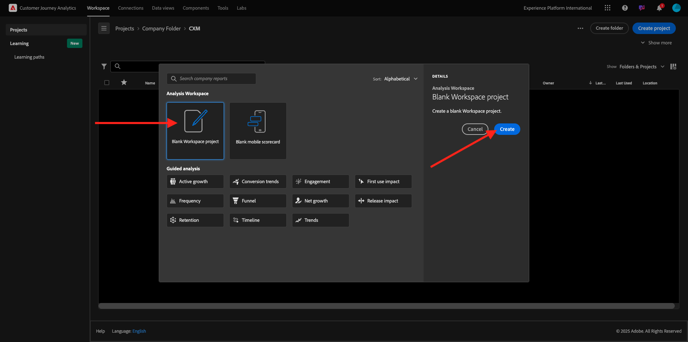
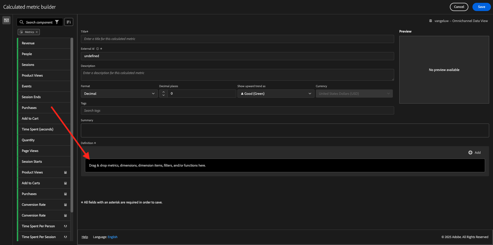
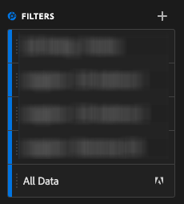

# 1.1.4 Gegevensvoorbereiding in Analysis Workspace

## Doelstellingen

- De gebruikersinterface van Analysis Workspace in CJA begrijpen
- Begrijp de concepten van gegevensvoorbereiding in Analysis Workspace
- Leer hoe u gegevensberekeningen uitvoert

## 1.1.4.1 Analysis Workspace-gebruikersinterface in CJA

Analysis Workspace verwijdert alle typische beperkingen van één Analytics-rapport. Het verstrekt een robuust, flexibel canvas voor de bouw van projecten van de douaneanalyse. Sleep een willekeurig aantal gegevenstabellen, visualisaties en componenten (afmetingen, Metriek, segmenten en tijdgranulariteit) naar een project. Creëer meteen onderverdelingen en segmenten, creeer cohorts voor analyse, creeer alarm, vergelijk segmenten, stroom en reserveanalyse, en curate en planningsrapporten voor het delen met iedereen in uw zaken.

Customer Journey Analytics plaatst deze oplossing boven op de gegevens van het Platform. We raden u aan deze overzichtsvideo van vier minuten te bekijken:

>[!VIDEO](https://video.tv.adobe.com/v/35109?quality=12&learn=on)

Als u Analysis Workspace nog niet eerder hebt gebruikt, raden we u aan deze video te bekijken:

>[!VIDEO](https://video.tv.adobe.com/v/26266?quality=12&learn=on)

### Uw project maken

Nu is het tijd om uw eerste CJA-werkruimte te maken. Ga naar het **Workspace** lusje binnen van CJA.
Klik **tot project** leiden.

Dan zie je dit. Selecteer **Leeg project van Workspace** en klik dan **creeer**.

Dan zie je een leeg project.

Selecteer eerst de juiste gegevensweergave in de rechterbovenhoek van het scherm. De gegevensweergave die moet worden geselecteerd, is `--aepUserLdap-- - Omnichannel Data View` .

Vervolgens slaat u uw project op en geeft u het een naam. U kunt de volgende opdracht gebruiken om op te slaan:

| OS | Korte snede |
| ----------------- |-------------| 
| Windows | Control + S |
| Mac | Command + S |

U ziet deze pop-up:

Gebruik deze naamgevingsconventie:

| Naam | Beschrijving |
| ----------------- |-------------| 
| `--aepUserLdap-- - Omnichannel Analysis` | `--aepUserLdap-- - Omnichannel Analysis` |

Daarna, klik **sparen**.

## 1.1.4.2 Berekende cijfers

Hoewel wij alle componenten in de Mening van Gegevens hebben georganiseerd, moet u nog enkele hen aanpassen, zodat de bedrijfsgebruikers bereid zijn om hun analyse te beginnen. Ook, tijdens om het even welke analyse kunt u berekende metrisch tot stand brengen om dieper op de inzichten het vinden te gaan.

Als voorbeeld zullen wij tot een berekend **Tarief van de Omzetting** gebruikend de **Aankopen** metrisch/gebeurtenis leiden wij op de Mening van Gegevens bepaald.

### Conversiesnelheid

Laten we beginnen met het openen van de berekende metrische builder. Klik op **+** om uw eerste Berekende Metrisch in Analysis Workspace tot stand te brengen.

**Berekende Metrische Bouwer** zal omhoog verschijnen:

Vind de **Aankopen** in de lijst van Metriek in het linkerzijmenu. Onder **Metriek** klik **tonen allen**

Nu sleep en laat vallen de **Steekproeven** binnen aan de berekende metrische definitie.

Typisch, betekent de omzettingspercentage **Conversies/Sessies**. Laten we dezelfde berekening uitvoeren in het berekende metrische definitiekanvas. Vind de **metrische Zittingen** en sleep en laat vallen het in de definitiebouwer, onder de **Aankopen** gebeurtenis.

De operator voor delen wordt automatisch geselecteerd.

De omrekeningskoers wordt gewoonlijk uitgedrukt in een percentage. Dus, veranderen wij het formaat om percentage te worden en ook 2 decimalen selecteren.

Ten slotte wijzigt u de naam en beschrijving van de berekende metrische waarde:

| Titel | Beschrijving | Externe id |
| ----------------- |-------------| -------------| 
| Conversiesnelheid | Conversiesnelheid | conversionRate |

Dan heb je dit. Klik **sparen**.

Klik **sparen** opnieuw.

## 1.1.4.3 Berekende afmetingen: filters (segmentatie) en datumbereiken

### Filters: berekende afmetingen

Berekeningen zijn niet alleen bedoeld voor Metriek. Alvorens om het even welke analyse te beginnen is het ook interessant om sommige **Berekende Dimensies** tot stand te brengen. Dit betekende eigenlijk **segmenten** terug in Adobe Analytics. In Customer Journey Analytics, worden deze segmenten genoemd **Filters**.

Het creëren van filters zal bedrijfs gebruikers helpen om de analyse met sommige waardevolle berekende afmetingen te beginnen. Dit zal sommige taken automatiseren evenals aan het adoptiedeel helpen. Hier volgen enkele voorbeelden:

1. Eigen media, betaalde media,
2. Nieuwe of terugkerende bezoeken
3. Klanten met Verlaten winkelwagen

Deze filters kunnen voor of tijdens het analysegedeelte worden gemaakt (dat u in de volgende oefening zult doen).

### Datumbereik: berekende tijdafmetingen

Tijdafmetingen zijn een ander type berekende afmetingen. Sommige zijn reeds tot stand gebracht, maar u hebt ook de capaciteit om uw eigen Dimensies van de Douane bij de fase van de gegevensvoorbereiding tot stand te brengen.

Deze berekende afmetingen van de Tijd zullen wij analisten en bedrijfsgebruikers helpen om belangrijke data te herinneren en hen te gebruiken om de rapporttijd te filtreren en te veranderen. Typische vragen en twijfels die ons bij analyses opkomen:

- Wanneer was Zwarte Vrijdag vorig jaar? 21e-29e?
- Wanneer hebben we die tv-campagne in december gevoerd?
- Van wanneer tot wanneer deden we de zomerverkoop van 2018? Ik wil het vergelijken met 2019. Weet je trouwens de exacte dagen in 2019?

U hebt nu de gegevensvoorbereidingsoefening met CJA Analysis Workspace voltooid.

## Volgende stappen

Ga naar [ 1.1.5 Visualisatie gebruikend Customer Journey Analytics ](./ex5.md) (./ex2.md){target="_blank"}

Ga terug naar [ Customer Journey Analytics ](./customer-journey-analytics-build-a-dashboard.md){target="_blank"}

Ga terug naar [ Alle modules ](./../../../../overview.md){target="_blank"}
