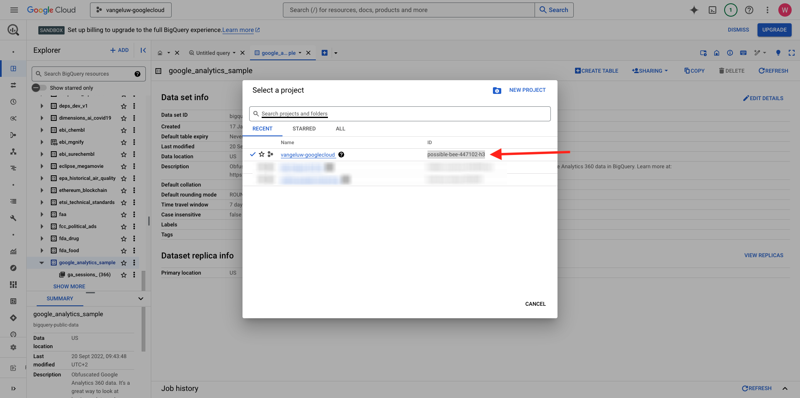

# 1.2.1 Start Google Cloud Platform

>[!NOTE]
>
>Hiervoor hebt u toegang nodig tot een Google Cloud Platform-omgeving. Als u nog geen toegang hebt tot GCP, maakt u een nieuw account met uw persoonlijke e-mailadres.

## 1.2.1.1 Waarom maakt u verbinding met Google BigQuery met Adobe Experience Platform om Google Analytics-gegevens op te halen

Google Cloud Platform (GCP) is een pakket openbare cloudcomputingdiensten die door Google worden aangeboden. Het Google Cloud Platform bevat een reeks gehoste services voor computer-, opslag- en toepassingsontwikkeling die op Google-hardware worden uitgevoerd.

BigQuery is een van deze services en wordt altijd opgenomen in Google Analytics 360. Google Analytics-gegevens worden vaak gesampled wanneer we gegevens er direct vanaf proberen te krijgen (bijvoorbeeld API). Daarom bevat Google BigQuery om niet-gesamplede gegevens te verkrijgen, zodat merken geavanceerde analyses kunnen uitvoeren met SQL en kunnen profiteren van de kracht van GCP.

Google Analytics-gegevens worden dagelijks in BigQuery geladen via een batchmechanisme. Daarom heeft het geen zin om deze integratie van GCP/BigQuery te gebruiken voor realtime personalisatie en activeringsgebruiksgevallen.

Als een merk gebruiksgevallen voor realtime personalisatie wil aanbieden op basis van Google Analytics-gegevens, kan het die gegevens verzamelen op de website met Google Tag Manager en deze vervolgens in real-time naar Adobe Experience Platform streamen.

De connector GCP/BigQuery Source moet worden gebruikt voor...

- Volg al klantengedrag op de website en laad die gegevens in Adobe Experience Platform voor analyse, gegevenswetenschap en verpersoonlijking gebruiksgevallen die geen activering in real time vereisen.
- historische Google Analytics-gegevens naar Adobe Experience Platform laden, ook voor gebruik door analyses en gegevenswetenschap

## 1.2.1.2 Je Google-account

>[!NOTE]
>
>Hiervoor hebt u toegang nodig tot een Google Cloud Platform-omgeving. Als u nog geen toegang hebt tot GCP, maakt u een nieuw account met uw persoonlijke e-mailadres.

## 1.2.1.3 Een project selecteren of maken

Ga naar [ https://console.cloud.google.com/ ](https://console.cloud.google.com/).

Daarna, klik op **selecteer een project** of klik een bestaand project.

Als u nog geen project hebt, klik op **NIEUW PROJECT**. Als u al een project hebt, kunt u ervoor kiezen om dat te selecteren en door te gaan naar de volgende stap.

Geef uw project een naam volgens deze naamgevingsconventie. Klik **CREËREN**.

| Conventie |
| ----------------- |
| `--aepUserLdap---googlecloud` |

Wacht tot het bericht in de rechterbovenhoek van het scherm u vertelt dat het maken is voltooid. Dan, klik **UITGEZOCHT PROJECT**.

Daarna, ga naar de onderzoeksbar bovenop het scherm en type **BigQuery**. Selecteer het eerste resultaat.

Het doel van deze module is om Google Analytics-gegevens in Adobe Experience Platform te krijgen. Om dat te doen, hebt u dummygegevens in een dataset van Google Analytics nodig om met te beginnen.

Klik op **+ voeg** toe, en klik dan **Openbare datasets** in het juiste menu.

U ziet dan dit venster:

Ga de steekproef van Google Analytics van de onderzoekstermijn **** in de onderzoeksbar in en klik het eerste onderzoeksresultaat.

U zult het volgende scherm met een beschrijving van de dataset zien. Klik op **DATASET VAN DE MENING**.

U zult dan aan BigQuery opnieuw worden gericht waar u dit **bigquery-public-data** dataset onder **Ontdekkingsreiziger** zult zien.

In **Ontdekkingsreiziger**, zou u een aantal lijsten nu moeten zien. Voel je vrij om ze te verkennen. Ga naar `google_analytics_sample` .

Klik om de tabel te openen `ga_sessions` .

Voordat u verdergaat met de volgende oefening, noteer gelieve de volgende dingen in een afzonderlijk tekstdossier op uw computer:

| Credentials | Naamgeving | Voorbeeld |
| ----------------- |-------------| -------------|
| Projectnaam | `--aepUserLdap---googlecloud` | vangeluw-googlecloud |
| Project-id | random | mogelijk-bijen-447102-h3 |

U kunt uw Naam van het Project en identiteitskaart van het Project vinden door op uw **Naam van het Project** in de hoogste menubar te klikken:

U ziet dan uw project-id aan de rechterkant:

Je kunt nu naar de volgende oefening gaan waar je handen vuil wordt door Google Analytics data te vragen.

## Volgende stappen

Ga naar [ 1.2.2 creeer uw eerste vraag in BigQuery ](./ex2.md){target="_blank"}

Ga terug naar [ Samenvatten en analyseren de gegevens van Google Analytics in Adobe Experience Platform met de Schakelaar van BigQuery Source ](./customer-journey-analytics-bigquery-gcp.md){target="_blank"}

Ga terug naar [ Alle modules ](./../../../../overview.md){target="_blank"}
