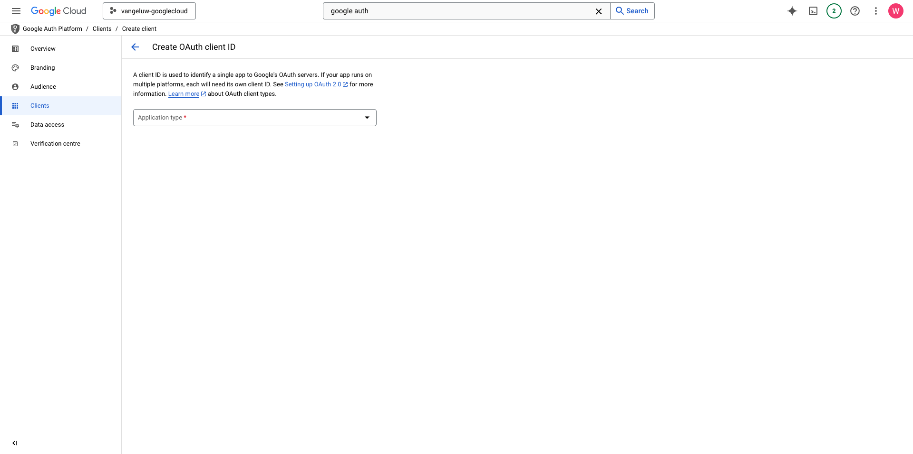
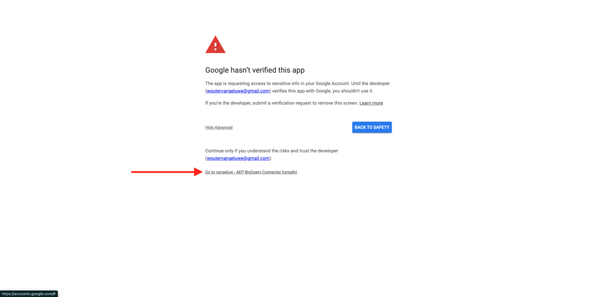
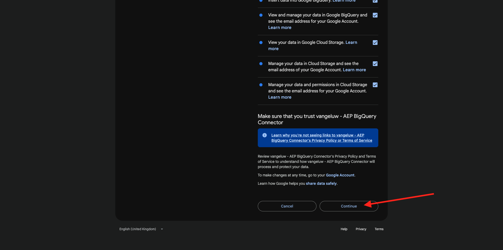
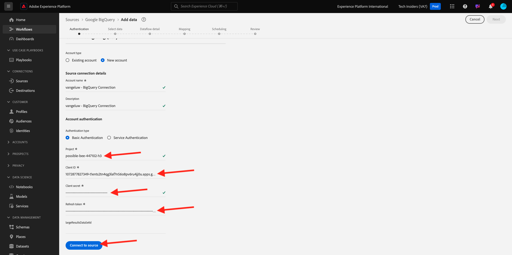
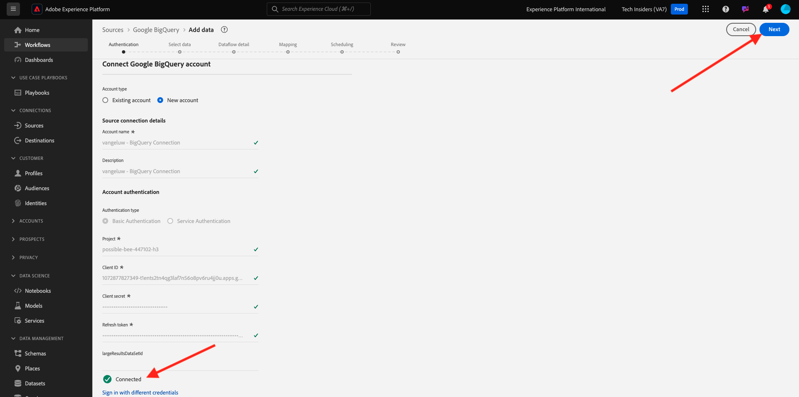

# 1.2.3 GCP en BigQuery aansluiten op Adobe Experience Platform

## Doelstellingen

- De API en services verkennen in het Google Cloud Platform
- Ben vertrouwd met OAuth Playground voor het testen van Google APIs
- Uw eerste BigQuery-verbinding maken in Adobe Experience Platform

## Context

Adobe Experience Platform verstrekt een schakelaar binnen **Bronnen** die u zal helpen datasets BigQuery in Adobe Experience Platform brengen. Deze gegevensconnector is gebaseerd op de Google BigQuery API. Daarom is het belangrijk om uw Google Cloud Platform en uw BigQuery-omgeving goed voor te bereiden voor het ontvangen van API-aanroepen van Adobe Experience Platform.

Voor het configureren van de BigQuery Source-connector in Adobe Experience Platform hebt u de volgende vier waarden nodig:

- project
- clientId
- clientSecret
- refreshToken

Tot dusverre hebt u slechts eerste, **identiteitskaart van het Project**. Deze **waarde van identiteitskaart van 0&rbrace; Project is een willekeurige identiteitskaart die door Google werd geproduceerd toen u uw project BigQuery tijdens oefening 12.1 creeerde.**

Kopieer de project-id in een gescheiden tekstbestand.

| Credentials | Naamgeving | Voorbeeld |
| ----------------- |-------------| -------------|
| Project-id | random | mogelijk-bijen-447102-h3 |

U kunt uw identiteitskaart van het Project op elk ogenblik controleren door op uw **Naam van het Project** in de hoogste menubar te klikken:

U ziet uw project-id aan de rechterkant:

In deze oefening zult u leren hoe te om de andere 3 vereiste gebieden te krijgen:

- clientId
- clientSecret
- refreshToken

## 1.2.3.1 Google Auth Platform

Ga om te beginnen terug naar de startpagina van het Google Cloud Platform. Klik hiertoe in de linkerbovenhoek van het scherm op het logo.

Zodra u op de homepage bent, onderzoek naar **Platform van de Auth van Google** in de onderzoeksbar. Klik op het eerste resultaat om het te openen.

U zult nu de **homepage van het Platform van de Auth van 0&rbrace; Google &lbrace;zien.** Klik **GET BEGONNEN**.

Voor de **naam van de App**, gebruik dit:

| Naamgeving | Voorbeeld |
| ----------------- |-------------| 
| `--aepUserLdap-- - AEP BigQuery Connector` | vangeluw - AEP BigQuery Connector |

Selecteer uw e-mailadres voor het gebied **e-mail van de de steunensteun van de Gebruiker**.

Klik **VOLGENDE**.

Selecteer **Extern** en klik **VOLGENDE**.

Ga uw e-mailadres in en klik **VOLGENDE**.

Controleer checkbox en klik **DOORGAAN**. Dan, klik **CREËREN**.

## 1.2.3.2 OAuth-client maken

Klik **CREEER OAUTH CLIENT**.

Dan zie je dit.

Selecteer **toepassing van het Web**.

Er verschijnen meerdere nieuwe velden. U moet nu de **Naam** van identiteitskaart OAuth van de Cliënt ingaan en ook ingaan **Gemachtigde redirect URIs**.

Voor het gebied **Naam**, gebruik dit:

| Veld | Waarde | Voorbeeld |
| ----------------- |-------------| -------------| 
| Naam | ldap - AEP BigQuery Connector | vangeluw - Platform BigQuery Connector |

Klik **+ voeg URI** toe onder **Gemachtigde opnieuw richt URIs**. Voeg de onderstaande nieuwe URI toe.

| Veld | Waarde |
| ----------------- |-------------| 
| Toegestane omleiding van URI&#39;s | https://developers.google.com/oauthplayground |

Het **Gemachtigde opnieuw richten URIs** gebied is een zeer belangrijk gebied omdat u het later zult nodig hebben om RefreshToken te krijgen u de opstelling van de Schakelaar van BigQuery Source in Adobe Experience Platform moet beëindigen.

Klik **creëren**.

Uw OAuth-client-id is nu gemaakt. Klik erop om nu uw client-id en uw clientgeheim te zien.

U zult dan de waarden voor identiteitskaart van de Cliënt en Geheime cliënt zien.

Kopieer deze twee velden en plak ze in een tekstbestand op uw bureaublad. U kunt deze geloofsbrieven altijd tot een later stadium toegang hebben, maar het is gemakkelijker als u hen in een tekstdossier naast uw identiteitskaart van het Project BigQuery opslaat.

Als recap voor de configuratie van de BigQuery Source Connector in Adobe Experience Platform, hebt u nu al de volgende waarden beschikbaar:

| Credentials voor BigQuery Connector | Waarde |
| ----------------- |-------------| 
| Project-id | uw eigen project-id (bijvoorbeeld: maximum-bijen-447102-h3) |
| clientid | uzelf |
| kindergeheim | uw clientgeheim |

Vervolgens moet u uw OAuth-app publiceren. Ga naar **Publiek** en klik **PUBLISH APP**.

Klik **BEVESTIGEN**.

U mist nog **refreshToken**. refreshToken is een vereiste wegens veiligheidsredenen. In de wereld van APIs, verlopen de tekenen typisch om de 24 uur. Zo **refreshToken** is nodig om het veiligheidstoken om de 24 uur te verfrissen, zodat uw opstelling van de Verbinding van Source het verbinden met het Platform van de Wolk van Google en BigQuery kan houden.

## 1.2.3.3 BigQuery API en refreshToken

Er zijn verschillende manieren om een refreshToken te verkrijgen voor toegang tot API&#39;s van het Google Cloud-platform. Een van deze opties is bijvoorbeeld het gebruik van Postman.
Nochtans, heeft Google iets gemakkelijker gebouwd om met hun APIs te testen en te spelen, een hulpmiddel genoemd **OAuth 2.0 Playground**.

Om tot **OAuth 2.0 Playground** toegang te hebben, ga [&#x200B; https://developers.google.com/oauthplayground &#x200B;](https://developers.google.com/oauthplayground).

U zult dan **OAuth 2.0 de homepage van de Playground** zien.

Klik op het **versnelling** pictogram in de hoogste juiste kant van uw scherm. Zorg ervoor dat de instellingen overeenkomen met de instellingen in de bovenstaande afbeelding.

Controle checkbox: **gebruik uw eigen geloofsbrieven OAuth**

Er worden twee velden weergegeven.

Vul de velden volgende op deze tabel in:

| API-instellingen voor afspelen | Uw Google API-gebruikersgegevens |
| ----------------- |-------------| 
| OAuth-client-id | uw eigen client-id (in het tekstbestand op uw bureaublad) |
| OAuth Client Secret | uw eigen clientgeheim (in het tekstbestand op uw bureaublad) |

Zodra u uw geloofsbrieven hebt ingevuld, te klikken gelieve **dicht**.

In het linkermenu ziet u alle beschikbare Google API&#39;s. Onderzoek naar **BigQuery API v2** en klik het om het te openen.

Selecteer vervolgens het bereik dat wordt aangegeven in de onderstaande afbeelding. U moet op elk van de beschikbare API&#39;s klikken en voor elke geselecteerde API wordt een vinkje weergegeven.

Daarna, klik **autoriseer APIs**.

Klik op het e-mailadres dat u hebt gebruikt voor het instellen van GCP en BigQuery.

U zult dan een grote waarschuwing zien: **Deze app wordt niet geverifieerd**. Dit gebeurt omdat uw Platform BigQuery Connector nog niet formeel is gecontroleerd, zodat Google niet weet of het een authentieke app is of niet.

Klik **Geavanceerd**.

Daarna, klik op **gaan naar —aepUserLoad— - de Schakelaar van AEP BigQuery (onveilig)**.

U zult dan een veiligheidsherinnering voor toegang zien. Klik **Uitgezocht allen**.

De rol neer en klikt **gaat** verder.

U wordt nu teruggestuurd naar OAuth 2.0 Playground en u zult dit zien. Klik **de vergunningscode van de Uitwisseling voor tokens**.

Na een paar seconden, zal de **Stap 2 - de vergunningscode van de Uitwisseling voor tokens** mening automatisch sluiten, en u zult **Stap 3 zien - verzoek aan API** vormen.

U moet terug naar **Stap 2 de vergunningscode van de Uitwisseling voor tokens** gaan, zodat klik op **Stap 2 de vergunningscode van de Uitwisseling voor tokens** opnieuw om **te visualiseren verfrissen teken**.

U zult nu **het verfrissen teken** zien.

Kopieer het **verfrissen teken** en kleef het in het tekstdossier op uw Desktop samen met andere Referenties van de Verbinding van BigQuery Source:

| Credentials voor BigQuery Source Connector | Waarde |
| ----------------- |-------------| 
| Project-id | uw eigen willekeurige project-id (bijvoorbeeld: apt-zomer-273608) |
| clientid | uzelf |
| kindergeheim | uw clientgeheim |
| vernieuwingstoken | uzelf vernieuwen |

Stel vervolgens uw Source-connector in Adobe Experience Platform in.

## 1.2.3.5 - Verbind Platform met uw eigen Lijst van de BigQuery

Login aan Adobe Experience Platform door naar dit URL te gaan: [&#x200B; https://experience.adobe.com/platform &#x200B;](https://experience.adobe.com/platform).

Na het aanmelden landt je op de homepage van Adobe Experience Platform.

Alvorens u verdergaat, moet u a **zandbak** selecteren. De te selecteren sandbox krijgt de naam ``--aepSandboxName--`` . Na het selecteren van de aangewezen zandbak, zult u de het schermverandering zien en nu bent u in uw specifieke zandbak.

Ga in het linkermenu naar Bronnen. U zult dan de **Bronnen** homepage zien. In het **Bronnen** menu, klik op **Gegevensbestanden**. Klik de **kaart van Google BigQuery**. Daarna, klik **Opstelling**.

Maak nu een nieuwe verbinding.

Klik **Nieuwe rekening**. U moet nu alle hieronder gebieden invullen, die op de opstelling worden gebaseerd u in GCP en BigQuery deed.

Laten we beginnen met de naam van de verbinding:

Gebruik deze naamgevingsconventie:

| Credentials voor BigQuery Connector | Waarde | Voorbeeld |
| ----------------- |-------------| -------------| 
| Accountnaam | `--aepUserLdap-- - BigQuery Connection` | vangeluw - BigQuery Connection |
| Beschrijving | `--aepUserLdap-- - BigQuery Connection` | vangeluw - BigQuery Connection |

Dan heb je het volgende:

Daarna, vul GCP en BigQuery API **de Authentificatie van de Rekening** - details in die u in een tekst-dossier op uw Desktop opsloeg:

| Credentials voor BigQuery Connector | Waarde |
| ----------------- |-------------| 
| Project-id | uw eigen willekeurige project-id (bijvoorbeeld: maximum-bijen-447102-h3) |
| clientId | ... |
| clientSecret | ... |
| refreshToken | ... |

Uw **Authentificatie van de Rekening** - details zouden nu als dit moeten kijken. Klik **verbinden met bron**.

Als uw **details van de Authentificatie van de 0&rbrace; Rekening correct werden ingevuld, zou u nu een visuele bevestiging moeten zien dat de verbinding behoorlijk werkt, door de** Verbonden **bevestiging te zien.** Klik **daarna**.

U zult nu de dataset zien BigQuery u in de vorige oefening creeerde.

Goed gedaan! In de volgende oefening, zult u gegevens van die lijst laden en het tegen een schema en dataset in Adobe Experience Platform in kaart brengen.

## Volgende stappen

Ga naar [&#x200B; 1.2.4 gegevens van de Lading van BigQuery in Adobe Experience Platform &#x200B;](./ex4.md){target="_blank"}

Ga terug naar [&#x200B; Samenvatten en analyseren de gegevens van Google Analytics in Adobe Experience Platform met de Schakelaar van BigQuery Source &#x200B;](./customer-journey-analytics-bigquery-gcp.md){target="_blank"}

Ga terug naar [&#x200B; Alle modules &#x200B;](./../../../../overview.md){target="_blank"}
