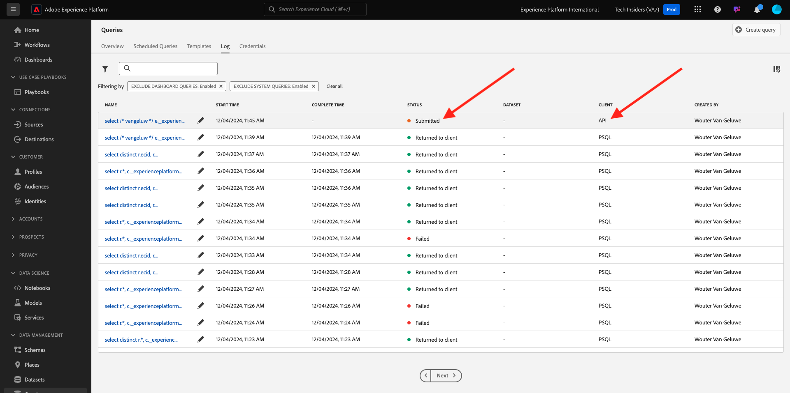

# 2.1.5 Genereer een dataset van een vraag

## Doelstelling

Leer hoe te om datasets van vraagresultaten te produceren
Microsoft Power BI Desktop/Tableau rechtstreeks verbinden met de Query Service
Een rapport maken in Microsoft Power BI Desktop/Tableau Desktop

## Context

Een interface van de bevellijn aan vraaggegevens is opwindend maar het presenteert niet goed. In deze les, zullen wij u door een geadviseerde werkschema voor hoe u Microsoft Power BI Desktop/Tableau direct de Dienst van de Vraag kunt gebruiken om visuele rapporten voor uw belanghebbenden tot stand te brengen.

## Een dataset maken van een SQL-query

De ingewikkeldheid van uw vraag zal beïnvloeden hoe lang het voor de Dienst van de Vraag duurt om resultaten terug te keren. En wanneer het vragen direct van de bevellijn of andere oplossingen zoals Microsoft Power BI/Tableau wordt de Dienst van de Vraag gevormd met een 5 minieme onderbreking (600 seconden). En in bepaalde gevallen zullen deze oplossingen met kortere onderbrekingen worden gevormd. Om grotere vragen in werking te stellen en voorladen de tijd het neemt om resultaten terug te keren bieden wij een eigenschap aan om een dataset van de vraagresultaten te produceren. Deze functie gebruikt de standaard SQL eigenschap die als Create Lijst als Uitgezochte (CTAS) wordt bekend. Het is beschikbaar in Platform UI van de Lijst van de Vraag en ook beschikbaar om direct van de bevellijn met PSQL te worden in werking gesteld.

In vorige u **hebt vervangen ga uw naam** met uw eigen ldap in alvorens het in PSQL uit te voeren.

```sql
select /* enter your name */
       e.--aepTenantId--.identification.core.ecid as ecid,
       e.placeContext.geo.city as city,
       e.placeContext.geo._schema.latitude latitude,
       e.placeContext.geo._schema.longitude longitude,
       e.placeContext.geo.countryCode as countrycode,
       c.--aepTenantId--.interactionDetails.core.callCenterAgent.callFeeling as callFeeling,
       c.--aepTenantId--.interactionDetails.core.callCenterAgent.callTopic as callTopic,
       c.--aepTenantId--.interactionDetails.core.callCenterAgent.callContractCancelled as contractCancelled,
       l.--aepTenantId--.loyaltyDetails.level as loyaltystatus,
       l.--aepTenantId--.loyaltyDetails.points as loyaltypoints,
       l.--aepTenantId--.identification.core.crmId as crmid
from   demo_system_event_dataset_for_website_global_v1_1 e
      ,demo_system_event_dataset_for_call_center_global_v1_1 c
      ,demo_system_profile_dataset_for_crm_global_v1_1 l
where  e.--aepTenantId--.demoEnvironment.brandName IN ('Citi Signal')
and    e.web.webPageDetails.name in ('Cancel Service', 'Call Start')
and    e.--aepTenantId--.identification.core.ecid = c.--aepTenantId--.identification.core.ecid
and    l.--aepTenantId--.identification.core.ecid = e.--aepTenantId--.identification.core.ecid;
```

Navigeer aan Adobe Experience Platform UI - [&#x200B; https://experience.adobe.com/platform &#x200B;](https://experience.adobe.com/platform)

U zoekt naar de uitgevoerde instructie in de gebruikersinterface van de Adobe Experience Platform-query door uw LDAP in te voeren in het zoekveld:

Selecteer **Vragen**, ga naar **Logboek** en ga uw ldap op het onderzoeksgebied in.


Selecteer uw vraag en klik **Looppas als CTAS**.


Ga `--aepUserLdap-- Callcenter Interaction Analysis` als naam en beschrijving voor de dataset in en klik **Looppas als CTAS**.


Dientengevolge, zult u een nieuwe vraag met een status **Voorgelegd** zien.



Op voltooiing, zult u een nieuwe ingang voor **Gemaakte Dataset** zien (u zou de pagina kunnen moeten verfrissen).


Zodra uw dataset wordt gecreeerd (die 5-10 minuten kan vergen), kunt u de oefening voortzetten.

## Volgende stappen

Ga naar Optie A: [&#x200B; 2.1.6 de Dienst van de Vraag en Power BI &#x200B;](./ex6.md){target="_blank"}

Ga naar Optie B: [&#x200B; 2.1.7 de Dienst van de Vraag en Tableau &#x200B;](./ex7.md){target="_blank"}

Ga terug naar [&#x200B; Dienst van de Vraag &#x200B;](./query-service.md){target="_blank"}

Ga terug naar [&#x200B; Alle modules &#x200B;](./../../../../overview.md){target="_blank"}
