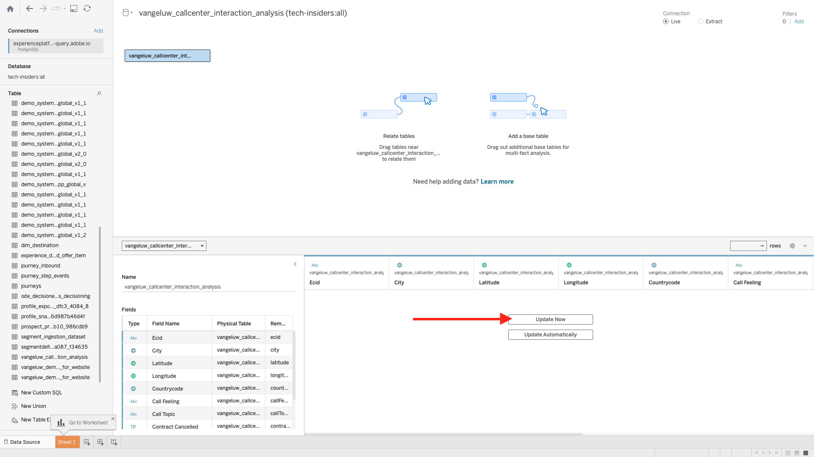

# 2.1.7 Query-service en Tableau

Open Tabel.

In **verbind met een Server**, klik **Meer** en klik dan **PostgreSQL**.

Als u PostgeSQL nog niet met Tableau hebt gebruikt, kunt u dit zien. Klik **Bestuurder van de Download**.

Volg de instructies om het PostgreSQL-stuurprogramma te downloaden en installeren.

Als u klaar bent met de installatie van het stuurprogramma, sluit u Tableau Desktop af en start u deze opnieuw. Dan na het nieuwe begin, ga **met een Server** opnieuw verbinden, klik **Meer** en klik dan **PostgreSQL** opnieuw.

Dan zie je dit.

Ga naar Adobe Experience Platform, aan **Vragen** en aan **Geloofsbrieven**.

Van de **Credentials** pagina in Adobe Experience Platform, kopieer de **Gastheer** en kleef het in het **gebied van de Server**, kopieer het **Gegevensbestand** en kleef het in het **Gegevensbestand** gebied in Tableau, kopieer de **Haven** en kleef het op het gebied **in Tableau, doe het zelfde voor** Gebruikersnaam **en** Wachtwoord **.** Daarna, klik **Teken binnen**.

Zoek in de lijst met beschikbare tabellen de tabel die u in de vorige exercitie hebt gemaakt. Deze tabel wordt `--aepUserLdap--_callcenter_interaction_analysis` genoemd. Sleep het naar het canvas.

Dan zie je dit. Klik **Update nu**.

Vervolgens ziet u de gegevens van AEP beschikbaar komen in Tableau. Klik **Blad 1** beginnen met het werken met de gegevens.

Om uw gegevens op de kaart zichtbaar te maken, moet u lengte en breedte in dimensies omzetten. In **Maatregelen**, klik **Breedte** met de rechtermuisknop aan, uitgezochte **Bekeerling aan Dimension** in het menu. Doe het zelfde voor de **maatregel van de Lengte 0} {.**

Sleep de **maatregel van de Lengte** {aan de **Kolommen** en de **5} maatregel van de Breedte {aan** Rijen **.** Automatisch zal de kaart van **België** met weinig punten verschijnen die de steden in uit gegevensreeks vertegenwoordigen.

Selecteer **Namen van de Maatregel**, klik **toevoegen aan Blad**.

Nu heb je een kaart met puntjes van verschillende grootten. De grootte wijst op het aantal interactie van het vraagcentrum voor die specifieke stad. Om de grootte van de punten te variëren, navigeer aan het juiste paneel en open **Waarden van de Maatregel** (gebruikend het drop-down pictogram). Van de drop-down lijst uitgezocht **geeft Grootte** uit. Speel rond met verschillende grootten.

Om de gegevens per **Onderwerp van de Vraag** verder te tonen, sleep het **Onderwerp van de Vraag** dimensie op **Pagina&#39;s**. Navigeer door de verschillende **onderwerpen van de Vraag** gebruikend het **Onderwerp van de Vraag** op de rechterkant van het scherm:

Je hebt deze oefening nu afgerond.

## Volgende stappen

Ga naar [ 2.1.8 API van de Dienst van de Vraag ](./ex8.md){target="_blank"}

Ga terug naar [ Dienst van de Vraag ](./query-service.md){target="_blank"}

Ga terug naar [ Alle modules ](./../../../../overview.md){target="_blank"}
