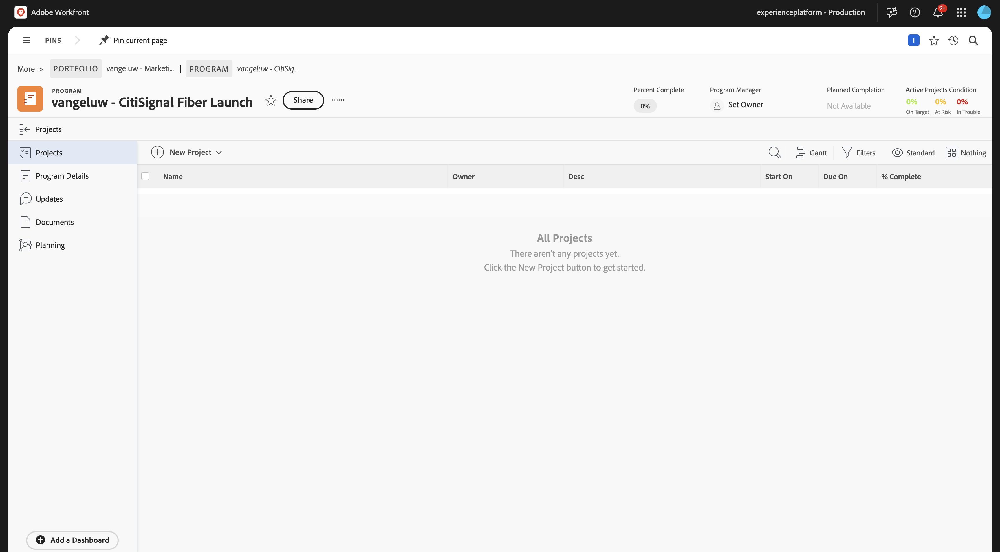

# 1.1.1 Aan de slag met Workfront Planning

## 1.1.1.1 Terminologie voor Workfront-planning

Hieronder vindt u de belangrijkste Workfront-planningsobjecten en -concepten:

| Term | Toelichting |
| --- | ---|
| **Workspace** | Een verzameling recordtypen die de operationele levenscyclus van een bepaalde organisatie definiëren. Een werkruimte is het werkkader van een organisatorische eenheid. |
| **Type van Verslag** | De naam van objecttypen in Workfront Planning. Met recordtypen worden werkruimten gevuld. In tegenstelling tot Workfront Workflow, waar de objecttypen vooraf zijn gedefinieerd, kunt u in Workfront Planning uw eigen objecttypen maken. |
| **Verslag** | Een instantie van een recordtype. |
| **malplaatje van Workspace** | U kunt een werkruimte maken met vooraf gedefinieerde sjablonen. U kunt de vooraf gedefinieerde recordtypen en -velden gebruiken die in een sjabloon voorkomen, of u kunt uw eigen recordtypen toevoegen. |
| **Velden** | Velden zijn kenmerken die u kunt toevoegen aan recordtypen. Velden bevatten informatie over het recordtype. |

>[!NOTE]
>
>Er gelden beperkingen voor het aantal Workfront Planning-objecten dat u kunt maken. Zie Overzicht van objectbeperkingen voor Adobe Workfront Planning voor meer informatie.

U gaat nu de handen in elkaar slaan en zelf een aantal van deze objecten maken.

## 1.1.1.2 Workspace, Recordtype, Velden

Ga naar [ https://experience.adobe.com/ ](https://experience.adobe.com/){target="_blank"}. Klik om **Workfront** te openen.


In Workfront, klik om het menu te openen en dan **Planning** te selecteren.


Dan moet je dit zien. Klik **creëren Workspace**.


Klik **van het Gebruik tempmate** voor het malplaatje **Basis Marketing Beheer**.


Er wordt nu een nieuwe werkruimte gemaakt. Voordat u verdergaat, moet u de naam van de werkruimte wijzigen. Klik de 3 punten **..** en selecteer dan **uitgeven**.


Wijzig de naam in `--aepUserLdap-- - Basic: Marketing Management` . Klik **sparen**.


Dan moet je dit hebben.


## 1.1.1.3 Taxonomies: Recordtype en velden

Onder **Taxonomies**, klik **+ voeg het Type van Verslag** toe en selecteer dan **voeg manueel** toe.


U zou dan **recordtype** popup moeten zien toevoegen.


Werk de volgende informatie op het **Verschijning** lusje bij:

- Vervang **Naamloos verslagtype** door `Business Unit`.
- Beschrijving: `Defines which BU is leading campaign planning.`.
- Een kleur en vorm selecteren voor het pictogram van uw keuze

Klik **sparen**.


Klik om het pas gecreëerde **BedrijfsEenheid** verslagtype te openen.


Er wordt nu een lege tabelweergave weergegeven, omdat er voor het nieuwe recordtype nog geen veld is gedefinieerd.


Klik de dropdown knoop op het gebied **Datum van het Begin** en selecteer dan **Schrapping**.


Selecteer **Schrapping**.


Klik de dropdown knoop op het gebied **Datum van het Eind** en selecteer dan **Schrapping**.


Selecteer **Schrapping**.


Klik vervolgens op het pictogram **+** om een nieuw veld toe te voegen. De rol neer in de lijst van beschikbare gebiedstypes en selecteert **Mensen**.


Plaats de **Naam** van het gebied aan `Business Unit Lead` en plaats de beschrijving van het gebied aan `Business Unit Lead responsible for budget and resources (VP, Head).`

Klik **sparen**.


U hebt nu een nieuw recordtype gemaakt en u hebt zowel velden verwijderd als velden gemaakt. Ga terug naar het Workspace-overzichtsscherm door op de pijl in de linkerbovenhoek te klikken.


Dan moet je dit zien.


## 1.1.1.4 Typen operationele records: velden

Klik om **Campagnes** te openen.


Klik op het pictogram **+** om een nieuw veld te maken. Selecteer **Nieuwe verbinding** en selecteer dan **Personas**.


Laat de standaardinstellingen staan. Klik **creëren**.


Selecteer **Overslaan**.


Het nieuwe veld wordt vervolgens weergegeven in de tabelweergave.


## 1.1.1.5 Een aanvraagformulier maken

Op het het overzichtsscherm van Campagnes, klik de 3 punten **...** en selecteer dan **de verzoekvorm van de creatie**.


Wijzig de naam in `Campaign Request Form` . Klik **sparen**.


Op dit moment hoeft u het formulier niet te wijzigen. U gebruikt deze zonder wijzigingen. Eerst, klik **sparen** en klik dan **publiceren**.


Klik op de pijl in de linkerbovenhoek om terug te keren naar het overzichtsscherm Request Forms.


Klik op de pijl in de linkerbovenhoek om terug te keren naar het scherm Campagnes overview.


## 1.1.1.6 Een nieuwe record verzenden met het aanvraagformulier

Voor het het overzichtsscherm van Campagnes, klik **+ Nieuw Verslag**.


Selecteer **voorleggen een verzoek** en klik **verdergaan**.


`vangeluw - New Campaign Creation Request`

`vangeluw - CitiSignal Fiber Launch`

```
The CitiSignal Fiber Launch campaign introduces CitiSignal’s flagship fiber internet service—CitiSignal Fiber Max—to key residential markets. This campaign is designed to build awareness, drive sign-ups, and establish CitiSignal as the go-to provider for ultra-fast, reliable, and future-ready internet. The campaign will highlight the product’s benefits for remote professionals, online gamers, and smart home families, using persona-driven messaging across digital and physical channels.
```

Klik **voorleggen verzoek**.


Klik **X** om popup te sluiten.


Dan zie je de nieuwe campagne in het overzicht.


## 1.1.1.7 Een automatisering maken

In de volgende stap gaat u een automatisering maken die informatie neemt uit de campagne die u hebt gemaakt in Workfront Planning en die die informatie gebruikt in Workfront om een programma te maken. Voordat u de automatisering kunt maken, moet u eerst twee dingen configureren in Workfront: een portfolio en een aangepast formulier.

Om de portefeuille tot stand te brengen, open het menu en klik **Portfolio&#39;s**.


Klik **+ Nieuwe Portfolio**.


Stel de naam van het portfolio in op `--aepUserLdap-- - Marketing` .


Daarna, open het menu en klik **Opstelling** om de douanevorm tot stand te brengen.


In het linkermenu, ga naar **Douane Forms**, **Forms** en klik dan **+ Nieuwe douanevorm**.


Selecteer **Programma** en klik **verdergaan**.


Wijzig de naam van het formulier in `--aepUserLdap-- Program Information` .


Daarna, ga naar **Bibliotheek van het Gebied** en onderzoek naar `budget`. De belemmering en laat vallen het bestaande gebied **Begroting** op de vorm.

Klik **toepassen**.


Uw aangepaste formulierconfiguratie is nu opgeslagen.


## 1.1.1.8 Een automatisering maken

Met het portfolio en het aangepaste formulier dat u hebt gemaakt, kunt u de automatisering nu maken.

Klik om het menu te openen en dan **Planning** te selecteren.


Klik om de werkruimte te openen die u eerder hebt gemaakt, met de naam `--aepUserLdap-- - Basic: Marketing Management` .


Klik om **Campagnes** te openen.


Op het het overzichtsscherm van Campagnes, klik de 3 punten **...** en selecteer dan **Automatiseringen beheren**.


Klik **Nieuwe automatisering**.


Stel de naam van de automatisering in op `Campaign to Program` .

De beschrijving instellen op `This automation will convert a Planning Campaign record to a Workfront Program.`

Klik **sparen**.


Plaats de **Actie** aan **creeer programma**. Klik op **+ Verbonden veld toevoegen** .


Selecteer de **portefeuille van het Programma**: `--aepUserLdap-- - Marketing`.

Selecteer deze **Vorm van de Douane**: `--aepUserLdap-- Program information`.

Klik **sparen**.


Dan moet je dit zien. Klik op de pijl om terug te gaan naar het scherm Campagnes overview.


Schakel het selectievakje in voor de campagne die u eerder hebt gemaakt. Dan, klik de **Campagne aan de automatisering van het Programma**.


Na een paar seconden ziet u een bevestiging dat de automatisering met succes is voltooid. Dit betekent dat op het voorwerp van de Campagne in de Planning van Workfront, een Programma werd gecreeerd in Workfront.


Om het Programma in Workfront te controleren, open het menu en klik **Portfolio&#39;s**.


Open uw portfolio met de naam `--aepUserLdap-- - Marketing` .


Ga naar **Programma&#39;s** en u zou dan het programma moeten zien dat enkel door de automatisering werd gecreeerd u vormde.



Volgende Stap: [ 1.2.2 TBD ](./ex1.md){target="_blank"}

Ga terug naar [ Inleiding aan de Planning van Workfront ](./wfplanning.md){target="_blank"}

[ ga terug naar Alle Modules ](./../../../overview.md){target="_blank"}
