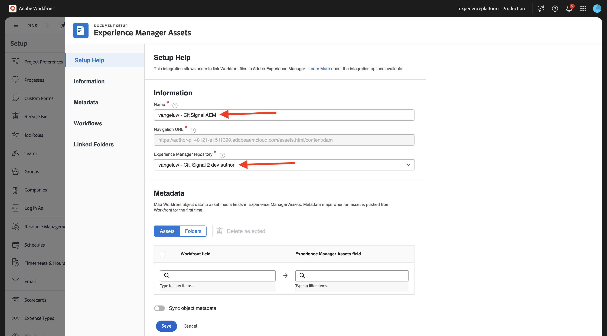
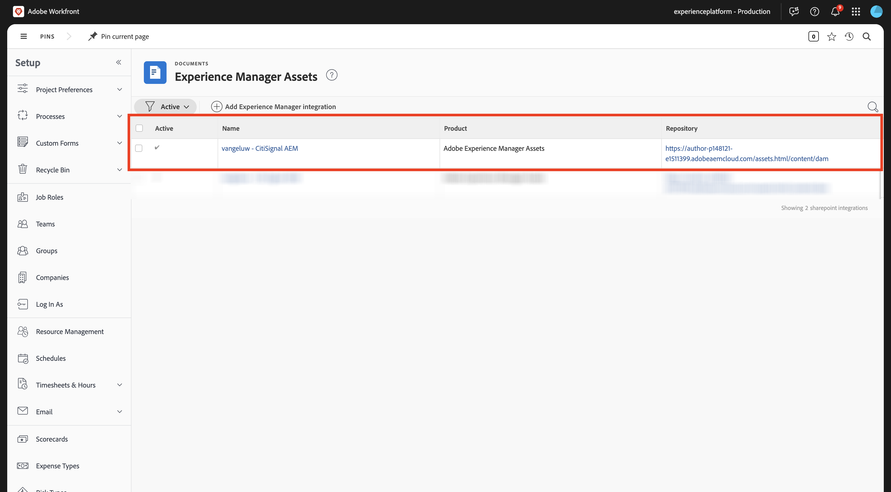
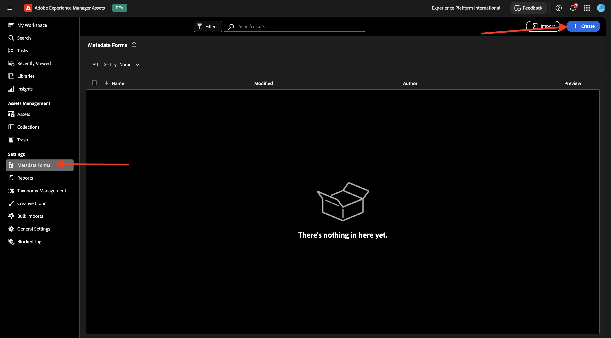

# 1.2.1 Workfront + AEM Assets CS Metadata Integration

>[!IMPORTANT]
>
>Als u deze bewerking wilt voltooien, hebt u toegang nodig tot een werkende AEM Assets CS Author-omgeving.
>
>Er zijn twee opties die u kunt overwegen:
>
>- Als u de GenStudio for CSC Technical Enablement workshop bijwoont, hebben uw instructeurs een AEM Assets CS Author-omgeving voor u gemaakt. Controleer bij hen wat de naam is en hoe u verder wilt gaan.
>
>- Als u de volledige Één de zelfstudie van Adobe volgt, ga [ Adobe Experience Manager Cloud Service &amp; Edge Delivery Services ](./../../../modules/asset-mgmt/module2.1/aemcs.md){target="_blank"} uitoefenen. Volg de instructies daar, en u zult toegang tot zulk een milieu hebben.

>[!IMPORTANT]
>
>Als u eerder een AEM CS-programma hebt geconfigureerd met een AEM Assets CS-omgeving, kan het zijn dat de AEM CS-sandbox is geminimaliseerd. Gezien het feit dat het vernietigen van zo&#39;n zandbak 10 tot 15 minuten duurt, zou het een goed idee zijn om het ontruimingsproces nu te beginnen zodat u niet op een later tijdstip hoeft te wachten.

Ga naar [ https://experience.adobe.com/ ](https://experience.adobe.com/){target="_blank"}. Klik om **Workfront** te openen.

Dan zie je dit.

## 1.2.1.1 Uw AEM Assets-integratie configureren

Klik het **menu** pictogram en selecteer dan **Opstelling**.

In het linkermenu, scrol neer aan **Documenten** en klik dan **Experience Manager Assets**. Klik op **+ Experience Manager-integratie toevoegen** .

Gebruik `--aepUserLdap-- - CitiSignal AEM` voor de naam van uw integratie.

Open de **bewaarplaats van Experience Manager** dropdown en selecteer uw instantie van AEM CS, die zou moeten worden genoemd `--aepUserLdap-- - CitiSignal`.

Onder **Meta-gegevens**, vorm de volgende afbeelding:

| Workfront-veld | Experience Manager Assets-veld |
| --------------- | ------------------------------ | 
| **Document** > **Naam** | **wm:documentName** |
| **Project** > **Naam** | **wm:projectName** |
| **Project** > **Beschrijving** | **wm:projectDescription** |
| **Verzoek van het Document** > **Status** | **wm :wm: documentStatus** |
| **Taak** > **Naam** | **wm:taskName** |
| **Taak** > **Beschrijving** | **wm:taskDescription** |
| **Project** > **identiteitskaart** | **wm:projectId** |

Laat de schakelaar voor **objecten meta-gegevens van de Synchronisatie** toe.

Klik **sparen**.

Uw integratie van Workfront naar AEM Assets CS is nu geconfigureerd.

## 1.2.1.2 Integratie van metagegevens met AEM Assets configureren

Vervolgens moet u AEM Assets CS zodanig configureren dat de metagegevensvelden van het element in Workfront worden gedeeld met AEM Assets CS.

Om dat te doen, ga naar [ https://experience.adobe.com/ ](https://experience.adobe.com/). Klik **Experience Manager Assets**.

Klik om de AEM Assets-omgeving te selecteren. Deze moet de naam `--aepUserLdap-- - CitiSignal dev` hebben.

Dan moet je dit zien. In het linkermenu, ga naar **Assets**.

Daarna, klik **creeer Omslag**.

Noem uw omslag `--aepUserLdap-- - CitiSignal Fiber Launch Assets` en klik **creëren**.

Daarna, ga naar **Meta-gegevens Forms** in het linkermenu en klik dan **creeer**.

Gebruik de naam `--aepUserLdap-- - Metadata Form` en klik **creëren**.

Voeg 7 nieuwe **Enige gebieden van de Tekst van de Lijn** aan de vorm toe en selecteer het eerste gebied. Dan, klik het **pictogram van het Schema** naast het **bezit van Meta-gegevens** gebied voor het eerste gebied.

Dan zie je deze popup. Op het onderzoeksgebied, ga `wm:project` in en selecteer dan de gebied **Naam van het Project**. Klik **Uitgezocht**.

Wijzig de label van het veld in `Project Name` . Klik **sparen**.

Ga naar het tweede gebied en klik het **Schema** pictogram naast het **bezit van Meta-gegevens** gebied.

Op het onderzoeksgebied, ga `wm:project` in en selecteer dan de gebied **Beschrijving van het Project**. Klik **Uitgezocht**.

Wijzig de label van het veld in `Project Description` .

Daarna, selecteer het derde gebied en klik opnieuw het **pictogram van het Schema** naast het **bezit van Meta-gegevens** gebied.

Dan zie je deze popup weer. Op het onderzoeksgebied, ga `wm:project` in en selecteer dan identiteitskaart van het gebied **Project**. Klik **Uitgezocht**.

Wijzig de label van het veld in `Project ID` .

Daarna, selecteer het vierde gebied en klik opnieuw het **pictogram van het Schema** naast het **bezit van Meta-gegevens** gebied.

Dan zie je deze popup weer. Op het onderzoeksgebied, ga `wm:document` in en selecteer dan identiteitskaart van het gebied **Project**. Klik **Uitgezocht**.

Wijzig de label van het veld in `Document Status` .

Daarna, selecteer het vijfde gebied en klik opnieuw het **pictogram van het Schema** naast het **bezit van Meta-gegevens** gebied.

Dan zie je deze popup weer. Op het onderzoeksgebied, ga `wm:document` in en selecteer dan identiteitskaart van het gebied **Project**. Klik **Uitgezocht**.

Wijzig de label van het veld in `Document Name` .

Daarna, selecteer het zesde gebied en klik opnieuw het **pictogram van het Schema** naast het **bezit van Meta-gegevens** gebied.

Dan zie je deze popup weer. Op het onderzoeksgebied, ga `wm:task` in en selecteer dan de 1} Naam van de Taak van het gebied **.** Klik **Uitgezocht**.

Wijzig de label van het veld in `Task Name` .

Daarna, selecteer het zevende gebied en klik opnieuw het **pictogram van het Schema** naast het **bezit van Meta-gegevens** gebied.

Dan zie je deze popup weer. Op het onderzoeksgebied, ga `wm:task` in en selecteer dan het gebied **Beschrijving van de Taak**. Klik **Uitgezocht**.

Wijzig de label van het veld in `Task Description` .

Verander de **naam van het Lusje** op de vorm in `--aepUserLdap-- - Workfront Metadata`.

Klik **sparen** en **dicht**.

Uw **Vorm van Meta-gegevens** wordt nu gevormd.

Vervolgens moet u het metagegevensformulier toewijzen aan de map die u eerder hebt gemaakt. Controleer checkbox voor uw Vorm van Meta-gegevens en klik **toewijzen aan Omslag(s)**.

Selecteer de map met de naam `--aepUserLdap-- - CitiSignal Fiber Launch Assets` . Klik **toewijzen**.

Het metagegevensformulier is nu toegewezen aan uw map.

Volgende Stap: [ 1.2.2 het Bewijzen met Workfront ](./ex2.md){target="_blank"}

Ga terug naar [ Beheer van het Werkschema met Adobe Workfront ](./workfront.md){target="_blank"}

[ ga terug naar Alle Modules ](./../../../overview.md){target="_blank"}
