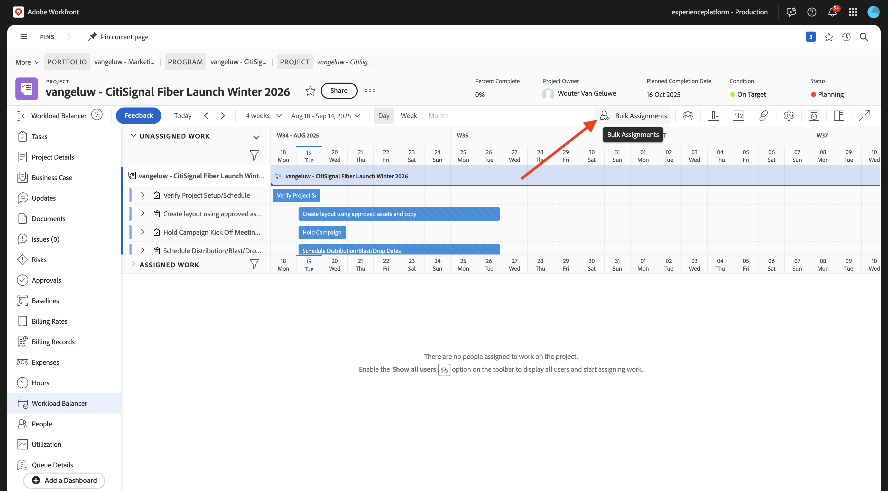
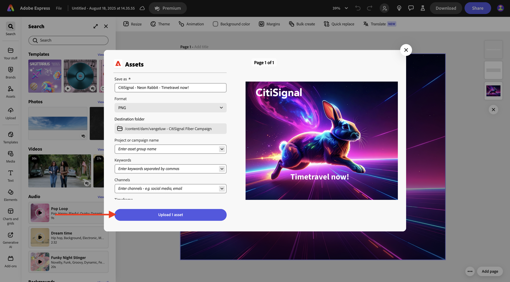
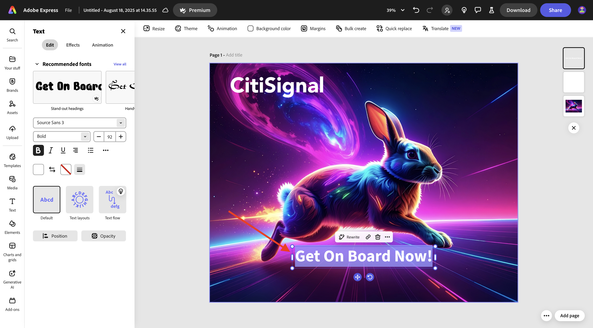
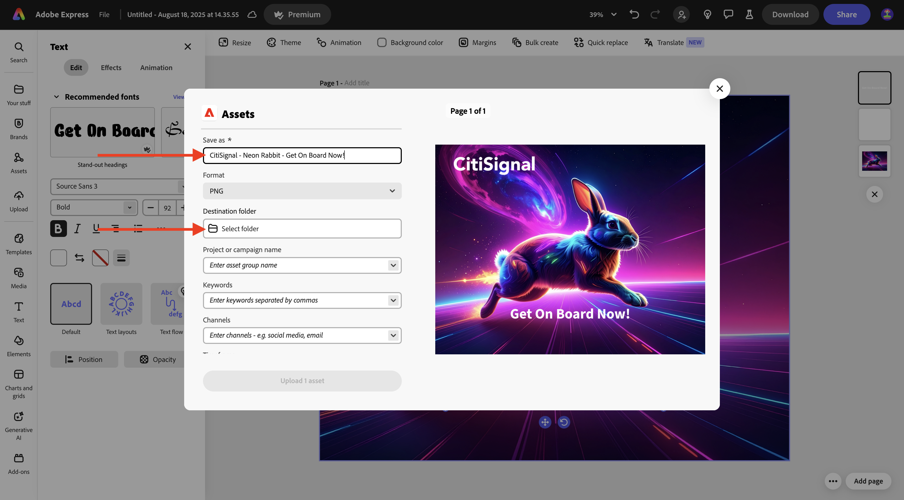
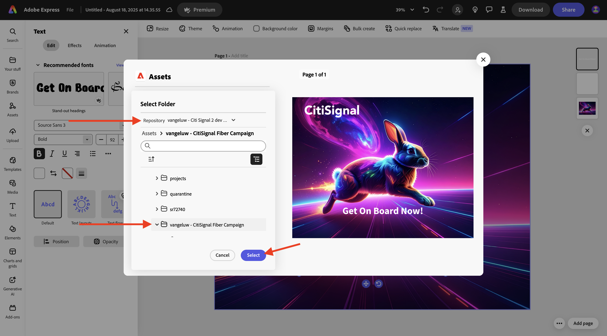
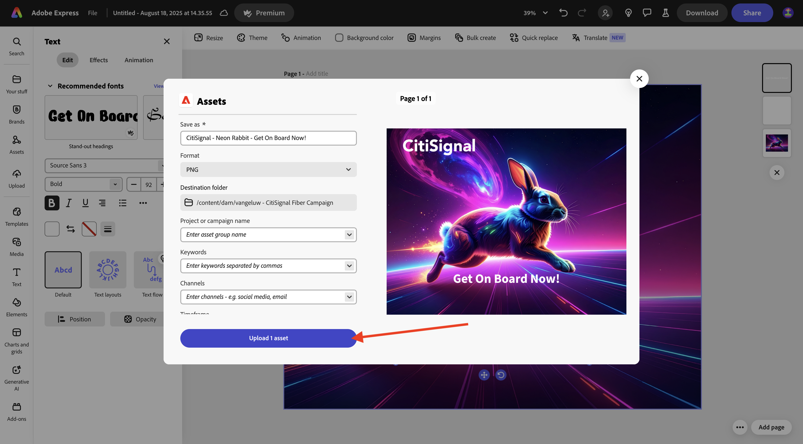
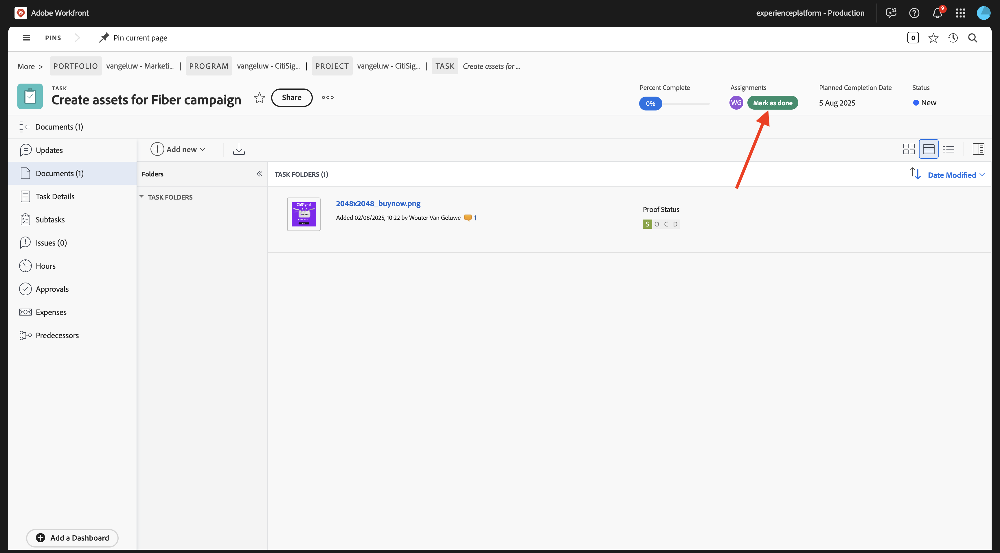

# 1.2.2 Proofing met Workfront

>[!IMPORTANT]
>
>Als u eerder een AEM CS-programma hebt geconfigureerd met een AEM Assets CS-omgeving, kan het zijn dat de AEM CS-sandbox is geminimaliseerd. Gezien het feit dat het vernietigen van zo&#39;n zandbak 10 tot 15 minuten duurt, zou het een goed idee zijn om het ontruimingsproces nu te beginnen zodat u niet op een later tijdstip hoeft te wachten.

## 1.2.2.1 Een nieuwe goedkeuringsstroom maken

Ga terug naar **Adobe Workfront**. Klik het **menu** pictogram en selecteer **het Bewijzen**.

Ga naar **Werkschema&#39;s**, klik **+ Nieuw** en selecteer dan **Nieuw malplaatje**.

Plaats de **naam van het Malplaatje** aan `--aepUserLdap-- - Approval Workflow` en plaats de **eigenaar van het Malplaatje** aan zich.

De rol neer, en onder **Staven** > **Stadium 1**, verandert de **rol van de Maker van het Bewijs** aan **Reviewer &amp; Approver**. U kunt iedereen anders, zo als voorbeeld ook toevoegen, zelf door uw gebruiker te selecteren en de **Rol** van **Recensent &amp; Fiatteur** te plaatsen.

Klik **creëren**.

Uw basisgoedkeuringswerkstroom is nu klaar om te worden gebruikt.

## 1.2.2.2 Workfront-vervaging inschakelen

In de volgende stap maakt u een nieuw project met een sjabloon. Adobe Workfront biedt u een aantal beschikbare blauwdrukken die u alleen moet activeren.

Voor het gebruiksgeval van CitiSignal, is de blauwdruk **Geïntegreerde Uitvoering van de Campagne** één u moet gebruiken.

Om die blauwdruk te installeren, open het menu en selecteer **Vervagen**.

Selecteer de filter **Marketing** en scrol neer om de blauwdruk **Geïntegreerde Uitvoering van de Campagne** te vinden. Klik **installeren**.

Klik **verdergaan**.

Klik **installeren zoals is...**.

Dan moet je dit zien. De installatie kan een paar minuten duren.

Na een paar minuten wordt de blauwdruk geïnstalleerd.

## 1.2.2.3 Een nieuw project maken

Open het **menu** en ga naar **Programma&#39;s**.

Klik op het programma dat u eerder hebt gemaakt en dat de naam `--aepUserLdap-- CitiSignal Fiber Launch` heeft.

>[!NOTE]
>
>U creeerde een programma als deel van de oefening op [ Planning van Workfront ](./../module1.1/ex1.md) met de automatisering u creeerde en liep. Als je dat nog niet hebt gedaan, kun je daar de instructies vinden.

In uw programma, ga naar **Projecten**. Klik **+ Nieuw Project** en selecteer dan **Nieuw Project van Malplaatje**.

Selecteer het malplaatje **Geïntegreerde Uitvoering van de Campagne** en klik **malplaatje van het Gebruik**.

Dan moet je dit zien. Verander de naam in `--aepUserLdap-- - CitiSignal Fiber Launch Winter 2026` en klik **creeer project**.

Uw project is nu gemaakt. Ga naar **Details van het Project**.

Ga naar **Details van het Project**. Klik om de huidige tekst onder **Beschrijving** te selecteren.

De beschrijving instellen op `The CitiSignal Fiber Launch project is used to plan the upcoming launch of CitiSignal Fiber.`

Klik **sparen Veranderingen**.

Uw project is nu klaar om te worden gebruikt.

De taken en gebiedsdelen in het project zijn gecreeerd gebaseerd op het malplaatje dat u koos en u is geplaatst als. eigenaar van het project. Het statuut van het project is geplaatst aan **Planning**. U kunt de status van het project wijzigen door een andere waarde in de lijst te selecteren.

## 1.2.2.4 Een nieuwe taak maken

Beweeg over de taak **begin om de Malplaatjes van het Ontwerp** tot stand te brengen en de 3 punten **te klikken...**.

Selecteer de optie **Taak van het Tussenvoegsel onder**.

Voer deze naam in voor uw taak: `Create layout using approved assets and copy` .

Plaats de gebied **Taken** aan de rol **Designer**.
Plaats de gebied **Duur** aan **5 dagen**.
Plaats het gebiedsvoorganger aan **9**.
Ga een datum voor de gebieden in **Begin op** en **Gelverschuldigd op**.

Klik ergens anders op het scherm om de nieuwe taak op te slaan.

Dan moet je dit zien. Klik op de taak om deze te openen.

Ga naar **taakdetails** en plaats het gebied **Beschrijving** aan: `This task is used to track the progress of the creation of the assets for the CitiSignal Fiber Launch Campaign.`

Klik **sparen Veranderingen**.

Dan moet je dit zien. Klik op het **gebied van het Project** om terug naar uw project te gaan.

In de **mening van het Project**, ga **de Balancer van de Werkbelasting**.

Klik **BulkToewijzingen**.

Selecteer de **taak van de Rol** van **Designer** en klik dan op het gebied **Gebruiker om** toe te wijzen. Dit zal alle gebruikers tonen die de rol van a **Designer** in uw instantie van Workfront hebben. In dit geval, selecteer de fictieve gebruiker **Melissa Jenkins**.

Klik **toewijzen**. De gebruiker u selecteerde zal nu aan de taken in het project worden toegewezen die met de **rol van Designer** verbonden zijn.

De taken worden nu toegewezen. Klik **Taken** om terug naar de **het overzichtspagina van Taken** te gaan.

Klik op de taak die u hebt gemaakt en die een naam heeft
**creeer lay-out gebruikend goedgekeurde activa en exemplaar**.

U zult nu in het kader van deze oefening aan deze taak beginnen te werken. U ziet dat Melissa Jenkins op dit moment aan deze taak is toegewezen. Om dat aan zich te veranderen, klik het **gebied van Taken** en selecteer **toewijzen aan me**.

Klik **sparen**.

Klik **Werk op het**.

Dan moet je dit zien.

Als onderdeel van deze taak moet u een nieuwe afbeelding maken en deze vervolgens als document uploaden in Workfront. U gaat dat middel nu zelf maken met Adobe Express.

## 1.2.2.5 Asset maken met Adobe Firefly Services en Adobe Express

Ga naar [ https://firefly.adobe.com/ ](https://firefly.adobe.com/){target="_blank"}. Ga de herinnering `a neon rabbit running very fast through space` in en klik **produceert**.

Er worden dan verschillende afbeeldingen gegenereerd. Kies het beeld u van de meesten houdt, klik het **pictogram van het Aandeel** op het beeld en selecteer dan **Open in Adobe Express**.

Vervolgens ziet u dat de afbeelding die u zojuist hebt gegenereerd, beschikbaar is in Adobe Express voor bewerking. U moet nu het CitiSignal-logo aan de afbeelding toevoegen. Om dat te doen, ga naar **Banden**.

Vervolgens ziet u een CitiSignal-merksjabloon. die in GenStudio for Performance Marketing is gemaakt, wordt weergegeven in Adobe Express. Klik om een merksjabloon te selecteren die `CitiSignal` in de naam heeft.

Ga naar **Logo&#39;s** en klik het **witte** embleem van het Citisignaal om het op het beeld te laten vallen.

Plaats het CitiSignal-logo boven aan de afbeelding, niet te ver van het midden.

Ga naar **Tekst**.

Klik **toevoegen uw tekst**.

Ga de tekst `Timetravel now!` in, verander de doopvontkleur en de doopvontgrootte, plaats de tekst aan **Vet** zodat u een beeld gelijkend op dit hebt.

Daarna, klik **Aandeel**.

Selecteer **AEM Assets**.

Wijzig de bestandsnaam in `CitiSignal - Neon Rabbit - Timetravel now!` .
Klik **Uitgezochte omslag**.

Selecteer uw AEM Assets CS-opslagplaats met de naam `--aepUserLdap-- - CitiSignal` en selecteer vervolgens de map `--aepUserLdap-- - CitiSignal Fiber Campaign` . Klik **Uitgezocht**.

Dan moet je dit zien. Klik **uploaden 1 activa**. Uw afbeelding wordt nu geüpload naar AEM Assets CS.

## 1.2.2.6 Voeg een nieuw Document aan uw Taak toe en begin de goedkeuringsstroom

Ga terug naar het **scherm van het Detail van de Taak**. Ga naar **Documenten**. Klik op **+ Nieuw toevoegen** en selecteer vervolgens de AEM Assets CS-opslagplaats met de naam `--aepUserLdap-- - CitiSignal` .

Dubbelklik om de map `--aepUserLdap-- CitiSignal Fiber Campaign` te openen.

Selecteer het dossier u in de vorige stap creeerde, die **CitiSignal - Neon konijn - Timetravel nu wordt genoemd!png** . Klik **Uitgezocht**.

{width="50px" align="left"}

Dan moet je dit hebben. Houd de muisaanwijzer boven het geüploade document. Klik **creeer proef** en kies dan **Geavanceerde Bewijs**.

In het **nieuwe proefdruk** venster, selecteer **Geautomatiseerd** en selecteer dan het werkschemamalplaatje dat u eerder creeerde, dat zou moeten worden genoemd `--aepUserLdap-- - Approval Workflow`. Klik **creëren Bewijs**.

Klik **Open Bewijs**

U kunt de proefdruk nu controleren. Selecteer **toevoegen commentaar** om een opmerking toe te voegen die het document vereist om worden veranderd.

Ga uw commentaar in en klik **Post**. Daarna, klik **maak een besluit**.

Selecteer **vereiste Veranderingen** en klik **besluit** nemen.

Ga terug naar uw **Taak** en het **Document**. U zult de vereiste tekst **Veranderingen** ook daar zien verschijnen.

U moet nu ontwerpwijzigingen aanbrengen, die u in Adobe Express zult uitvoeren.

## 1.2.2.7 Ontwerpwijzigingen aanbrengen in Adobe Express

Ga naar [ https://new.express.adobe.com/your-stuff/files ](https://new.express.adobe.com/your-stuff/files) en open het beeld u vroeger opnieuw creeerde.

Wijzig de CTA-tekst in `Get On Board Now!` .

Klik **Aandeel** en selecteer dan **AEM Assets**.

Ga de naam `CitiSignal - Neon Rabbit - Get On Board Now!` in en klik dan **Uitgezochte Omslag** om een bestemmingsomslag te selecteren.

Selecteer uw AEM Assets CS-opslagplaats met de naam `--aepUserLdap-- - CitiSignal` en selecteer vervolgens de map `--aepUserLdap-- - CitiSignal Fiber Campaign` . Klik **Uitgezocht**.

Klik **uploadt 1 activa**.

Uw nieuwe middel wordt nu gecreeerd en opgeslagen in AEM Assets.

## 1.2.2.8 Voeg een nieuwe versie van uw Document aan uw Taak toe

Selecteer in de taakweergave in Adobe Workfront het oude afbeeldingsbestand dat niet is goedgekeurd. Dan, klik **+ voeg nieuw** toe, selecteer **Versie** en selecteer dan uw bewaarplaats van AEM Assets CS, die `--aepUserLdap-- - CitiSignal` zou moeten worden genoemd.

Ga naar de map `--aepUserLdap-- CitiSignal Fiber Campaign` en selecteer het bestand `CitiSignal - Neon Rabit - Get On Board Now!.png` . Klik **Uitgezocht**.

Dan moet je dit hebben. Klik **creeer proef** en selecteer dan **Geavanceerde Bewijs** opnieuw.

Dan zie je dit. Het **malplaatje van het Werkschema** wordt nu vooraf geselecteerd aangezien Workfront veronderstelt dat het vorige goedkeuringswerkschema nog geldig is. Klik **creëren Bewijs**.

Selecteer **Open Bewijs**.

U ziet nu twee versies van het bestand naast elkaar. Klik de **Compare Proofs** knoop.

Vervolgens ziet u beide versies van de afbeelding naast elkaar. Klik **besluit van het Merk**.

Selecteer **Goedgekeurd** en klik **besluit** opnieuw maken.

Sluit **vergelijkt de 1&rbrace; mening van Bewijzen &lbrace;door de linkerversie van het beeld te sluiten.** Klik de **Naam van de Taak** terug naar het overzicht van de Taak.

U zult dan terug in uw mening van de Taak, met goedgekeurd activa zijn. Dit middel moet nu worden gedeeld met AEM Assets.

Selecteer het goedgekeurde document. Klik het **pijlpictogram van het Aandeel** en selecteer uw integratie van AEM Assets, die zou moeten worden genoemd `--aepUserLdap-- - CitiSignal AEM`.

Dubbelklik op de map die u eerder hebt gemaakt en die u de naam `--aepUserLdap-- - CitiSignal Fiber Launch Assets` moet geven.

Klik **Uitgezochte omslag**.

Na 1-2 minuten wordt uw document nu gepubliceerd in AEM Assets. Er verschijnt een AEM-pictogram naast de documentnaam.

Klik **Teken zoals gedaan** om deze taak te beëindigen.

Dan moet je dit zien.

## 1.2.2.9 Je bestand weergeven in AEM Assets

Ga naar de map in AEM Assets CS met de naam `--aepUserLdap-- - CitiSignal Fiber Launch Assets` .

Selecteer het beeld, en kies dan **Details**.

Vervolgens ziet u het eerder gemaakte metagegevensformulier met de waarden die automatisch zijn ingevuld door de integratie tussen Workfront en AEM Assets.

Ga terug naar [ Beheer van het Werkschema met Adobe Workfront ](./workfront.md){target="_blank"}

[ ga terug naar Alle Modules ](./../../../overview.md){target="_blank"}
