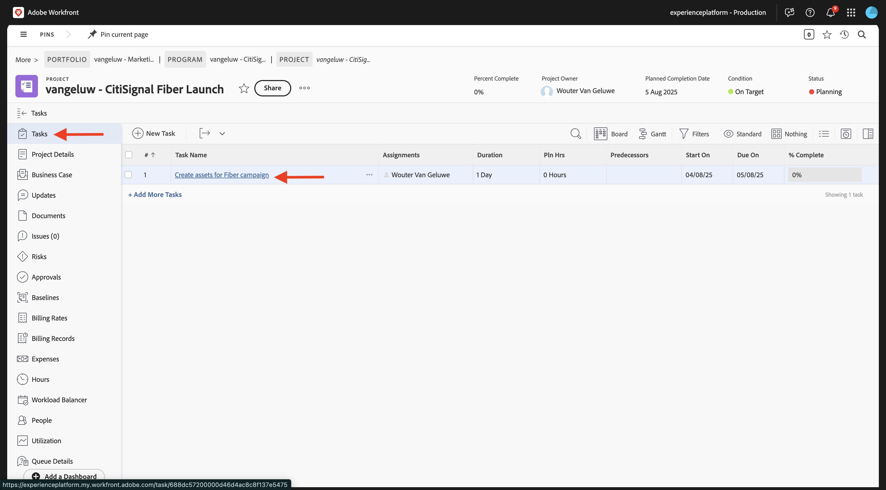
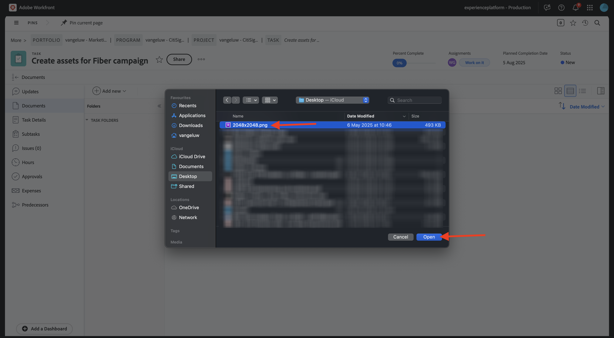
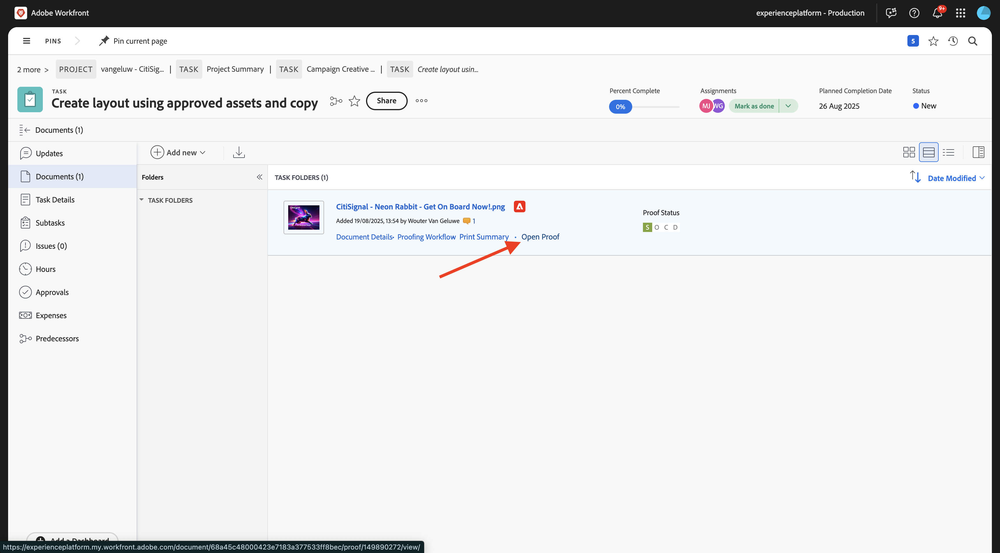

# 1.2.2 Proofing met Workfront

>[!IMPORTANT]
>
>Als u eerder een AEM CS-programma hebt geconfigureerd met een AEM Assets CS-omgeving, kan het zijn dat de AEM CS-sandbox is geminimaliseerd. Gezien het feit dat het vernietigen van zo&#39;n zandbak 10 tot 15 minuten duurt, zou het een goed idee zijn om het ontruimingsproces nu te beginnen zodat u niet op een later tijdstip hoeft te wachten.

## 1.2.2.1 Een nieuwe goedkeuringsstroom maken

Ga terug naar **Adobe Workfront**. Klik het **menu** pictogram en selecteer **het Bewijzen**.

Ga naar **Werkschema&#39;s**, klik **+ Nieuw** en selecteer dan **Nieuw malplaatje**.

Plaats de **naam van het Malplaatje** aan `--aepUserLdap-- - Approval Workflow` en plaats de **eigenaar van het Malplaatje** aan zich.

De rol neer, en onder **Staven** > **Stadium 1**, voegt me met de **Rol** van **Reviewer &amp; Approver** toe.

Klik **creëren**.

Uw basisgoedkeuringswerkstroom is nu klaar om te worden gebruikt.

## 1.2.2.2 Een nieuw project maken

Open het **menu** en ga naar **Programma&#39;s**.

Klik op het programma dat u eerder hebt gemaakt en dat de naam `--aepUserLdap-- CitiSignal Fiber Launch` heeft.

>[!NOTE]
>
>U creeerde een programma als deel van de oefening op [ Planning van Workfront ](./../module1.1/ex1.md) met de automatisering u creeerde en liep. Als je dat nog niet hebt gedaan, kun je daar de instructies vinden.

In uw programma, ga naar **Projecten**. Klik **+ Nieuw Project** en selecteer dan **Nieuw Project**.

Dan moet je dit zien. Wijzig de naam in `--aepUserLdap-- - CitiSignal Fiber Launch` .

Ga naar **Details van het Project**. Klik **+ toevoegen** onder **Beschrijving**.

De beschrijving instellen op `The CitiSignal Fiber Launch project is used to plan the upcoming launch of CitiSignal Fiber.`

Klik **sparen Veranderingen**.

Uw project is nu gemaakt.

## 1.2.2.3 Een nieuwe taak maken

Ga naar **Taken** en klik **+ Nieuwe Taak**.

Voer deze naam in voor uw taak: `Create assets for Fiber campaign` .

Plaats het gebied **Beschrijving** aan: `This task is used to track the progress of the creation of the assets for the CitiSignal Fiber Launch Campaign.`

Klik **creëren Taak**.

Dan moet je dit zien.

In de kolom **Taak**, voeg uw eigen naam toe.

De taak zal dan aan u worden toegewezen.

## 1.2.2.4 Voeg een nieuw Document aan uw Taak toe ga door de goedkeuringsstroom

Klik het **Workfront** embleem terug naar de overzichtspagina. Het zojuist gemaakte project wordt dan weergegeven in het overzicht. Klik op uw project om het te openen.

In **Taken**, klik om de taak te openen.

Ga naar **Documenten**. Klik **+ voeg nieuw** toe en selecteer dan **Document**.

Download [ dit dossier ](./images/2048x2048.png) aan uw Desktop.

{width="50px" align="left"}

Selecteer het dossier **2048x2048.png** en klik **Open**.

Dan moet je dit hebben. Houd de muisaanwijzer boven het geüploade document. Klik **creeer proef** en kies dan **Geavanceerde Bewijs**.

In het **nieuwe proefdruk** venster, selecteer **Geautomatiseerd** en selecteer dan het werkschemamalplaatje dat u eerder creeerde, dat zou moeten worden genoemd `--aepUserLdap-- - Approval Workflow`. Klik **creëren Bewijs**.

Klik **Werk op het**.

Klik **Open Bewijs**

U kunt de proefdruk nu controleren. Selecteer **toevoegen commentaar** om een opmerking toe te voegen die het document vereist om worden veranderd.

Ga uw commentaar in en klik **Post**. Klik **dicht**.

Daarna, moet u uw rol van **Recensent** in **Recensent &amp; Approver** veranderen. Om dat te doen, ga terug naar uw Taak en klik **het Beproeven Werkschema**.

Verander uw rol van **Recensent** in **Recensent &amp; Fiatteur**.

Ga terug naar je taak en open de proefdruk opnieuw. U ziet nu een nieuwe knoop, **besluit van het Merk**. Klik erop.

Selecteer **vereiste Veranderingen** en klik **besluit** nemen.

Ga terug naar uw **Taak** en het **Document**. U moet nu een tweede afbeelding uploaden die rekening houdt met de opmerkingen die zijn opgegeven.

Download [ dit dossier ](./images/2048x2048_buynow.png) aan uw Desktop.

{width="50px" align="left"}

Selecteer in de taakweergave het oude afbeeldingsbestand dat niet is goedgekeurd. Dan, klik **+ voeg nieuw** toe, selecteer **Versie** en selecteer dan **Document**.

Selecteer het dossier **2048x2048_buynow.png** en klik **Open**.

Dan moet je dit hebben. Klik **creeer proef** en selecteer dan **Geavanceerde Bewijs** opnieuw.

Dan zie je dit. Het **malplaatje van het Werkschema** wordt nu vooraf geselecteerd aangezien Workfront veronderstelt dat het vorige goedkeuringswerkschema nog geldig is. Klik **creëren Bewijs**.

Selecteer **Open Bewijs**.

U ziet nu twee versies van het bestand naast elkaar.

Klik **besluit van het Merk**, selecteer **Goedgekeurd** en klik **besluit** opnieuw maken.

Klik de **Naam van de Taak** terug naar het overzicht van de Taak.

U zult dan terug in uw mening van de Taak, met goedgekeurd activa zijn. Dit middel moet nu worden gedeeld met AEM Assets.

Selecteer het goedgekeurde document. Klik het **pijlpictogram van het Aandeel** en selecteer uw integratie van AEM Assets, die zou moeten worden genoemd `--aepUserLdap-- - CitiSignal AEM`.

Dubbelklik op de map die u eerder hebt gemaakt en die u de naam `--aepUserLdap-- - CitiSignal Fiber Launch Assets` moet geven.

Klik **Uitgezochte omslag**.

Na 1-2 minuten wordt uw document nu gepubliceerd in AEM Assets. Er verschijnt een AEM-pictogram naast de documentnaam.

## 1.2.2.5 Je bestand weergeven in AEM Assets

Ga naar de map in AEM Assets CS met de naam `--aepUserLdap-- - CitiSignal Fiber Launch Assets` .

Selecteer het beeld, en kies dan **Details**.

Vervolgens ziet u het eerder gemaakte metagegevensformulier met de waarden die automatisch zijn ingevuld door de integratie tussen Workfront en AEM Assets.

Ga terug naar [ Beheer van het Werkschema met Adobe Workfront ](./workfront.md){target="_blank"}

[ ga terug naar Alle Modules ](./../../../overview.md){target="_blank"}
