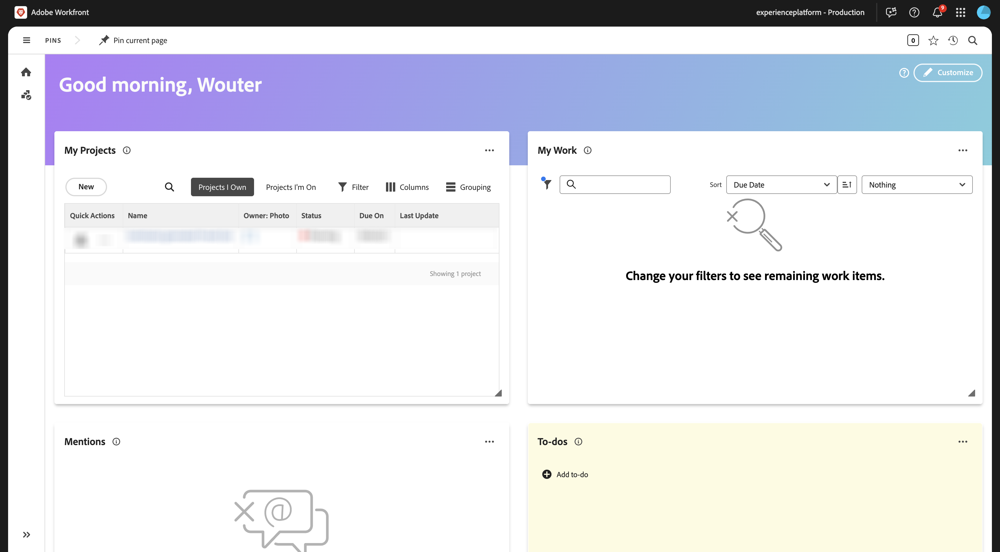

# 1.2.4 Workfront + AEM Sites

Login aan Adobe Workfront door naar [&#x200B; https://experienceplatform.my.workfront.com/ &#x200B;](https://experienceplatform.my.workfront.com/){target="_blank"} te gaan.

Dan zie je dit.

## 1.2.4.1 Uw AEM Sites-integratie configureren

>[!NOTE]
>
>Deze insteekmodule is momenteel op **Vroege wijze van de Toegang** en is over het algemeen nog niet beschikbaar.
>
>Deze insteekmodule is mogelijk al geïnstalleerd in het Workfront-exemplaar dat u gebruikt. Als deze al is geïnstalleerd, kunt u de onderstaande instructies bekijken, maar hoeft u niets te wijzigen in uw configuratie.

Ga naar [&#x200B; https://experience.adobe.com/#/@experienceplatform/aem/extension-manager/universal-editor &#x200B;](https://experience.adobe.com/#/@experienceplatform/aem/extension-manager/universal-editor){target="_blank"}.

Zorg ervoor de **knevel** voor deze stop wordt geplaatst aan **Toegelaten**. Dan, klik het **versnelling** pictogram.

U zult een **configuratie van de Uitbreiding** popup zien. Configureer de volgende velden om deze insteekmodule te gebruiken.

| Sleutel | Waarde |
| --------------- | ------------------------------ | 
| **`IMS_ENV`** | **PROD** |
| **`WORKFRONT_INSTANCE_URL`** | **https://experienceplatform.my.workfront.com** |
| **`SHOW_CUSTOM_FORMS`** | **&#39;{&quot;previewUrl&quot;: true, &quot;publishUrl&quot;: true}&#39;** |

Klik **sparen**.

Ga terug naar uw Workfront UI en klik het 9 punten **hamburger** pictogram. Selecteer **Opstelling**.

In het linkermenu, ga naar **Douane Forms** en selecteer **Vorm**. Klik op **+ Nieuw aangepast formulier** .

Selecteer **Taak** en klik **verdergaan**.

Vervolgens ziet u een leeg aangepast formulier. Voer de formuliernaam in `Content Fragment & Integration ID` .

De belemmering en laat vallen een nieuw **Enige lijntekst** gebied op het canvas.

Vorm het nieuwe gebied als dit:

- **Etiket**: **het Fragment van de Inhoud**
- **Naam**: **`aem_workfront_integration_content_fragment`**

Voeg een nieuw **Enige lijntekst** gebied op het canvas toe en vorm het nieuwe gebied als dit:

- **Etiket**: **identiteitskaart van de Integratie**
- **Naam**: **`aem_workfront_integration_id`**

Klik **toepassen**.

U moet nu een tweede aangepast formulier configureren. Klik op **+ Nieuw aangepast formulier** .

Selecteer **Taak** en klik **verdergaan**.

Vervolgens ziet u een leeg aangepast formulier. Voer de formuliernaam in `Preview & Publish URL` .

De belemmering en laat vallen een nieuw **Enige lijntekst** gebied op het canvas.

Vorm het nieuwe gebied als dit:

- **Etiket**: **Voorproef URL**
- **Naam**: **`aem_workfront_integration_preview_url`**

Voeg een nieuw **Enige lijntekst** gebied op het canvas toe en vorm het nieuwe gebied als dit:

- **Etiket**: **publiceer URL**
- **Naam**: **`aem_workfront_integration_publish_url`**

Klik **toepassen**.

U hebt dan twee aangepaste formulieren beschikbaar.

Volgende Stap: [&#x200B; 1.2.2 het Bewijzen met Workfront &#x200B;](./ex2.md){target="_blank"}

Ga terug naar [&#x200B; Beheer van het Werkschema met Adobe Workfront &#x200B;](./workfront.md){target="_blank"}

[&#x200B; ga terug naar Alle Modules &#x200B;](./../../../overview.md){target="_blank"}
