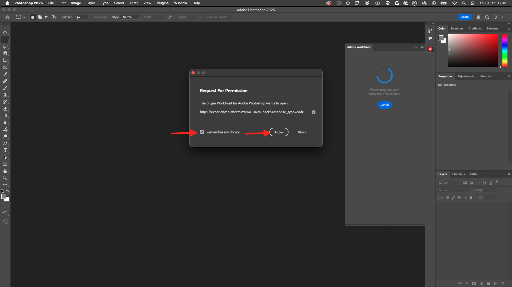

# 1.2.5 Photoshop instellen + Workfront-plug-in

## 1.2.5.1 Workfront for Photoshop-plug-in installeren

Installeer de Creative Cloud-toepassing op uw computer om de integratie tussen Workfront en Photoshop in te stellen. Meld u aan met uw Adobe ID.

Selecteer **Onderneming of de Rekening van de School** en verifieer.

Selecteer een profiel voor aanmelden.

Dan ben je hier. Ga naar **Voorraad &amp; Marketplace**.

Klik **Insteekmodules** en klik dan **leiden insteekmodules**. Klik **installeer** op **Adobe Workfront voor Photoshop** kaart.

Klik **OK**.

Dan zie je dit.

## 1.2.5.2 De insteekmodule configureren in Photoshop

Open Photoshop. In de bar van de Taak, ga **Insteekmodules** > **Workfront voor Adobe Photoshop** > klik **Adobe Workfront**.

Dan zie je dit.

Voer het domein van uw Adobe Workfront-instantie in. Klik **Login**.

Klik **toestaan**.

Teken binnen met uw **Adobe ID**.

Selecteer **Onderneming of de Rekening van de School**.

Klik **Toestaan Toegang**.

Je ziet deze bevestiging.

Ga terug naar Photoshop en u zult zien dat de plug-in nu klaar is om te worden gebruikt en uw actieve taken toont.

Ga terug naar [&#x200B; Beheer van het Werkschema met Adobe Workfront &#x200B;](./workfront.md){target="_blank"}

[&#x200B; ga terug naar Alle Modules &#x200B;](./../../../overview.md){target="_blank"}
