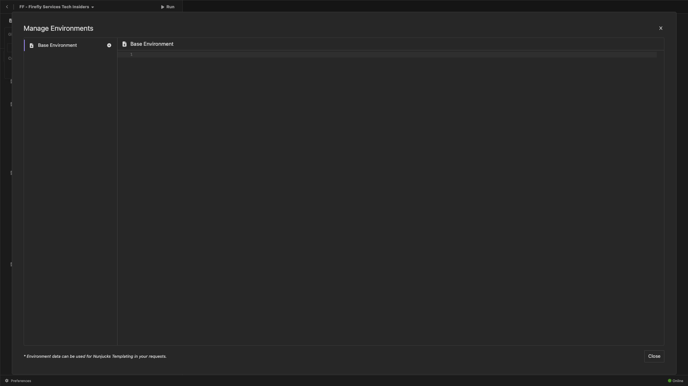

# PostBuster

>[!IMPORTANT]
>
>De onderstaande instructies zijn alleen bedoeld voor Adobe werknemers.

## PostBuster installeren

Ga naar [ https://adobe.service-now.com/esc?id=adb_esc_kb_article&amp;sysparm_article=KB0020542 ](https://adobe.service-now.com/esc?id=adb_esc_kb_article&amp;sysparm_article=KB0020542).

Klik om de recentste versie van **PostBuster** te downloaden.


Download de juiste versie voor uw besturingssysteem.


Open PostBuster nadat het downloaden is voltooid en geïnstalleerd. Dan moet je dit zien. Klik **Invoer**.


De download [ postbuster.json.zip ](./assets/postman/postbuster.json.zip) en haalt het op uw Desktop uit.


Klik **kiezen een Dossier**.


Selecteer het dossier **postbuster.json**. Klik **Open**.


Dan moet je dit zien. Klik **Scannen**.


Klik **Invoer**.


Dan moet je dit zien. Klik om de geïmporteerde verzameling te openen.


Nu zie je je collectie. U moet nog een milieu vormen om sommige omgevingsvariabelen te houden.


Klik **Milieu van de Basis** en klik dan **uitgeven** pictogram.


Dan moet je dit zien.



Kopieer hieronder milieu placeholder en kleef het in het **Milieu van de Basis**.

```json
{
	"CLIENT_SECRET": "",
	"API_KEY": "",
	"ACCESS_TOKEN": "",
	"SCOPES": [
		"openid",
		"AdobeID",
		"ff_apis",
		"firefly_api"
	],
	"TECHNICAL_ACCOUNT_ID": "",
	"IMS": "ims-na1.adobelogin.com",
	"IMS_ORG": "",
	"access_token": "",
	"IMS_TOKEN": "",
	"AZURE_STORAGE_URL": "",
	"AZURE_STORAGE_CONTAINER": "",
	"AZURE_STORAGE_SAS_READ": "",
	"AZURE_STORAGE_SAS_WRITE": ""
}
```

Dan moet je dit hebben.


Na het gaan door de **module van de Diensten van de Firefly 0} {, zou uw milieu als dit moeten kijken.** U hoeft dit nu niet te doen, dit wordt later opgelost.


>[!NOTE]
>
>{width="50px" align="left"}
>
>Als u vragen hebt, wil algemene terugkoppelen van hebben suggesties over toekomstige inhoud delen, gelieve direct contactTech Insiders, door een e-mail naar **techinsiders@adobe.com** te verzenden.

[Terug naar alle modules](./overview.md)
