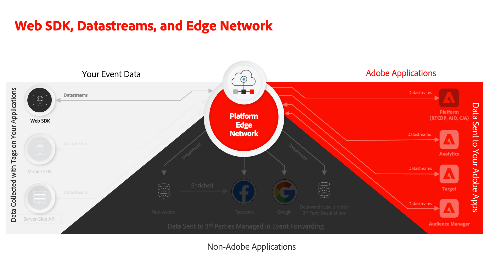

# Een gegevensstroom configureren

Leer hoe te om een gegevensstroom toe te laten en de toepassingen van het Experience Cloud te vormen.

De gegevensstromen vertellen het Netwerk van Adobe Experience Platform Edge waar te om gegevens te verzenden die door het Web SDK van het Platform worden verzameld. In de configuratie van gegevensstromen, laat u uw toepassingen van het Experience Cloud, uw rekening van het Experience Platform, en gebeurtenis toe door:sturen. Zie de [Grondbeginselen van het Vormen van een DataStream](https://experienceleague.adobe.com/docs/experience-platform/edge/fundamentals/datastreams.html?lang=en) voor meer gedetailleerde informatie.

## Leerdoelstellingen

Aan het eind van deze les, zult u kunnen:

* Een gegevensstroom maken
* Aan de slag met gegevensstroomoverschrijvingen

## Vereisten

Voordat u de gegevensstroom configureert, moet u de volgende lessen al hebben voltooid:

* [Een schema configureren](configure-schemas.md)
* [Naamruimte configureren](configure-identities.md)

## Een gegevensstroom maken

Nu kunt u een gegevensstroom tot stand brengen om het Netwerk van de Rand van het Platform te vertellen waar te om gegevens te verzenden die door SDK van het Web worden verzameld.

**Een gegevensstroom maken:**

1. Open de [Interface voor gegevensverzameling](https://launch.adobe.com/){target="_blank"}
1. Zorg ervoor dat u zich in de juiste sandbox bevindt

   >[!NOTE]
   >
   >Als u de klant bent van een toepassing op basis van een platform, zoals Real-Time CDP, raden wij u aan een ontwikkelingssandbox voor deze zelfstudie te gebruiken. Als dat niet het geval is, gebruikt u de **[!UICONTROL Prod]** sandbox.

1. Ga naar **[!UICONTROL Gegevensstromen]** in de linkernavigatie
1. Selecteren **[!UICONTROL Nieuwe DataStream]** aan de rechterkant van het scherm.
1. Enter `Luma Web SDK: Development Environment` als de **[!UICONTROL Naam]**. Deze naam wordt van verwijzingen voorzien later wanneer u de uitbreiding van SDK van het Web in uw markeringsbezit vormt.
1. Selecteer uw `Luma Web Event Data` als de **[!UICONTROL Gebeurtenisschema]**
1. Selecteren **[!UICONTROL Opslaan]**

   

   >[!AVAILABILITY]
   >
   >De toewijzingsfunctie wordt later in deze zelfstudie opgenomen.

Op het volgende scherm, kunt u de diensten zoals de toepassingen van de Adobe aan de datastream toevoegen, nochtans zult u geen diensten op dit punt in het leerprogramma toevoegen. U zult dit later doen in de lessen [Experience Platform instellen](setup-experience-platform.md), [Analyses instellen](setup-analytics.md), [Audience Manager instellen](setup-audience-manager.md), [Doel instellen](setup-target.md), of [Gebeurtenis doorsturen](setup-event-forwarding.md).

>[!NOTE]
>
>Wanneer u Platform Web SDK op uw eigen website implementeert, moet u drie gegevensstreams maken om toe te wijzen aan uw drie labelomgevingen (ontwikkeling, werkgebied en productie). Als u Platform Web SDK met op platform-gebaseerde toepassingen zoals Adobe Real-time Customer Data Platform of Adobe Journey Optimizer gebruikt, zou u zeker moeten zijn om die gegevensstromen in de aangewezen zandbakken van het Platform tot stand te brengen.

## Een gegevensstroom overschrijven

Met DataStream-overschrijvingen kunt u aanvullende configuraties voor uw gegevensstromen definiëren en vervolgens de standaardconfiguratie onder bepaalde voorwaarden van uw implementatie overschrijven.

De configuratieopheffing van gegevensstroom is een proces in twee stappen:

1. Eerst definieert u de gegevensstroom overschrijft in de configuratie van de gegevensstroom. Dit moet worden gedaan per Adobe toepassing u probeert met voeten te treden.
1. Dan, verzendt u de met voeten treedt naar het Netwerk van de Rand of door SDK van het Web verzendt de Actie van de Gebeurtenis, of door een configuratie in de de markeringsuitbreiding van SDK van het Web.

Zie de [datastream configuratie heeft voorrang op documentatie](https://experienceleague.adobe.com/docs/experience-platform/datastreams/overrides.html?lang=en) voor gedetailleerde instructies op hoe te om configuraties met betrekking tot gegevensstroom met voeten te treden.

In de Adobe Analytics-les voor instellen [treedt de rapportreeks voor een pagina met voeten gebruikend het Web SDK van het Platform verzendt de Actie van de Gebeurtenis](setup-analytics.md).

U bent nu klaar om de uitbreiding van SDK van het Web van het Platform in uw markeringsbezit te installeren!

[Volgende: ](install-web-sdk.md)

>[!NOTE]
>
>Bedankt dat u tijd hebt geïnvesteerd in het leren over de SDK van Adobe Experience Platform Web. Als u vragen hebt, algemene feedback wilt delen of suggesties voor toekomstige inhoud hebt, kunt u deze delen over deze [Experience League Communautaire discussiestuk](https://experienceleaguecommunities.adobe.com/t5/adobe-experience-platform-launch/tutorial-discussion-implement-adobe-experience-cloud-with-web/td-p/444996)
